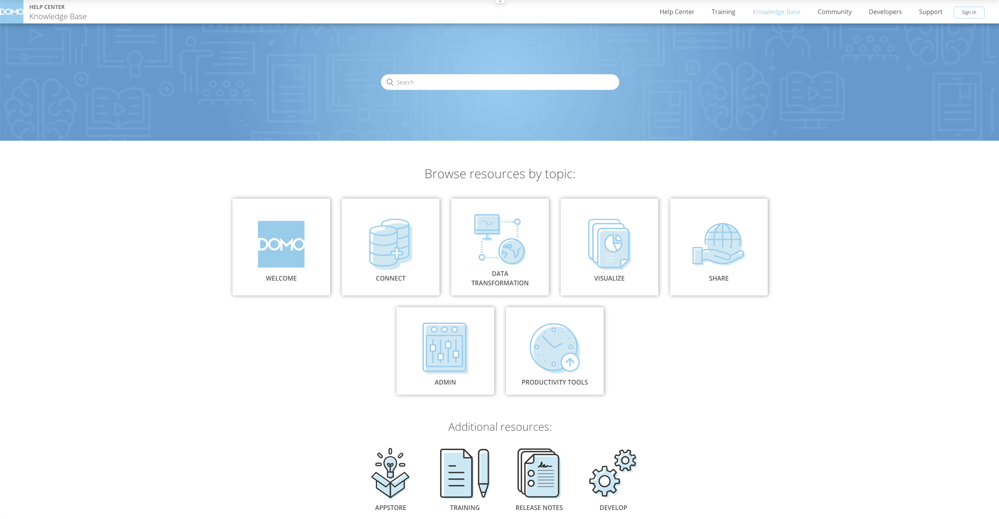

Welcome to the new and improved Domo Knowledge Base! Domo’s been hard at work ensuring a streamlined experience with all the great content you know and love.

 

#### The new Knowledge Base includes:

* **Simplified Categories -** Find the knowledge you need in fewer clicks.
* **Improved Multi-Language Access -** Effortlessly switch between languages with a simple drop-down menu at the bottom of each page.

 

#### To Access the Knowledge Base:

1. Navigate to the Help Center by clicking on the question mark icon  in the top navigational header.
2. Select the  button in the Knowledge Base tile.
