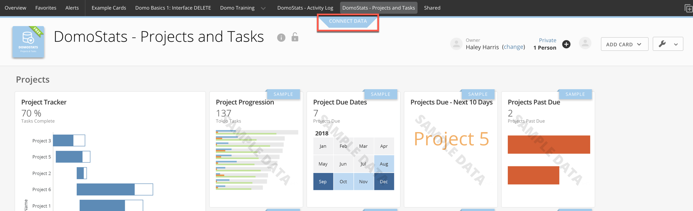
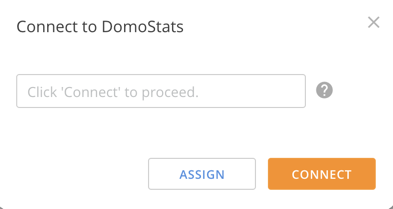

---
    title: DomoStats - Projects and Tasks
    url: https://domo-support.domo.com/s/article/360043439313
    linked_kbs:  ['[https://domo-support.domo.com/s/knowledge-base/](https://domo-support.domo.com/s/knowledge-base/)', '[https://domo-support.domo.com/s/](https://domo-support.domo.com/s/)', '[https://domo-support.domo.com/s/topic/0TO5w000000ZamlGAC](https://domo-support.domo.com/s/topic/0TO5w000000ZamlGAC)', '[https://domo-support.domo.com/s/topic/0TO5w000000ZannGAC](https://domo-support.domo.com/s/topic/0TO5w000000ZannGAC)', '[https://domo-support.domo.com/s/article/360042926274](https://domo-support.domo.com/s/article/360042926274)', '[https://domo-support.domo.com/s/article/360043439313](https://domo-support.domo.com/s/article/360043439313)', '[https://domo-support.domo.com/s/topic/0TO5w000000ZannGAC/governance-tools](https://domo-support.domo.com/s/topic/0TO5w000000ZannGAC/governance-tools)', '[https://domo-support.domo.com/s/article/360043429933](https://domo-support.domo.com/s/article/360043429933)', '[https://domo-support.domo.com/s/article/360043429953](https://domo-support.domo.com/s/article/360043429953)', '[https://domo-support.domo.com/s/article/360042925494](https://domo-support.domo.com/s/article/360042925494)', '[https://domo-support.domo.com/s/article/360043429913](https://domo-support.domo.com/s/article/360043429913)', '[https://domo-support.domo.com/s/article/4408174643607](https://domo-support.domo.com/s/article/4408174643607)', '[https://domo-support.domo.com/s/login/](https://domo-support.domo.com/s/login/)']
    article_id: 000003039
    views: 2,190
    created_date: 2022-10-24 21:05:00
    last updated: 2022-10-24 22:39:00
    ---

Intro
-----

DomoStats gives you the freedom to explore how your team is using Domo. Because DomoStats is powered by a live Domo DataSet with no configuration, you can easily build cards, alerts, and workflows around the metrics you want to see as well as use the pre-built dashboard.

This DomoStats app provides key insights into your organization's Domo Projects and Tasks. Ensure projects will be delivered on time by monitoring all your open projects and tasks in a single dashboard. Identify at-risk projects, address overdue tasks, and manage team workloads by tracking assignee productivity and efficiency. 

Video - Domostats - Projects and Tasks App
------------------------------------------

 

Requirements
------------

You must have Admin level access to download from the Appstore. 

Using the DomoStats App
-----------------------

You can use the pre-built dashboard or build any of your own content using the DomoStats DataSets in the Data Center. When you first download the app, a new page is created titled DomoStats - Projects and Tasks. You'll need to power up the dashboard with the following steps:

1. Navigate to the **DomoStats - Projects and Tasks** page.
2. Select **Connect Data**.
3. 
4. In the drop-down, select **Connect** to connect the page to the DomoStats DataSets or select **Assign** if you want to assign another Domo user to set up the data.
5. In the last window, select **Connect**.  

The dashboard
-------------

### Data

The following data is included in the download of the DomoStats - Projects and Tasks app and can be found in the Data Center as a 'DomoStats' type DataSet.

DataSets include:

* Projects
* Tasks
* Task Owners

DataFlows include:

* Projects and Tasks
* Tasks + Task Owners

 

**Note:** All DataSets powering the app run once a day. Runtime is every 24 hours from when the app is first deployed. While the run frequency cannot be changed, you can edit the runtime in the DataSet settings. For more information on how to schedule DataSets, see [DataSet Scheduling](/s/article/360042926274 "Adding a DataSet Using a Data Connector").

### Cards

The following cards are included in the pre-built dashboard.

|  |  |  |
| --- | --- | --- |
| **Collection** | **Card** | **Description** |
| Projects | Project Tracker | Displays the start date and due date for each project and measures the number of completed tasks against the number of total tasks to give an estimated completion percentage for each project.

**Note:** For best results, be sure to include a project due date for each of your projects within your Domo Projects and Tasks. When a project due date is not defined, the current date will be displayed as the due date on this card.

 |
| Project Progression | Shows the number of to-do, working on, and completed tasks per project. |
| Project Due Dates | Shows the projects due on each day of the calendar. |
| Projects Due - Next 10 Days | The projects that will come due in the next 10 days. |
| Projects Past Due | The projects that are past due and the number of days since they were due. |
| Newest Projects | The project name, created date, creator name, and project description of the 15 most recently created projects. |
| Project Creation Trend | The number of projects created over time. |
| Top Project Creators | The number of projects created by users. |
| Largest Projects | The number of tasks created across all active projects. |
| Tasks | Project Task Completion | Measures the number of completed tasks against the number of total tasks within each active project. |
| Task Completion by Project | The number of tasks completed on each project over time. |
| Tasks Completed (30 Days) | The trend of tasks completed over the last 30 days. |
| Tasks Due Calendar | The tasks that are due each day. |
| Overdue Tasks | Shows the tasks that are past due, the projects those tasks belong to, and the number of days since the tasks were due. |
| Task Breakdown | Displays the number of tasks listed as to-do, working on, and completed across all active projects. |
| Assignees | Assignee Productivity | The number of tasks each member has been assigned and the number of tasks each member has completed. Bubble sizes represent the percentage of assigned tasks that have been completed. |
| Assignee Workloads | Shows the number of tasks each member has been assigned in each project. |
| Top 10 Assignee Workloads | The number of tasks each member has been assigned and the number of tasks each member has completed. Displays the top 10 assignees by the number of tasks. |
| Top 25 Assignees | The number of tasks each member has been assigned. |
| Lightest Workloads | The 5 assignees with the fewest number of "to-do" or "working-on" tasks assigned them. |
| Assignee Efficiency | Shows the average number of days each assignee's tasks have had a "to-do" or "working-on" status. Also displays the average number of days each assignee spent on tasks that have been completed. |
| Assignee Tasks To-do | Shows the number of to-do tasks assigned to each member and the average number of days these tasks have had a to-do status. |
| Assignee Tasks Working-on | The number of tasks each member is working on and the average number of days these tasks have had a "working-on" status. |
| Assignee Tasks Completed | The number of tasks each member has completed and the average number of days spent completing these tasks. |

