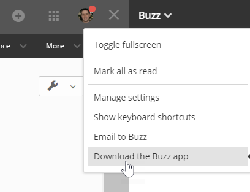
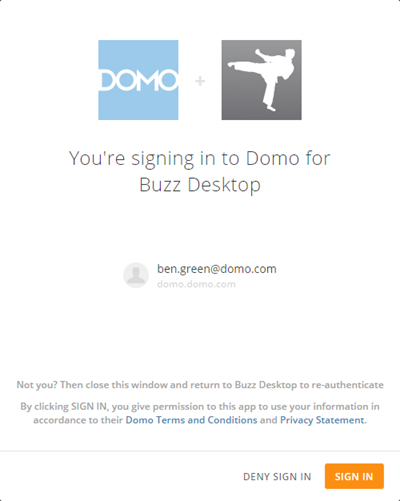

---
    title: Downloading and Running the Buzz Desktop Version
    url: https://domo-support.domo.com/s/article/360043430293
    linked_kbs:  ['[https://domo-support.domo.com/s/knowledge-base/](https://domo-support.domo.com/s/knowledge-base/)', '[https://domo-support.domo.com/s/](https://domo-support.domo.com/s/)', '[https://domo-support.domo.com/s/topic/0TO5w000000ZamsGAC](https://domo-support.domo.com/s/topic/0TO5w000000ZamsGAC)', '[https://domo-support.domo.com/s/topic/0TO5w000000ZanCGAS](https://domo-support.domo.com/s/topic/0TO5w000000ZanCGAS)', '[https://domo-support.domo.com/s/article/360043429973](https://domo-support.domo.com/s/article/360043429973)', '[https://domo-support.domo.com/s/article/360042925574](https://domo-support.domo.com/s/article/360042925574)', '[https://domo-support.domo.com/s/article/360043430293](https://domo-support.domo.com/s/article/360043430293)', '[https://domo-support.domo.com/s/topic/0TO5w000000ZanCGAS/buzz](https://domo-support.domo.com/s/topic/0TO5w000000ZanCGAS/buzz)', '[https://domo-support.domo.com/s/article/360043429933](https://domo-support.domo.com/s/article/360043429933)', '[https://domo-support.domo.com/s/article/360043429953](https://domo-support.domo.com/s/article/360043429953)', '[https://domo-support.domo.com/s/article/360042925494](https://domo-support.domo.com/s/article/360042925494)', '[https://domo-support.domo.com/s/article/360043429913](https://domo-support.domo.com/s/article/360043429913)', '[https://domo-support.domo.com/s/article/4408174643607](https://domo-support.domo.com/s/article/4408174643607)', '[https://domo-support.domo.com/s/login/](https://domo-support.domo.com/s/login/)']
    article_id: 000004314
    views: 2,240
    created_date: 2022-10-24 21:36:00
    last updated: 2022-10-24 22:40:00
    ---

Intro
-----

Buzz comes in two varieties—the version found within the Domo application as well as a free downloadable version that functions as an independent application on your computer. These versions are exactly the same, save for a set of additional toolbar options in the free version. For more information about these options, see [Desktop version toolbar options](/s/article/360043429973 "Buzz Layout").

System Requirements
-------------------

### Windows

* Runs on Windows 7 and later versions. (Older versions will not work.)
* Both x86 and amd64 (x64) binaries are provided. The ARM version of Windows is not supported.
* Intel Pentium 4 processor or later that's SSE2-capable
* 512 MB of RAM

### Mac

* Runs on OS X 10.9 and later versions. (Older versions will not work.)
* Only 64-bit binaries are provided.
* 64-bit Intel processor
* 512 MB of RAM

### Linux

* Runs on Ubuntu 12.04+, Fedora 21, and Debian 8
* Intel Pentium 4 processor or later that's SSE2-capable

Downloading the Desktop Version of Buzz
---------------------------------------

You can download the desktop version of Buzz from the Domo product.

**To download the desktop version of Buzz,**

1. Open the Domo product.
2. (Conditional) If Buzz is not open, open it by clicking  in the toolbar in the upper right corner of Domo.
3. Select **Download the Buzz App** in the **Buzz** dropdown menu in the top left corner of Buzz.  
   
 
4. Choose your desired operating system.

The Buzz application is downloaded to your computer. It then opens automatically. 

Running the Desktop Version of Buzz
-----------------------------------

Follow these steps to get going with the desktop version of Buzz.

**To run the desktop version of Buzz,**

1. (Conditional) If you just installed Buzz, it opens automatically. Otherwise, locate the Buzz file on your machine and double-click it.
2. Enter your company domain in the field. This is the portion of your company's Domo URL that comes before .[domo.com](http://domo.com). For example, if the URL of your company's Domo instance was [myURL.domo.com](http://myURL.domo.com), you would enter myURL. 

 

**Tip:**If at any time you want to return to this screen to add a new domain, you may do so by selecting **Team > Add Team.**
3. Click **Continue**.  
   
 One of two things now happens:

	* If you are already signed into the Domo instance you specified in step 2, a dialog appears asking if you want to sign in using your current credentials, as shown here:  
	   
	   
	   
	 If this dialog appears, go to step 4.
	* Otherwise, the normal Domo login screen appears for the specified instance.   
	   
	   
	 If this dialog appears, go to step 5.
4. (Conditional) If the sign-in dialog appears as shown in the first image above...

	* If you want to sign in using the account shown here, click **Sign In**.
	* Otherwise close the browser window, log out of Domo, reopen Buzz Desktop. enter your desired domain, then enter your credentials.
5. (Conditional) If the regular Domo login screen appears as shown in the second image above, enter your credentials, then click **Sign In**.

Buzz now opens on your desktop. You can now collaborate with coworkers just as you can in the online version of Buzz. For more information, see [Chatting in Buzz](/s/article/360042925574 "Chatting in Buzz"). 

The desktop version of Buzz includes a number of menu options not found in the online version. For descriptions of these, see [Desktop version toolbar options](/s/article/360043429973 "Buzz Layout").

