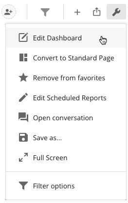
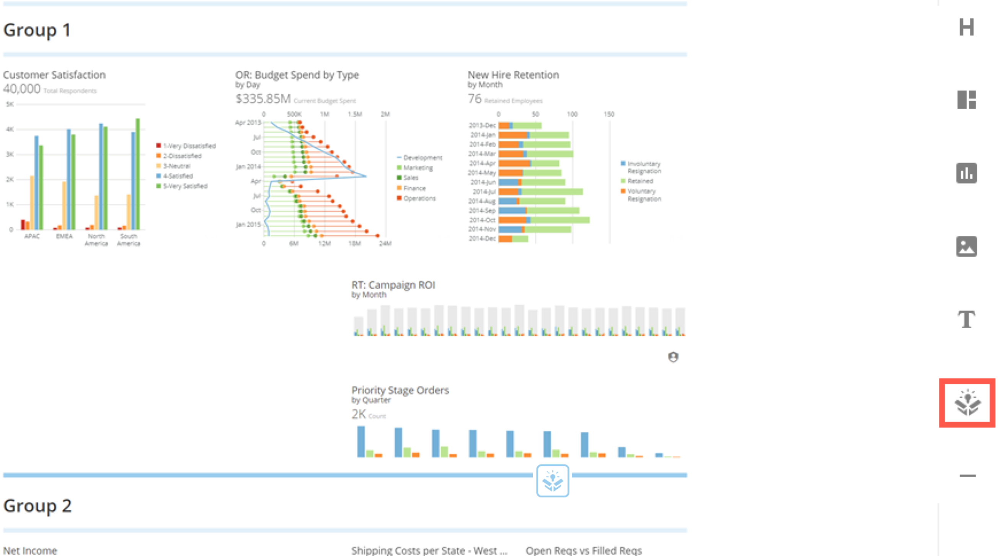

Intro
-----

Drag-and-Drop Apps bring the power of the Appstore to your Dashboard. You can now add DDX Bricks right from your Dashboard editor, so you no longer have to go back and forth from the Appstore to your Dashboard - you are able to stay in context with the rest of your Dashboard content while adding Cards from the Appstore. For more information on DDX Bricks, see [DDX Bricks](/s/article/4423762260375).

Adding a Drag-and-Drop App
--------------------------

You can add a Drag-and-Drop App by clicking the  icon that appears on the right side of the Dashboard view when the Dashboard edit mode is open, then dragging it to the desired location on the Dashboard. You can then select the desired DDX Brick. The DDX Brick you select will then be added to this location on the Page.

**To add a Drag-and-Drop App,**

1. On the Dashboard where you want to add a Drag-and-Drop App, select **Edit Dashboard** in the  menu in the top right corner of the Page.  
  

2. Click and drag the  icon from the toolbar on the right side of the Page to the location on the Page where you want the new layout.  
  

When you drag the App icon over a border, it highlights to indicate you can put the App there. In the example below, the user is dragging the icon over the line directly beneath the "Group 1" layout.  
  
  
  
Once you drop the  icon onto a border, the **Select an App** dialog opens.
3. Search for the DDX Brick you want to add to the Dashboard.
4. Select the App from the list and click **Get**.  
A pop-up window will display letting you know the app is being created.  
  

5. The App is now inserted into your Dashboard.
6. Save your Dashboard by clicking the **Save** button in the top right-hand corner.
7. You can now edit and customize the App by hovering over it and selecting **Edit Card** from the drop-down menu.

For more information on editing DDX Bricks, see [DDX Bricks](/s/article/4423762260375).

