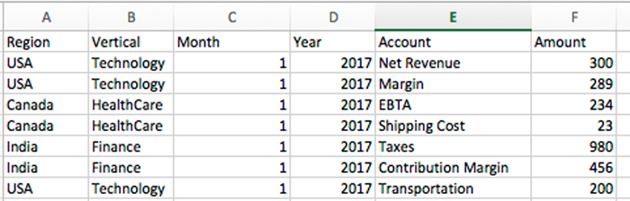
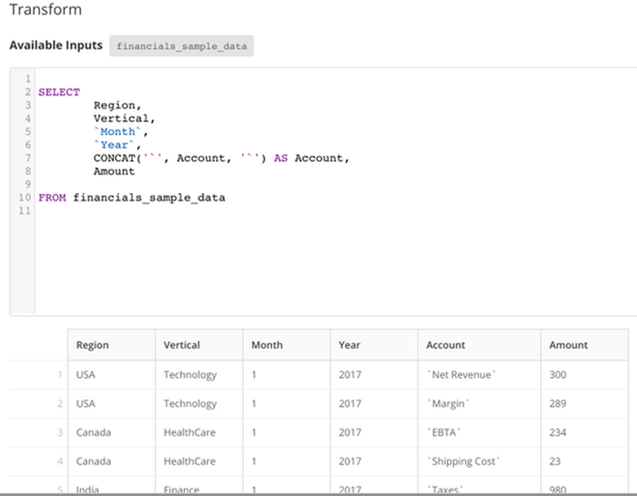
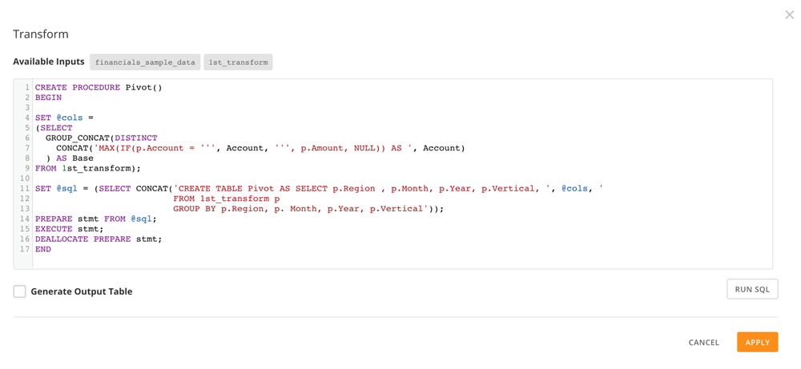
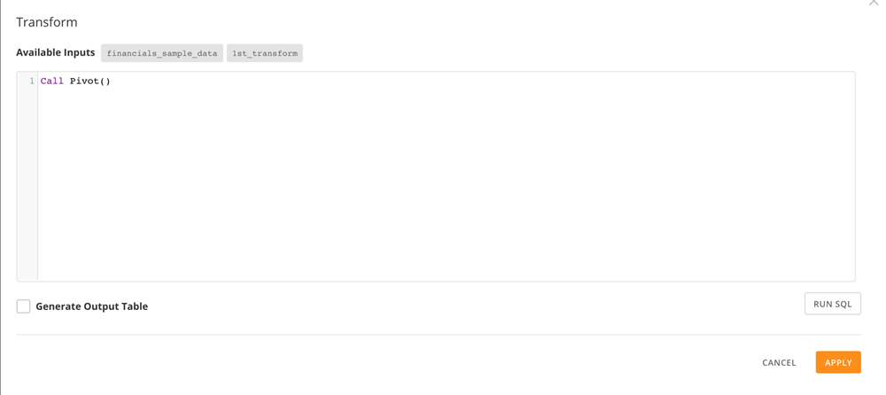
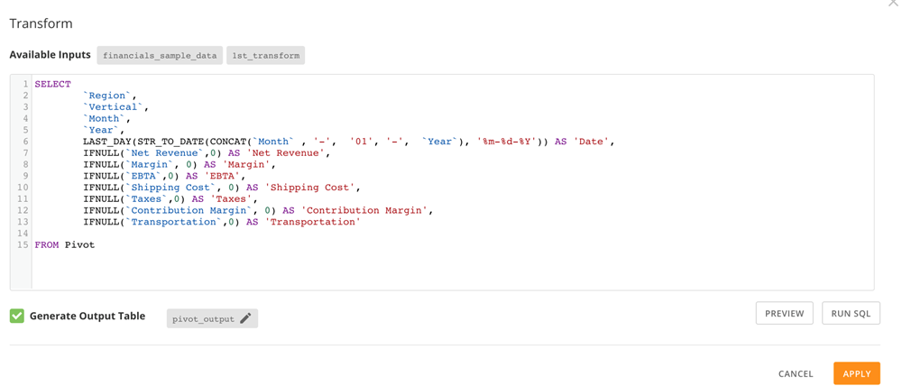
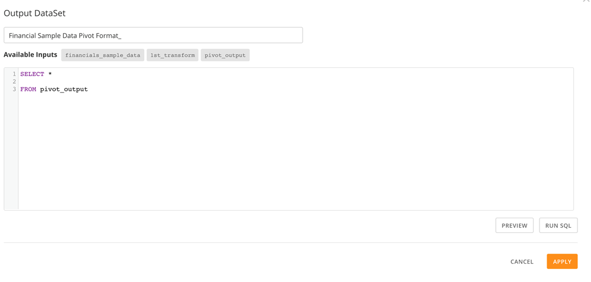

Intro
-----

As a use case, let's say a user receives a dataset every month from Finance and uploads it to Domo in Excel format via Workbench. This dataset contains a column titled "Account." The values on this column show a list of financial metrics or transactions as shown below. (The screenshot below is just sample data but the schema is similar to the schema of the actual dataset, albeit with fewer columns.)

The client needs to pivot each metric into its own column to perform certain calculations and to report the data in tabular format as requested by the Exec team. One option is to use the Magic ETL "Uncollapse Columns" transformation, which works pretty well; however, one disadvantage of this transform is that it's not dynamic. The client does not want to manually edit the Magic DataFlow because he would have to add a new "Account" metric every time a new metric was added to the source data.

Luckily there is at least one solution to accomplish this. You can create a MySQL stored procedure to dynamically include/add any new metric under the Account field every time a new value is added to the data source.

Transformation Steps
--------------------

This section shows you how to dynamically add new metrics to a DataSet by creating and calling a MySQL stored procedure. The stored procedure is available here as a text file: [Dynamic\_Pivot.sql](https://domosoftware.sharepoint.com/:u:/s/CS-Edu-PublicFiles/EZ8GF8LzuERGqBepdhCBqUgB6ZJ275-0tezIGMW6eKBfcw?e=8bUfXh "Dynamic_Pivot.sql") 

**To dynamically add new metrics,**

1. Add backticks (`) for all values with spaces (i.e. `Net Revenue`).   
 This is necessary so the Group CONCAT function will work in the next step.  
   

2. Create your stored procedure, making sure to uncheck **Generate Output Table**.  
   

3. Call the stored procedure, making sure to uncheck **Generate Output Table**.  
   

4. Query the new table generated by the procedure.  
   

5. Generate the output DataSet.   
   

