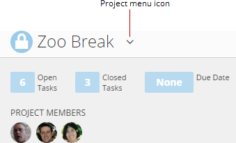

You edit or delete a project in the details page for that project. The options in the **Edit Project** dialog are the same as those in the **Create New Project** dialog, except that a **Delete** option is also available. You can edit the name, team members, privacy setting, project description, and due date, or delete the project altogether. You can edit any project of which you are a team member. You can delete *only* projects that you own, unless you have an "Admin" default security role or a custom role with "Manage All Projects and Tasks" enabled. For more information about default security roles, see [Managing Custom Roles](/s/article/360043438973 "Security Role Reference").

**To edit a project,**

1. Open the Projects & Tasks page by selecting **Projects and Tasks** in the **More** menu at the top of the screen.
2. Click the name of the project you want to edit.
3. Mouse over the arrow to the right of the project name to display the project menu.
4. Click **Edit This Project**.  
 The **Edit Project** dialog appears.
5. Make whatever changes you want in the dialog.
6. Click **Done**.

**To delete a project,**

1. Open the Projects & Tasks page by selecting **Projects and Tasks** in the **More**​​​​​​​ menu at the top of the screen.
2. Click the name of the project you want to edit.
3. Mouse over the arrow to the right of the project name to display the project menu.
4. Click **Edit This Project**.  
 If you are not the project owner, this option does not appear.   
 The **Edit Project** dialog appears.
5. Click **Delete**.
6. Click **Delete** again to confirm.

This deletes the project along with all tasks within it.

