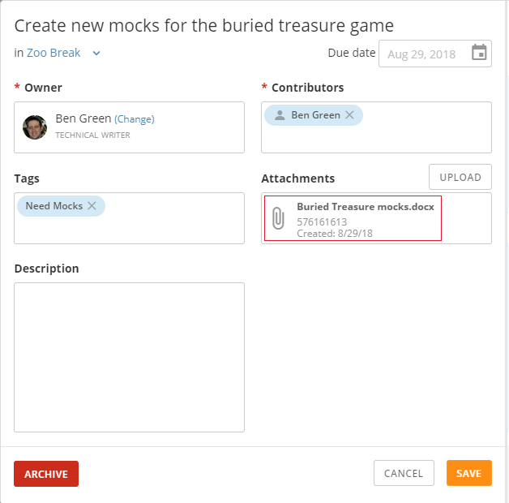

In the task details page for a project, you can edit any task by opening the edit dialog for that task and making the changes you want. You can only edit tasks in projects in which you have access, unless you have an "Admin" default security role or a custom role with "Manage All Tasks and Projects" enabled. For more information about default security roles, see [Managing Custom Roles](/s/article/360043438973 "Security Role Reference").

In this dialog you can edit all of the following:

* The task name and description
* The task owner as well as the contributors assigned to the task

 

**Note****:** Admins are not able to remove the owner of a project.
* The task due date
* The project to which the task belongs
* Task tags

You can also add comments and attachments to the task in this dialog, as well as [archive](/s/article/360042925934 "Archiving Project Tasks and Lists") the task.

**To open the edit dialog for a task,**

1. Click the task.

**To comment on a task,**

1. Click the task to open the edit dialog.
2. Enter your comment in the field in the **Write a message** field in the bottom right corner of the dialog, then press Enter.

**To attach a file to a task,**

1. Click the task to open the dialog.
2. Click **Upload**.
3. Browse to and select the file you want to attach.
4. Click **Save**.

 

**Note****:**  In the interest of preventing users from uploading malicious files into Domo accounts, Domo allows a specific set of file types to be uploaded. If you attempt to upload a file not within this list, an error message appears. For more information, including a full list of supported file types, see [Permitted File Types for Attachments](/s/article/360042925634 "Permitted File Types for Attachments").

**To download a file attached to a task,**

1. Click the task to open the dialog.
2. Click the name of the file.  
   
  
 The file is downloaded to your computer.

For information about the other options in this dialog, see [Creating and Assigning Project Tasks](/s/article/360042925874 "Creating and Assigning Project Tasks").

