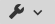
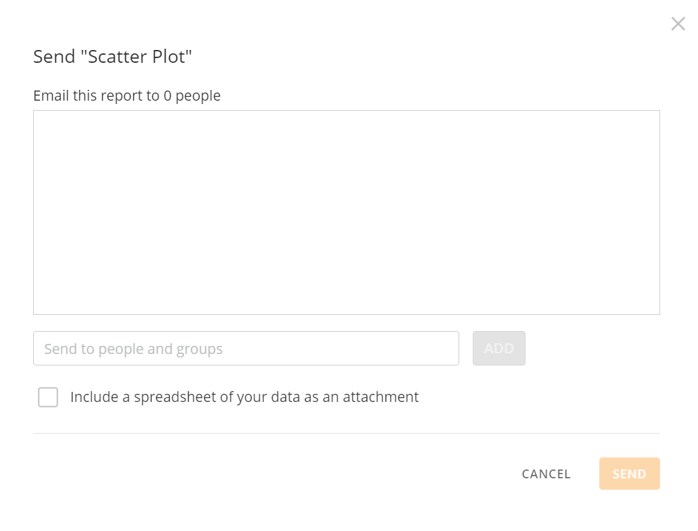

You can email a Visualization Card from either the Dashboard or the Details view. If you email a Card from the Details view when filters are applied, those filters are applied in the email version of the Card. For more information about applying filters, see [Adding Filters to Your Chart](/s/article/360042924074). This option is available *only* for Visualization Cards (that is, you cannot email Notebook Cards, Sumo Cards, Document Cards, etc.). However, all chart types are supported, including tables.

If data in a Card is filtered due to PDP policies, those filters are applied in the emailed version. 

**To email a Visualization Card,**

1. Do either of the following:

	* (Conditional) If you are on the Dashboard, mouse over the Card that you want to email, click  > **Send / Export**.  
	The **Export** dialog opens.
	* (Conditional) If you are in the Details view, click  > **Send / Export**.  
	The **Export** dialog opens.
2. Select **Email**.
3. Enter one of the following in the **Send to people and groups** field:

	* The recipient's email address (if they are not a user in the Domo instance.)
	* The name of a user.
	* The name of a Group that contains the desired users.
4. Click **Add**.  
  

**Note:** Only one Email, User, or Group can be added at a time. Repeat steps 3 and 4 until you have added all the people you would like to receive the Card.

  

5. (Optional) Check the box: **Include a spreadsheet of your data as an attachment**, if desired.
6. Click **Send**.
