---
    title: Enabling SSO with Azure Active Directory
    url: https://domo-support.domo.com/s/article/360043438033
    linked_kbs:  ['[https://domo-support.domo.com/s/knowledge-base/](https://domo-support.domo.com/s/knowledge-base/)', '[https://domo-support.domo.com/s/](https://domo-support.domo.com/s/)', '[https://domo-support.domo.com/s/topic/0TO5w000000ZamlGAC](https://domo-support.domo.com/s/topic/0TO5w000000ZamlGAC)', '[https://domo-support.domo.com/s/topic/0TO5w000000ZanoGAC](https://domo-support.domo.com/s/topic/0TO5w000000ZanoGAC)', '[https://domo-support.domo.com/s/article/360043438973](https://domo-support.domo.com/s/article/360043438973)', '[https://domo-support.domo.com/s/article/360043438953](https://domo-support.domo.com/s/article/360043438953)', '[https://domo-support.domo.com/s/article/360043438033](https://domo-support.domo.com/s/article/360043438033)', '[https://domo-support.domo.com/s/topic/0TO5w000000ZanoGAC/implementing-sso](https://domo-support.domo.com/s/topic/0TO5w000000ZanoGAC/implementing-sso)', '[https://domo-support.domo.com/s/article/360043429933](https://domo-support.domo.com/s/article/360043429933)', '[https://domo-support.domo.com/s/article/360043429953](https://domo-support.domo.com/s/article/360043429953)', '[https://domo-support.domo.com/s/article/360042925494](https://domo-support.domo.com/s/article/360042925494)', '[https://domo-support.domo.com/s/article/360043429913](https://domo-support.domo.com/s/article/360043429913)', '[https://domo-support.domo.com/s/article/4408174643607](https://domo-support.domo.com/s/article/4408174643607)', '[https://domo-support.domo.com/s/login/](https://domo-support.domo.com/s/login/)']
    article_id: 000003051
    views: 2,726
    created_date: 2022-10-24 21:08:00
    last updated: 2022-10-24 22:40:00
    ---

Microsoft's Azure Active Directory Application Gallery is an "app store" where users can search for and deploy apps that are tested and certified by Microsoft. Both Premium and Standard users can integrate with Domo for Single Sign-On (SSO).  You must have an "Admin" default security role or a custom role with "Manage All Company Settings" enabled to set up SSO. For more information about default roles, see [Managing Custom Roles](/s/article/360043438973 "Default Security Role Reference").

Users are responsible for properly setting up their Azure AD instance. This includes creating a directory, adding users to the directory and entering all user information such as name and email address. For more information, see [https://docs.microsoft.com/en-us/azure/active-directory/saas-apps/domo-tutorial](https://docs.microsoft.com/en-us/azure/active-directory/saas-apps/domo-tutorial "https://azure.microsoft.com/en-us/documentation/articles/active-directory-saas-domo-tutorial/#configuring-and-testing-azure-ad-single-sign-on"). 

**To implement SSO with Azure AD,**

1. Sign in to the Azure portal.
2. On the left navigation pane, select the **Azure Active Directory** service.
3. Navigate to **Enterprise Applications** and then select **All Applications**.
4. To add a new application, select **New application**.
5. In the **Add from the gallery** section, type **Domo** in the search box.
6. Select **Domo** from the results panel and then add the app. Wait a few seconds while the app is added to your tenant.  
After installing the application, you will need to configure Single Sign-on. This requires steps in both Azure and Domo.
7. In the Azure portal, on the **Domo** application integration page, find the **Manage** section and select **single sign-on**.
8. On the **Select a single sign-on method** page, select **SAML**.
9. On the **Set up single sign-on with SAML** page, click the pencil icon for **Basic SAML Configuration** to edit the settings.  
  

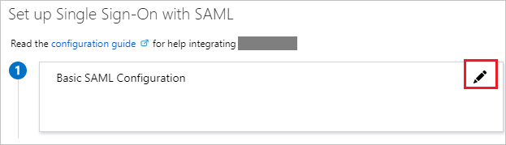
10. In a separate browser tab, log into Domo as an "Admin" user and navigate to **More > Admin > Authentication**.  
This tab is visible only if you are logged in as an "Admin" user. For more information about security roles, see [Security Role Reference](/s/article/360043438953).
11. Select **SAML (SSO)**.
12. Click **Enable Single Sign-On**.
13. At the bottom of the **Single Sign-On** tab, copy the URL in the SAML Assertion Endpoint URL field up to ".com" as shown below. This will be used as both the Azure "Sign On URL" and "Identifier (Entity ID)" fields.  
  
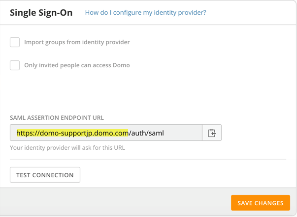
14. Return to the Azure browser tab.
15. On the **Basic SAML Configuration** section, enter the values for the following fields:
	1. In the **Sign on URL** text box, paste the URL you copied from Domo.
	2. In the **Identifier (Entity ID)** text box, paste the same URL you copied from Domo.
16. Copy the URL from the **Login URL** field. (Note that this URL is the same as the one in the **Logout URL**.)  
  
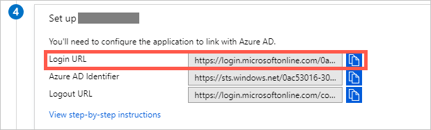  
  
You may ignore the **Azure AD Identifier** URL as this is not used.
17. In the **Single Sign-On** tab in Domo, paste the URL from the previous step into the **Identity Provider Endpoint URL** field.  
  
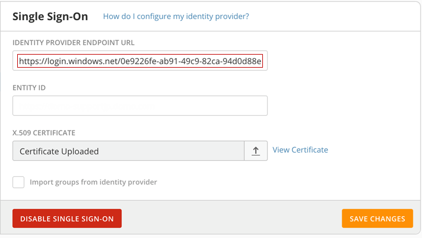
18. Enter the Domo instance URL from step 13 into the **Entity ID** field.  
Note this must match the value you entered in the Azure **Identifier (Entity ID)** field in step 15.  
  
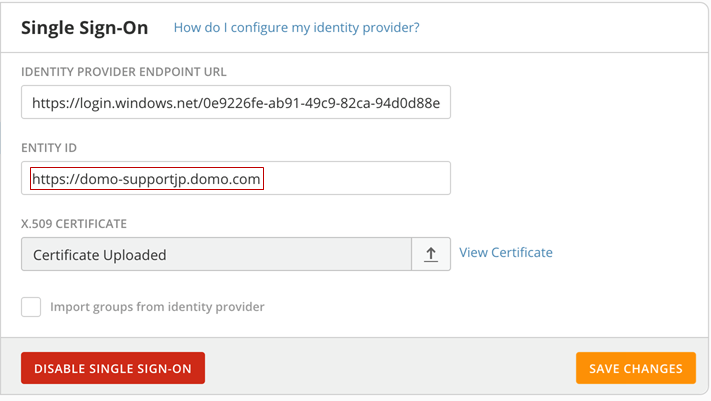
19. Return to the Azure configuration screen.
20. On the **Set up single sign-on with SAML** page, in the **SAML Signing Certificate** section, find **Certificate (Base64)** and select **Download** to download the certificate and save it on your computer.  
  

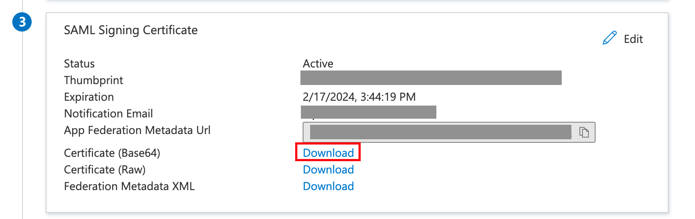
21. Return to Domo.
22. Click the up arrow in the **X.509 Certificate** field and enter the Base64 certificate you downloaded in step 20.  
  
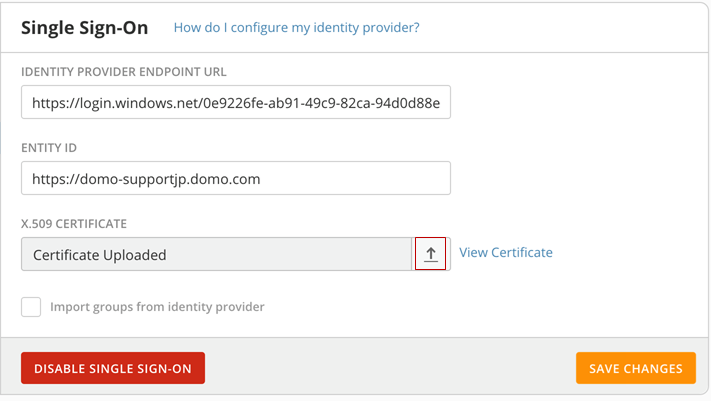
23. Select the checkbox next to **Import groups from identity provider** if you wish to copy your groups from Azure to Domo. Please note that Azure does not currently support groups that represent company departments, so Domo does not recommend enabling this option.

**Note:** Azure will sometimes import the Group ID rather than the name of the group. This can be fixed. either by following the steps here: <https://stackoverflow.com/questions/59331693/azure-group-claim-returns-object-id-need-group-name> Or the name can be edited in the Admin section under Groups.
24. Select the checkbox next to **Only invited people can access Domo** if you wish to prevent users from logging into Domo until they are invited to Domo. (By default, when SSO is enabled in Domo, any user in your Azure AD directory will be able to log into Domo.)
25. Return the Azure AD configuration screen.  
Before continuing, it is necessary to configure your Domo SAML token attributes. If you do not, then the Azure AD default settings will be used and usernames within Domo will be overwritten with email addresses.
26. To configure your SAML token attributes, click **ATTRIBUTES**.  
  
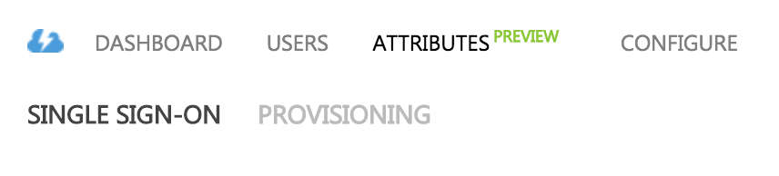
27. Configure what user information is sent to Domo.  
  
Domo accepts the following attribute names and Azure allows you to assign values.

| Attribute | Description |
| --- | --- |
| name | The full name of the user |
| name.personal | The user's first name |
| name.family | The user's last name |
| email | The email address of the user |
| email.secondary | A secondary email address for the user |
| title | The job title of the user |
| user.phone | The primary phone number of the user, usually a mobile phone number |
| desk.phone | The number for the user's desk phone |
| group | The group that the user belongs to, usually a department name |
| role | The user's role in the company |
| [employee.id](http://employee.id) | The user's employee ID |
| hire.date | The user's hire date |
| title | The user's job title |
| department | The user's department in the company |
| location | The company location for the user |
| locale | The user's locale, which determines settings such as number formats, measurements, etc. |
| timezone | The user's time zone |

All attributes are optional except "email" (though "name" is strongly recommended). The email can actually appear in two places in the SAML assertion—as the subject and as the email attribute. Either will be accepted.   
  
Due to the way that Azure AD supports groups, Domo does not recommend sending a “group” attribute.  
  
The next few steps explain how to set the “name” and “email” attribute within Azure AD.  
  
Below are the default Azure AD attributes. All rows should be deleted (except for the first row, which cannot be removed). To delete a row, mouse over it and click the "x" icon. Delete rows with names ending in “claims/givenname,” “claims/surname,” “claims/emailaddress,” and “claims/name.”  
  
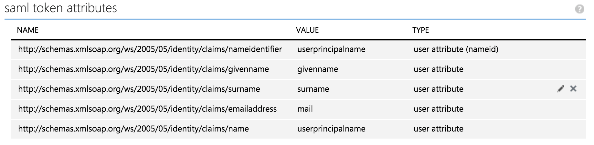  
  
If you make a mistake, Azure allows you to "reset to default" and start over.  
  
After you delete the unnecessary rows, your list should look like the list below. It only contains a row with a name ending in “claims/nameidentifier.”  
  
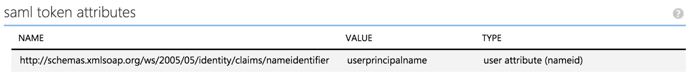
28. Add two new rows for “name” and “email” with values that Domo expects.

	1. To add “name,” do the following:
	
	
		1. Click the green button called **add user attribute**.  
		This brings up the window shown below.  
		  
		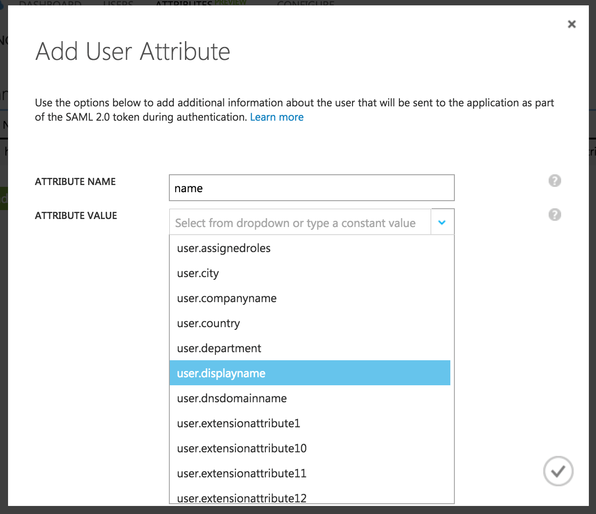
		2. Type "name" in the **ATTRIBUTE NAME** field.
		3. Select **user.displayname** in the **ATTRIBUTE VALUE** field.
		4. Click the check button at the bottom right of the screen.
		
		
		
		
		 
		
		
		**Note:****Display Name** is the default field that contains the user's full name. If you customized this field or do not use it, you may need to contact the Azure team for help in identifying which field to use to get the user's full name.
	2. To add "email," do the following:
	
	
		1. Click the green button called **add user attribute**.
		2. Enter "email" in the **ATTRIBUTE NAME** field.
		3. Select "user.mail" in the **ATTRIBUTE VALUE** field.
		4. Click the check button on the bottom right of the window.  
		  
		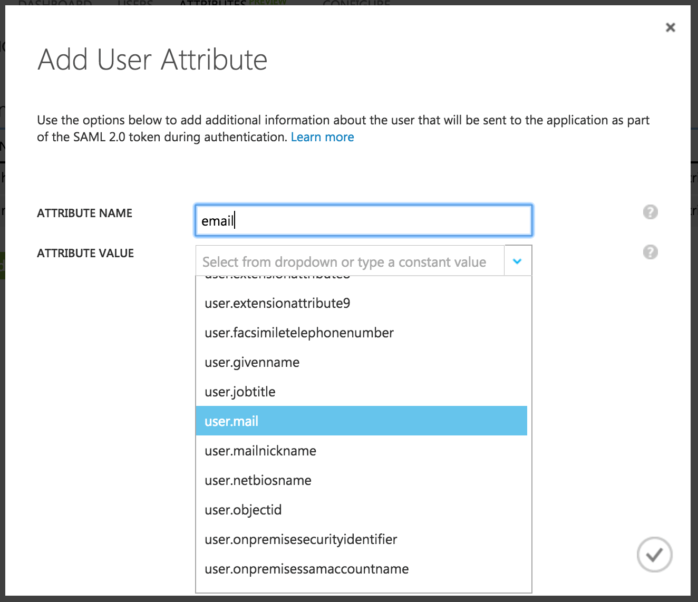  
		  
		Your final attributes should look like the screenshot below:  
		  
		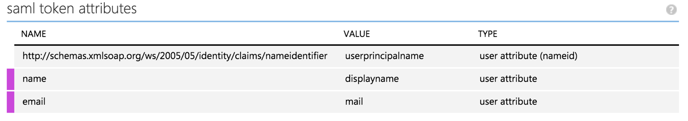
	3. (Optional) If you want to add title, phone, and/or group, do so now using the same workflow that you did for "name" and "email."
29. Click the **Apply Changes** button at the bottom of the screen.  
This concludes the SSO setup within Azure.
30. Test your connection in Domo by clicking the **Test Config** button at the top of the **Single Sign-On (SSO)** tab.   
Note that Azure may take up to five minutes to apply your settings, so the connection test may not immediately work.   
  
If you followed the preceding steps correctly you should see a success message. If not, review the above steps or contact Domo Support if necessary.
31. Save your SSO configuration by clicking the orange **Save Config** button.
