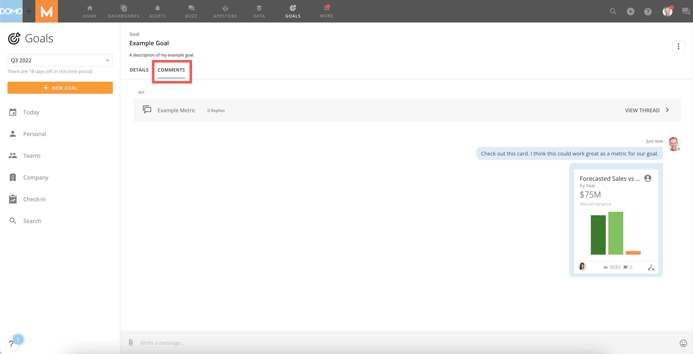
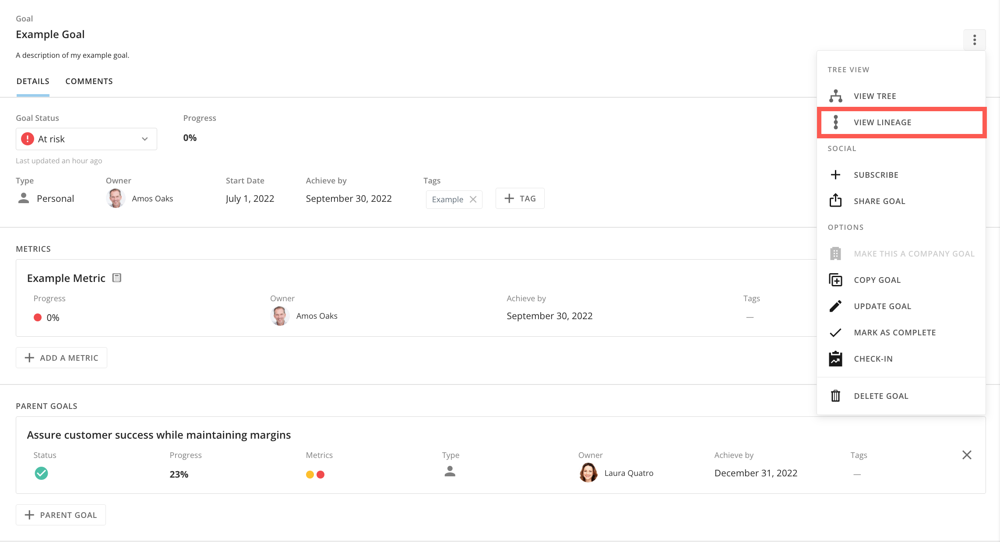
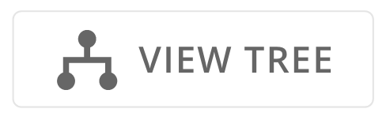
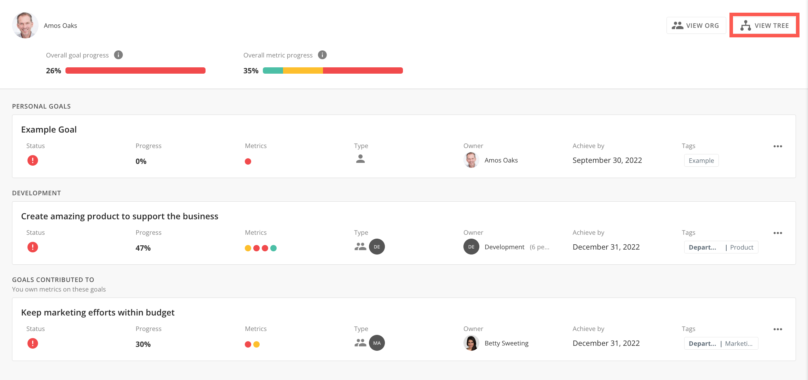
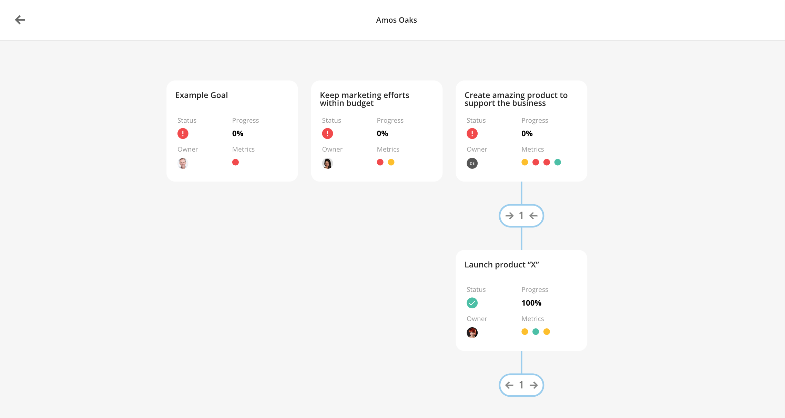
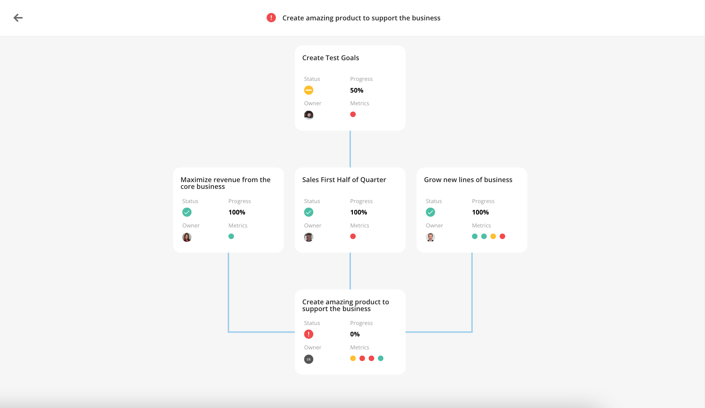

---
    title: Enhancing Your Goals
    url: https://domo-support.domo.com/s/article/4578049721495
    linked_kbs:  ['[https://domo-support.domo.com/s/knowledge-base/](https://domo-support.domo.com/s/knowledge-base/)', '[https://domo-support.domo.com/s/](https://domo-support.domo.com/s/)', '[https://domo-support.domo.com/s/topic/0TO5w000000ZamsGAC](https://domo-support.domo.com/s/topic/0TO5w000000ZamsGAC)', '[https://domo-support.domo.com/s/topic/0TO5w000000ZanmGAC](https://domo-support.domo.com/s/topic/0TO5w000000ZanmGAC)', '[https://domo-support.domo.com/s/article/4578278680855](https://domo-support.domo.com/s/article/4578278680855)', '[https://domo-support.domo.com/s/article/4578049721495](https://domo-support.domo.com/s/article/4578049721495)', '[https://domo-support.domo.com/s/topic/0TO5w000000ZanmGAC/goals-center](https://domo-support.domo.com/s/topic/0TO5w000000ZanmGAC/goals-center)', '[https://domo-support.domo.com/s/article/360043429933](https://domo-support.domo.com/s/article/360043429933)', '[https://domo-support.domo.com/s/article/360043429953](https://domo-support.domo.com/s/article/360043429953)', '[https://domo-support.domo.com/s/article/360042925494](https://domo-support.domo.com/s/article/360042925494)', '[https://domo-support.domo.com/s/article/360043429913](https://domo-support.domo.com/s/article/360043429913)', '[https://domo-support.domo.com/s/article/4408174643607](https://domo-support.domo.com/s/article/4408174643607)', '[https://domo-support.domo.com/s/login/](https://domo-support.domo.com/s/login/)']
    article_id: 000004342
    views: 2,175
    created_date: 2022-10-24 21:41:00
    last updated: 2022-10-24 22:39:00
    ---

Intro
-----

You can customize your personal, team, and company goals. By using enhancements, you can create associations between your goals and other goals in your organization. This article describes how to add tags, comments, attachments, and link parent and child goals. 

Adding a Tag
------------

Tagging establishes a searchable way to see all goals and metrics with the same tag, regardless of who they belong to. Both goals and metrics can have tags, but they function independently of one another. 

 

#### Tagging a Goal

1. In the navigation header, select **Goals**. 

2. In the left-side rail, locate your goal in the **Personal**, **Team**, or **Company** tabs. 

3. Select a goal. 

The **Goal Details** view displays. 

4. In the **Details** tab, select **+ Tag**. 

5. Select a tag from the available list, or create a new tag by entering a title in the search field. 

The goal is tagged and appears in searches with other goals and metrics with an identical tag. 

6. To delete a tag, select the **Delete**  next to the tag.

The tag is deleted, and the goal is no longer associated with goals with the same tag. 

**Tip:** Multiple tags can be added to a goal by repeating this process. 

 

#### Tagging a Metric

1. In the navigation header, select **Goals**. 

2. In the left-side rail, locate your goal containing the metric in the **Personal**, **Team**, or **Company** tabs. 

3. Select a goal containing the metric you want to tag. 

The **Goal Details** view displays. 

4. Select the metric you want to tag.

The **Details** view displays.

5. In the metric details, select **+ Tag**.

6. Select a tag from the available list, or create a new tag by entering a title in the search field. 

The goal is tagged and appears in searches with other goals and metrics with an identical tag. 

7. To delete a tag, select the **Delete** next to the tag.

The tag is deleted and the metric is no longer associated with metrics with the same tag. 

 

Adding Comments and Attachments
-------------------------------

As you track your progress, add comments or attachments to goals and metrics. You can document updates over time by going to the **Comments** tab in the goal or metric details view. 

To add a file or card, select **Add Attachment**   in the message field. 

 

Linking Parent and Child Goals
------------------------------

Let’s say your goal relates to a higher-level goal in your company. In this case, you can link goals together, making your goal a **Child** to the higher-level or **Parent** goal. 

The benefit of having parent and child goals is to create a connection between goals that you can visualize in **Tree View** or **Lineage View.** You can also expand parent goals to view child goals, and click on specific goals to see summaries. 

 

1. In the navigation header, select **Goals**. 

2. In the left-side rail, locate your goal containing the metric in the **Personal**, **Team**, or **Company** tabs. 

3. From the goal details page, select **+ Parent Goal** or **+ Link Child Goal.**

* If you chose **+ Parent Goal** in the previous step, search for and click on the desired parent goal, then click **Select.** Your goal is now connected to the selected objective as a child.
* If you chose **+ Link Child Goal**, you can search for an existing goal or create a new one. The options for creating a new goal are the same as those described in [Getting Started With Goals](/s/article/4578278680855) and will become a child goal automatically.

 

#### Tree View

Tree view displays an entire hierarchy of a goal with its child goals.

Select **View Tree** in the **Goal Options**  menu. 

Or, select  from the **Personal**, **Teams**, or **Company** tabs. 

 

Once in tree view, click the number under a goal to see all child goals. You can click and drag the tree or zoom in and out. Select any goal to see a summary view. 

 

#### Lineage View

You can see the lineage of your goal using the lineage view. This view is similar to tree view. It shows all parents of your goal up to the highest-level goal but does not show children.

Select  **View Lineage** in the **Goal Options**  menu in the **Goal Details** page.

As with tree view, you can click and drag the lineage diagram or zoom in and out. Select any goal to see its summary view. 

