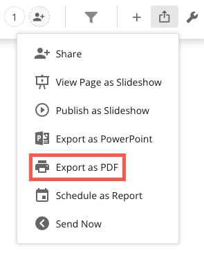
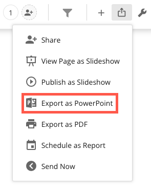
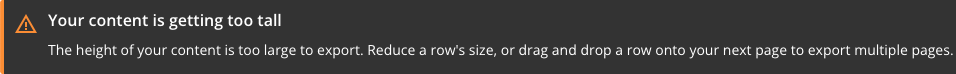
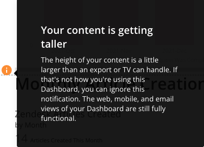
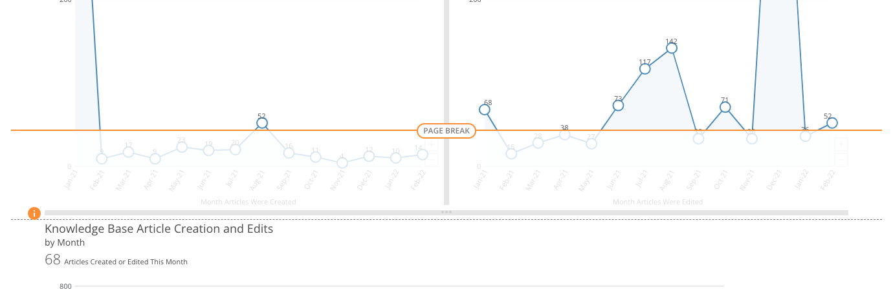
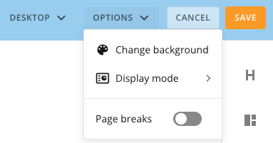

---
    title: Exporting Dashboards to PDF or PowerPoint
    url: https://domo-support.domo.com/s/article/360043437893
    linked_kbs:  ['[https://domo-support.domo.com/s/knowledge-base/](https://domo-support.domo.com/s/knowledge-base/)', '[https://domo-support.domo.com/s/](https://domo-support.domo.com/s/)', '[https://domo-support.domo.com/s/topic/0TO5w000000ZamnGAC](https://domo-support.domo.com/s/topic/0TO5w000000ZamnGAC)', '[https://domo-support.domo.com/s/topic/0TO5w000000ZanjGAC](https://domo-support.domo.com/s/topic/0TO5w000000ZanjGAC)', '[https://domo-support.domo.com/s/article/360043428433](https://domo-support.domo.com/s/article/360043428433)', '[https://domo-support.domo.com/s/article/360043437893](https://domo-support.domo.com/s/article/360043437893)', '[https://domo-support.domo.com/s/topic/0TO5w000000ZanjGAC/exporting-cards-and-dashboards](https://domo-support.domo.com/s/topic/0TO5w000000ZanjGAC/exporting-cards-and-dashboards)', '[https://domo-support.domo.com/s/article/360043429933](https://domo-support.domo.com/s/article/360043429933)', '[https://domo-support.domo.com/s/article/360043429953](https://domo-support.domo.com/s/article/360043429953)', '[https://domo-support.domo.com/s/article/360042925494](https://domo-support.domo.com/s/article/360042925494)', '[https://domo-support.domo.com/s/article/360043429913](https://domo-support.domo.com/s/article/360043429913)', '[https://domo-support.domo.com/s/article/4408174643607](https://domo-support.domo.com/s/article/4408174643607)', '[https://domo-support.domo.com/s/login/](https://domo-support.domo.com/s/login/)']
    article_id: 000004045
    views: 2,677
    created_date: 2022-10-24 21:19:00
    last updated: 2022-10-24 22:39:00
    ---

Intro
-----

You can export Dashboards to a PDF by selecting the **Export as PDF** option or to PowerPoint by selecting the **Export as PowerPoint** option in the share menu in the upper right corner of the screen. This option appears *only* for Dashboard Pages. It does not appear for standard pages.

 

**Note:** Exporting card descriptions is not supported. If a card description is enabled on a dashboard, that description does not show when the dashboard is exported.

**To export a Dashboard to PDF,**

1. Open the Dashboard you want to export.
2. In the  menu in the upper right corner, select **Export as PDF**.

**To export a Dashboard to PowerPoint,**

1. Open the Dashboard you want to export.
2. In the  menu in the upper right corner, select **Export as PowerPoint**.

Export icon grayed out
----------------------

If any layout (section of Cards) on the Page is greater than 11 inches high, the **Export as PDF**option is unavailable (since a PDF page is 11 inches high). The same is true for the **Export to PowerPoint** option. If you go into the Edit mode for the Page, a warning message appears as a banner at the top of the page as follows:  
 

A warning message also appears next to the Card that is too tall, as follows:  
 

  
 

Once you shorten all layouts displaying this warning, you will be able to export the page to PDF.

For more information about Dashboards, see [Creating Dashboards](/s/article/360043428433 "Creating Domo Stories").

View page breaks
----------------

To easily see if your Dashboard will export to PDF or PowerPoint, you can enable the **Page breaks** toggle. This displays the maximum height that a layout section can be before it gets cut off.  
 

  
 

**To enable the page breaks view,**

1. Open the Dashboard you want to export.
2. In the  menu in the upper right corner, select **Edit Dashboard**.
3. In the **Options** drop-down menu, enable the **Page breaks** toggle.

