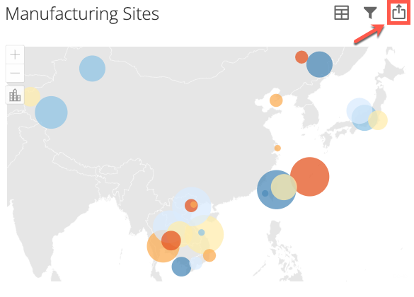
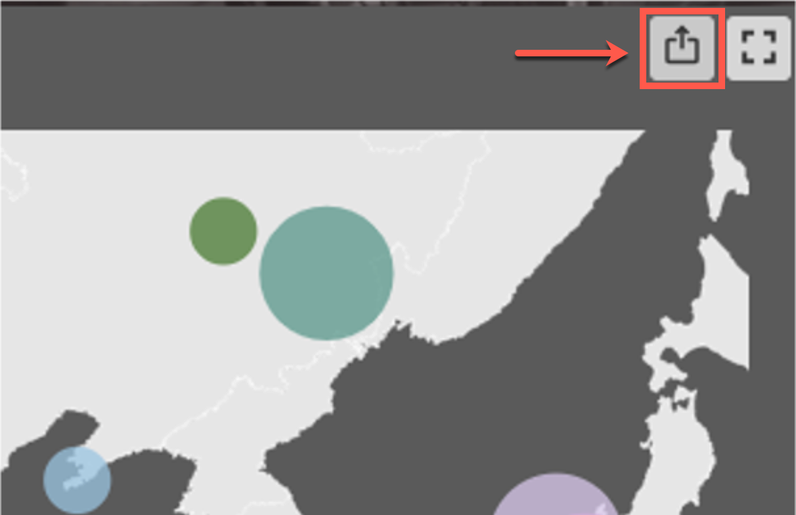
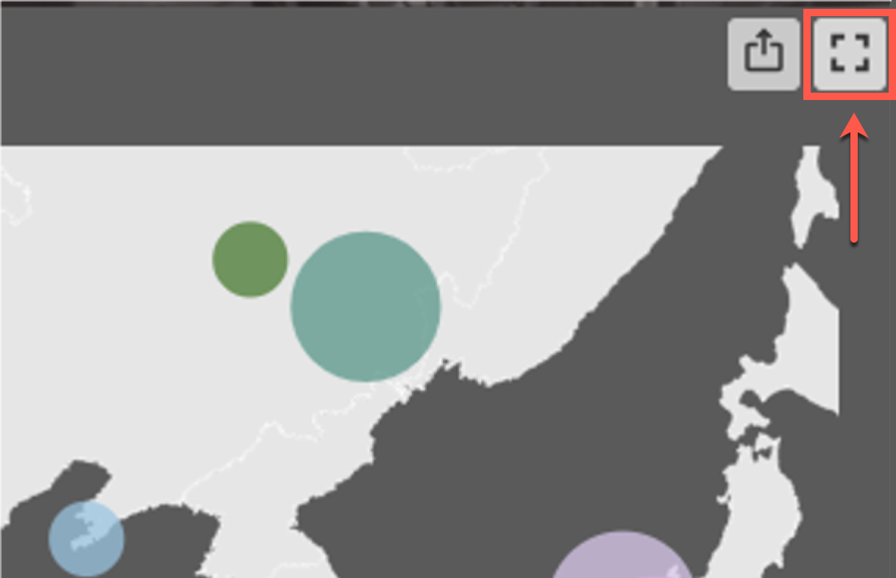
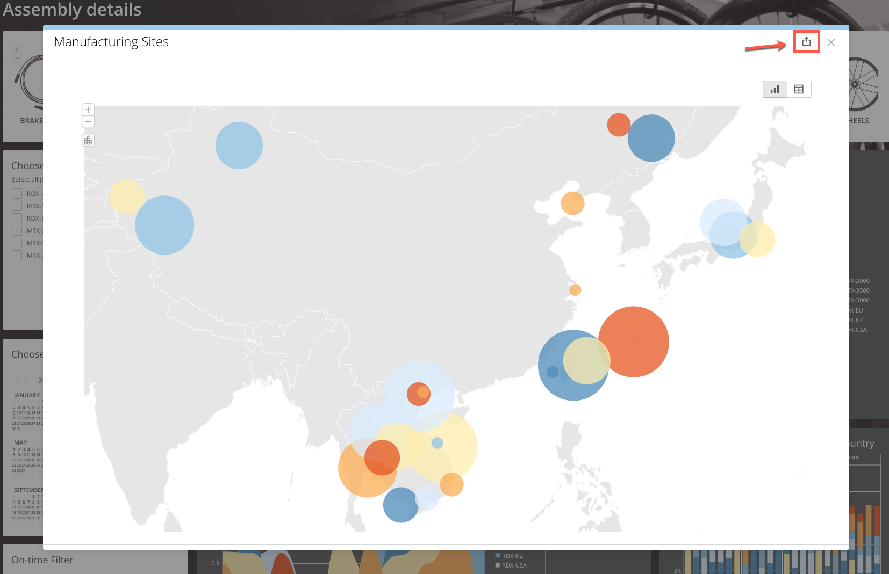
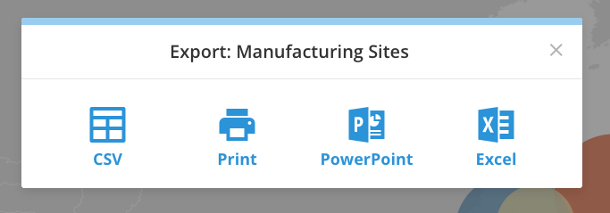
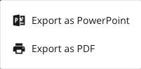

Intro
-----

Users viewing embedded content have the option to export the content in a variety of file types depending on the content that is embedded.

**Note:** If you do not see the option to export content, please ensure the **Allow export** box is checked in the embed settings modal when setting up the content to be embedded.

Embedded Card
-------------

The following section contains information on how to export a Card that has been embedded.

### Card export

You can export the Card as an Excel file, CSV, or PowerPoint.

1. Click the export icon in the top right-hand corner of the Card.  
  

2. Select the desired export method: **Excel**, **CSV**, or **PowerPoint**.  
  

Embedded Dashboard
------------------

The following sections contain information on how to export a Card that is part of a Dashboard and how to export an entire Dashboard.

### Card hover export

Using the Card hover export, you can quickly download your file as a CSV.

1. Hover over the Card you want to export to CSV.
2. Click the export icon that appears in the top right-hand corner of the Card.  
  

3. The file automatically downloads as a CSV.

### Maximization view export

In the Maximization view of a Card, you can choose to export your Card as a CSV, PDF, PowerPoint, or Excel file.

1. Hover over the Card you want to export.
2. Click the Maximize icon that appears in the top right-hand corner of the Card.  
  

3. In the modal that opens, click on the export icon in the top right-hand corner.  
  

4. Select the desired export method: **CSV**, **Print**, **PowerPoint**, **Excel**.  
  

### Dashboard export

You can export your Dashboard as a PowerPoint or PDF.

1. Click the export  icon in the top right-hand corner of the Dashboard.
2. Select the desired export method.  
  
  

**Note:** Depending on the number of Cards on the Dashboard, it may take a few minutes to download. To avoid multiple downloads, only select the export option once, even if it appears that it is not downloading.
