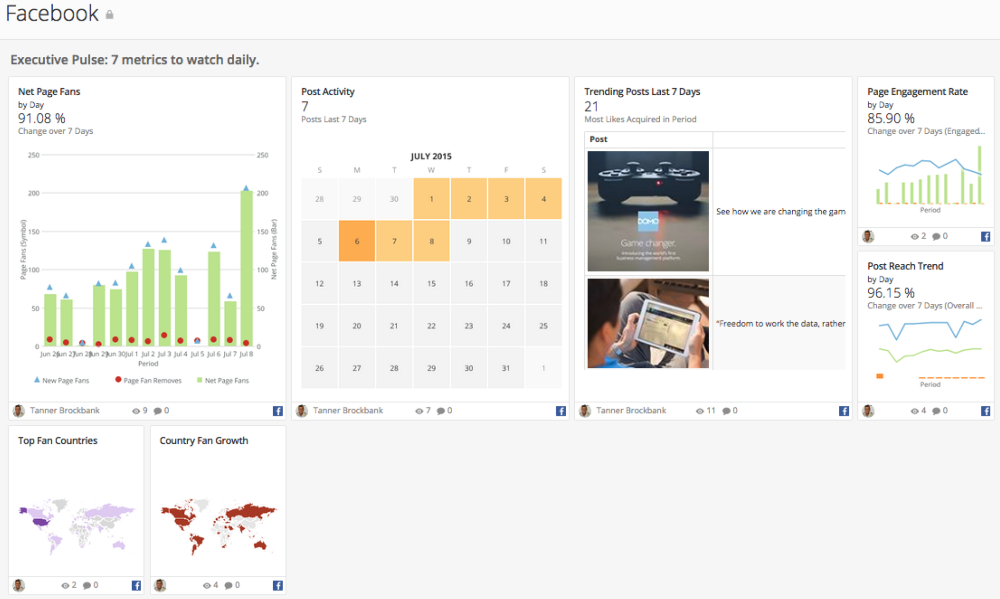

---
    title: Facebook (Business) QuickStart App
    url: https://domo-support.domo.com/s/article/360042933554
    linked_kbs:  ['[https://domo-support.domo.com/s/knowledge-base/](https://domo-support.domo.com/s/knowledge-base/)', '[https://domo-support.domo.com/s/](https://domo-support.domo.com/s/)', '[https://domo-support.domo.com/s/topic/0TO5w000000ZampGAC](https://domo-support.domo.com/s/topic/0TO5w000000ZampGAC)', '[https://domo-support.domo.com/s/topic/0TO5w000000Zan9GAC](https://domo-support.domo.com/s/topic/0TO5w000000Zan9GAC)', '[https://domo-support.domo.com/s/article/360042933554](https://domo-support.domo.com/s/article/360042933554)', '[https://domo-support.domo.com/s/topic/0TO5w000000Zan9GAC/available-apps](https://domo-support.domo.com/s/topic/0TO5w000000Zan9GAC/available-apps)', '[https://domo-support.domo.com/s/article/360043429933](https://domo-support.domo.com/s/article/360043429933)', '[https://domo-support.domo.com/s/article/360043429953](https://domo-support.domo.com/s/article/360043429953)', '[https://domo-support.domo.com/s/article/360042925494](https://domo-support.domo.com/s/article/360042925494)', '[https://domo-support.domo.com/s/article/360043429913](https://domo-support.domo.com/s/article/360043429913)', '[https://domo-support.domo.com/s/article/4408174643607](https://domo-support.domo.com/s/article/4408174643607)', '[https://domo-support.domo.com/s/login/](https://domo-support.domo.com/s/login/)']
    article_id: 000004211
    views: 1,083
    created_date: 2022-10-24 21:27:00
    last updated: 2022-10-24 22:40:00
    ---

Intro
-----

Tracking Facebook engagement gives you the data you need to nurture your community of brand advocates.

Screenshot
----------

Requirements and Notes
----------------------

Credentials must include analyst or admin permissions on a Facebook Business Page. This App will not populate with personal Facebook data or with accounts that do not have access to a Facebook Business Page.

(Without access to a business page, this QuickStart App will install with public data from Domo's Facebook page.)

Default Date Range: 60 days for most reports, 30 days for a few page data reports.

Usage
-----

* Executive Pulse: 7 metrics to watch daily

	+ Top Fan Countries
	+ Trending Posts Last 7 Days
	+ Country Fan Growth
	+ Post Reach Trend
	+ Post Activity
	+ Page Engagement Rate
	+ Net Page Fans
* Reach: Who is in your circle of fans?

	+ Fan Age Segments
	+ Site Referrals Trend
	+ Male : Female Reach
	+ Fan Growth
	+ Top Sources for Fans
* Engagement: How are your fans engaging with your content and brand?

	+ Negative Feedback
	+ Page View Growth
	+ Viral Post Impressions
	+ Best Posting Days
	+ Best Times to Post
* Content Optimization: What do your fans engage with most?

	+ Most Engaging Posts
	+ Best Performing Days
	+ Recent Engaging Posts

Authentication
--------------

| Credential | Description |
| --- | --- |
| Username | Your Facebook username that has access to the business page(s) to be utilized for the Quickstart |
| Password | Your password of the Facebook username that has access to the business page(s) to be utilized for the Quickstart |

Quickstart Reports
------------------

For report descriptions, see Facebook Connector.

| Report | Schedule Update Setting | Parameters | Selection |
| --- | --- | --- | --- |
| Page Impressions Details | Replace | Report | Page Impressions Details |
| Accounts | *Your selected accounts* |
| Start Date | yesterday-30 |
| End Date | yesterday |
| End date should be inclusive? | Yes |
| Backfill |   |
| Page Posts | Replace | Report | Page Posts |
| Accounts | *Your selected accounts* |
| Start Date | yesterday-30 |
| End Date | yesterday |
| End date should be inclusive? | Yes |
| Backfill |   |
| Page Fans by Country | Replace | Report | Page Fans by Country |
| Accounts | *Your selected accounts* |
| Start Date | yesterday-30 |
| End Date | yesterday |
| End date should be inclusive? | Yes |
| Backfill |   |
| Page Fans | Replace | Report | Page Fans |
| Accounts | *Your selected accounts* |
| Start Date | yesterday-60 |
| End Date | yesterday |
| End date should be inclusive? | Yes |
| Backfill |   |
| Page Impressions by Age, Gender | Replace | Report | Page Impressions by Age, Gender |
| Accounts | *Your selected accounts* |
| Start Date | yesterday-30 |
| End Date | yesterday |
| End date should be inclusive? | Yes |
| Backfill |   |
| Page Fans by Like Source | Replace | Report | Page Fans by Like Source |
| Accounts | *Your selected accounts* |
| Start Date | yesterday-30 |
| End Date | yesterday |
| End date should be inclusive? | Yes |
| Backfill |   |
| Referrals to Page | Replace | Report | Referrals to Page |
| Accounts | *Your selected accounts* |
| Start Date | yesterday-30 |
| End Date | yesterday |
| End date should be inclusive? | Yes |
| Backfill |   |
| Page Impressions by View Frequency | Replace | Report | Page Impressions by View Frequency |
| Accounts | *Your selected accounts* |
| Start Date | yesterday-60 |
| End Date | yesterday |
| End date should be inclusive? | Yes |
| Backfill |   |
| Page Post Lifetime Metrics
  | Replace | Report | Page Impressions by View Frequency |
| Accounts | *Your selected accounts* |
| Start Date | yesterday-60 |
| End Date | yesterday |
| End date should be inclusive? | Yes |
| Backfill |   |
| Page Interactions
  | Replace | Report | Page Interactions |
| Accounts | *Your selected accounts* |
| Start Date | yesterday-730 |
| End Date | yesterday |
| End date should be inclusive? | Yes |
| Backfill |   |
| Page Fans Online | Replace | Report | Page Fans Online |
| Accounts | *Your selected accounts* |
| Start Date | yesterday-30 |
| End Date | yesterday |
| End date should be inclusive? | Yes |
| Backfill |   |

 

