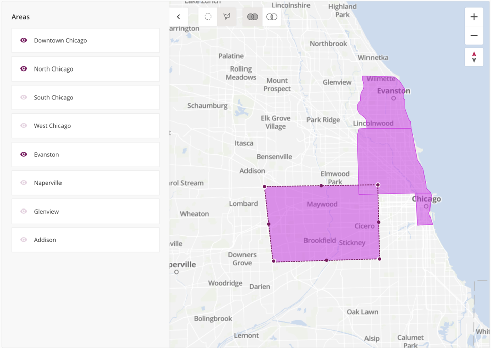
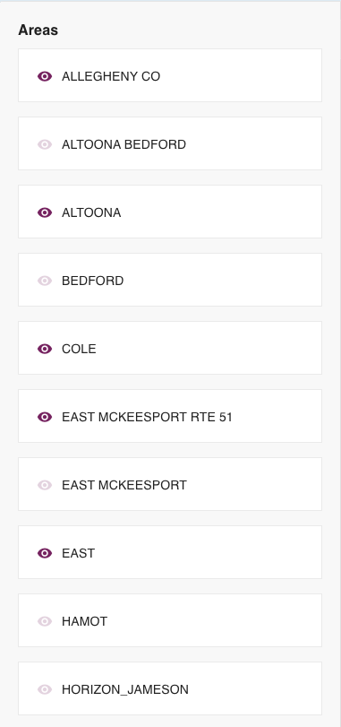
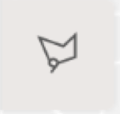
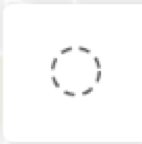
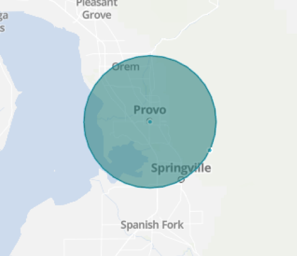
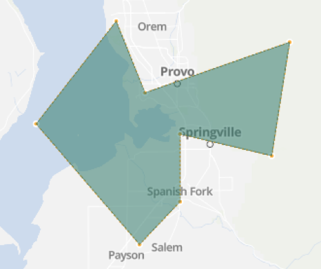
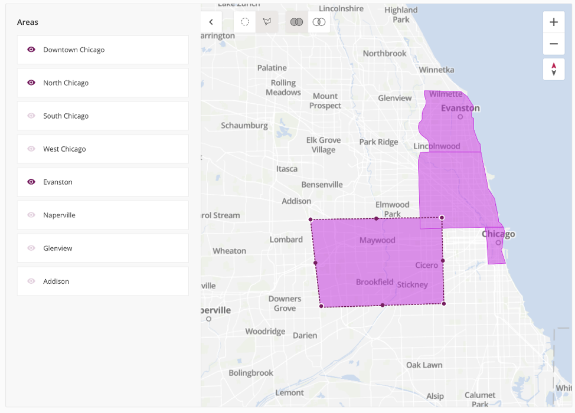
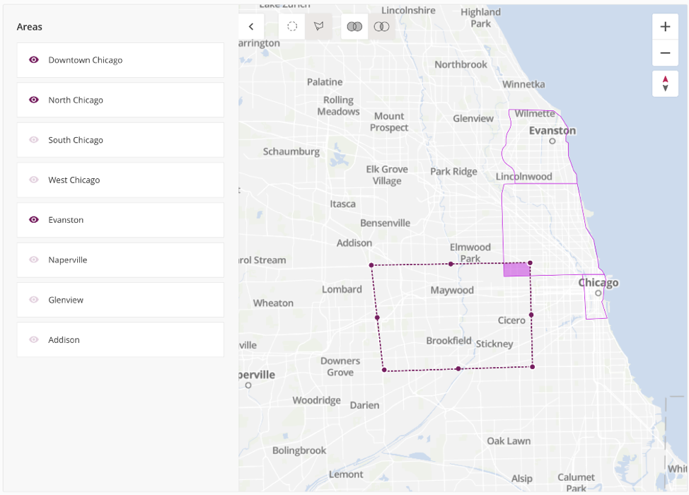
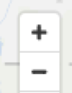

Intro
-----

The Filter Map app provides you with the ability to filter data on a Domo page based upon zip codes (provided by you) selected on the map. In the app, you're able to toggle pre-defined area on and off by drawing ad-hoc shapes (circles and polygon) on the map. The Filter Map app generates a list of zip codes based upon the areas you've both pre-defined and drawn using the ad-hoc shape feature, which is displayed as a page filter for other cards on your Domo page. Note that ad-hoc shapes are not saved after you leave the app. Areas, however, can be turned on and off using the eye symbol next to the name of each location (which is defined by the user when the app is being configured).

Parts of the Filter Map App
---------------------------

### Main View

The Filter Map app's main view includes the left navigation panel, the filter map, the tool bar, the zoom in and out option, and the clear map button at the bottom of the page. You may also have a card included on the app's page that shows the zip codes currently being shown on the map and the filters being applied on that card.

 

#### Left Navigation Panel

The Left Navigation Panel on the Filter Map is where you're able to actually turn on and off your pre-defined areas. Note that when you purchase the Filter Map app, 10 service hours are included—this is where you'll decide and configure what zip-codes and areas you want included in your version of Filter Map. Areas can be turned on and off by clicking the eye symbol on and off, when the area is visible the eye will be purple and the eye will be a light shade of purple when an area is not visible. Cards on your page will also be filtered down according to which areas you have selected as on and off.

#### Tool Bar

The tool bar is where you'll be able to either create ad-hoc shapes on the map: circles and polygons, or where you'll turn either the union or intersection mapping option on. The union and intersection option will only be visible once you have created either a circle or polygon territory on the map, as individual pre-defined areas cannot have the union or intersection on since they are individualized shape files that cannot be edited in the app. 

##### **Circles**

Circles can be drawn on the map by selecting the circle option in the tool bar. Once the circle option has been selected, place your mouse on the section of the map that you want to be the middle of the defined area and click one of the four points surrounding the center and drag it out as large as you want the circle area to be. Circles can also be moved by clicking into the circle and dragging your mouse across the screen. Only one circle can be displayed at a time.

        

 

 

 

##### **Polygons**

Polygon can be created on the map by selecting the polygon option in the tool bar. Once the polygon option has been selected, place your mouse at the starting point of your polygon and clicking at least two other places on the map to create a full polygon. When you are satisfied with the shape and area of your polygon, click back on one of your points to close the polygon. Polygons can be dragged to a different location on the map by clicking the inside of the polygon and dragging your mouse across the screen. Only one polygon can be displayed at a time.

##### **Unions**

The union option can be turned on by selecting the union option after you've either created a circle or polygon on the map. The union option allows you to allow overlap with the pre-defined areas you have visible and either the circle or polygon that you create on the map. Unions allow for a greater range of filtered data both on your map and the filter cards you create for the Filter Map app.

##### **Intersections**

Intersections can be created by selecting the intersection option from the tool bar after you've created either a circle or polygon on the Filter Map app. The intersection option allows you to create an overlap in filters, so if you have on a certain pre-defined area displayed on the map and you put a circle over that area, the intersection will turn on a very select number of filters based upon the intersected data you select. Intersections allow for a very defined, small amount of filter data both on your map and the filter cards you create for the Filter Map app.

#### Map

The map portion of the app displays the selected pre-defined areas and your drawn areas—mixture circles, polygons, unions, or intersections. The map includes the following properties:

* Default View: The default is configured according to the pre-defined areas you last had visible the last time you were in the app. For example, if you had three areas visible, the next time you open the app in Domo those three areas will be visible again. Circles, polygons, unions, and intersections are not saved.
* Zoom In/Out: Using the zoom in/out option, you're able to either zoom in and out of the map by selecting the + or - option. You can also move left or right on the map by dragging your mouse in the direction you wish to view in the map in.

* Clear Map: The Clear Map button completely clears the map, so any pre-defined areas, circles, polygons, unions, or intersections that you have on will be automatically made not visible. The map will appear blank and your filter cards will not be filtered down at all and will list all of your data instead of being filtered down.

How Do I Get This?
------------------

*To begin using the Filter Map app, have an Admin contact your Customer Success Manager.*

 

 

 

 

 

