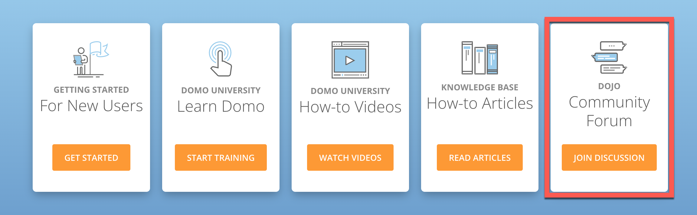
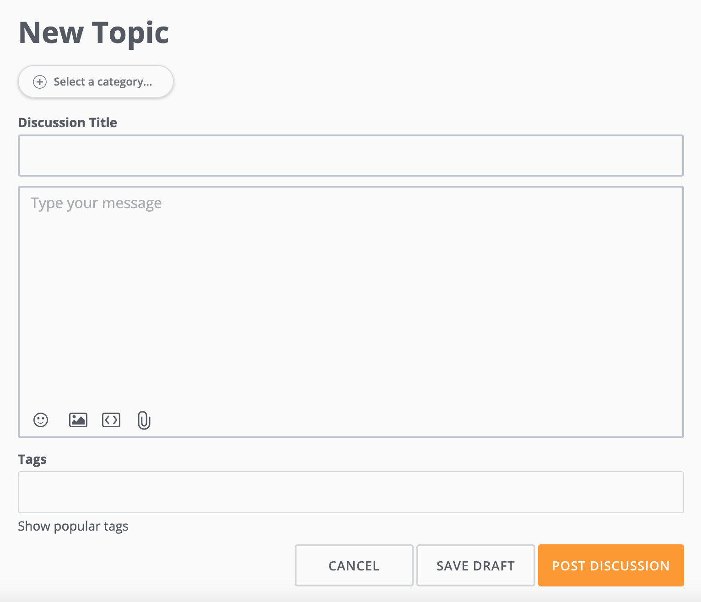
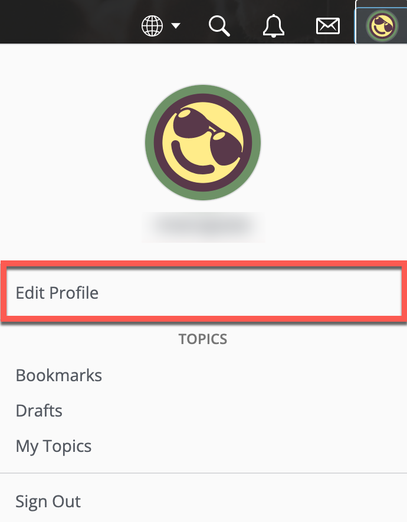
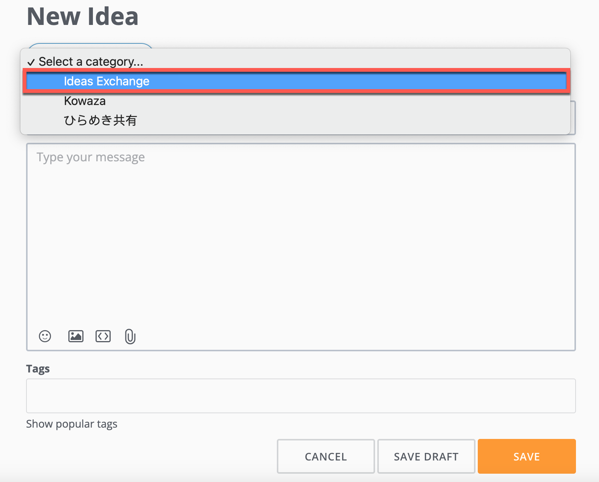
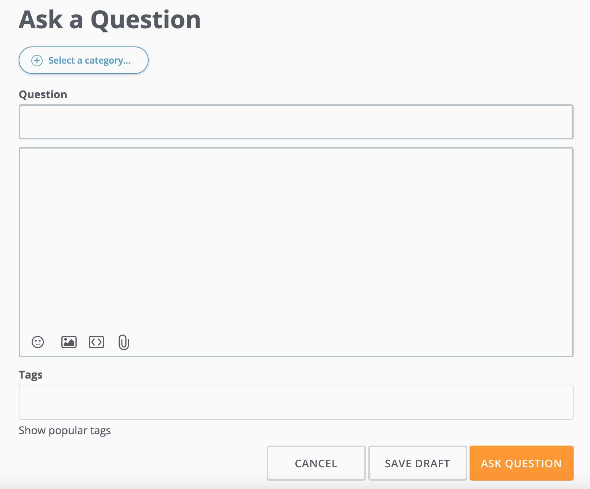
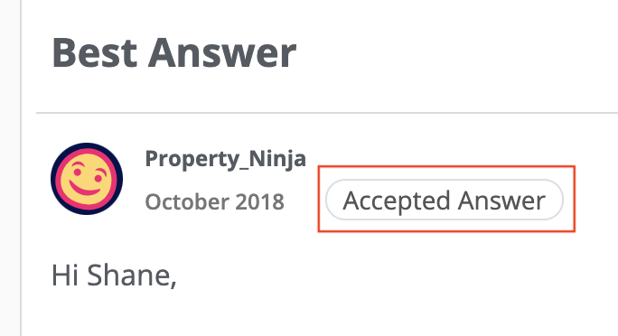

---
    title: Finding Solutions Using Dojo
    url: https://domo-support.domo.com/s/article/360042922894
    linked_kbs:  ['[https://domo-support.domo.com/s/knowledge-base/](https://domo-support.domo.com/s/knowledge-base/)', '[https://domo-support.domo.com/s/](https://domo-support.domo.com/s/)', '[https://domo-support.domo.com/s/topic/0TO5w000000ZamsGAC](https://domo-support.domo.com/s/topic/0TO5w000000ZamsGAC)', '[https://domo-support.domo.com/s/topic/0TO5w000000ZaoIGAS](https://domo-support.domo.com/s/topic/0TO5w000000ZaoIGAS)', '[https://domo-support.domo.com/s/article/360042922794](https://domo-support.domo.com/s/article/360042922794)', '[https://domo-support.domo.com/s/article/360042922894](https://domo-support.domo.com/s/article/360042922894)', '[https://domo-support.domo.com/s/topic/0TO5w000000ZaoIGAS/support-resources](https://domo-support.domo.com/s/topic/0TO5w000000ZaoIGAS/support-resources)', '[https://domo-support.domo.com/s/article/360043429933](https://domo-support.domo.com/s/article/360043429933)', '[https://domo-support.domo.com/s/article/360043429953](https://domo-support.domo.com/s/article/360043429953)', '[https://domo-support.domo.com/s/article/360042925494](https://domo-support.domo.com/s/article/360042925494)', '[https://domo-support.domo.com/s/article/360043429913](https://domo-support.domo.com/s/article/360043429913)', '[https://domo-support.domo.com/s/article/4408174643607](https://domo-support.domo.com/s/article/4408174643607)', '[https://domo-support.domo.com/s/login/](https://domo-support.domo.com/s/login/)']
    article_id: 000004371
    views: 2,171
    created_date: 2022-10-24 21:45:00
    last updated: 2022-10-24 22:42:00
    ---

Intro
-----

If you have a question about the Domo product, the community in Dojo may be able to help. This platform allows Domo customers and employees to post solutions. When you submit a question, the original author can mark the best answers to help future users. 

If you're new to Dojo, visit the [Welcome Page](https://dojo.domo.com/main/categories/welcome). You'll learn all the tips and tricks to navigating and getting the most out of Domo's online community.

 

**Video: Dojo Overview**

 

Submitting a New Post in Dojo
-----------------------------

Follow the steps below to post in Dojo: 

 

1. Select the **Help Center** in the navigation header.

 

2. Select the **Join Discussion** button to enter the **Dojo Community Form.** 

 

3. Scroll down and select the **+ New Post** button and choose **New Topic, New Idea,** or **Ask a Question.**

 

#### Submitting a New Topic

If you'd like to start a discussion about the Domo product, post a **New Topic**. 

 

Follow the steps below to begin a discussion in Dojo: 

 

1. On the main Dojo page, scroll down and select the **+ New Post** button. Choose **New Topic.**

2. From the **+ Select a Category** menu, choose a subject that best describes your topic. Give the post a title, description, and add tags to group your post with others. To see trending topics, select **Show popular tags**.

 

3. Select **Post Discussion**.

The post has been added to the Dojo Community Forum for others to see and comment on. Activity will appear in **Notifications** and is sent to your email. 

 

To change notification preferences, click the **Mebox** and choose **Edit Profile** > **Notification Preferences**.

 

#### Submitting a New Idea

If you have an idea to improve the Domo product, post your suggestions in the **Ideas Exchange**. The Ideas Exchange is a channel in Dojo where our product managers regularly review idea submissions. The most upvoted ideas are given top consideration for future development. For more information, see [Submitting Domo Product Feedback.](/s/article/360042922794)

 

Follow the steps below to suggest a new feature idea: 

 

1. On the main Dojo page, scroll down and select the **+ New Post** button. Choose **New Idea.**

2. From the **+ Select a Category** menu, choose **Ideas Exchange**. Add a title, and a detailed description of your proposed addition, and tags. You can also add pictures, files, and URLs. To see trending topics, select **Show popular tags**. 

 

3. Select **Save**. 

The post has been added to the Dojo Community Forum for others to see, comment on, and **Upvote** . Activity will appear in **Notifications** and is sent to your email. 

 

To change notification preferences, click the **Mebox** and choose **Edit Profile** > **Notification Preferences**.

 

#### Submitting a Question

If you're experiencing issues with the Domo product, ask a question in Dojo. With thousands of existing questions and solutions from other Domo users, it's likely you'll find an answer.

 

Before submitting a question, use the **Search** bar to see if a solution already exists.  

 

Follow the steps below to post a question: 

 

1. On the main Dojo page, scroll down and select the **+ New Post** button. Choose **Ask a Question.**

2. From the **+ Select a Category** menu, choose a subject that best describes your question. Add a title, a detailed description the issue you're experiencing, and tags. You can also add pictures, files, and URLs. To see trending topics, select **Show popular tags**. 

 

3. Select **Ask Question**. 

The question has been added to the Dojo Community Forum for others to see and answer. Activity will appear in **Notifications** and is sent to your email. 

 

To change notification preferences, click the **Mebox** and choose **Edit Profile** > **Notification Preferences**.

 

4. When someone offers a great solution for your problem, tag the reply as **Accepted Answer**. It will appear directly below the original post. 

 

Earning Rewards in Dojo
-----------------------

Rankings in the Dojo are a reflection of activity and engagement. The rank structure resembles the Karate Belt System. Upon registration, each member is given the "White Belt" rank.

As you ask questions, receive reactions on your posts, and reply to other discussions, you will accumulate points. The more points you have = the higher rank association you earn. 

As you uprank, you earn rewards. Some of the rewards include a Domopalooza ticket, VIP spotlight article posted on Dojo, and a physical black belt mailed to you with your name embroidered on it. To learn more about ranks and badges, see [Ranking & Badge System](https://dojo.domo.com/main/discussion/52264/ranking-badge-system#latest).

