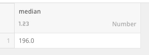
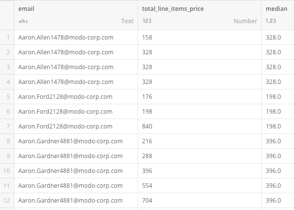

You can use an SQL DataFlow to find the median of a value. You can do this in either a MySQL or Redshift DataFlow.

#### MySQL

Transform\_data\_1:

`SELECT` 

`* ,`

`@row := @row + 1 AS 'row count'` 

`FROM input_dataset,` 

`(SELECT @row:=0) a` 

`ORDER BY `value``

Transform\_data\_2:

`SELECT` 

`*,` 

`(CASE    
WHEN (SELECT MAX(`row count`) FROM transform_data_1) % 2 = 0   
    
THEN    ((SELECT `value` FROM transform_data_1 WHERE `row count` = (((SELECT MAX(`row count`) FROM transform_data_1)/2)+1)) + (SELECT `value` FROM transform_data_1 WHERE `row count` = (((SELECT MAX(`row count`) FROM transform_data_1)/2))) ) /2         
   
WHEN (SELECT MAX(`row count`) FROM transform_data_1) % 2 != 0     
   
THEN (SELECT `value` from transform_data_1 WHERE `row count` = (((SELECT MAX(`row count`) FROM transform_data_1)+1)/2))  
   
END) AS 'Median'`

`FROM transform_data_1`

Your output is then: 

`SELECT * FROM transform_data_2`

#### Redshift

Redshift has its own function to easily calculate the median of a range.

`MEDIAN ("column_name")`

This function is best used when you want to find the median of the entire range of a column.

Transform\_data\_1:

`SELECT`

`MEDIAN ("total_line_items_price")`

`FROM "table_name"`

Your output is then:

 

The `MEDIAN` function can also be windowed to group by another column.

`MEDIAN ( "column_name" ) OVER ( PARTITION BY "partition_column_name" )`

Transform\_data\_1:

`SELECT`

`"email",`

`MEDIAN ("total_line_items_price") OVER ("email")`

`FROM "table_name"`

Your output is then:

You can now see what the median item price is per person.

