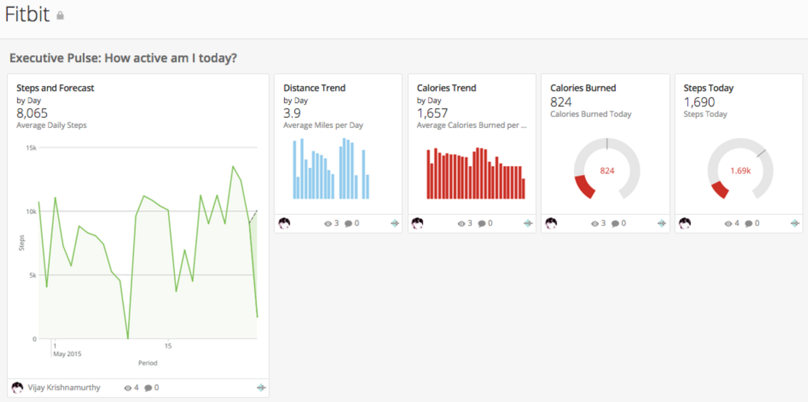

---
    title: Fitbit Dashboard App
    url: https://domo-support.domo.com/s/article/360042933574
    linked_kbs:  ['[https://domo-support.domo.com/s/knowledge-base/](https://domo-support.domo.com/s/knowledge-base/)', '[https://domo-support.domo.com/s/](https://domo-support.domo.com/s/)', '[https://domo-support.domo.com/s/topic/0TO5w000000ZampGAC](https://domo-support.domo.com/s/topic/0TO5w000000ZampGAC)', '[https://domo-support.domo.com/s/topic/0TO5w000000Zan9GAC](https://domo-support.domo.com/s/topic/0TO5w000000Zan9GAC)', '[https://domo-support.domo.com/s/article/360042933574](https://domo-support.domo.com/s/article/360042933574)', '[https://domo-support.domo.com/s/topic/0TO5w000000Zan9GAC/available-apps](https://domo-support.domo.com/s/topic/0TO5w000000Zan9GAC/available-apps)', '[https://domo-support.domo.com/s/article/360043429933](https://domo-support.domo.com/s/article/360043429933)', '[https://domo-support.domo.com/s/article/360043429953](https://domo-support.domo.com/s/article/360043429953)', '[https://domo-support.domo.com/s/article/360042925494](https://domo-support.domo.com/s/article/360042925494)', '[https://domo-support.domo.com/s/article/360043429913](https://domo-support.domo.com/s/article/360043429913)', '[https://domo-support.domo.com/s/article/4408174643607](https://domo-support.domo.com/s/article/4408174643607)', '[https://domo-support.domo.com/s/login/](https://domo-support.domo.com/s/login/)']
    article_id: 000004210
    views: 1,097
    created_date: 2022-10-24 21:27:00
    last updated: 2022-10-24 22:40:00
    ---

Intro
-----

Fitbit tracks your fitness efforts so you can reach your personal goals. The Fitbit Dashboard provides a summary of the key metrics that matter most to your personal fitness goals. You will quickly see daily calorie metrics, daily motion in steps, and trends over days, and weeks.

Screenshot
----------

Requirements and Notes:
-----------------------

Requires FitBit credentials to authenticate 

Default date range: Last 30 days

Usage
-----

* Executive Pulse: How active am I today?

	+ Steps and Forecast
	+ Steps Today
	+ Calories Burned
	+ Calories Trend
	+ Distance Trend
* Activity Breakdown: What days am I most active and where can I improve?

	+ Average Day Performance
	+ Steps Week over Week
	+ Most Active Days
	+ Avg Calories per Activity
* Health Breakdown: Am I eating right? How is my health?

	+ Hours Asleep
	+ Most Healthy Foods Consumed
	+ Caloric Intake
	+ Weight
	+ Badges Earned
	+ Protein Intake
	+ Hours Slept

Authentication
--------------

| Credential | Description |
| --- | --- |
| Email | Your email address used to log in to Fitbit |
| Password | The password associated with your Fitbit account |

Dashboard Reports
-----------------

For report descriptions, see Fitbit Connector.

| Report | Schedule Update Setting | Parameters | Selection |
| --- | --- | --- | --- |
| User Activity Steps | Replace | Report | User Activity Steps |
| Number of Days | Thirty Days |
| Friend ID’s | *List of friends to track* |
| Distance by Day | Replace | Report | Total Distance by Day |
| Number of Days | Thirty Days |
| Friend ID’s | *List of friends to track* |
| Calories by Day | Replace | Report | Total Calories by Day |
| Number of Days | Thirty Days |
| Friend ID’s | *List of friends to track* |
| User Activities | Replace | Report | User Activities |
| Number of Days | Thirty Days |
| Foods | Replace | Report | Foods |
| Number of Days | Thirty Days |
| Weight | Replace | Report | Weight |
| Date |   |
| Number of Days | Thirty Days |
| Sleep | Replace | Report | Sleep |
| Number of Days | Thirty Days |
| Badges | Replace | Report | Badges |

