---
    title: Flex Map v2 Implementation Guide
    url: https://domo-support.domo.com/s/article/000005073
    linked_kbs:  ['[https://domo-support.domo.com/s/knowledge-base/](https://domo-support.domo.com/s/knowledge-base/)', '[https://domo-support.domo.com/s/](https://domo-support.domo.com/s/)', '[https://domo-support.domo.com/s/topic/0TO5w000000ZampGAC](https://domo-support.domo.com/s/topic/0TO5w000000ZampGAC)', '[https://domo-support.domo.com/s/topic/0TO5w000000Zan9GAC](https://domo-support.domo.com/s/topic/0TO5w000000Zan9GAC)', '[https://domo-support.domo.com/s/article/000005048](https://domo-support.domo.com/s/article/000005048)', '[https://domo-support.domo.com/s/article/000005073](https://domo-support.domo.com/s/article/000005073)', '[https://domo-support.domo.com/s/topic/0TO5w000000Zan9GAC/available-apps](https://domo-support.domo.com/s/topic/0TO5w000000Zan9GAC/available-apps)', '[https://domo-support.domo.com/s/article/360043429933](https://domo-support.domo.com/s/article/360043429933)', '[https://domo-support.domo.com/s/article/360043429953](https://domo-support.domo.com/s/article/360043429953)', '[https://domo-support.domo.com/s/article/360042925494](https://domo-support.domo.com/s/article/360042925494)', '[https://domo-support.domo.com/s/article/360043429913](https://domo-support.domo.com/s/article/360043429913)', '[https://domo-support.domo.com/s/article/4408174643607](https://domo-support.domo.com/s/article/4408174643607)', '[https://domo-support.domo.com/s/login/](https://domo-support.domo.com/s/login/)']
    article_id: 000005073
    views: 1,080
    created_date: 2022-11-22 03:59:00
    last updated: 2022-12-05 12:59:00
    ---

Intro
-----

 

 

**Important:** This guide helps you implement the Flex Map v2 app. This guide does not help you implement the [Flex Map v1](http://domo-support.domo.com/s/article/360043438353?language=en_US) app. To implement the Flex Map v1 app, see the [Flex Map v1 Implementation Guide](http://domo-support.domo.com/s/article/360043884674?language=en_US).

 

Flex Map v2 is a premium app you can use to map locations and territories and get geographical insights into your data. You can also discover relationships between locations and important locations.  
  
This guide describes how to implement the Flex Map v2 app in the following topics:

* [Configuring required DataSets](#required_datasets)
* [Configuring Domo user groups](#user_groups)
* [Connecting your data to the app](#connecting_data)

Configuring Required DataSets
-----------------------------

Before you can configure the app, you need to create two DataSets to power the four main parts of its functionality:

* Pin Layers
* Heatmaps
* Map Layers
* Uploading custom KML or GEOJSON layer files to display

The details for the two DataSets are as follows:

1. Locations Data — This is the main locations DataSet. Rows of locations data are mapped by latitude and longitude.
2. Heatmap Data — This is the main Heatmap DataSet. Rows of data by region display as numerical or categorical heat maps.

Prepare each DataSet as detailed below. 

### Locations Data

The app requires the following fields for the Locations DataSet.

 

**Important:** The required fields are case sensitive, so make sure to add these columns to your data with the names as shown.

| Column Name | Description |
| --- | --- |
| Location Id | A unique number/letter combination for a location. |
| Latitude | The latitude of a location. |
| Longitude | The longitude of a location. |
| Location Name | The name of the location. This value should be a 1:1 relation with the Location Id for the location. You can have multiple rows for a single location and the app groups the data for the location together by the ID and name. |
| Address | The address of a location. |
| SearchCache | A comma separated list of terms you want the app to use to find the location when searching using the main search bar of the app. |
| *Additional Columns* | Any additional columns for data and metrics for the locations you want to display with the mapped pins. 
Possible values include: Region, other address data, other metrics |

  

### Heatmap Data

Use this data to map metrics to regions for the Heatmaps in the app. The most important columns from this data are RegionCode and RegionType.

The app uses statistical regions to create the Heatmaps, so you need to map your metric data to the region types that the app needs.

For example, if you are in the USA and you have metric data based on zip code, you need to map your zip codes to CBSA codes in order for the map to use your data. You can easily find data to map your data to these codes online.

The app supports the following region codes/types: CBSA for the USA, CMA for Canada, SA3 for Australia, and NUTS 2 for Europe. Reach out to your Account Executive (AE) or Customer Success Manager (CSM) if you need regions beyond what is available.

The app requires the following fields for the Heatmap DataSet.  
The three required fields are case sensitive, so add them to your data with the names as shown:

| Column Name | Description |
| --- | --- |
| RegionCode | The code for the area that corresponds to the value in the RegionType column.
Example: RegionCode: 30030; RegionType: CBSA |
| RegionName | (Optional) The name of the region, if applicable. |
| RegionType | The value corresponds to the value in the RegionCode. 
Possible values include: CBSA, CMA, NUTS 2, and SA3. |
| *Your Metric Columns* | Any columns with the metrics that you want to use to build your heat maps. You can add as many as you want, but at least one is required for heat map functionality. |
| *Additional Metadata Columns* | Optional columns with metadata about the regions you want to map that use Domo Page filters to filter through the data.  |

Configuring Domo User Groups
----------------------------

Flex Map v2 supports three different user levels—Admin, Standard, and View-only.  
To have admin or view-only privileges within the app, users must be added to a Domo Group. Standard users aren't added to a group and receive the standard app privileges and functionality. The following list describes the differences between the three user levels:

* Admin users can share items they create in the app with members of Domo Groups, and configure a default map and a default center.
* Standard users can create their own items and see things that admin users share with them, but can't share items or set defaults.
* View-only users can't create anything in the app. They can only view items that admin users share with them.

To add admin and view-only users, a Domo admin must navigate to the Domo admin portal and create two Domo Groups: \_FlexMap\_Admins and \_FlexMap\_ViewOnly.

Add a user to either group to give them admin or view-only privileges, or do not add the user to either group to give them standard user privileges.

Connecting Your Data to the App
-------------------------------

After you configure the required DataSets and user groups, you can deploy the app and connect your data.

* If you have access to the app card inside the **Asset Library**, deploy the app to a dashboard in Domo and follow the numbered steps below.
* If the app card has been deployed for you with sample data, navigate to the app, then follow the numbered steps below.

Follow these steps to connect your data to the app: 

1. Hover over the top right corner of the app until 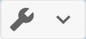 **Card options** displays floating over the other map controls.

 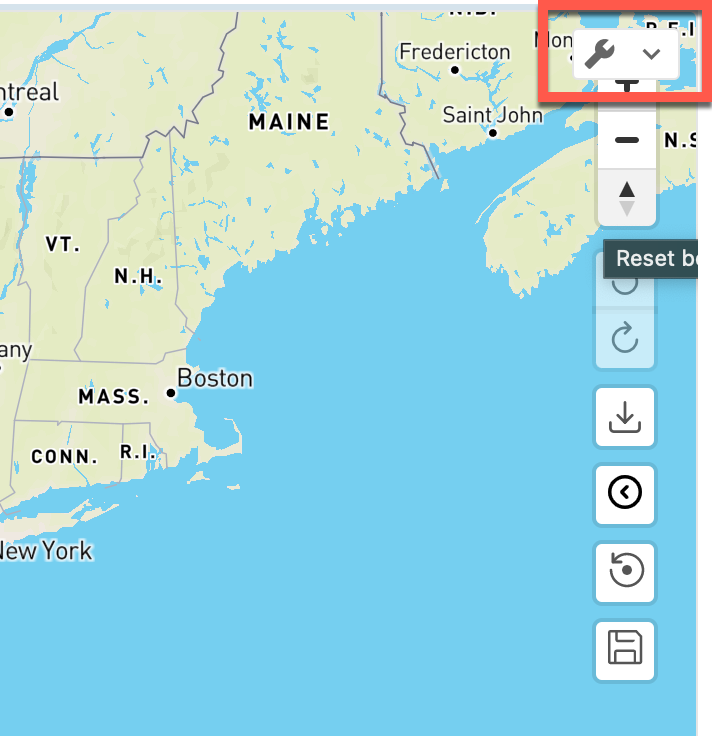
2. Select  **Card options**>  **Edit Card**. The card editor opens.
3. (Optional) Check the box for **Fullpage**if you want to see the full page of the app as you edit.
 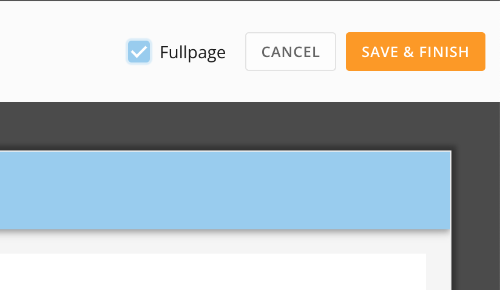
4. At the bottom of the card editor screen, locate the data **Mapping** area. (If it is not visible, select 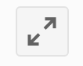 **Expand** to view it.) There are two tabs in this area: 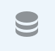 **DataSets** and 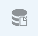 **Collections**. You can select the hamburger menu to view the mapping navigation drawer.
 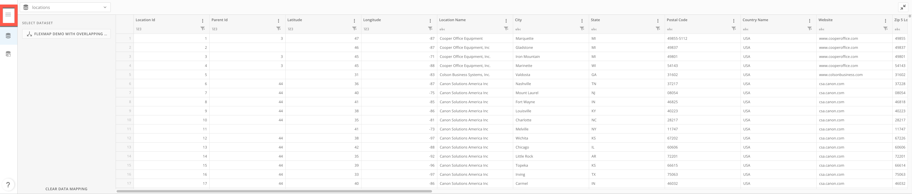

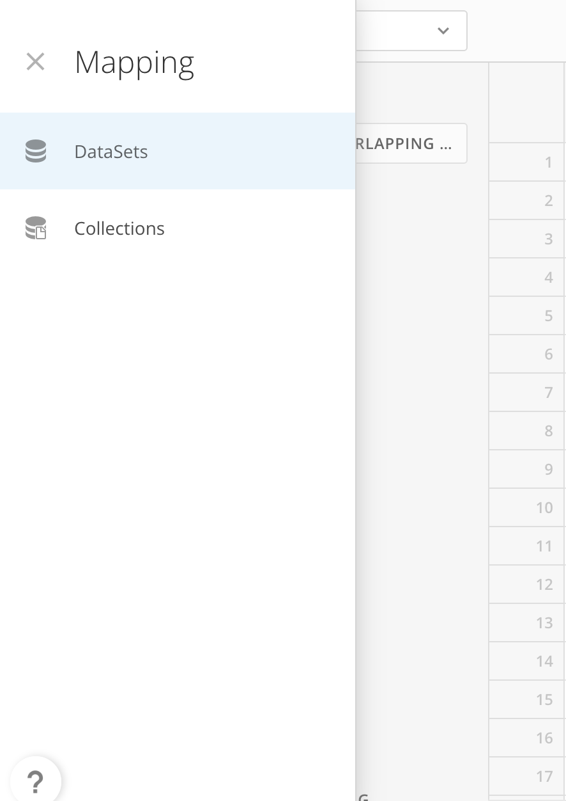
5. In the  **DataSets** tab (default), select the DataSet list at the top of the tab and choose **locations**.
 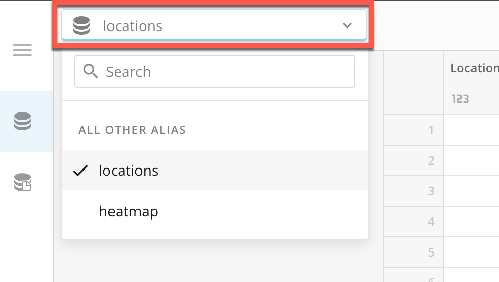
6. Under **Select DataSet**, click the button to open the **Select and DataSet** modal.
7. In the modal, search for and select the prepared Locations DataSet.
 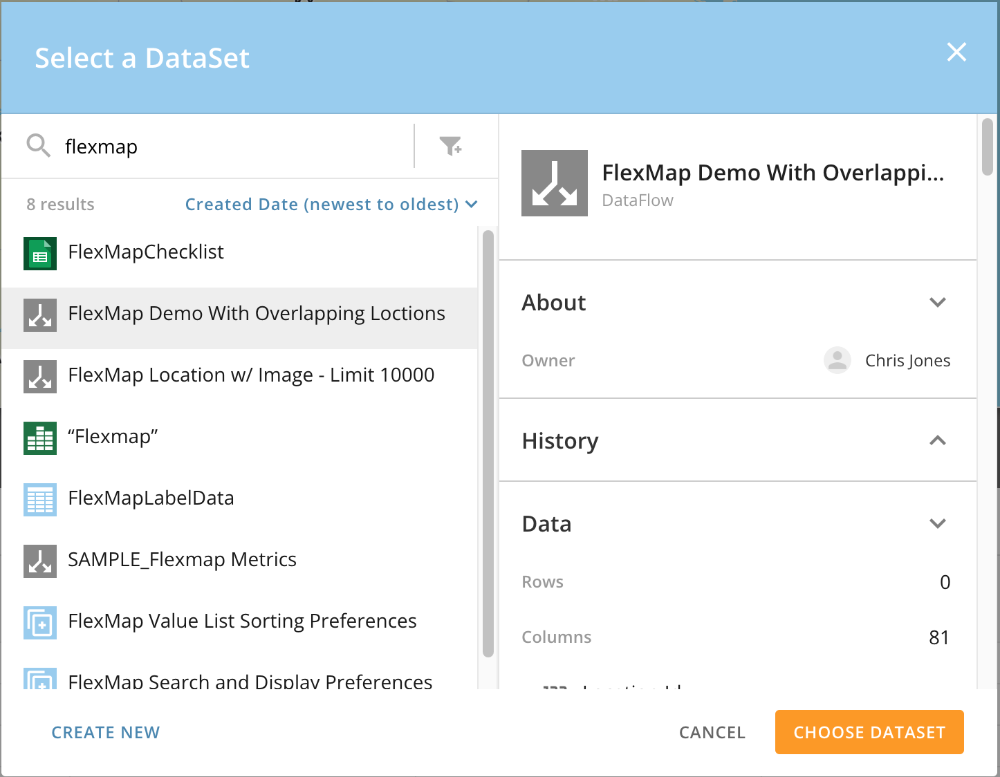
8. When you find and select your DataSet, select **Choose DataSet**to close the modal.
9. Repeat steps 5–8 for the **heatmap** DataSet.
10. Go to the  **Collections**tab and toggle the switch to **Automatically create un-configured collections with app defaults**. 
 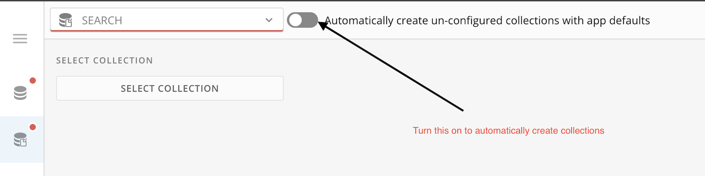
11. Select **Save and Finish**at the top of the card editor to save your configuration.

After configuring your Flex Map v2 app, you can learn about navigating it in the [Flex Map v2 User Guide](https://domo-support.domo.com/s/article/000005048).

