---
    title: Form Builder App
    url: https://domo-support.domo.com/s/article/360043438373
    linked_kbs:  ['[https://domo-support.domo.com/s/knowledge-base/](https://domo-support.domo.com/s/knowledge-base/)', '[https://domo-support.domo.com/s/](https://domo-support.domo.com/s/)', '[https://domo-support.domo.com/s/topic/0TO5w000000ZampGAC](https://domo-support.domo.com/s/topic/0TO5w000000ZampGAC)', '[https://domo-support.domo.com/s/topic/0TO5w000000Zan9GAC](https://domo-support.domo.com/s/topic/0TO5w000000Zan9GAC)', '[https://domo-support.domo.com/s/article/360042933614](https://domo-support.domo.com/s/article/360042933614)', '[https://domo-support.domo.com/s/article/9485049422103](https://domo-support.domo.com/s/article/9485049422103)', '[https://domo-support.domo.com/s/article/360043438373](https://domo-support.domo.com/s/article/360043438373)', '[https://domo-support.domo.com/s/topic/0TO5w000000Zan9GAC/available-apps](https://domo-support.domo.com/s/topic/0TO5w000000Zan9GAC/available-apps)', '[https://domo-support.domo.com/s/article/360043429933](https://domo-support.domo.com/s/article/360043429933)', '[https://domo-support.domo.com/s/article/360043429953](https://domo-support.domo.com/s/article/360043429953)', '[https://domo-support.domo.com/s/article/360042925494](https://domo-support.domo.com/s/article/360042925494)', '[https://domo-support.domo.com/s/article/360043429913](https://domo-support.domo.com/s/article/360043429913)', '[https://domo-support.domo.com/s/article/4408174643607](https://domo-support.domo.com/s/article/4408174643607)', '[https://domo-support.domo.com/s/login/](https://domo-support.domo.com/s/login/)']
    article_id: 000004981
    views: 2,497
    created_date: 2022-11-01 23:18:00
    last updated: 2022-11-01 23:23:00
    ---

Intro
-----

Form Builder is a premium app you can use to create and edit custom forms, form templates, and questionnaires to collect feedback from your users.  Use the [Form Viewer](/s/article/360042933614) app to enter data into your forms. You can download and install both apps from the Domo Appstore. You can download Form Builder in trial mode. If you then purchase the app, Domo converts the trial version to a full version.

 

**Note:** The trial version of Form Builder is **not** feature restricted.

Form Builder can exist on one or more Domo dashboards. Response data entered into a form using Form Viewer is stored in the app database, and then synced to the Domo Data Center. Usually, you must then transform the data in Domo.

#### Response DataSets

You can use one form that you create in Form Builder to collect data, whether in one or more instances of Form Viewer, or in Form Builder itself.

An example is that Person A and Person B each use a separate instance of Form Viewer to enter data into the same form. Person C, who created the form in Form Builder, also enters data into the same form.

There will be three DataSets of responses to the form: Person A's responses, Person B's responses, and Person C's responses.

By default, these DataSets have the following naming convention:

<*form name*> Responses - <*GUID of form*>\_<*GUID of instance of Form Builder or Viewer*>

To learn more about the response data, see [Understanding Form Response Data.](/s/article/9485049422103)

 

Prerequisites
-------------

Before you can create forms, templates, or questionnaires, you need to create the following groups in your Domo instance:

* \_FB\_CreateForms\_
* \_FB\_CreateTemplate\_

Each of these groups grants a unique set of permissions to its members while using Form Builder.

* Members of the **\_FB\_CreateForms\_** group are granted permission to create and manage forms for their Domo groups.
* Members of the **\_FB\_CreateTemplate\_** group are granted permission to manage all questionnaires, templates, and forms for all Domo groups and users.

 

**Note:** You do not need to be a member of one of these groups to enter data into a form. Only users who need to create and edit forms should be members of the groups.

Configuration
-------------

Download Form Builder from the **Appstore**. When you download the app, Domo creates a dashboard for it automatically. You can add additional cards for the app from the Domo Asset Library.

 

**Note:** When you are deploying a new card for the app, you may see an error message that states "An occurred while fetching data from the server." This is because some of the underlying application data isn't created until you save the card. You can ignore this error.
 

To use Form Builder, access the dashboard deployed for it and choose one of the tasks outlined later in this article.

#### FormDefinition DataSets

After you create your first form in Form Builder, a series of FormDefinition DataSets are created in Domo and appear in the Data Center. These DataSets contain the metadata that define the forms. You need to connect these FormDefinition DataSets to Form Viewer to use the app.

The FormDefinition DataSets are listed below:

* ExportForms
* ExportGroups
* ExportTags
* ExportSubmittedUsers
* ExportSections
* ExportItems
* ExportColumns
* ExportFilters

To learn how to connect to these DataSets in Form Viewer, see [Form Viewer](/s/article/360042933614).

Creating a Form
---------------

After you have installed the app, and if you are a member of one of the **\_FB\_CreateForms\_** or **\_FB\_CreateTemplate\_** groups, you have access to create and manage forms.

1. Open the Form Builder card and go to the **Form** tab.

2. Select **Create** **Form**.

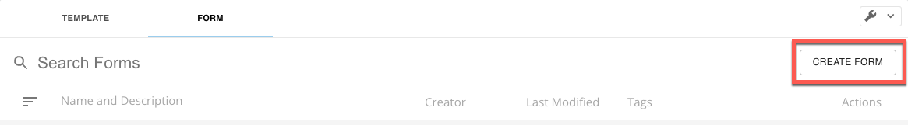

The form editor displays.

3. Define your form. See below for information on form definition.

#### Basic Form Definition

When creating a new form or managing an existing form, you can choose how users find and interact with your form by configuring the basic form definition with the following items in the form editor.

* **Name  —**the name of the form
* **Description (optional) —** a description of the form
* **Tags (optional) —** searchable tags so you can locate a form faster
* **Groups (optional) —** the users who are permitted to respond to your form, designated in one or more groups
* **Response Type (required) —** determines response limitations and formats
* **Form Settings (optional) —** various ways that users can interact with your form

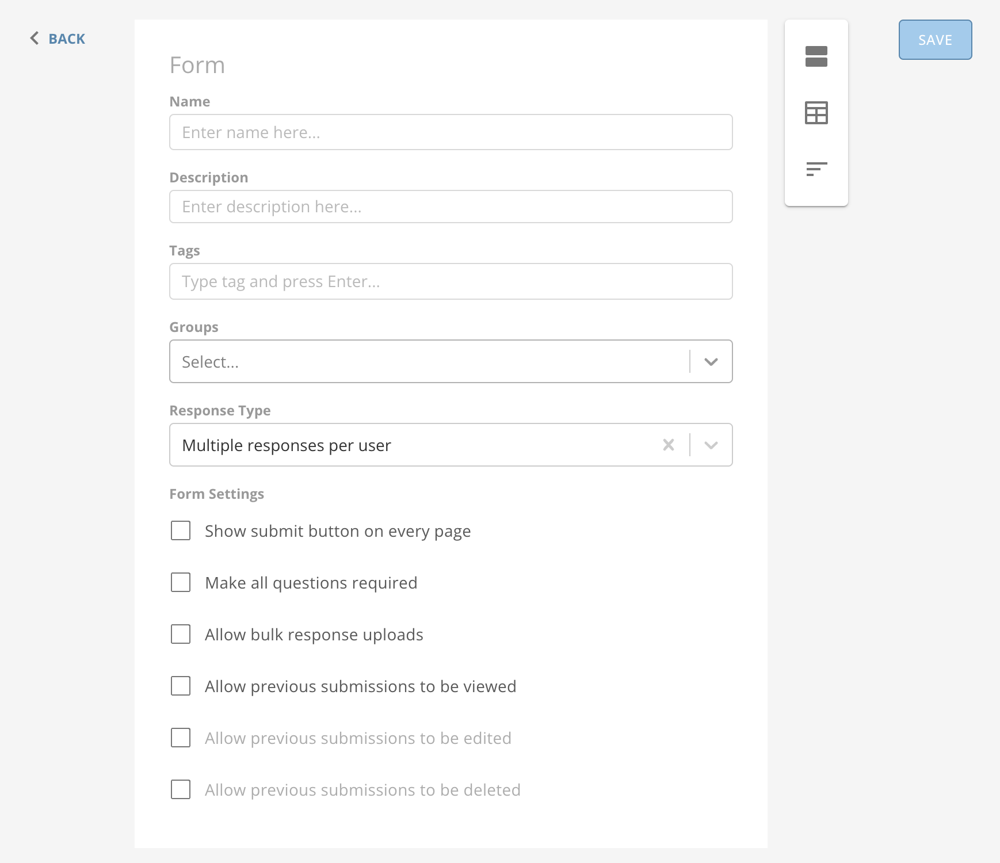

**Response Types**

There are several different response types that govern how end users can interact with your form. Each type is appropriate for specific use cases. The following table defines four of the possible response types available in the form editor, including some notes about possible use cases.

Bulk response is defined below the table.

| Response Type | Description |  |
| Crowdsourced (collaborative) | Crowdsourced responses allow multiple users to contribute to the same submission.
When loading an active submission, users may see other users' unsubmitted responses.
Users can save form submissions without submitting and return later to modify the submission before submitting. |  |
| One response per user | Each user may only submit one response.
This type can be useful for collecting votes or obtaining other one-time responses. |  |
| Multiple responses per user | Users can submit multiple responses.
This type can be useful for collecting data on multiple occasions, such as for a maintenance request. |  |
| Multi-session form | Users can submit multiple responses. Users may have multiple named sessions active at one time. When visiting the form, users are prompted to start a new entry or resume an existing session.
mceclip0.png
To rename an existing session, select the session name to activate the text entry, enter the desired title, and then click away from the text input to save the new name.  mceclip1.png
Users can save form submissions without submitting and return later to modify the submission before submitting. |  |

 

**Bulk Response**

The bulk response option is not available in the **Response Type** menu in the form editor. To use it, follow the steps below.

1. In the **Form Settings**  in the form editor, check the box to **Allow bulk response uploads**.

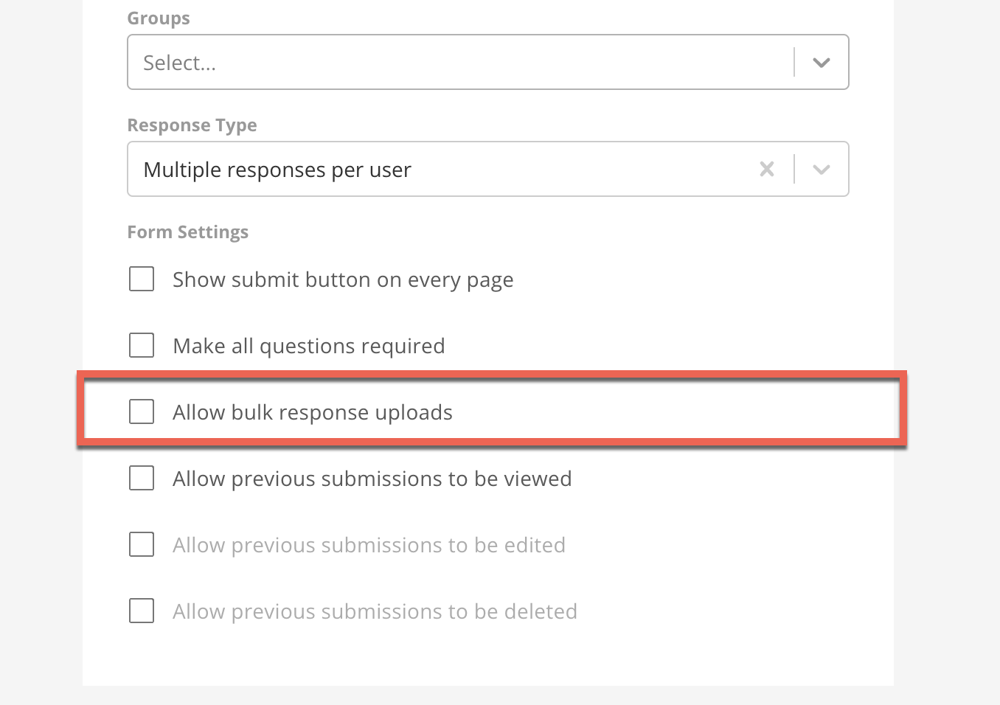

2. Finish configuring your form in Form Builder.

3. In **Form Viewer**, select **Bulk Upload**.  
The Bulk Upload menu displays.

4. Select **Download Template**.

The bulk response template is formatted as a comma separated value file (.CSV). By default, the first four lines are filled and include important metadata to ensure that, when uploaded, the file and responses can be parsed and submitted correctly. In order, the default values in the template are:

1. Section ID
2. Section Name
3. Question ID
4. Question Name

 

**Note:** You can learn more about these values and the other response data in [Understanding Form Response Data.](/s/article/9485049422103)

5. Fill out your responses in the .CSV file.

6. In Form Viewer, select **Bulk Upload**> **Upload Bulk Responses**.

7. Upload the file containing your responses.

8. Wait for the bulk response to process. If any errors are found, you are notified and all responses are rejected until the errors have been resolved.

 

**Important:** The first four lines in the bulk response template should remain unchanged. Altered templates may be rejected when submitted

#### Form Settings

This table defines each of the Form Settings available in the form editor.

| Setting | Description |
| --- | --- |
| Show submit button on every page | Indicates whether the submit button is displayed on all pages or on only the final page of the form. |  |
| Make all questions required | **If the box is checked —** Users are required to enter a valid response to all questions before submitting the form (does not apply to table sections).
**If the box is unchecked —** Users may choose not to respond to questions that are marked 'optional.'

 

**Note:** If you check the **Make all questions required** box, you can no longer change the required setting for individual questions.

 |  |
| Allow bulk response uploads | Indicates whether users can perform bulk submissions (see [Bulk Response](#bulk-response)). |  |
| Allow previous submissions to be viewed | Indicates whether users can see their own previous submitted responses to a form.  You can **Select preview fields** to allow user to configure the fields that are displayed on the **Previous Submissions** page. |  |
| Allow previous submissions to be edited | Indicates whether users can edit previous submitted responses to a form.
Is not available unless **Allow previous submissions to be viewed** is enabled. |  |
| Allow previous submissions to be deleted | Indicates whether users can delete previous submitted responses to a form.
Is not available unless **Allow previous submissions to be viewed** is enabled. |  |

#### Sections

After filling out the form definition, before adding questions to your form, you need to add at least one section. Each section you define displays as a page of the form when end users are entering data. You can use sections to your advantage if you keep related questions in the same section.

Form Builder supports two types of sections:

* **Item Sections** **—** support standard question types such as text inputs and dropdown selections
* **Table Sections** **—** use a Table Card to prompt users for itemized input

**Adding a Section**

In the section management menu to the right of the form editor, select **** **A****dd Item Section** or  **A****dd Table Section**.

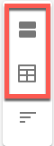

The new unnamed section displays below the form editor.

We recommend you name each section by entering a **Section Name**to keep things organized.

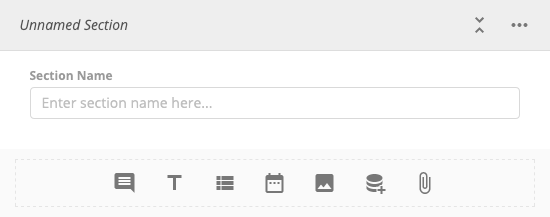

**Reordering Sections**

1. Select  **R****eorder** in the section management menu.  
The **Reorder Sections** modal displays.  
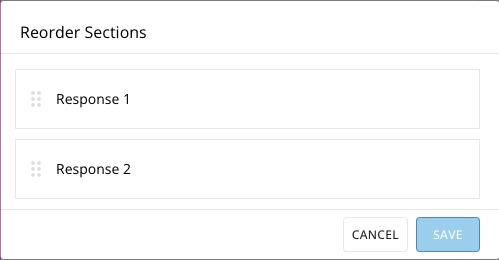

2. Hover over the  click-and-drag handle for the section you want to move til the cursor changes to a hand.

3. Click on the handle and drag the section to the position that you want.

**Deleting a Section**

1. Find the section you wish to remove and select **More Options**. 

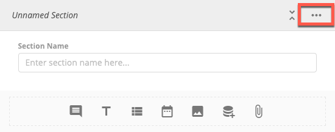

2. Select ** D****elete**.

A dialog displays to confirm deletion. Selecting **Delete**again deletes the section. This action cannot be undone.  
  
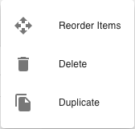

#### Item Sections

The following table defines the item and question types supported in item sections.

**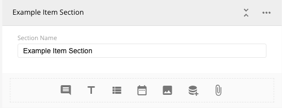**

| Icon | Name | Description | Multi Value Response Allowed |
| --- | --- | --- | --- |
| mceclip12.png | Title and Description | Additional metadata and contextual information.
Can be used to create logical breaks within a single section or simply to provide additional information. | No |
| mceclip13.png | Text | Prompts the user for free-form text response. | No |
| mceclip14.png | Dropdown | Limits user input to a list of configurable options. | Yes |
| mceclip15.png | Date | Prompts the user for a date or date range. | Yes |
| mceclip16.png | Image | Displays an image in your form (does not support user input). | No |
| mceclip17.png | Lookup | A dropdown question for which the list of options is generated from the unique values of a Table Card (supports PDP). | Yes |
| mceclip18.png | File Attachment | Allows the user to attach a file as part of their response. | No |

 

To choose an item type, select the icon in the item management menu at the bottom of the section definition. For more more information about item and question types, see [Advanced Item Configuration](#h_01F8B1N35Y7EB17B52QDJ9ZJVQ) below.

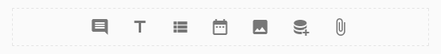

#### Table Sections

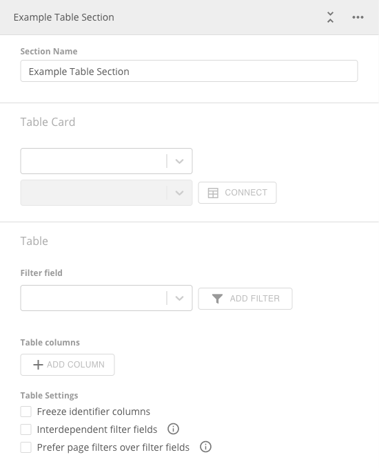

Table sections leverage Domo Table Cards to display data and prompt users for input in a row/column format.

When you select a table section, select the **Table Card** menu in the section and find and select the page/dashboard where your Table Card resides.

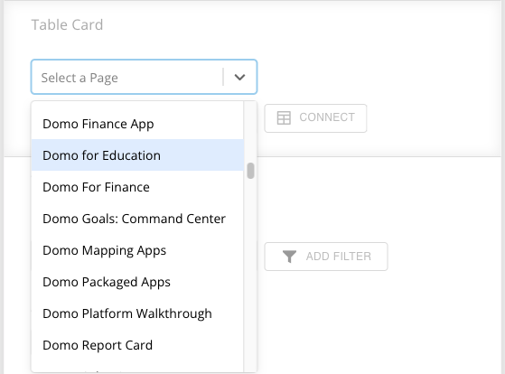

Then use the next menu control to find the Table Card from the page/dashboard you selected. Choose the Table Card you want to use and select **Connect** to begin the connection process.

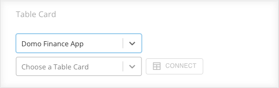

 

**Note:** Table sections support PDP.

#### Connecting a Table Card

After you select the the Table Card you want to connect to your table section, a modal displays.

You must select one or more columns from the table whose values, when combined, can be used to uniquely identify every row. Some Table Cards may have a unique id column while others may require multiple identifier columns. In the example below, the identifier columns are: Region, State, and City.

After you've chosen your identifier column(s), select **Connect** to complete the connection process.

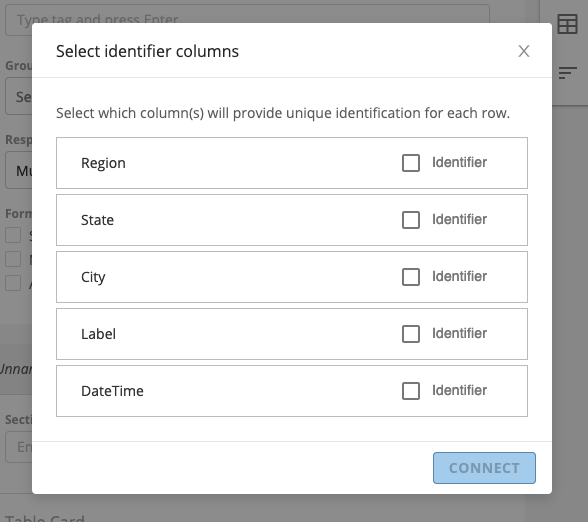

#### Table Columns

After the connection process is complete, the table section of your form in Form Builder displays the list of columns that make up the Table Card. You can change the input type of a column by choosing one of the available options in the menu option on the right hand side of the column's list entry.

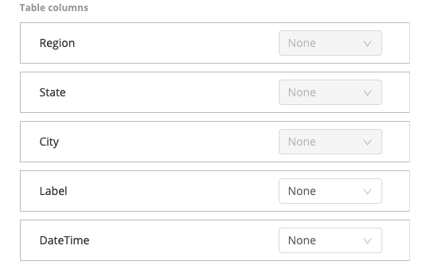

The following table describes the input types that table columns support.

 

**Note:** Identifier columns cannot be configured as input columns.

| Input Type | Description | Custom Column Supported | Existing Column Supported |
| --- | --- | --- | --- |
| None | No input control
Displays existing data from Table Card | No | Yes |
| Checkbox | Select one or more rows from the table by checking a box | Yes | Yes |
| Dropdown | Limit user input to a set of values configured in the form editor
mceclip28.png | Yes | Yes |
| Lookup | Limit user input to the unique values from the column of a table card; select a page, card, and column to configure the lookup options
mceclip29.png |  
Yes
  | Yes |
| Single Select (radio) | Choose/mark a single row from the table | Yes | Yes |
| Text | Allows freeform text entry | Yes | Yes |
| Validated Input | Detects the type assigned to the table card's column to display the correct input control type.
Supported types:* Text - freeform, no validation enforced
* Date (short) - does not support time value
* Date (datetime) - supports time values
* Numeric (long) - does not support decimal values
* Numeric (decimal/double) - supports decimal values
 | No | Yes |

 

You may add custom columns by selecting **A****dd column** at the bottom of the column list. To change the name of a custom column, hover over the space where the name should be and select the gray box to activate the text editor. Enter the desired name then click anywhere outside the text input.

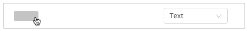

To delete a custom column or to change the visibility of an existing column, hover over the left side of a column's list entry and select  **Delete**  or  **Hide Column** .

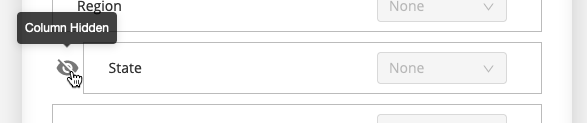

#### Table Filters (Filter Fields)

Under the **Filter field** sub-menu, you can manage fields that can be used to filter the table rows. Filter fields are dropdown menus (select boxes) that contain the unique values from their assigned columns. When a user changes the selection in these fields and applies the new selection, a filtered view of the table card is loaded so that only rows that match their filter configuration are displayed. To add a filter field, select a column from the **filter field** input control and click **add filter**. To allow users to select multiple values in a single filter, check the **multi-select** box on the right side of the list entry.

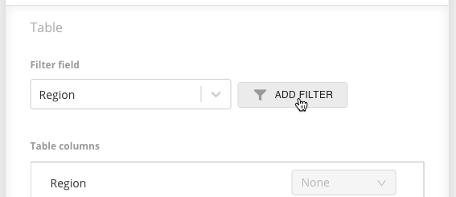

#### Table Settings

To help manage how your table section is displayed and used, table sections support the following settings:

|  |  |
| --- | --- |
| Setting | Description |
| Freeze identifier columns | Freezes the identifier columns to the left side of the table so they are always visible.
Aids users in identifying the distinct row which is being viewed or modified. |
| Interdependent filter fields | Causes the options in each table filter field to be filtered based on preceding selections. |
| Prefer page filters over filter fields | If enabled, the table is filtered based on the Page Filter configuration, allowing for a more rich filtering experience.
For instructions to enable Page Filters on your forms, see [Using Page Filters](#h_01F8B8E69Z57MSA91Z294BF498). |

Advanced Item Configuration
---------------------------

The following table displays configuration supported by the various item and question types:

| Type of item/question | Configuration | Description |
| --- | --- | --- |
| All item and question types | Descriptions | Provides additional information and context for a question. |
| Required questions | 

All items that take user input can be flagged as **required**, preventing form submission until a response has been provided ('title and description' and 'image' items do not support the **required** setting as they do not take user input).
Each question can be marked as required individually or all questions can be marked simultaneously by using the form level setting (see [Form Settings](#h_01F8B9BS8F312PHP7HNZ41X0G0)).

 |
| Text questions | Multiline | Use the **Multiline** setting to display a larger text input (textarea). |
| Dropdown questions | Multiselect | Enable the **Multiselect** setting to allow users to choose more than one value for their response. |
| Explanation field | To prompt the user for additional information about their selection, you can add an explanation field by clicking mceclip35.png to open the **additional options** menu and choosing **include explanation field**. You can choose the prompt's message by entering your desired note in the newly displayed text box. If left empty, the default message of 'Please explain your response' will be used. |
| Date questions | Date Range | Allows users to select a date range (start and end date) by enabling the **date range** setting. |
| Lookup questions
To configure a lookup question select a page, card, and column from which to retrieve the options displayed in the select/input control. | Use Page Filters to filter available options | To quickly and easily locate the desired value(s), you can use page filters to narrow down the option list (see [Using Page Filters](#h_01F8B8E69Z57MSA91Z294BF498) for setup instructions). |
| Filter based on preceding lookup question responses | When you have several lookup questions **built from the same table card** in the same section, you can build a chain of dependence that uses the selected value of a preceding lookup question to filter the options available in subsequent lookup questions. When building the chain of dependence, here are some things to keep in mind:* Lookup questions can only be made dependent on other lookup questions built from **different columns of the same table card**
* Lookup questions can only be made dependent on other lookup questions in the same section
* If the order in which the lookup questions appear in the section is altered, the chain of dependence may be broken and must be rebuilt for the questions directly affected by the change in order
* When viewing the dependent lookup questions in an active response session, child lookup questions are disabled (preventing user input) until their parent has a response

For a configuration example see [Configuration Examples](#h_01F8BFJCZDH668PWC6S9T0Q0XA) > [Dependent Lookup Questions](#h_01F8BFJMKMHSNW1A9W2XBXY5VQ). |
| File attachment | Allowed file types | You can restrict the format of the uploaded file to ensure it's always the correct type. If no type is selected, any file of a format supported by the Domo file service will be allowed.  

 

**Note:** When a user submits a file attachment, use this URL to read the file from inside your instance of Domo: [https://{INSTANCE}.domo.com/api/data/v1/data-files/{FILE\_ID}](https://%5C%7BINSTANCE%7D.domo.com/api/data/v1/data-files/%7BFILE_ID%7D). INSTANCE is the user's individual instance of Domo, and FILE\_ID is the unique identifier of the form returned in the output DataSet. You may want to consider generating the complete URL through a Beast Mode or ETL using concatenation.

 |

Using Page Filters
------------------

To make your forms feel like an integrated part of Domo, the Form Builder and Form Viewer applications both support Page Filters. Follow the steps below to connect your DataSet to an application and enable Page Filters.

#### Connecting Data to Form Builder and Form Viewer

1. Open Form Builder or Form Viewer.

2. Select **Card options**.

3. Select **Edit Card**.  
The card editor opens.

4. Scroll to the bottom and find the list of **FilterConfiguration** DataSets.  
Both the Form Builder and Form Viewer have 25 placeholder DataSets you can change for your own DataSets which you want to use for table and lookup filtering.

5. Select one of the unused **FilterConfiguration** DataSets.

6. Under **Select DataSet**, select the DataSet.  
The **Select a DataSet** modal displays.

7. Search for and select the DataSet you want to connect to your application.

8. Select **Choose DataSet**.

9. Select **S****ave & Finish** to close the editor.  
Now that you've connected your DataSet to the application, its Page Filters are also applied to the relevant queries.

 

**Note:** Page Filters are only applied to lookup questions or table sections if the Table Card used to create the lookup question/table section matches the DataSet targeted by the Page Filters.

Configuration Use Case
----------------------

Consider the following Table Card:

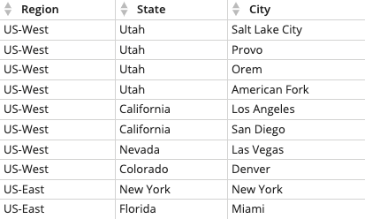

Using this Table Card, we can create a lookup question for each column:

|  |
| --- |
| Region Lookup Question
mceclip40.png |
| State Lookup Question
mceclip41.png |
| City Lookup Question
mceclip43.png |

 

If we want to restrict the list of states to those in the region selected by the user in the **Region** lookup question, we can choose **Region** in the menu labeled **Use previous lookup question response to filter available options** under the **State** lookup question. The new **State** lookup question configuration:

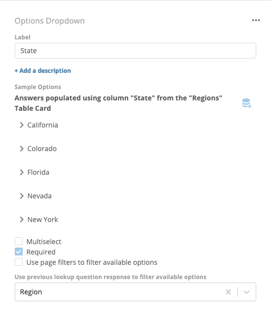

 

Similarly, if we want to restrict the available cities to those in the state chosen by the user in the **State** lookup question, we can configure the **City** lookup question like this:

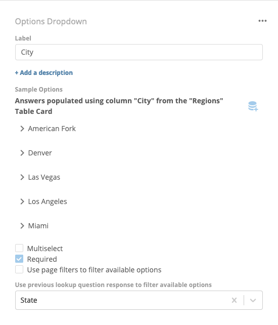

 

Now, when the user views these questions in an active session, they'll see the following:

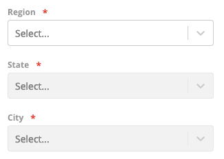

 

Making the **State** dependent on the **Region** also disables the **State** input until the user has chosen a region. Additionally, the available **State** values are limited to those that correspond to the selected **Region** while the **City** values are limited to those corresponding with the selected **State**:

|  |  |
| --- | --- |
| mceclip48.png | mceclip47.png |

 

