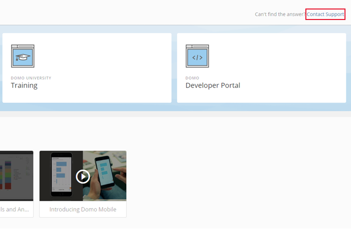

Intro
-----

You can get help using Domo from the resources listed in this page.

You can access any of these resources from within Domo by clicking  in the top navigation bar. This opens a page with links to Domo's community forum (Dojo), Knowledge Base, the Developer Portal, the Video Library, and training apps.

**Video - Help Center Overview** 

Domo University
---------------

Domo University is the next step in helping you quickly and easily become a Domo expert, offering you an ecosystem of role-based or feature-based learning options to help you get the most out of your investment. From insightful video content available 24/7, webinars, certification to structured classroom environment or onsite, Domo University is here when—and where—you need it. 

If you are interested in or have questions about training options on Domo, please contact Domo University at [university@domo.com](mailto:university@domo.com) or visit [http://www.domo.com/university/training](http://www.domo.com/university "http://www.domo.com/university"). 

To see Domo's full library of instructional videos, visit <https://www.domo.com/help-center/videos>. 

**Video - Domo University Overview**

 

Domo's Community—Dojo
---------------------

Data lovers, unite. Domo's community, known as the Dojo, is a fun place to connect, ask questions, find answers and share best practices with fellow Domo customers.

You can sign into Dojo by doing the following:

1. In Domo, click  in the top navigation bar.
2. Click **Community Forum**.
3. Click **Sign In**, then specify your Domo account username and password.

Domo Knowledge Base
-------------------

Domo's extensive documentation covers nearly every aspect of the product in full detail. 

Domo Developer Portal
---------------------

Domo's Developer Portal contains documentation for all the tools available in the portal. To access the portal, visit [https://developer.domo.com](https://developer.domo.com "https://developer.domo.com").

Technical Support
-----------------

If you cannot find what you're looking for, and you have a valid support package, please use the Customer Support Portal at [support.domo.com](http://support.domo.com) to create and manage your customer support tickets. See [Understanding the Customer Support Portal](/s/article/360043427573 "Understanding the Customer Support Portal") for more information.

  
For more support information, see <http://www.domo.com/support> and [Troubleshooting](/s/article/360043427473 "Troubleshooting").

* Follow these instructions to create a help ticket in the Support Portal:

	1. In Domo, click  in the top navigation bar.
	2. Click the **Contact Support** link in the top right corner of the Help Center.  
	  
	
	3. In the Support Portal, click **New**.
	4. Enter the information for your issue in the required fields.
	5. Click **Save**.  
	  
	For information about creating lists in the Support Portal, see [Creating a New List in the Customer Portal](/s/article/360043427533 "Creating a New List in the Customer Portal").
* Reach out to your Domo Customer Success Manager or Technical Consultant.

 

**Note:** Individuals evaluating commercial products are entitled to evaluation support. 

If you are experiencing slowness or rendering issues in Domo, go through the following steps first before you contact Support:

* Clear the cache and cookies in your browser.
* Check your network connection to ensure it is functioning normally.
* See if others in your organization are experiencing the same issue.
* See if the problem persists when you use other browsers.
* If your cache has been cleared and the network is functioning normally, contact Support so our team can investigate the issue.
* Once you contact support, they will want you to show them an example of a card/page that is experiencing slowness or rending problems. And please be ready to report roughly what timeframe they last tried to render that card/page.

For information about the service agreement, see <http://www.domo.com/company/service-terms>.

**Video - Support Portal Overview**

Contact information
-------------------

|  |  |
| --- | --- |
| Address | Domo, Inc.
772 East Utah Valley Dr.
American Fork, UT 84003 |
| Website | [http://www.domo.com](http://www.domo.com "http://www.domo.com") |

 

 

