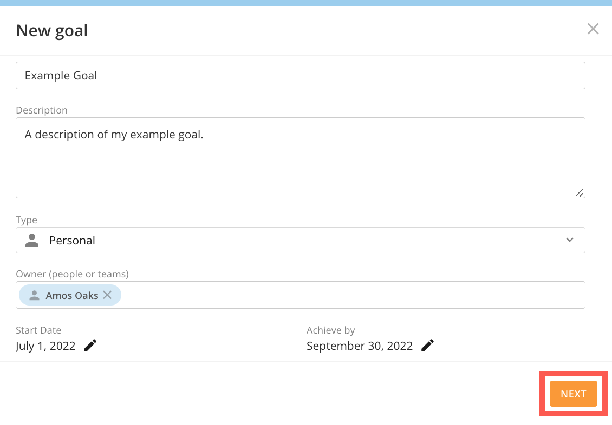
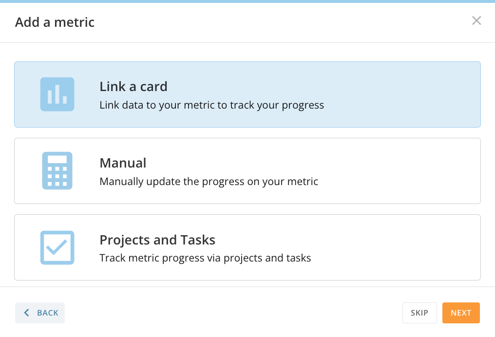
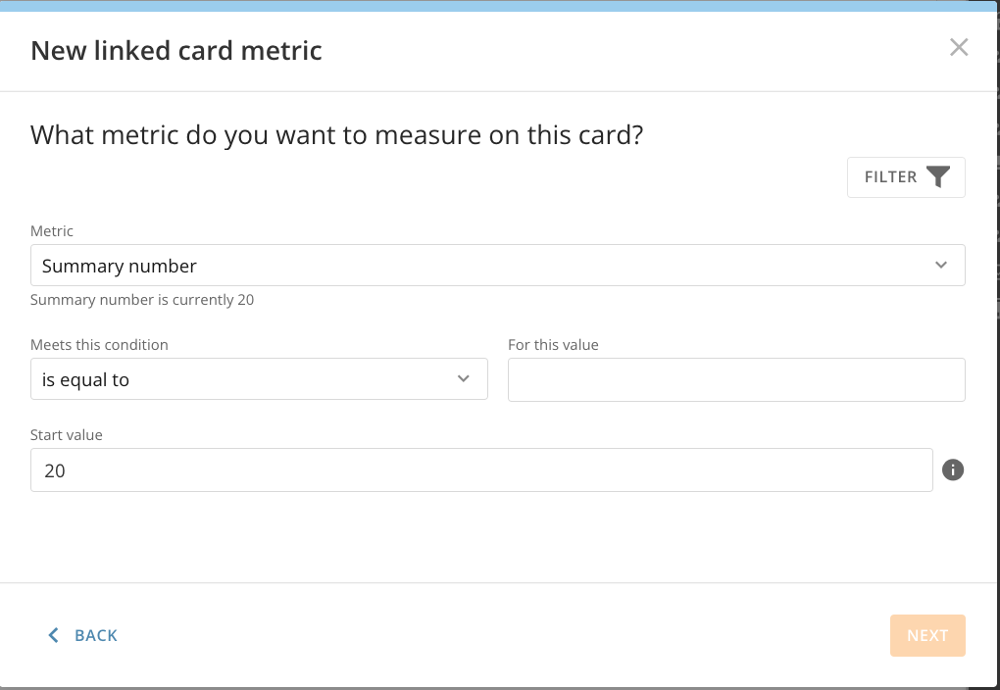
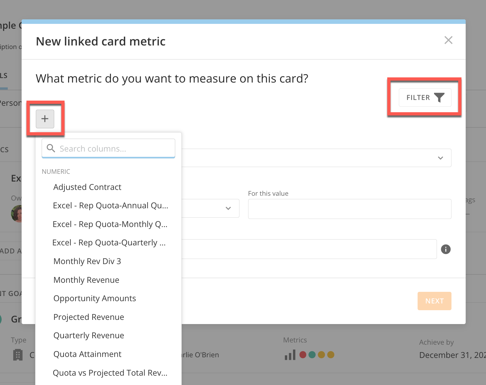
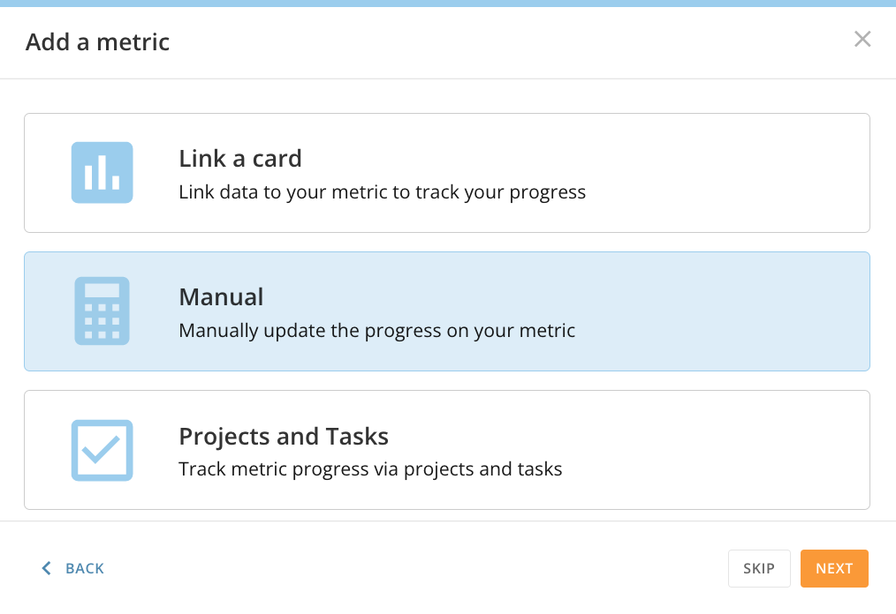
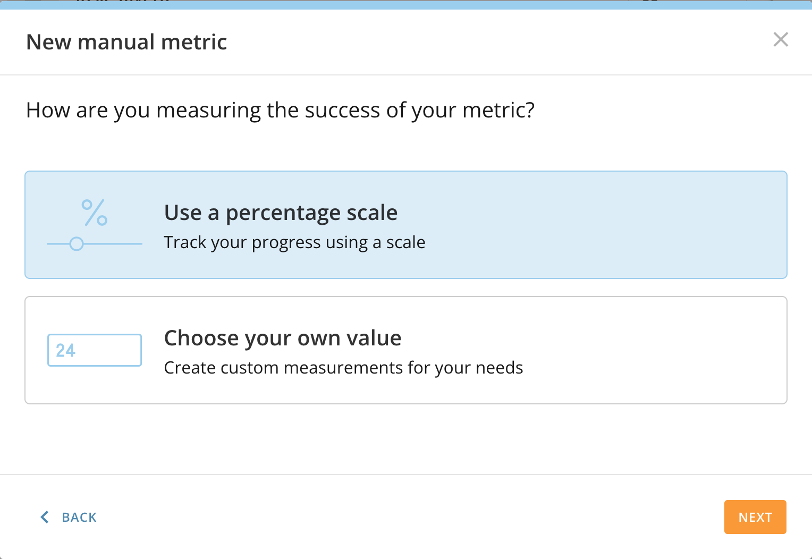
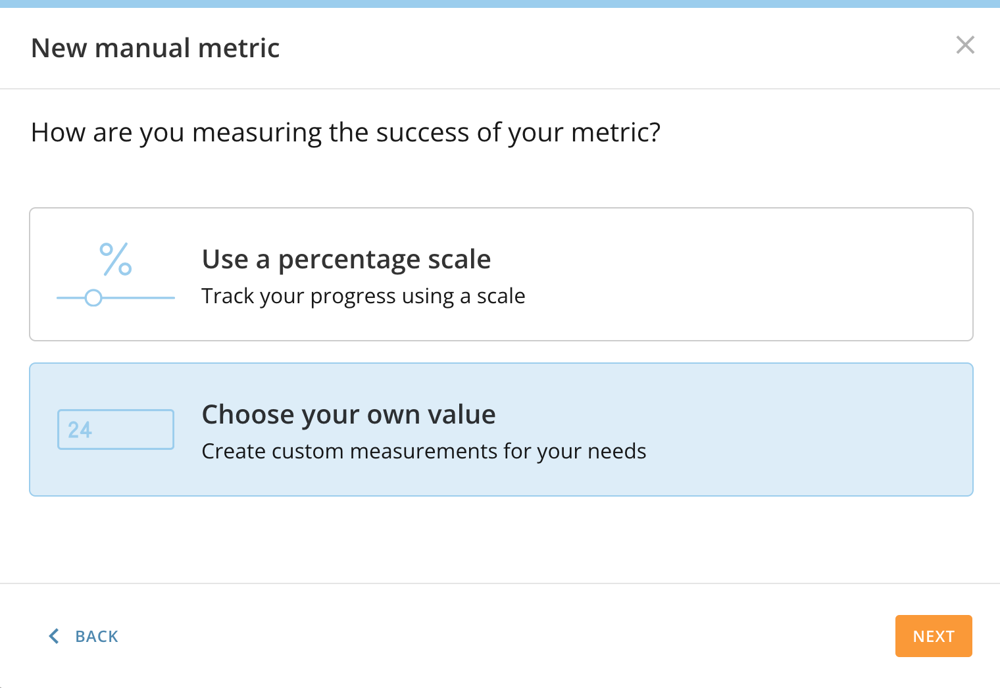
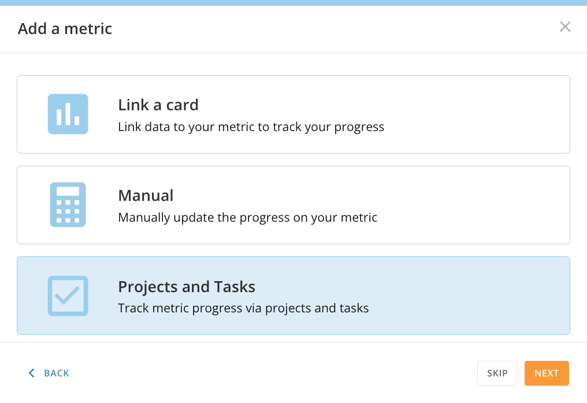

---
    title: Getting Started With Goals
    url: https://domo-support.domo.com/s/article/4578278680855
    linked_kbs:  ['[https://domo-support.domo.com/s/knowledge-base/](https://domo-support.domo.com/s/knowledge-base/)', '[https://domo-support.domo.com/s/](https://domo-support.domo.com/s/)', '[https://domo-support.domo.com/s/topic/0TO5w000000ZamsGAC](https://domo-support.domo.com/s/topic/0TO5w000000ZamsGAC)', '[https://domo-support.domo.com/s/topic/0TO5w000000ZanmGAC](https://domo-support.domo.com/s/topic/0TO5w000000ZanmGAC)', '[https://domo-support.domo.com/s/article/4577172785559](https://domo-support.domo.com/s/article/4577172785559)', '[https://domo-support.domo.com/s/article/360043428753](https://domo-support.domo.com/s/article/360043428753)', '[https://domo-support.domo.com/s/article/4578278680855](https://domo-support.domo.com/s/article/4578278680855)', '[https://domo-support.domo.com/s/topic/0TO5w000000ZanmGAC/goals-center](https://domo-support.domo.com/s/topic/0TO5w000000ZanmGAC/goals-center)', '[https://domo-support.domo.com/s/article/360043429933](https://domo-support.domo.com/s/article/360043429933)', '[https://domo-support.domo.com/s/article/360043429953](https://domo-support.domo.com/s/article/360043429953)', '[https://domo-support.domo.com/s/article/360042925494](https://domo-support.domo.com/s/article/360042925494)', '[https://domo-support.domo.com/s/article/360043429913](https://domo-support.domo.com/s/article/360043429913)', '[https://domo-support.domo.com/s/article/4408174643607](https://domo-support.domo.com/s/article/4408174643607)', '[https://domo-support.domo.com/s/login/](https://domo-support.domo.com/s/login/)']
    article_id: 000004343
    views: 2,436
    created_date: 2022-10-24 21:41:00
    last updated: 2022-10-24 22:39:00
    ---

Intro
-----

Domo Goals is a feature that allows users to create results-driven objectives. Domo Goals is based on the OKR, or Objectives and Key Results philosophy. Goals can be personal, for teams, or for companies. This article describes the various goal types, how to create a new goal, and how to add metrics to track your progress.

**Note:** The articles in this section use "Goals" and "Metrics." Your organization may refer to them as something else depending on your Goals Admin Settings. For more information, see [Configuring Goals Settings](/s/article/4577172785559). 

Goal Types
----------

**Personal**, **Team**, and **Company** goals all serve different purposes. Personal goals allow users to track their individual milestones, while team and company goals give multiple people access to group objectives. With tags and linking parent or child goals, users can create connections between goals regardless of their type. Goal types can be changed at any time. However, only admin users or those with the "Manage All Goals" grant will be able to designate an objective as "Company."

 

#### Locating Personal Goals

With personal goals, users can create individual objectives with metrics to measure progress. 

 

1. In the navigation header, select **Goals**.

2. In **Goals**, select **Personal**from the left-side rail. 

A list of your personal goals, metrics, and summary banner displays. 

**Note:** Personal goals are visible to members of your organization. Others can see your goals by accessing the **Search** tool in the left navigation menu.

 

#### Locating Team Goals

With team goals, groups of individuals can track an objective's progress. Teams are identical to Groups in the Admin Settings. Users can view and create groups by going to **More** > **Admin** > **Groups**. 

 

1. In the navigation header, select **Goals**.

2. In **Goals**, select **Team**from the left-side rail. 

A list of your team goals, metrics, and summary banner displays. 

 

#### Creating Teams within Goals

Users can create new teams in the Goals feature. You can only make existing teams owners, so ensure your group is created before beginning a new team goal. 

**Important:** In order to create teams within goals, you must have the Edit Groups grant enabled. Contact your CSM for more information.

1. In the navigation header, go to **Goals**. 

2. In **Goals**, select **Teams** from the left-side rail. 

3. Select the **+ Create Team**button. 

The **Group Creation** modal displays. 

4. Define the specifications for your new group:

* Enter a title and optional description.
* Choose a group type (closed, dynamic, or open).
* Select members from your organization.
* (Optional) Choose an avatar.
* Add owners. This can be multiple members of your team or specific individuals. The Manage All Groups grant is automatically included.
* Review and save.

5. After specifying your group's details, select **Save.** 

The new team is created and can be assigned to a goal. 

**Tip:** If the entire team or group wishes to edit the goal, the team must be assigned as the "owner." Otherwise, you can restrict editing privileges to one user. The team will not be able to update the goal, but they will have access to view it.

 

#### Locating Company Goals

With company goals, all members of an organization can track an objective's progress. Editing privileges can be restricted to individuals or teams within a company. Personal and team goals can be linked to a parent company goal, with connected metrics that determine the overall status and progress.

 

1. In the navigation header, select **Goals**.

2. In **Goals**, select **Company** from the left-side rail. 

A list of your company goals, metrics, and summary banner displays. 

 

Creating a Goal
---------------

1. In the navigation header, select **Goals.**

2. Select the **+ New Goal** button.

3. Define the specifications for your new goal:

* Enter a title and optional description.
* Choose a goal type: personal, team, or company.
* Choose an owner. You can add several individuals, a team, or keep yourself as the default owner.
* Determine the **Start Date** and **Achieve By** date by selecting **Edit** .
* Add optional tags. Tagging groups your goal with others that have the same tag.

**Note:** By default, the current period for your company goals program is displayed as your start and achieve by dates. Information for administrators about creating periods for goals is found in [Configuring Domo Goals for your Organization](/s/article/4577172785559).

 

4. Select **Next.**

The basic goal is created. You can add one or more metrics that make your goal measurable. If the title and description are sufficient for now, select **Skip**. If you'd like to add a metric, select **Next**. 

5. (Conditional) If you would not like to add a metric, select **Skip**. 

The goal is added to its goal type tab on the left-side rail. 

 

Adding Metrics to Goals
-----------------------

Metrics are crucial for making goals measurable. Metrics can use percentages, custom numerical values, data from Domo cards, and Projects and Tasks to track a goal's progress over time. They can be added during the initial goal creation or later. 

Before adding metrics to your goal, determine whether you’re tracking progress by:

* Linking a Domo card
* Updating metrics manually
* By connecting a project or task.

#### Adding Metrics to a New Goal

1. After creating a goal and adding details, such as a title, owner, and completion date, select **Next**. 

The **Add a metric** modal displays. 

2. From the options, select **Link a card**, **Manual**, or **Projects and Tasks**. 

3. Depending on your selection, follow the guides within this article: [Linking a Card](#h_01GCT339HF9MWWRJ1GEBW3D5Z2), [Manually Updated Metrics](#h_01GCT34HKF282C546T6WDRJXZA), or [Connecting a Project or Task.](#h_01GCT350ATVZZN052R3BKZG8PB)

 

#### Adding Metrics to an Existing Goal

1. In the navigation header, select **Goals.**

2. Select a goal from the **Personal**, **Team**, or **Company** tabs. 

The **Goal Details** displays. 

3. Select **+ Add a Metric**

The **Add a metric modal** displays. 

4. From the options, select **Link a card**, **Manual**, or **Projects and Tasks**. 

5. Depending on your selection, follow the guides within this article: [Linking a Card](#h_01GCT339HF9MWWRJ1GEBW3D5Z2), [Manually Updated Metrics](#h_01GCT34HKF282C546T6WDRJXZA), or [Connecting a Project or Task.](#h_01GCT350ATVZZN052R3BKZG8PB)

 

Linking a Card
--------------

This option allows you to create a metric using data in a Domo card. The metric’s progress is automatically driven by value changes in the card. Anyone with a default security role of “Participant” or higher can link Domo cards to goals in their instance.

 

1. Select **Link a Card** from the **Add a metric** modal. Select **Next.**

2. Choose a card or search for one. 

3. Make selections from the various menus for **Metric, Meets this condition**, **For This Value**, and the **Start Value.**

**Important:** A card must have a summary number in order to be used as a metric.

 

 

Card metrics are made up of the following parts:

* **Metric:** The item being measured. This could be the current [Summary Number](/s/article/360043428753) of the Card or the sum, average, minimum, or maximum value of all items or items in a certain column.
* **Filters** may be applied to focus on certain aspects of the card without changing the existing data by selecting the **Filter** and **+** buttons.

* **Meets this condition:** Domo provides a variety of condition statements to choose from, including greater than, less than, and equal statements and combinations of these. Frequently, goals are considered achieved if they meet OR exceed a target. Selecting greater than or equal to, for example, will assure your goal is complete even if you go above your target.

3. Define the specifications for your goal's metric: 

* Enter a title and optional description.
* Choose an owner. You can add several individuals, a team, or keep yourself as the default owner.
* Determine the **Start Date** and **Achieve By** date by selecting **Edit**.
* Add optional tags. Tagging groups your metric with others that have the same tag.

4. Select **Done.**

The card metric is created and attached to your goal. 

 

Manually Updated Metrics
------------------------

This option allows users to create custom measurements for their needs. The metric's progress is updated when users manually change the values in the metric details view. To create a manually tracked metric, select **Manual**. 

   After selecting **Manual** from the **Add a metric** modal,   you have two options: 

* [**Use a percentage scale**](#h_01GCT4MXBMVJWWHHGBY7JRRYW8), where you report progress as a completion percentage.
* **[Choose your own value](#h_01GCT4N84WM9KMWZ3A70YPPWW8)**, where you have a specific number you're working towards, such as how many tasks you'd like to complete.

 

#### Percentage-Based Metrics

1. Choose **Use a percentage scale** and select **Next.**

3. Define the specifications for your goal's metric: 

* Enter a title and optional description.
* Choose an owner. You can add several individuals, a team, or keep yourself as the default owner.
* Determine the **Start Date** and **Achieve By** date by selecting **Edit**.
* Add optional tags. Tagging groups your metric with others that have the same tag.

7. Select **Done.** 

The metric is created and attached to the goal, with the progress initially set to 0%. Each time you manually update your progress, the completion percentage will change. 

 

#### Choose Your Own Value Metrics

1. Select **Choose your own value** and select **Next.**

2. Define the specifications for your goal's metric: 

* Enter a title and optional description.
* Choose an owner. You can add several individuals, a team, or keep yourself as the default owner.
* Define what you are measuring. For example, Tasks or Meetings Attended.
* Enter the **Start Value/Current Value**, **Target Value**, and select the condition. For example, if you would like to complete 50 tasks but have completed 0, you would type 0 in the **Start Value/Current Value** and 50 in the **Target Value.** For **Meets this condition**, users can choose what condition must be met for their goal to be "complete."
* Determine the **Start Date** and **Achieve By** date by selecting **Edit**.
* Add optional tags. Tagging groups your metric with others that have the same tag.

3. Select **Done.**

The metric is created and attached to the goal, with the progress initially set to 0%. Each time you manually update your progress, the completion percentage will change. 

 

Connecting a Project or Task
----------------------------

This option allows users to track metric progress with **Projects and Tasks**. These can be existing, or users can begin new ones when creating the metric.

 

1. Select **Projects and Tasks** from the **Add a metric** modal. Select **Next.**

****

3. Locate an **Existing** project or create a new one by selecting the **New** tab. Give it a **Project name,** and add an optional description. Select **Next**. 

5. Define the specifications for your goal's metric: 

* Enter a title and optional description.
* Choose an owner. You can add several individuals, a team, or keep yourself as the default owner.
* Determine the **Start Date** and **Achieve By** date by selecting **Edit**.
* Add optional tags. Tagging groups your metric with others that have the same tag.

The metric is created and attached to the goal, with the progress initially set to 0%. Each time you complete a task in your project, the completion percentage will change. 

 

 

 

 

 

