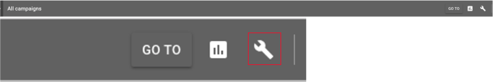
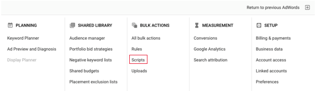
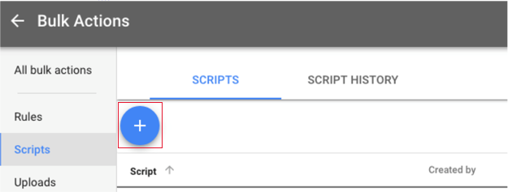
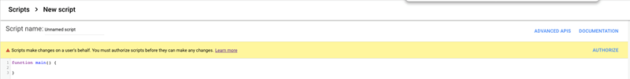
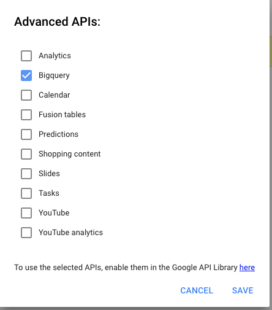
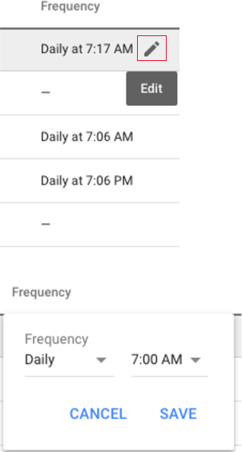

---
    title: Google Ads via Google BigQuery Service Connector
    url: https://domo-support.domo.com/s/article/360043431253
    linked_kbs:  ['[https://domo-support.domo.com/s/knowledge-base/](https://domo-support.domo.com/s/knowledge-base/)', '[https://domo-support.domo.com/s/](https://domo-support.domo.com/s/)', '[https://domo-support.domo.com/s/topic/0TO5w000000ZammGAC](https://domo-support.domo.com/s/topic/0TO5w000000ZammGAC)', '[https://domo-support.domo.com/s/topic/0TO5w000000ZanLGAS](https://domo-support.domo.com/s/topic/0TO5w000000ZanLGAS)', '[https://domo-support.domo.com/s/topic/0TO5w000000ZaoQGAS](https://domo-support.domo.com/s/topic/0TO5w000000ZaoQGAS)', '[https://domo-support.domo.com/s/article/360042926274](https://domo-support.domo.com/s/article/360042926274)', '[https://domo-support.domo.com/s/article/360042926054](https://domo-support.domo.com/s/article/360042926054)', '[https://domo-support.domo.com/s/article/360043431253](https://domo-support.domo.com/s/article/360043431253)', '[https://domo-support.domo.com/s/topic/0TO5w000000ZaoQGAS/api-connectors](https://domo-support.domo.com/s/topic/0TO5w000000ZaoQGAS/api-connectors)', '[https://domo-support.domo.com/s/article/360043429933](https://domo-support.domo.com/s/article/360043429933)', '[https://domo-support.domo.com/s/article/360043429953](https://domo-support.domo.com/s/article/360043429953)', '[https://domo-support.domo.com/s/article/360042925494](https://domo-support.domo.com/s/article/360042925494)', '[https://domo-support.domo.com/s/article/360043429913](https://domo-support.domo.com/s/article/360043429913)', '[https://domo-support.domo.com/s/article/4408174643607](https://domo-support.domo.com/s/article/4408174643607)', '[https://domo-support.domo.com/s/login/](https://domo-support.domo.com/s/login/)']
    article_id: 000003773
    views: 2,179
    created_date: 2022-10-24 21:15:00
    last updated: 2022-10-24 22:40:00
    ---

 

****Important********:****Due to Google’s change in allowing Domo connectors to use OAuth authentication, all users must now use service account key authentication to create new data connections. To create new Google AdWords via Google BigQuery DataSets, use this connector. All pre-existing AdWords via BigQuery DataSets will continue to run normally. 

Intro
-----

Google Ads (formerly Google AdWords) is an online advertising service. Use Domo's Google Ads via BigQuery Service connector to transfer and pull data from a specific project into Domo. To successfully configure this connector, you must first configure a Google BigQuery script within your Google Ads account. The steps for doing this are provided later in this article.  

For more information about the Google Ads API, see [https://developers.google.com/adword...s/guides/start](https://developers.google.com/adwords/api/docs/guides/start "https://developers.google.com/adwords/api/docs/guides/start"). 

This topic discusses the fields and menus that are specific to the Google Ads via Google BigQuery Service connector user interface. For general information about adding DataSets, setting update schedules, and editing DataSet information, see [Adding a DataSet Using a Data Connector](/s/article/360042926274 "Adding a DataSet Using a Data Connector").

Prerequisites
-------------

To connect to a BigQuery service account, you must have a Google BigQuery service account JSON key. To generate a key, do the following:

1. In the GCP Console, open the **IAM & Admin** page.
2. Click ****Service accounts**** in the left-hand navigation pane.
3. Select your project and click ****Open****.
4. Click ****Create Service Account****.
5. Enter a name and description for the service account.
6. Click ****Create****.

**Note:** You may need the “BigQuery Admin” role in the service account permissions dialog. Please consult with your Google administrator for additional guidance.
7. Select ****Project Owner****.
8. Click ****Continue****.
9. Click ****Create key****.
10. Select ****JSON**** as the key type.
11. Click ****Create****.

A private key will be saved to your computer.  

Connecting to Google Ads via Google BigQuery
--------------------------------------------

This section enumerates the options in the **Credentials** and **Details** panes in the Google Ads via Google BigQuery Service Connector page. The components of the other panes in this page, **Scheduling** and **Name & Describe Your DataSet**, are universal across most connector types and are discussed in greater length in [Adding a DataSet Using a Data Connector](/s/article/360042926274 "Adding a DataSet Using a Data Connector").

### Credentials Pane

This pane contains fields for entering credentials to connect to Google Ads via BigQuery. The following table describes what is needed for each field:

| Field | Description |
| --- | --- |
| Service Account Key JSON | Copy and paste the JSON for your BigQuery service account key. For information about creating a key, see "Prerequisites," above. |

Once you have entered a valid key, you can use the same account any time you go to create a new Google Ads via BigQuery Service DataSet. You can manage connector accounts in the ****Accounts**** tab in the Data Center. For more information about this tab, see [Managing User Accounts for Connectors](/s/article/360042926054 "Managing User Accounts for Connectors").

### Details Pane

This pane contains a number of fields and menus you can use to configure your report.

| Menu | Description |
| --- | --- |
| Project ID | Enter the name of the specific project you want to add your DataSet to. You can find this in your Google Cloud Console in the project info. |
| DataSet ID | Enter a name for your DataSet. You can choose any name you want. |
| Report | Select the AdWords report type to run. The following reports are available:

|  |  |
| --- | --- |
| Account Performance | Returns all statistics aggregated by default at the account level. |
| Ad Customizers Feed Item | Provides statistics for feed items used in Ad Customizers. Statistics are aggregated at the feed item level. |
| Ad Performance | Returns all statistics aggregated at the ad level. |
| Ad Group Performance | Returns all statistics aggregated by default at the ad group level. |
| Age Range Performance | Returns all Display Network and YouTube Network statistics aggregated by age range. |
| Audience Performance | Returns performance data from interests and remarketing lists for Display Network and YouTube Network ads, and remarketing lists for search ads (RLSA), aggregated at the audience level. |
| Automatic Placements Performance | Returns all statistics aggregated at the placement level. |
| Bid Goal Performance | Returns statistics for your portfolio bid strategies. |
| Budget Performance | Returns all statistics aggregated by default at the budget level. |
| Call Metrics Call Details | Returns data for call tracking of call-only ads or call extensions. |
| Campaign Ad Schedule Target | Summarizes the performance of campaigns by AdSchedule criteria. |
| Campaign Criteria | Returns campaign-level criteria. |
| Campaign Group Performance | Returns the overall performance statistics of campaigns that you have included in campaign groups. |
| Campaign Location Target | Summarizes the performance of campaigns by location-based campaign criteria. |
| Campaign Negative Keywords Performance | Retrieves attributes of keyword-based NegativeCampaignCriterion objects. |
| Campaign Negative Placements Performance | Retrieves attributes of placement-based NegativeCampaignCriterion objects. |
| Campaign Negative Locations | Retrieves attributes of location-based NegativeCampaignCriterion objects. |
| Campaign Performance | Returns all statistics aggregated by default at the campaign level. |
| Campaign Shared Set | Returns all relationships between SharedSet objects and campaigns. |
| Click Performance | Returns all stats aggregated at each click level. |
| Creative Conversion | Returns statistics on free clicks. |
| Criteria Performance | Returns all statistics aggregated at the ad group criteria level. |
| Destination URL | Returns all statistics aggregated at the destination URL level. |
| Display Keyword Performance | Returns all Display Network and YouTube Network statistics aggregated at the keyword level. |
| Display Topics Performance | Returns all Display Network and YouTube Network statistics aggregated at the topic level. |
| Final URL | Returns all statistics aggregated at the final URL level. |
| Gender Performance | Returns all statistics aggregated by gender along with automatic audience performance. |
| Geo Performance | Returns all statistics aggregated at the country/territory level, one row per country/territory. |
| Keywordless Category | Returns keywordless ads (dynamic search ads) statistics aggregated by category. |
| Keywordless Query | Returns keywordless ads (dynamic search ads) statistics based on search terms. |
| Keywords Performance | Returns all statistics aggregated at the keyword level. |
| Label  | Lists all labels for your account. |
| Landing Page | Returns all statistics aggregated by default by the UnexpandedFinalUrlString. |
| Marketplace Performance | Returns all statistics of ads displayed on the Marketplace, aggregated by default at the account level. |
| Paid Organic Query | Returns a holistic view of your search stats across ads and organic listings at the query level. |
| Parental Status Performance | Returns statistics aggregated at the parental status level. |
| Placeholder | Returns statistics for feed-based ad extensions. |
| Placeholder Feed Item | Returns all statistics at the feed-item level. |
| Placement Performance | Returns all statistics aggregated at the placement level. |
| Product Partition | Returns shopping campaign statistics aggregated at the product partition (ID field) level. |
| Search Query Performance | Returns all statistics aggregated at the search terms level. |
| Shared Set | Returns all SharedSet objects that can be shareable across campaigns. |
| Shared Set Criteria | Returns criteria for each Shared Set. |
| Shopping Performance | Returns shopping campaign statistics aggregated at the product (OfferId field) level. |
| Top Content Performance | Returns statistics for top content bid modifier criteria. |
| URL Performance | Returns all statistics aggregated at the URL and criterion level. |
| User Ad Distance | Returns statistics aggregated by the user's distance from your location extensions. |
| Video Performance | Returns statistics for your account's upgraded AdWords for Video campaigns. |

 |
| Date Range | Select the date range for the data in your report. |
| Fields | Check the boxes for all fields you want to import into your report. |
| Segments | Check the boxes for all segments you want to import into your report. |

Once you have entered data into all of the fields and selected options from the menus, your Google Ads script will appear automatically in the **Query preview** pane. Copy this script and paste it into Google Ads as explained in the next section. 

Configuring a BigQuery Script in Google Ads
-------------------------------------------

This section explains how to configure a BigQuery script in Google Ads. After you have configured the script, you should be able to use the BigQuery Service connector to pull in data just as you would any other connector. 

 

**To configure a BigQuery script in Google Ads,**

1. Configure your connector settings as explaned above.
2. Copy the script from the **Query Preview** pane.
3. Sign into your account in Google Ads.
4. Click the wrench icon in the top right corner of the screen.  
  

5. Click **Scripts** (which is found under "Bulk Actions").   
  

6. Click the plus button to create a new script.  
  

7. Name the script, then click **Authorize**.  
  

8. Select **Advanced APIs**.
9. Check the **Bigquery** box.  
  

10. Paste the script you copied in step 4 into the textbox.
11. Click **Preview**.
12. (Conditional) If any error messages appear after you preview, follow their instructions.  
For example, you may be prompted to click on another link to authorize BigQuery or reauthorize.
13. Click **Run** when your configuration is successful.  
Google Ads now takes you back to the main page, where you are prompted to set up how often a script runs.
14. Click the pencil icon under "Frequency," then set the schedule for your script.  
  

15. Return to the Google Ads via Google BigQuery Service connector page in Domo and continue configuring the connector.

### Other Panes

For information about the remaining sections of the connector interface, including how to configure scheduling, retry, and update options, see [Adding a DataSet Using a Data Connector](/s/article/360042926274).

Troubleshooting
---------------

If the data doesn't seem to be updating, make sure your Google Ads script runs before the connector runs. Otherwise, the same data will be pulled again.

