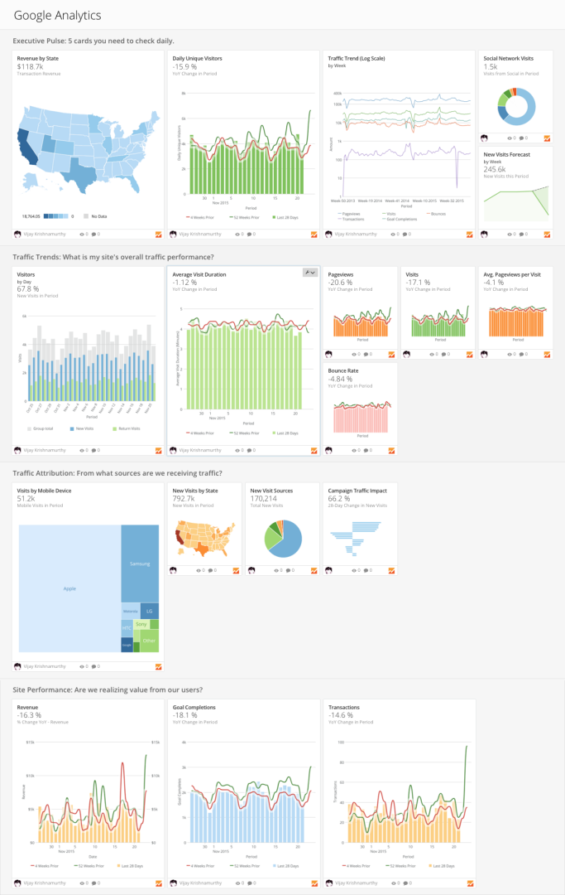

Intro
-----

Google Analytics gives you access to crucial website engagement data. This Dashboard helps you visualize that data by providing a summary of your website's key metrics including traffic trends, conversion, and revenue all in one place.

Requirements and Notes
----------------------

Your Google Analytics account must have API access enabled for the complete account/profile.  
Default date range: last 400 days.

Usage
-----

* Executive Pulse: 5 cards you need to check daily.

	+ Revenue by State
	+ Social Network Visits
	+ New Visits Forecast
	+ Traffic Trend (Log Scale)
	+ Daily Unique Visitors
* Traffic Trends: What is my site's overall traffic performance?

	+ Visits
	+ Bounce Rate
	+ Visitors
	+ Average Visit Duration
	+ Avg. Pageviews per Visit
	+ Pageviews
* Site Performance: Are we realizing value from our users?

	+ Goal Completions
	+ Revenue
	+ Transactions
* Traffic Attribution: From what sources are we receiving traffic?

	+ Visits by Mobile Device
	+ New Visit Sources
	+ New Visits by State
	+ Campaign Traffic Impact

Authentication
--------------

| Credential | Description |
| --- | --- |
| Email | The email with access to the Google Analytics data |
| Password | The password for the email with access to the Google Analytics data |

Dashboard Reports
-----------------

For report descriptions, see Google Analytics Connector.

| Report | Schedule Update Setting | Parameters | Selection |
| --- | --- | --- | --- |
| Location Metrics | Replace | Report | Location Metrics |
| View (Profile) | *Your views* |
| Sampling Level | Default |
| Filters |   |
| Start Date | yesterday-400 |
| End Date | yesterday |
| Backfill |   |
| Timezone | MST |
| Traffic Metrics | Replace | Report | Traffic Metrics |
| View (Profile) | *Your views* |
| Sampling Level | Default |
| Filters |   |
| Start Date | yesterday-400 |
| End Date | yesterday |
| Backfill | 30 |
| Timezone | MST |
| Campaign Metrics | Replace | Report | Campaign Metrics |
| View (Profile) | *Your views* |
| Sampling Level | Default |
| Filters |   |
| Start Date | yesterday-400 |
| End Date | yesterday |
| Backfill |   |
| Timezone | MST |
| Social Network
  | Replace | Report | Social Network |
| View (Profile) | *Your views* |
| Sampling Level | Default |
| Filters |   |
| Start Date | yesterday-400 |
| End Date | yesterday |
| Backfill |   |
| Timezone | MST |
| Mobile Metrics
  | Replace | Report | Mobile Metrics |
| View (Profile) | *Your views* |
| Sampling Level | Default |
| Filters |   |
| Start Date | yesterday-400 |
| End Date | yesterday |
| Backfill |   |
| Timezone | MST |
| Base Metrics
 
  | Replace | Report | Base Metrics |
| View (Profile) | *Your views* |
| Sampling Level | Higher Precision |
| Filters |   |
| Start Date | yesterday-400 |
| End Date | yesterday |
| Backfill |   |
| Timezone | MST |

 

