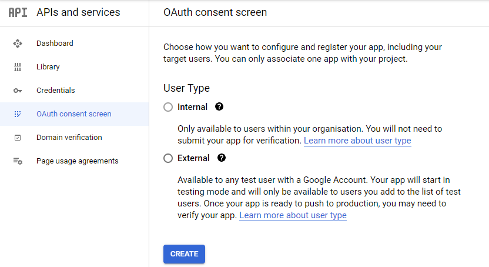
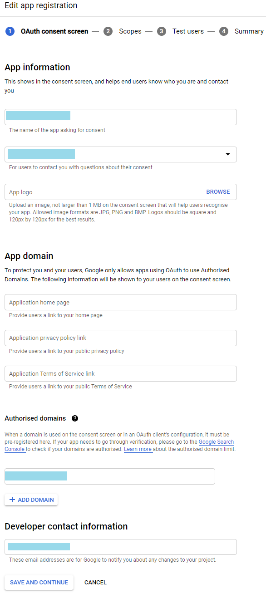
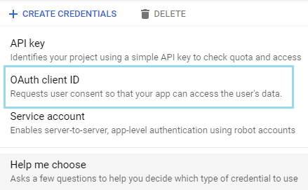
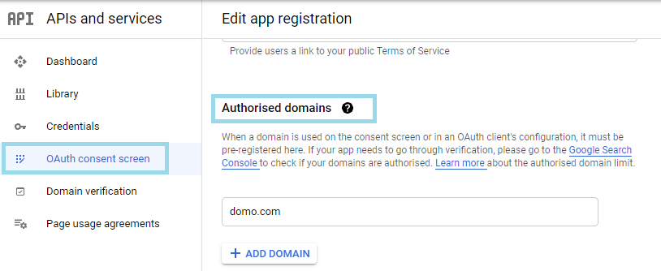
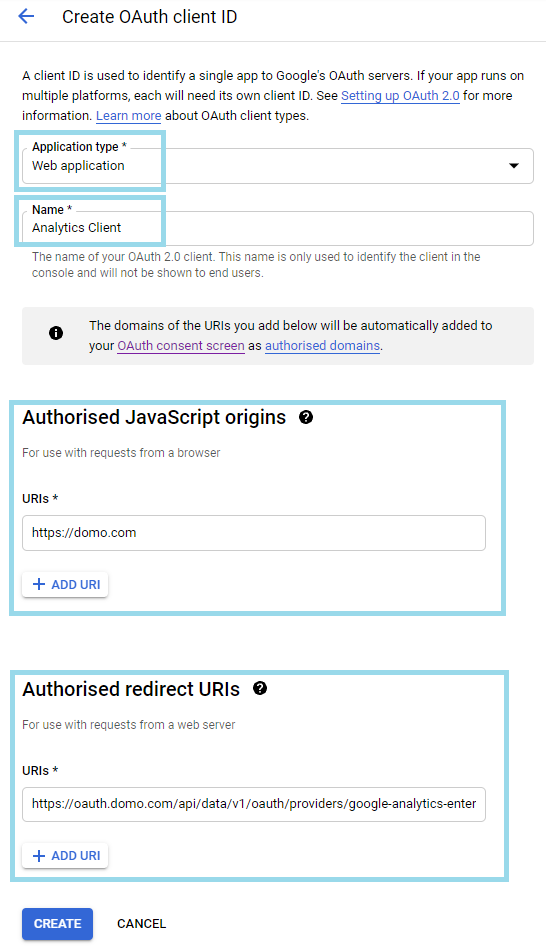
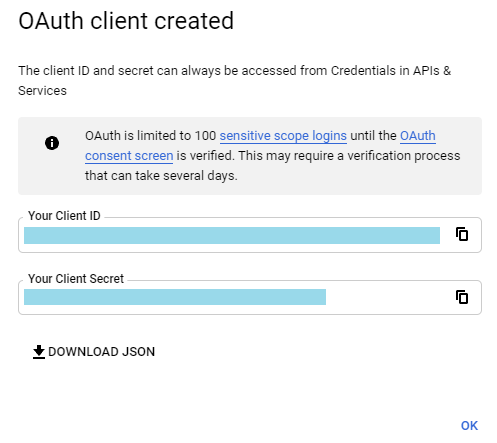
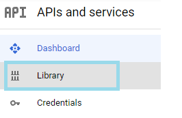
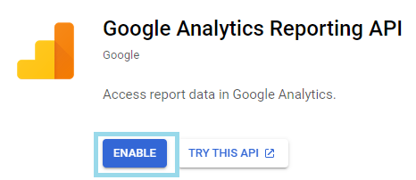
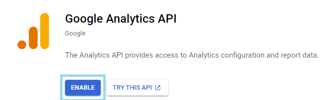

Intro
-----

Google Analytics generates detailed website traffic stats to help measure sales and conversions. Use Domo's Google Analytics Enterprise Connector to efficiently generate reports about campaign, device, location, social network, and traffic metrics to make sure the customer behavior you're seeing now translates to sales and revenue down the line. This connector allows you to use and query against your own Google Analytics project. To learn more about the Google Analytics API, visit [https://developers.google.com/analytics/](https://developers.google.com/analytics/ "https://developers.google.com/analytics/").  
With your Google Analytics data in Domo, you can get immediate insights into your web performance metrics so you can better understand your customers and assess the performance of your content. Create visualizations in just minutes, and easily share them with your team to help drive better user experiences. 

You connect to your Google account in the Data Center. This topic discusses the fields and menus that are specific to the Google Analytics Enterprise Connector user interface. General information for adding DataSets, setting update schedules, and editing DataSet information is discussed in [Adding a DataSet Using a Data Connector](/s/article/360042926274).

|  |  |
| --- | --- |
| **Primary Use Cases** | * Understanding visitor traffic patterns on your website
* Understanding visitor behavior patterns on your website
* Understanding the relationship between geography and user behavior on your website
* Understanding the difference between user behavior on mobile devices vs. desktop browsers
* Understanding how social media drives traffic to your website
* Understanding how users interact with products on your website
 |
| **Primary Metrics** | * Page Views
* Unique Visitor Counts
* Return Visitor Counts
* Product Sales Numbers
* Geographic Patterns
* Referring Domains
* Conversion metrics
* Bounce Rate
* Exit Pages
 |
| **Primary Company Roles** | * Data analysts
* Digital marketers
* Editorial teams
* Marketing leads
 |
| **Average Implementation Time** | If choosing the basic reporting functions you can plan on about an hour depending on how many reports you are pulling. However, if choosing the custom route, the time may be up to 2 hours. Also, depending on how much data you are pulling, it may take several hours for the data to be available in Domo. |
| **Ease of Use (on a 1-to-10 scale with 1 being easiest)** | 7 |

Prerequisites
-------------

To connect to the Google Analytics API and create a DataSet, you must have the following:

* Your client ID and client secret associated with your Google Analytics project.
* You also need to select the query quota limit (queries per second) for your Google Analytics project. By default it is 20 QPS.

Before you can generate your client ID and client secret, you need to first configure the OAuth Consent screen.

#### Configuring the OAuth Consent screen

1. Go to the [Google API Console](https://console.developers.google.com/).

2. Under **APIs and services**, click **OAuth consent screen**.

3. Now, choose how you want to configure and register your app, including your target users. Note that, you can only associate one app with your project.

4.  If you select the user type as **Internal** then your app will be limited to Google Workspace users within your organization. You can communicate with your internal users directly about how you'll use their data.

5. If you select the user type as **External** then your app will only be available to the users you add to the list of test users. Once your app is ready to publish, you may need to verify your app.

6. Select the User Type and click **Create**. The **Edit app registration** screen appears.

7. Here, provide the app information, app domain details, authorised domain, developer contact information, etc. The authorised domain registered here will appear under the Authorised JavaScript origins while creating the client ID and secret for your app. 

8. Click **Save and Continue**. Now, you can create your client ID and secret.

#### To generate a new client ID and client secret:

1. Go to the [Google API Console](https://console.developers.google.com/).

2. Click on the **Credentials** in the left column. Click on the **Create Credentials** drop down.

3. Select **OAuth client ID**.

4. Select **Web application** as the **Application Type** and specify a desired name for the client in the **Name** field- such as Analytics Client. 

5. In the **Authorised JavaScript origins** field, enter The HTTP origin URI that host your web application. Note that, the domains of the URIs you add here will automatically be added to your **OAuth consent** screen as **Authorised domains** as below. 

When a domain is used on the consent screen or in an OAuth client's configuration, it must be pre-registered as an authorised domain.

6. For the **Authorized redirect URL** enter: **<https://oauth.domo.com/api/data/v1/oauth/providers/google-analytics-enterprise/exchange>**

5. Click **Create**. A box will popup showing the client ID and secret. Click **Ok** to close the popup.

  
Once your credentials are created, we'll need to make sure that access to the **Google Analytics Reporting API** and the **Google****Analytics API** is enabled.

1. Click **Library** in the left pane.

2. Find the **Google Analytics Reporting API** link and click on it.

3. Towards the top of the screen you will see an **ENABLE** button.

* If there is a DISABLE instead of ENABLE then it is already enabled in your project.

4. Repeat the same steps for enabling the **Google Analytics API**.

Visit [Google Analytics Reporting API - Authorization](https://developers.google.com/analytics/devguides/reporting/core/v4/authorization) for more details.

Connecting to Your Google API
-----------------------------

This section enumerates the options in the Credentials and Details panes in the Google Analytics Enterprise Connector page. The components of the other panes in this page, **Scheduling**and **Name & Describe Your DataSet,** are universal across most connector types and are discussed in greater length in [Adding a DataSet Using a Data Connector](/s/article/360042926274 "Adding a DataSet Using a Data Connector").

### Credentials Pane

This pane contains fields for entering credentials to connect to your Google Analytics API. The following table describes what is needed for each field:

| Field | Description |
| --- | --- |
| Client ID | Enter your client ID. See "Prerequisites," for more details. |
| Client Secret | Enter your client secret. See "Prerequisites," for more details. |
| Quota Limit | Select the query quota limit (queries per second) for your Google Analytics project. By default it is 20 QPS. |

### Data Selection Pane

This pane contains a number of sub-panes in which you can select a report, set a date range, choose your segments, and more.

| Sub-pane | Description |
| --- | --- |
| View | Choose whether you want to pull data from a specific view or all views. If you choose ********Specific views********, you are asked to choose the desired profiles. Be aware that you won't be able to use custom metrics and dimensions if you choose more than one web property. |
| Report | The Google Analytics reports are divided  into three categories, namely- Custom report, Google Analytics Audience reports, and Curated Domo reports. The number of available Metrics and Dimensions for the selected report appear next to the reports drop down. You can view the names of the metrics and dimensions as you hover the pointer over the respective field. The following reports are available:

|  |  |
| --- | --- |
| Custom Report | Custom Report allows you to create a customized report. You can select a base report for your custom report from the ****Base Report**** drop down. Depending on your base report selection, the number of metrics and dimensions that you can combine in your custom report appear next to the report drop down as well as in the left pane. You can select the categories from list available. A list of available metrics and dimensions for the selected category appears in the right pane. As you select/deselect the desired metrics and dimensions, you can see the changes in the respective numbers in the left pane as well as next to the report drop down.  |
| ****Google Analytics Audience reports**** |
| Active Users | Returns data for Users, New Users, and Sessions. |
| Behavior | Returns data for % New Sessions, Avg. Session Duration, Bounce Rate, Goal Completions, Goal Conversion Rate, Goal Value, New Users, Pages / Session, Page views, and Sessions broken down by Count of Sessions, Days Since Last Session, and Session Duration. |
| Cohort Analysis | Returns data for Goal Completions, Page views, Revenue, Session Duration, Sessions, Transactions, and Users broken down by Date. |
| Demographics | Returns data for % New Sessions, Avg. Session Duration, Bounce Rate, Goal Completions, Goal Conversion Rate, Goal Value, New Users, Pages / Session, and Sessions broken down by Age and Gender. |
| Geo | Returns data for % New Sessions, Avg. Session Duration, Bounce Rate, Goal Completions, Goal Conversion Rate, Goal Value, New Users, Pages / Session, and Sessions broken down by City, Continent, Country, Language, Region, and Sub Continent. |
| Mobile | Returns data for % New Sessions, Avg. Session Duration, Bounce Rate, Goal Completions, Goal Conversion Rate, Goal Value, New Users, Pages / Session, Page views, and Sessions broken down by Device Category, Mobile Device Branding, Mobile Device Info, Mobile Input Selector, Operating System, Screen Resolution, and Screen Provider. |
| Overview | Returns data for % New sessions, Avg. Session Duration, Bounce Rate, New Users, Pages / Session, Page views, Sessions, and Users broken down by Browser, City, Country, Language, Operating System, Screen Resolution, and Service Provider. |
| Technology | Returns data for % New Sessions, Avg. Session Duration, Bounce Rate, Goal Completions, Goal Conversion Rate, Goal Value, New Users, Pages / Session, and Sessions broken down by Browser, Flash Version, Hostname, Operating System, Screen Colors, Screen Resolution, and Service Provider. |
| ****Curated Domo reports**** |
| Base Metrics | Returns data for Bounces, Goal Completions, Goal Value, New Users, Page views, Revenue, Session Duration, Sessions, Transactions, and Users broken down by Date. |
| Campaign Metrics | Returns data for Bounces, Goal Completions, Goal Value, New Users, Page views, Revenue, Session Duration, Sessions, Transactions, and Users broken down by Date and Campaign. |
| Device Metrics | Returns data for Bounces, Goal Completions, Goal Value, New Users, Page views, Revenue, Session Duration, Sessions, Transactions, and Users broken down by Date, Device, and Operating System. |
| Location Metrics | Returns data for Bounces, Goal Completions, Goal Value, New Users, Page views, Revenue, Session Duration, Sessions, Transactions, and Users broken down by Country, Date and Region. |
| Mobile Metrics | Returns data for Bounces, Goal Completions, Goal Value, New Users, Page views, Revenue, Session Duration, Sessions, Transactions, and Users broken down by Date, Device Category, Mobile Device Branding, Mobile Device Info, Mobile Device Model, and Operating System. |
| Product Metrics | Returns data for Product Revenue, Quantity, and Unique Purchases broken down by Date, Product, Product Category, and Product SKU. |
| Social Network | Returns data for Avg. Session Duration, Pages / Session, Page views, and Sessions broken down by Date and Social Network. |
| Traffic Metrics | Returns data for Bounces, Goal Completions, Goal Value, New Users, Page views, Revenue, Session Duration, Sessions, Transactions, and Users broken down by Date, Medium, and Source. |

 |
| Range | Choose a predefined date range (30 days, 60 days, 90 days, or all days since the last successful run) or set a custom date range. If you choose to set a custom date range, you are asked to choose whether to pull data for a single date or a range of dates. With both options, you can choose whether the dates in the range are specific or relative. If you choose specific dates, you are prompted to choose those dates in a date picker. If you choose relative dates, you are asked to pick the number of days back you want to start pulling/stop pulling data for. 
For example, you might choose to pull in data for a date range and then opt to have relative start and end dates for the range. If you were to select 14 days back for the start date and 7 days back for the end date, every time the report ran it would pull data for the last 14 days up until the last 7 days.  |
| Segments | Select whether you want to use Segments in your data. A Segment is a subset of Google Analytics data. For example, of the entire set of users, one Segment might be users from a particular country or city. Segments let you isolate and analyze those subsets of data so you can examine and respond to the component trends in your business.
You can build dynamic Segments within Domo. You do this by inputting JSON code formatted as follows:
`[    {        "dynamicSegment": {            "name": "Sessions with Safari browser",            "userSegment": {                "segmentFilters": [                    {                        "simpleSegment": {                            "orFiltersForSegment": [                                {                                    "segmentFilterClauses": [                                        {                                            "dimensionFilter": {                                                "dimensionName": "ga:browser",                                                "operator": "EXACT",                                                "expressions": [                                                    "Safari"                                                ]                                            }                                        }                                    ]                                }                            ]                        }                    }                ]            }        }    }]`
For more detailed information about building segments, see [https://developers.google.com/analyt...asics#segments](https://developers.google.com/analytics/devguides/reporting/core/v4/basics#segments "https://developers.google.com/analytics/devguides/reporting/core/v4/basics#segments").  |
| Filters | Select whether you want to use Filters in your data. Filters can be used to collect only data that matches specific criteria. You can filter specific metrics or dimensions. For example, you could limit the "browser" dimension to show only traffic from the Safari or Chrome browsers.
For more information about utilizing Google Analytics filters, see [https://developers.google.com/analyt...erence#filters](https://developers.google.com/analytics/devguides/reporting/core/v3/reference#filters "https://developers.google.com/analytics/devguides/reporting/core/v3/reference#filters").
You can build Dimension Filters and Metrics Filters within Domo. You do this by inputting JSON code formatted as follows:
`{    "metricFilterClauses": [        {            "filters": [                {                    "metricName": "ga:pageviews",                    "operator": "GREATER_THAN",                    "comparisonValue": "2"                }            ]        }    ]}`
For more detailed information about building Filters, see [https://developers.google.com/analyt...sics#filtering](https://developers.google.com/analytics/devguides/reporting/core/v4/basics#filtering "https://developers.google.com/analytics/devguides/reporting/core/v4/basics#filtering").  |
| Advanced Settings > Allow Sampled Data | Select whether you want to allow sampled data in your report. By default Domo will try to unsample data by breaking up the requests into smaller date intervals until Google responds with unsampled data. By allowing sampled data, Domo will not break up the query into smaller date intervals and return the queried data as is. If you are querying user metrics without a date dimension, we recommend allowing sampled data. |
| Advanced Settings > Replace Backfill | Select whether you want your dataset to show your past data. While this switch is selected the dataset will retrieve data as per the dates selected and replace all the data in the dataset. If you are using Append as an update mode, be aware that you will lose all past history. |
| Test | Click ********Run Test******** to test your configuration. |

### Other Panes

For information about the remaining sections of the connector interface, including how to configure scheduling, retry, and update options, see [Adding a DataSet Using a Data Connector](/s/article/360042926274 "Adding a DataSet Using a Data Connector").

FAQs
----

#### What version of the Google Analytics API does this connector use?

This connector uses version 4 of the Google Analytics API (<https://www.googleapis.com/analytics/v4/>).

#### Why does it seem that my data is not accurate?

Google's data processing latency is 24-48 hours. If your query is for yesterday's data, some data may not be displayed. Google may not have finished processing the most current data, so incomplete data may appear.  
Google 360 accounts have a much faster processing time. Enhanced data freshness normally takes 15-20 minutes depending on some factors. Enhanced data freshness is not applied to data that results from integration with other products (Example: AdWords or any of the DoubleClick products). Visit [restrictions on enhanced data freshness](https://support.google.com/analytics/answer/7084038?hl=en&ref_topic=2430414#limits "https://support.google.com/analytics/answer/7084038?hl=en&ref_topic=2430414#limits") to view some other restrictions.  
   
The slowest possible data latency for 360 accounts is 24 hours.  
   
The fastest possible data latency for 360 accounts is 15-20 minutes.  
   
The chart on [this page](https://support.google.com/analytics/answer/7084038?hl=en&ref_topic=2430414 "https://support.google.com/analytics/answer/7084038?hl=en&ref_topic=2430414") breaks down all the possible data latency periods based on the account and based on the query. Different queries have different data latency periods.

#### Where can I find help in building queries?

Utilize Google's [Query Explorer](https://ga-dev-tools.appspot.com/query-explorer/ "https://ga-dev-tools.appspot.com/query-explorer/") to help test and build your queries. The Query Explorer may also give more insight on why the query isn't working.

#### I keep getting the error "Selected dimensions and metrics cannot be queried together."

Refer to the [Dimensions and Metrics Explorer](https://developers.google.com/analytics/devguides/reporting/core/dimsmets "https://developers.google.com/analytics/devguides/reporting/core/dimsmets") to understand what dimensions/metrics can actually be queried together because not all combinations are valid.

#### What are my custom metrics and dimensions?

Custom metrics and dimensions are defined at the web property level. We can only display your custom metrics/dimensions if you have one web property selected. Only views within the web property can use its custom metric/dimension. You can have as many views selected as you want as long as they belong to the same web property. The custom metrics and dimensions (if there are any) will be displayed under the "Custom Variables or Columns" section under the custom report.

#### How do segments work?

A segment is a subset of your Analytics data. For example, of your entire set of users  one segment might be users from a particular country or city. Within Domo, when you select multiple segments, we query a report for each segment you have selected. You can use custom segments. Learn more about segments [here](https://support.google.com/analytics/answer/3123951?hl=en#using "https://support.google.com/analytics/answer/3123951?hl=en#using"). 

#### How does "Include all views" work?

If you select to include all views, the query is run for every view each time the connector runs. That way whenever you add or delete a view, you won't have to update the DataSet.

#### Why am I limited to 10 metrics and 7 dimensions?

This is a limitation given by the Google Analytics API. There is no way to add more than 10 metrics and 7 dimensions to a report.

#### My data is not aggregated in the way I expect. Why is that?

Google returns sampled data when your data passes the threshold of 500k sessions at the property level for the date range you are using. (For more about sampled data and how Google handles it, see [About Data Sampling](https://support.google.com/analytics/answer/2637192 "https://support.google.com/analytics/answer/2637192")[.](https://support.google.com/analytics/answer/2637192. "https://support.google.com/analytics/answer/2637192.")  
   
If Google returns sampled data, and your connector configuration does not "Allow Sampled Data", then:

* Domo rejects the sampled data
* Domo breaks up the request into smaller date intervals.
* Google responds to these smaller requests with unsampled data. This data will be aggregated with the time dimension of the smaller date interval, not the time dimension of the overall report.

For example, you might have a custom report aggregated with a time dimension of Month of the year (ga:month). If your data passes the threshold of 500k sessions, Google will return sampled data. Domo will reject the sampled data and instead request data for January 1-15. Google will return unsampled data that is aggregated for January 1-15. The process will repeat for the data for January 16 -31.  
   
It is your responsibility to handle the non-aggregated data with an ETL.  
   
To avoid this, either configure the dataset to Allow Sampled Data, or aggregate the data with a time dimension of Date (ga:date) or smaller.

Troubleshooting
---------------

* Check user permission settings if you are having trouble gaining access to data.
* Check to make sure you are using the correct set of credentials.
* When validating data between the API data and the front end reporting tool, always check to see if the data was sampled or not.
