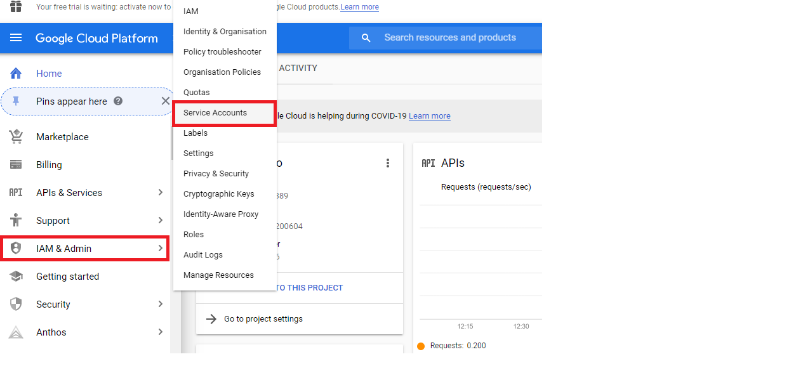
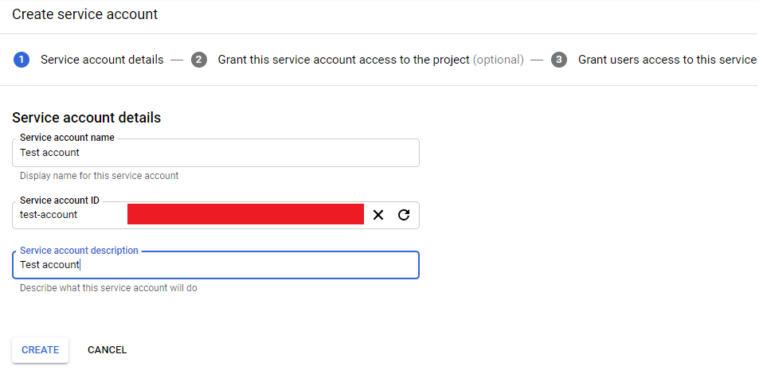
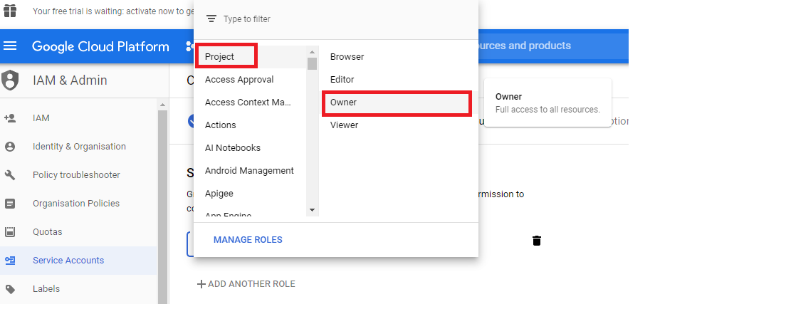
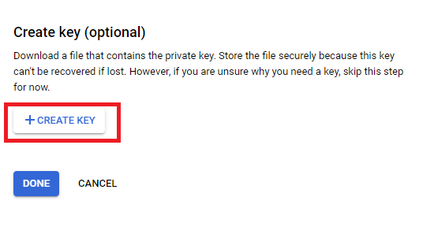
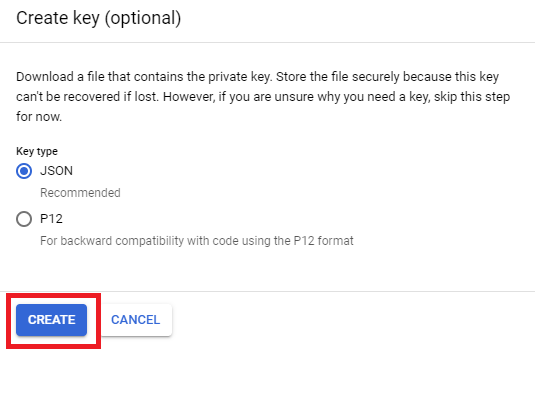
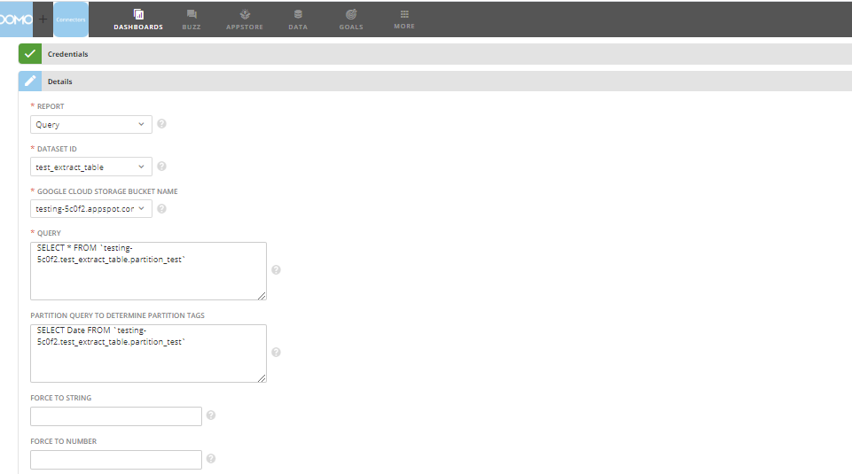
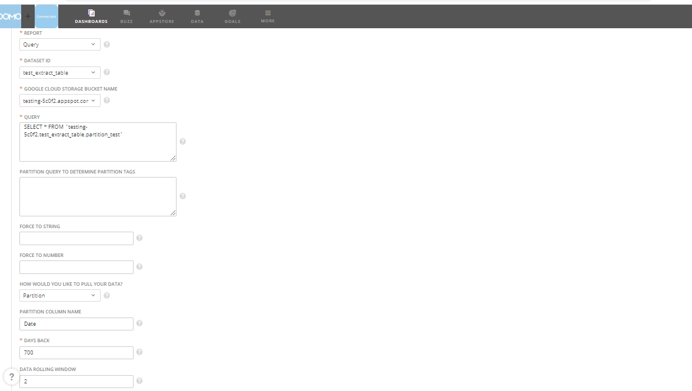
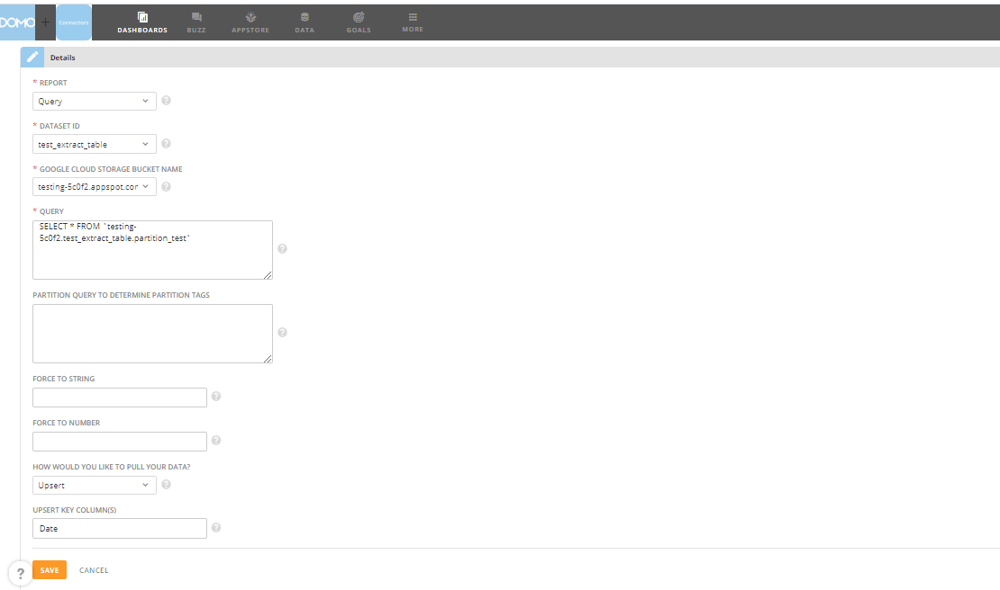

---
    title: Google BigQuery High Bandwidth Service Connector
    url: https://domo-support.domo.com/s/article/360060507713
    linked_kbs:  ['[https://domo-support.domo.com/s/knowledge-base/](https://domo-support.domo.com/s/knowledge-base/)', '[https://domo-support.domo.com/s/](https://domo-support.domo.com/s/)', '[https://domo-support.domo.com/s/topic/0TO5w000000ZammGAC](https://domo-support.domo.com/s/topic/0TO5w000000ZammGAC)', '[https://domo-support.domo.com/s/topic/0TO5w000000ZanLGAS](https://domo-support.domo.com/s/topic/0TO5w000000ZanLGAS)', '[https://domo-support.domo.com/s/topic/0TO5w000000ZaoQGAS](https://domo-support.domo.com/s/topic/0TO5w000000ZaoQGAS)', '[https://domo-support.domo.com/s/article/360042926274](https://domo-support.domo.com/s/article/360042926274)', '[https://domo-support.domo.com/s/article/360042926054](https://domo-support.domo.com/s/article/360042926054)', '[https://domo-support.domo.com/s/article/360060507713](https://domo-support.domo.com/s/article/360060507713)', '[https://domo-support.domo.com/s/topic/0TO5w000000ZaoQGAS/api-connectors](https://domo-support.domo.com/s/topic/0TO5w000000ZaoQGAS/api-connectors)', '[https://domo-support.domo.com/s/article/360043429933](https://domo-support.domo.com/s/article/360043429933)', '[https://domo-support.domo.com/s/article/360043429953](https://domo-support.domo.com/s/article/360043429953)', '[https://domo-support.domo.com/s/article/360042925494](https://domo-support.domo.com/s/article/360042925494)', '[https://domo-support.domo.com/s/article/360043429913](https://domo-support.domo.com/s/article/360043429913)', '[https://domo-support.domo.com/s/article/4408174643607](https://domo-support.domo.com/s/article/4408174643607)', '[https://domo-support.domo.com/s/login/](https://domo-support.domo.com/s/login/)']
    article_id: 000003275
    views: 2,229
    created_date: 2022-10-24 21:12:00
    last updated: 2022-10-24 22:41:00
    ---

Intro
-----

BigQuery is a data platform to create, manage, share and query data. Domo's Google BigQuery High Bandwidth Service connector lets you bring in larger results from BigQuery through the assistance of the Google Cloud Storage service. To learn more about the BigQuery API, go to <https://cloud.google.com/bigquery/docs/reference/v2/>.

The Google BigQuery High Bandwidth Service connector is a "Cloud App" connector, meaning it retrieves data stored in the cloud. In the Data Center, you can access the connector page for this and other Cloud App connectors by clicking ********Cloud App******** in the toolbar at the top of the window.

This topic discusses the fields and menus that are specific to the Google BigQuery High Bandwidth Service connector user interface. For general information about adding DataSets, setting update schedules, and editing DataSet information, see [Adding a DataSet Using a Data Connector](/s/article/360042926274 "Adding a DataSet Using a Data Connector").

Prerequisites
-------------

To connect to BigQuery and create a DataSet, you must have the following:

* A JSON BigQuery service account key
* A JSON Google Cloud Storage service account key

##### **To generate the necessary service account keys, do the following**:

1. In the Google Cloud Platform Console, open the **IAM & Admin** page.

2. Click ********Service accounts********.

3. Select your project and click ********Open********.

4. Click ********Create Service Account********.

5. Enter a name and description for the service account.

6. Click ********Create********.

7. To grant this service account access to the project, click **Select a role** drop down.

8. Click **Project** and then click********Owner********.

9. Owner will appear in the Role field.

10. Click ********Continue********.

11. Click ********Create key********.

12. Select ********JSON******** as the key type.

13. Click ********Create********.

A private key will be saved to your computer.

##### **Include the following permissions for the Service keys**:

**BIGQUERY ROLES**  
bigquery.datasets.get  
bigquery.jobs.create  
bigquery.jobs.get  
bigquery.jobs.list  
bigquery.tables.list  
bigquery.tables.export  
bigquery.tables.create  
bigquery.tables.delete

**CLOUD STORAGE ROLES**  
storage.buckets.get  
storage.buckets.list  
storage.objects.create  
storage.objects.delete  
storage.objects.get  
storage.objects.list

Connecting to BigQuery
----------------------

This section enumerates the options in the ****Credentials**** and ****Details**** panes in the Google BigQuery High Bandwidth Service Connector page. The components of the other panes in this page, ****Scheduling**** and ****Name & Describe Your DataSet****, are universal across most connector types and are discussed in greater length in [Adding a DataSet Using a Data Connector](/s/article/360042926274 "Adding a DataSet Using a Data Connector").

You cannot export nested and repeated data in CSV format. Nested and repeated data are supported for Avro, JSON, and Parquet exports.

Basically, if the customer has a column with type as ARRAY, BigQuery doesn't support unloading that data in CSV.

The customer needs to exclude the ARRAY columns or UNNEST them to run the unload successfully

### Credentials Pane

This pane contains fields for entering credentials to connect to your BigQuery Unload account. The following table describes what is needed for each field:  

| Field | Description |
| --- | --- |
| Service Account Key JSON BigQuery | Enter your Google BigQuery JSON service account key. |
| Service Account Key JSON Google Cloud Storage | Enter your Google Cloud Storage JSON service account key. |

Once you have entered valid credentials, you can use the same account any time you go to create a new Google BigQuery High Bandwidth Service DataSet. You can manage connector accounts in the **Accounts** tab in the Data Center. For more information about this tab, see [Managing User Accounts for Connectors](/s/article/360042926054 "Managing User Accounts for Connectors").

### Details Pane

This pane contains a primary **Reports** menu, along with various other menus which may or may not appear depending on the report type you select.

| Menu | Description |
| --- | --- |
| Query | Runs a BigQuery SQL query and returns results if the query completes. |
| Dataset ID | Select the BigQuery dataset id for your data. For more info about BigQuery datasets, visit <https://cloud.google.com/bigquery/docs/datasets-intro>. |
| Google Cloud Storage bucket name | Select the Google Cloud Storage bucket name that will be used for temporary storage as we transfer your data into Domo. |
| Query | Enter a query to execute. Only Standard SQL query is supported. Example: Select \* from Table\_Name. |
| Partition query to determine partition tags | Enter partition query to determine the distinct partition tags. The column containing the **Date** data is your partition column. Example: Select **Date** from Table\_Name. |
| Force to string | Enter a comma separated list of fields that need to be treated as STRING in Domo. |
| Force to number | Enter a comma separated list of fields that need to be treated as NUMBER in Domo. |
| How would you like to pull your data? | Choose how you would like to pull your data. |
| Partition column name | Enter partition column name. The column containing the **Date** data is your partition column. |
| Upsert key columns | Enter a comma separated list of upsert key column names. |
| Days Back | The number of days back that you would like to get data from. Example: Specify 7 to get data for the last 7 days. |
| Data Rolling Window | The data will be retained for the number of days specified. Example: Specify 60 to retain the data for 60 days. |

##### **Entering the SQL Query and Partition Query**

##### **Entering the Partition column name and other parameters**

Your data will be fetched from the number of days mentioned in the **Days Back** field and will be retained for the number of days specified in the **Data Rolling Window** field.

 

**Note:** When using the Partition option, your DataSet must be set to **Append** and NOT Replace.

##### **Using the Upsert mode**

### Other Panes

For information about the remaining sections of the connector interface, including how to configure scheduling, retry, and update options, see [Adding a DataSet Using a Data Connector](/s/article/360042926274).

 

**Note:** Currently this connector only supports date partitions.

