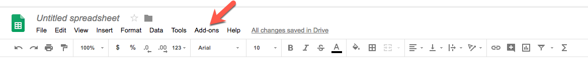
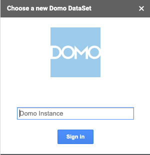
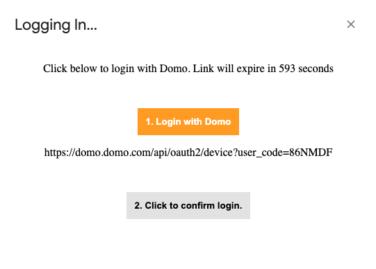
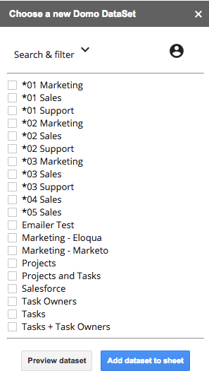
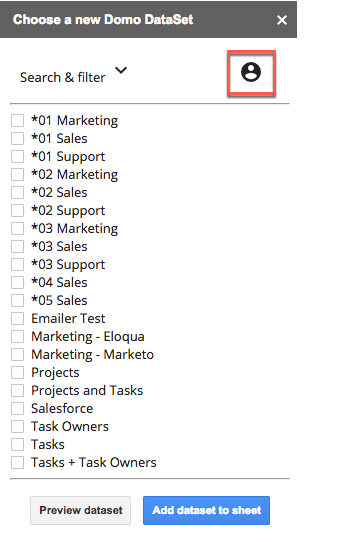

---
    title: Google Sheets Add-On
    url: https://domo-support.domo.com/s/article/360043437913
    linked_kbs:  ['[https://domo-support.domo.com/s/knowledge-base/](https://domo-support.domo.com/s/knowledge-base/)', '[https://domo-support.domo.com/s/](https://domo-support.domo.com/s/)', '[https://domo-support.domo.com/s/topic/0TO5w000000ZamqGAC](https://domo-support.domo.com/s/topic/0TO5w000000ZamqGAC)', '[https://domo-support.domo.com/s/topic/0TO5w000000Zao3GAC](https://domo-support.domo.com/s/topic/0TO5w000000Zao3GAC)', '[https://domo-support.domo.com/s/article/360043437913](https://domo-support.domo.com/s/article/360043437913)', '[https://domo-support.domo.com/s/topic/0TO5w000000Zao3GAC/plugins-for-sharing-domo-content](https://domo-support.domo.com/s/topic/0TO5w000000Zao3GAC/plugins-for-sharing-domo-content)', '[https://domo-support.domo.com/s/article/360043429933](https://domo-support.domo.com/s/article/360043429933)', '[https://domo-support.domo.com/s/article/360043429953](https://domo-support.domo.com/s/article/360043429953)', '[https://domo-support.domo.com/s/article/360042925494](https://domo-support.domo.com/s/article/360042925494)', '[https://domo-support.domo.com/s/article/360043429913](https://domo-support.domo.com/s/article/360043429913)', '[https://domo-support.domo.com/s/article/4408174643607](https://domo-support.domo.com/s/article/4408174643607)', '[https://domo-support.domo.com/s/login/](https://domo-support.domo.com/s/login/)']
    article_id: 000004258
    views: 2.540
    created_date: 2022-10-24 21:35:00
    last updated: 2022-10-24 22:42:00
    ---

Intro
-----

Use the Domo Google Sheets Add-on to download Datasets from Domo to Google Sheets. You can then edit the data just as you could with any spreadsheet in Google. This is an excellent way to share your Domo data with others in your company who may not have access to Domo.

### What you can do with the Add-on

Using this add-on, you can do all of the following:

* Connect to the server for the desired Domo instance.
* Download any DataSet from your connected instance as a Google Sheet.
* Edit the data in your downloaded DataSet.
* Refresh the DataSet—if anything has changed in this DataSet, you can refresh to the current version in Domo.

### Downloading the Add-on

You can download the add-on from within Google Sheets

**To download the Google Sheets Add-on,**

1. In a Google Sheet, navigate to **Add-ons.**  
  

2. Click**Get add-ons.**
3. In the **Search apps** box, search for **Domo**.
4. Select the **Install** button to install.
5. Select the Google Account to connect to Domo.
6. Click **Allow**.

The add-on will now be available anytime you open Google Sheets.

### Using the Add-On

The process for using the add-on to download DataSets can be summarized as follows:

1. Select a Google Sheet.
2. Click **Add-ons**, then **Domo**.
3. Select **Choose DataSet**.
4. Connect to your Domo instance.
5. Choose your DataSet.
6. Select **Add dataSet to sheet**.
7. Refresh the data as necessary to keep everything up to date.

### Connecting to Your Domo Instance

You can connect to the server for any Domo instance for which you have access. You can be connected to only one instance at a time.

**To connect to a Domo instance,**

1. Select **Add-ons**, then **Domo**.
2. Select **Choose DataSet**.
3. A dialog appears on the right side of your sheet requesting your credentials.  
  

4. Enter your Domo instance (if my instance is [customer.domo.com](http://customer.domo.com), then my instance is customer) and click **Sign In**.
5. Click the **Login with Domo** button.  
  

6. Select the **Click to confrim login.** button.

### Downloading a DataSet from Domo to Google Sheets

After you have connected to Domo, you can download a DataSet from that instance into Sheets.

**To download a Domo DataSet into Sheets,**

1. Use the **Search & filter** options to locate the DataSet you want to download.

2. Select the desired DataSet.

3. (Optional) Click **Preview dataset** to see the owner and last updated date.

From the preview, you can choose **Go to dataset** to view the data directly in Domo.

4. Click  **Add dataset to sheet.**

5. Your DataSet will be opened in its own sheet within Google Sheets.

### Refreshing a DataSet

If at any time you want to update your data to its current state in Domo, you can choose the **Refresh** option. Once this is selected, any edits made are removed, and the most current version of your data in Domo is downloaded.

**To refresh the data in a sheet,**

1. Choose the Google Sheet containing the DataSet you want updated.

2. Select **Add-ons** , then **Domo**.

3. Click **Refresh Sheet**.

### Logging Out

To log out of the Google Sheets Add-on, just click the log out icon.

 

 

 

 

