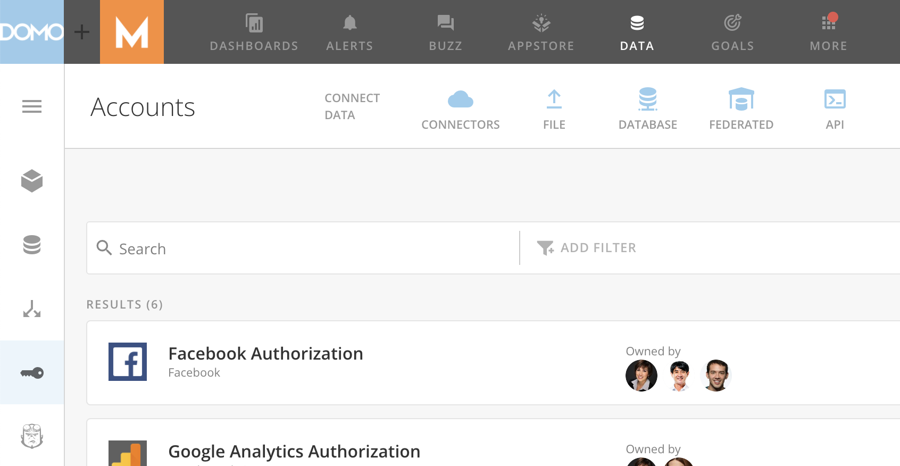
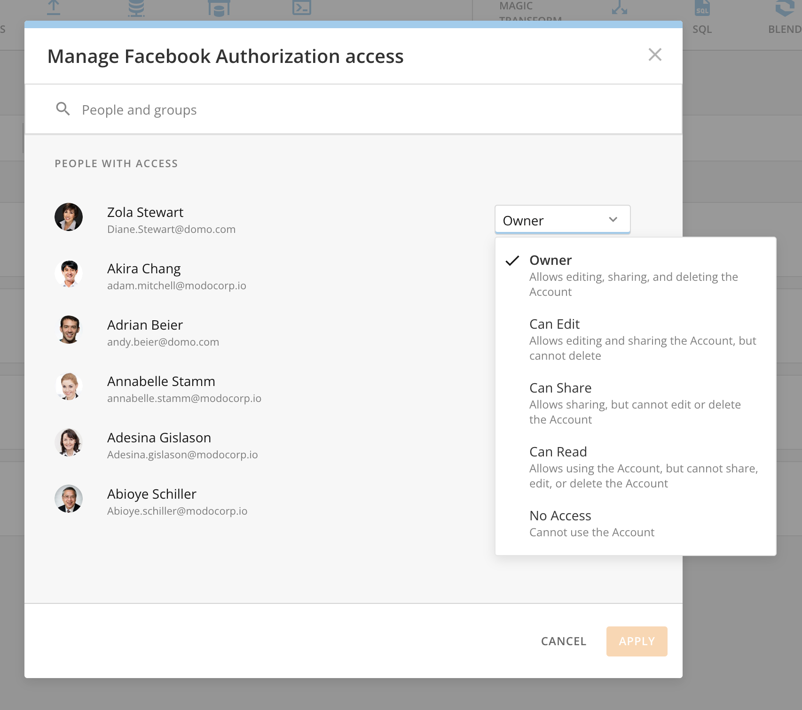
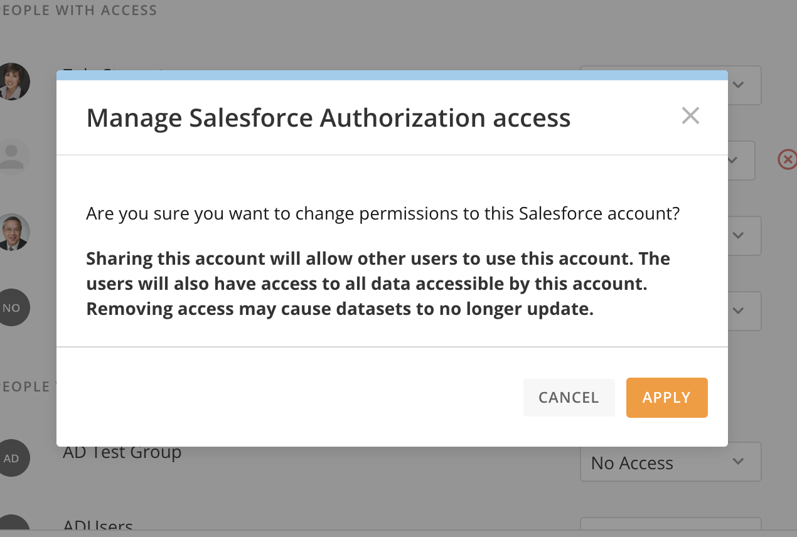
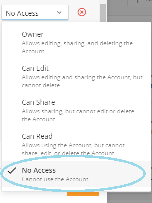
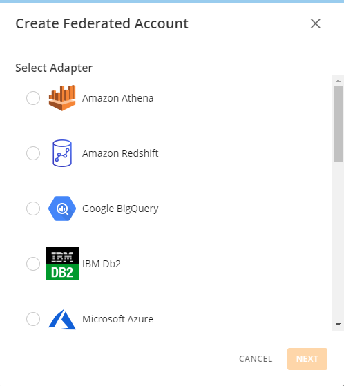

Intro
-----

In the **Accounts** tab in the Data Center, you can add, delete, share, and edit the accounts associated with DataSets. Each account appears as an item in the list, with the name and logo of the data provider, the owner(s) of the Account, the number of DataSets being powered from this account, and the last updated date. You can see and manage only your own accounts and the accounts that are shared with you; however, you can transfer DataSets to other users' accounts or change the accounts associated with DataSets. You can also share accounts with others so they can also create DataSets using that Account.

When the OAuth token for an account is about to expire, you receive notifications in Domo and via email/SMS. For information about setting notification preferences, see [Configuring Notification and Alert Settings](/s/article/360042925814).

If you delete a user from Domo and reassign his/her DataSets to another user, the ownership for the DataSet accounts is not passed to the new user (although permission to use the Accounts is passed to the new user as “Read Only” access). Account Owners must be updated on the Account itself. For more information, see [Removing Users from Domo](/s/article/360042934334).

For more information about the layout of this tab, see [Data Center Layout](https://domo-support.domo.com/s/article/360047553253?language=en_US).

Getting this feature
--------------------

If you are interested in joining the Beta for this feature, please contact your Customer Success Manager (CSM). This beta will be more broadly available in 2022.

Accessing the Accounts tab
--------------------------

You access the **Accounts** tab from the Data Center.

**To access the Accounts tab,**

1. Click **Data** in the toolbar at the top of the screen.  
   
 
2. Click the  icon from the left pane of the screen to open the **Accounts** tab.  
 The accounts visible in the accounts Tab are accounts that you either own, or have been shared with you. There are exceptions to this if you have either the “Manage All Accounts” grant or the “View All Accounts” grant. See [Grants for Account Management](#h_01FPX8KDK2JDHWEA75B04N92Y7) below for more information about Account grants.

Sharing an account
------------------

You can share accounts with others at varying levels of access ranging from owning the account to using the account to create DataSets.

You can see accounts that have been shared with you in the **Accounts** tab.

**To share an account with another user,**

1. Mouse over the account you want to share.
2. Click   and select **Share account**.  
   
 
3. A Manage account access dialog for the selected account appears, listing the users with and without access to this account.
4. Select the desired access for the user that you want to share the account with.  
   
 
5. You can share the account with multiple users in the same attempt just by selecting the accesses for the users you want to share the account with.
6. Click **Apply**.
7. A dialogue will appear with a confirmation for the account change permission. Click **Apply**.  
   
 

Group Ownership of Accounts
---------------------------

Group Ownership of Accounts means that individual users and groups can be the owners of an account, and multiple users and groups can also be the owners of accounts at the same time.

 

**Note:** The account credentials are not visible to anyone in Domo, including the owners.

Account Owner Permissions
-------------------------

The account owner can do the following:

* Share the account with other users with "Owner", "Can Edit", "Can Share", "Can Read", or "No Access" permissions.
* Update the credentials for the account.
* Use the account to create a DataSet.
* Delete the account.

### "Can Edit" Permission

A user with the Can Edit permission can do the following:

* Update the credentials for the account.
* Add other users to the account with "Can Edit", "Can Share", or "Can Read" permissions.
* Use the account to create a DataSet in Domo.

### "Can Share" Permission

A user with the Can Share permission can do the following:

* Add other users to the account with "Can Share" or "Can Read" permissions.
* Use the account to create a DataSet in Domo.

### "Can Read" Permission

A user with the Can Read permission can do only one thing:

* Use the account to create a DataSet in Domo.

### "No Access" Permission

A user with the No Access permission cannot see or use the account.

Searching Accounts
------------------

You can search any accounts on the accounts page using the Search bar and by adding filters.

### Search Accounts using the Search bar

You can search the accounts in Search bar by a number of things as follows:

* Data provider (i.e. Facebook, Salesforce, etc…)
* Account Name
* Account Owners

### Search Accounts using the Account Filters

You can use the Add Filter feature to filter the accounts to a specific subset. Domo provides the following filters:

* Owned by: Accounts are filtered by the selected owners of the accounts.
* Valid: Accounts are filtered based on whether or not the accounts are valid, and can be used to connect to a data provider.
* Used: Accounts are filtered based on whether or not the accounts are connected to a data provider.
* Data Provider Type: Accounts are filtered by the Data Provider the account is connected to (Salesforce, Facebook, etc…)

 

**Note:** Account filters are "and" filters, so you can use multiple filters at the same time.

Adding an account
-----------------

You can add an account to Domo by doing either of the following:

* By adding a DataSet using a Connector to Domo and entering new account information (as opposed to selecting an existing account). An entry for the new account appears automatically in the **Accounts** view. This method is discussed in more detail in [Adding a Dataset Using a Connector](/s/article/360042926274).
* By clicking **Add New** in the **Accounts** view and following the steps in the wizard.

**To add an account to Domo from the Accounts view,**

1. In **Accounts**, click **Add New**.
2. Select the desired Integration Method (Federated connection, Account, etc…)
3. For a Connector, search for and select the desired Connector.
4. Click the **Connect to** button.
5. Enter your connection information.
6. Click **Done**.

An entry for the new account appears in the **Accounts** view listing.

Deleting an account
-------------------

You can disconnect (delete) any account listing from the **Accounts** view. Any DataSets that use this account are unassociated and stop updating. You must be an owner of an Accounts, or have the Manage All Accounts grant to be able to delete an Account.

**To delete an account in the Accounts view,**

1. Mouse over the account you want to delete.
2. Click  and select **Delete Account**.
3. Click **Delete Account** to confirm.

Viewing DataSets associated with accounts
-----------------------------------------

In the **Accounts** view, you can see a listing of DataSets associated with each account. You can see any DataSet in more detail by clicking a DataSet's name in the list.

**To view DataSets associated with an account,**

1. In **Accounts**, on a listed account, mouse over the **DataSets** column item.  
 A list of the associated DataSets appears.
2. Click the name of a DataSet to see the Details page for that DataSet.

Reconnecting accounts
---------------------

For connectors that use OAuth to authenticate, you can reconnect, if necessary in the **Accounts** tab. If an OAuth token has expired, you may have to re-enter your credentials to reconnect.

**To reconnect an account,**

1. Mouse over the account you want to reconnect.
2. Click  and select **Re-connect**.
3. (Conditional) Enter your credentials or grant account access to Domo, if you are asked to do so.

Renaming accounts
-----------------

When you create accounts, either by adding them in the **Accounts** tab or entering credentials for a new DataSet, those accounts take the name of the connector. For example, if you add an account for Facebook, that account is called "Facebook Account." Subsequently added accounts for the same connector share this name. This can make it confusing to differentiate between accounts for the same connector. You can eliminate this confusion by giving unique names to accounts in the **Accounts** tab.

**To rename accounts in the Accounts tab,**

1. Click the account name. (You can also select **Edit account** in the gear menu.)  
 The account name and credentials open for editing.
2. Enter a new name for the account.
3. Click **Save Changes**.

Editing account credentials
---------------------------

For connectors that require you to enter account credentials manually (as opposed to using OAuth), you can edit the credentials as necessary in the **Accounts** tab.

**To edit connector information in the Accounts tab,**

1. Click the account you want to edit. (You can also select **Edit account** in the gear menu.)
2. Enter the required credentials in the necessary fields.
3. Click **Save Changes**.

Removing a user account
-----------------------

You can remove a user from the account that you added earlier. The removed user will no longer have the access to your datasets.

**To remove a user's account access,**

1. Mouse over the account you want to remove access from.
2. Click  and select **Share account**.
3. A dialog appears listing the users with access to DataSets from this account.
4. Select **No Access** from the dropdown in front of the user name that you want to remove the access for.  
   
 
5. You can remove the account access with multiple users in the same attempt just by selecting the **No Access** from the dropdown in front of the user names that you want to remove the access for.
6. Click **Apply**. A dialog will appear with a confirmation for the account change permission.
7. Click **Apply**.

The user(s) no longer have access to the DataSets associated with this account.

Grants for Account Management
-----------------------------

You can view account grants in the Roles section of the Admin Center

1. To navigate to the Admin center select **More  > Admin  > Governance > Roles > Grants**.  
   
 
2. A list of the grants appears along with their details such as associated roles, role participation, associated features, and members.

Manage All Accounts Grant
-------------------------

When the Manage All Accounts grant is added as part of a custom role, it gives a person the ability grant to see and make themselves owners of all the accounts in that instance.

**Note:** The Manage All Accounts Grant is not automatically given to the Domo Admin role.

**To access the Manage All Accounts grant,**

1. Start typing the grant name in the Search bar in the right side of the pane.
2. The Manage All Accounts grant will surface.
3. Click on the grant entry to view the role details. With the Manage All Accounts grant, you can perform all functions on an account including viewing who has access to the account, sharing with any user at any permission level, editing credentials, and deleting the account.  
   
 

View All Accounts Grant
-----------------------

The View Account Grant allows you to see all the accounts in an instance. However, the accounts still need to be shared with you before you can use them.

**To access the View All Accounts grant,**

1. Start typing the grant name in the Search bar in the right side of the pane.
2. The View All Accounts grant will surface.
3. Click on the grant entry to view the role details. With the View All Accounts grant, you can view all accounts in that instance.  
   
 

Notifications for Accounts
--------------------------

Owners receive notifications for any changes make to the account, including changes they made to the account. These changes include editing credentials, sharing the account, or deleting the account.

Notifications are also sent to any person whose permissions are updated on an account.

Notifications for accounts can be managed for a person in the notifications section of Domo.

Known issues
------------

If you have the "Manage all Accounts" grant and try to edit an OAuth Account, you will not see the fields to edit. In order to see the fields, please add yourself as an owner to the Account.

FAQ's
-----

#### How do I add a Federated Account?

The **+ Federated** button in the upper right corner on the **Account** page helps you create a Federated Account.

1. Click the **+ Federated** button.
2. **Create Federated Account** window will appear.  
   
 
3. Select the desired adapter, and click **Next**.
4. Now, provide the connection details to configure the account.
5. Click **Connect**.

#### If someone has the “Manage All Accounts” grant, will they be able to share an Account I created with other people?

Yes. You will be notified via email about any activity on Accounts you create and are the owner of.

#### Can I perform actions on multiple Accounts at once?

No, bulk actions on Accounts is not available at this time.

#### If I delete a user or group that owns an Account, will I be prompted to reassign those Accounts before they are deleted?

Not at this time. However, if Accounts do not have owners, any DataSets associated with that Account will continue to execute successfully for those the Account has been shared with. Any person with the “Manage All Accounts” grant will be able to assign a new owner to the Account.

