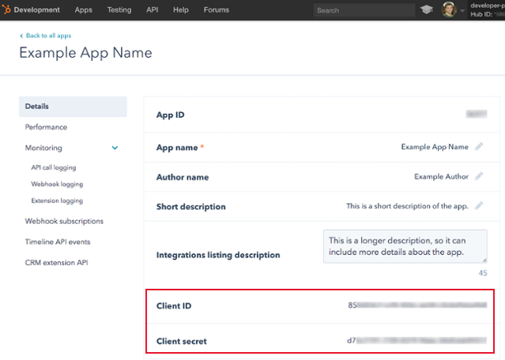

Intro
-----

HubSpot develops software for social media and email marketing, content management, web analytics, and search engine optimization. The Domo HubSpot Webhook connector allows you to subscribe to changes happening in the accounts of any HubSpot user who installs your integration. Using this connector requires that you set up a HubSpot app to use the API by subscribing to changes you want to be notified about, and by specifying a URL to send those notifications. See HubSpot's [prerequisites documentation](https://developers.hubspot.com/docs/faq/integration-platform-api-requirements "https://developers.hubspot.com/docs/faq/integration-platform-api-requirements") for more details about creating an app.

Webhooks are set up for a HubSpot app, not individual portals.  Any portals that install your app (by going through the OAuth flow) will be subscribed to any webhook subscriptions set up for the app.

Because this connector is webhook-based, DataSets created using this connector update automatically when new data is sent to your Hubspot account. You do *not* need to worry about scheduling updates when using this connector.

You connect to your HubSpot account in the Data Center. This topic discusses the fields and menus that are specific to the HubSpot Webhook connector user interface. General information for adding DataSets, setting update schedules, and editing DataSet information is discussed in [Adding a DataSet Using a Data Connector](/s/article/360042926274).

For more information about webhooks in Hubspot, see [https://developers.hubspot.com/docs/...hooks-overview](https://developers.hubspot.com/docs/methods/webhooks/webhooks-overview "https://developers.hubspot.com/docs/methods/webhooks/webhooks-overview"). 

Prerequisites
-------------

To connect to your HubSpot account and create a DataSet, you must first create an app within Hubspot. To create an app, you must first open a developer account. You can learn more about opening a developer account and creating an app by navigating here: [https://developers.hubspot.com/docs/...app-in-hubspot](https://developers.hubspot.com/docs/faq/how-do-i-create-an-app-in-hubspot "https://developers.hubspot.com/docs/faq/how-do-i-create-an-app-in-hubspot")

In addition to creating a Hubspot app, you must have the following:

* The client ID and client secret associated with the app you have created
* The username and password for your Hubspot account

You can find your client ID and client secret in the **Details** tab for the app, as shown in the following screenshot:

Connecting to Your HubSpot Account
----------------------------------

This section enumerates the options in the **Credentials** and **Details** panes in the HubSpot Connector page. The components of the other panes in this page, **Scheduling** and **Name & Describe Your DataSet**, are universal across most connector types and are discussed in greater length in [Adding a DataSet Using a Data Connector](/s/article/360042926274 "Adding a DataSet Using a Data Connector").

### Credentials Pane

This pane contains fields for entering credentials to connect to your HubSpot account. The following table describes what is needed for each field:  

| Field | Description |
| --- | --- |
| Client ID | Enter the client ID associated with your Hubspot app. For information about finding your client ID, see "Prerequisites," above. |
| Client Secret | Enter the client secret associated with your Hubspot app. For information about finding your client secret, see "Prerequisites," above. |

After you click **Connect**, you are taken to the Hubspot login screen, where you can log into your Hubspot account using your Hubspot credentials (the password associated with your Hubspot account as well as your Hubspot password). Alternatively, you can connect to Hubspot using Google credentials or SSO. 

Once you have entered valid credentials for your Hubspot app and account, you can use the same account any time you go to create a new HubSpot Webhook DataSet. You can manage connector accounts in the **Accounts** tab in the Data Center. For more information about this tab, see [Managing User Accounts for Connectors](/s/article/360042926054 "Managing User Accounts for Connectors").

### Details Pane

In this pane, you configure webhook subscriptions for your Hubspot app by pasting a URL from Domo into the app. This creates a connection between the app and the DataSet, meaning the DataSet will update anytime the data in the app is updated.  

**To configure webhook subscriptions for your app,**

1. In the Details pane in Domo, copy the URL found in the **Webhook URL**field.
2. Go into your Hubspot app. (This should be the same app you provided credentials for in the **Credentials** pane.)
3. Under **Webhook Subscriptions**, select **Configure**.
4. Paste the copied URL into the empty field.
5. Create as many subscriptions as necessary using the **Create Subscription** button.
6. In Domo, select **Yes** in the dropdown menu if you want to include metadata such as IP address and timestamp in your returned data. Otherwise select **No**.
7. (Conditional) If you want new data in your DataSet to be replaced instead of simply added onto, click **Change update settings** then choose **Replace.**
8. Click **Save**.

FAQs
----

##### How often can the data be updated?

The Hubspot Webhook connector updates automatically as Hubspot receives data.  

##### Are there any API limits I should be aware of?

No.

##### What's the difference between this connector and the HubSpot connector?

The Hubspot Webhook connector automatically updates as Hubspot receives more data and does not update on a set schedule. The HubSpot connector, on the other hand, is a more "standard" connector in which you choose a report and set an update schedule. 

