Intro
-----

Inline Editing is a premium app that allows you to modify DataSets in Domo directly from the card in Domo.  
You can find the app in the Domo Appstore.

 

**Important:** Due to an issue with our underlying persistence layer, you cannot have any periods or dots in your column names. Example: *[my.column.name](http://my.column.name)*. This prevents the DataSet from loading in the app.

This article describes app configuration and how to perform tasks within the app in the following topics:

* [Prerequisites](#prereqs)
* [Known limitations](#limitations)
* [Upsert DataSets](#upsert)
* [Page Filters setup](#page_filters_setup)
* [Mapping DataSets to the app](#mapping)
* [Configuring the app](#configure_app)
* [Tabs](#tabs)
* [Tab settings](#tab_settings)
* [Using the app](#using)
* [Writing back changes](#write_back_changes)
* [Change log](#change_log)
* [Migrating to the new version of Inline Editing](#migrating)

Prerequisites
-------------

Only app admins can configure the app's internal settings. To add admins, create a Domo Group and name it \_Inline\_Edit\_Owners, and then add admins to this Group. If the Group does not exist, the app runs but no users can make changes to it.

To learn about Domo Groups, see [Creating and Managing User Groups](http://domo-support.domo.com/s/article/360042934294?language=en_US).

Known Limitations
-----------------

The following are known limitations in the current version of the app:

* Standard DataSets are limited to 100,000 rows and/or 500 columns. If you need to use a larger DataSet, first convert it to an upsert DataSet. Learn how to do this in the [Inline Editing Implementation Guide.](http://domo-support.domo.com/s/article/1500000406641?language=en_US)
* If a mechanism external to the app is in place and modifies the data in the DataSet, such as a DataFlow, the changes written from the app are overwritten by the mechanism.
* The app checks for changes to the DataSet every few seconds. If multiple people are actively using the app, and one of them commits changes, the app warns the other users of the action and their changes must be dropped to continue using the app.

Upsert DataSets
---------------

You can configure Inline Editing to use any DataSet in Domo. However, when changes are written back to the DataSet, there are two ways of sending the changes, described below.

* In a standard, default DataSet, the app must download the entire DataSet (in sections), apply the changes to the target rows, and re-upload the modified DataSet. This process can potentially take a long time, depending on the size of the DataSet.
* In an upsert DataSet, changes are only sent for the rows that are being modified, added, or deleted, using the values in the key columns. Because of the shorter potential writeback time, you may consider converting your DataSets to upsert DataSets. To learn how, see the [Inline Editing Implementation Guide](http://domo-support.domo.com/s/article/1500000406641?language=en_US).

Page Filters Setup
------------------

Inline Editing provides an in-app way to filter the data. However, the Filters applied to the Domo dashboard where the app card is placed can also be read and used by the app.

In order for the columns used in the DataSets in the app to be available as Page Filters, these DataSets must be mapped properly. To learn how to do this, see [Mapping DataSets to the App](#mapping), below. The app allows for up to 30 DataSets (in 30 tabs) to exist at the same time.

Whenever you add a tab, you must map the DataSet in that tab. 

 

**Note the following:** 
 

* Each DataSet can only be linked to one tab. After it is linked, you cannot add a second tab pointing to the same DataSet.
* If you remove a tab, you do not necessarily need to remove the DataSet from the mapping. Doing so, however, cleans up the list of Filters and keeps a cleaner list of mapped DataSets.

### Mapping DataSets to the App

Follow these steps to map DataSets to the app:

 

1. Hover over the app to display  **Card options** in the top right corner, and select it.  
 The card options display.
2. Select  **Edit Card.**  
 The card editor displays.
3. (Optional) Check the box for **Fullpage** if you want to see the full page of the app as you edit. 
 
4. At the bottom of the card editor, the data **Mapping** area displays. There are two sections:  **DataSets** and  **Collections**.  
 During the configuration process, if you see a red indicator like the one shown below for either tab, it means there is an issue with the mapping for that tab. 
 
5. Go to the  **DataSets**section, if it is not already open.
6. Select the DataSet list to expand it and view the 30 slots for mapped DataSets. If the slot has a placeholder DataSet, that means it is not being used.
 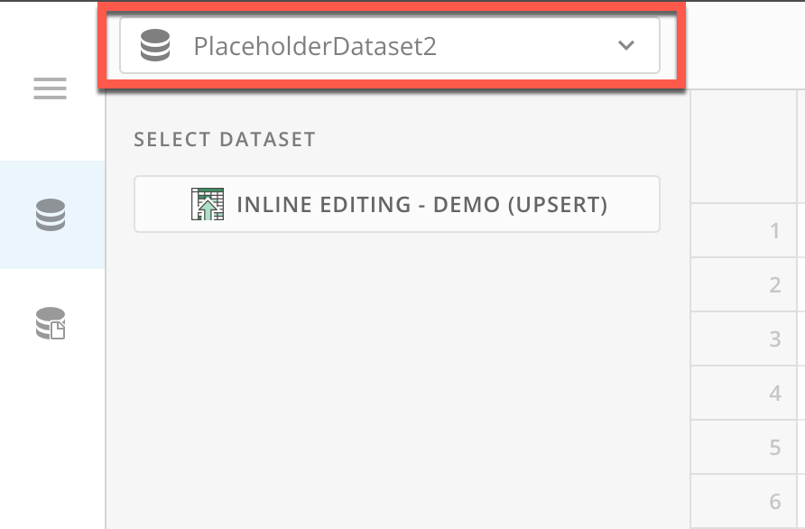 

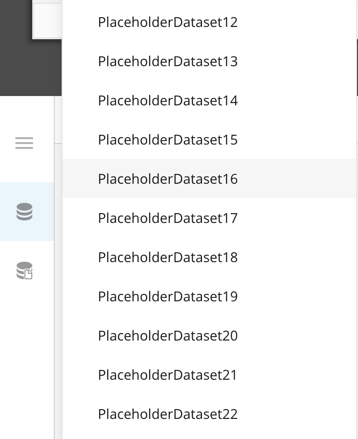
7. Select an unused slot. (The order in which you map the DataSets does not affect app functionality.) You can also replace a DataSet with another DataSet if needed.
8. After you choose a slot, under **Select DataSet**, select the button to display the **Select a DataSet** modal. 
 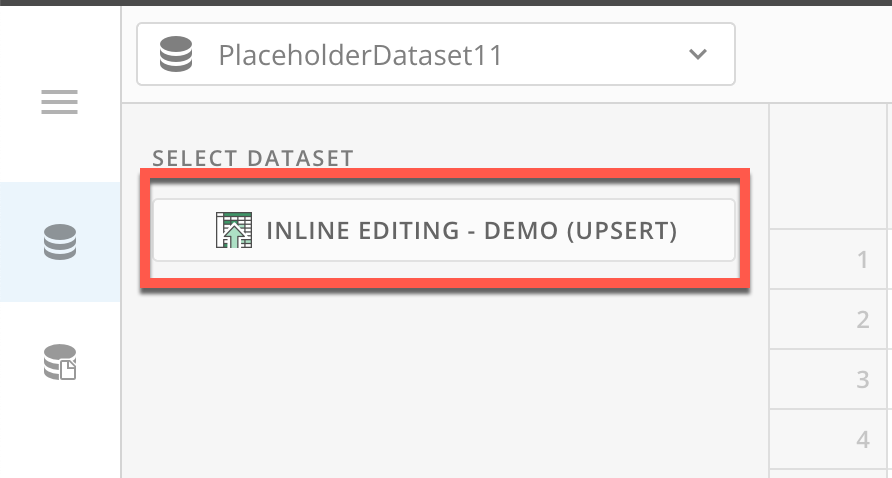
9. In the modal, search for and select your DataSet, and then select **Choose DataSet** to return to the card editor.
 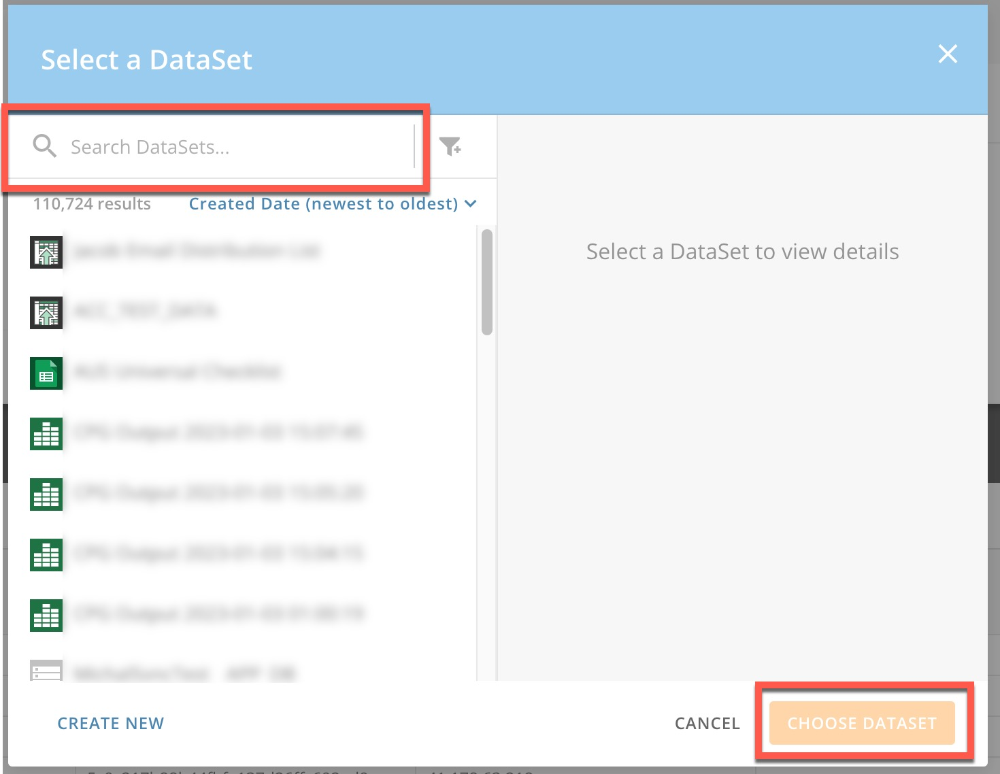

You can select **Clear Data Mapping** to reset the DataSet's mapping. 

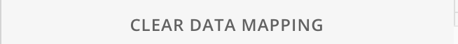

 

**Important:** Sometimes when you switch a DataSet, the list of Page Filters for the dashboard where the app card displays does not update automatically. When this happens, the columns from the newly mapped DataSet are not included.

 A quick fix is to close the Page Filters bar on your dashboard, reload the page, and open the Page Filters bar again. If you do this and still can't see the correct Page Filters, please contact [Domo Support](http://domo-support.domo.com/).
10. Repeat steps 6–8 to map as many DataSets as you need.
11. When you finish mapping DataSets to the app, select **Save & Finish** at the top of the card editor to close it and keep your changes.

 

 

**Admin Note:** By default, the app automatically uses the Page Filters that apply to the active tab to filter the data displayed in the table. However, as an admin, you can go to **Settings** > **Filters** for the app and configure whether and how the app uses Page Filters.  

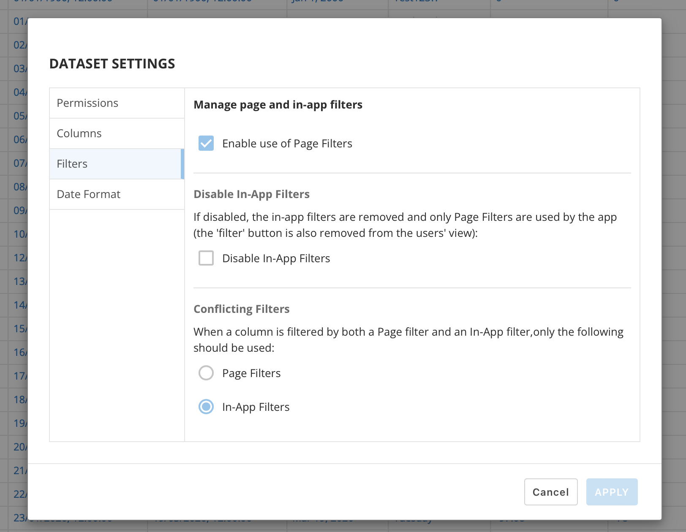

Configuring the App
-------------------

App admins can configure app settings. To learn how to designate app admins, see [Prerequisites](#prereqs), above.

### Tabs

Tabs contain DataSets, allowing you to edit DataSets directly from the app. This is the main function of Inline Editing. Admins can add, delete, and configure tabs. These processes are described below.

#### Adding a Tab

1. At the bottom of the default screen, beside the tabs, admins seen the option to  **Add new tab.**If you do not see this option, you are not part of the admin group.  
 To learn how to add admins to the group, see [Prerequisites](#prereqs), above.
2. Select **+ Add new tab**.  
 The **Add New Tab** modal displays.
3. On the left side of the modal, search for and select a DataSet you want to add to the app.  
 The right side of the modal displays DataSet details and a preview of the DataSet.
4. Press **Select**or **Cancel**.
	* If you press **Select**, you are prompted to enter a **Tab Name** and can then select **Create Tab**.
	* If you select Cancel, you return to the app—no new tab is created.

#### Deleting a Tab

1. Select the tab you want to remove at the bottom of the app.  
 The selected tab turns blue and displays a 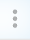 kebab menu beside the tab name.
2. Select the kebab menu to display the option to **Delete Tab**.
3. Select **Delete Tab**.  
 A dialog displays warning that the tab and all related settings and stored changes will be removed and that the action is not reversible. 
 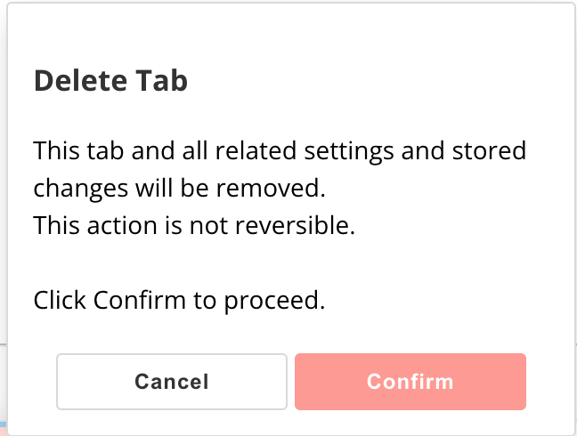
4. Select **Confirm.**

#### Tab Settings

Since settings are for an individual tab, admins must make changes to each tab if they want changes to apply to that tab.

To modify the settings for an active tab, admins can select  **Tab****Settings** in the app toolbar.   
The **DataSet Settings**modal displays.

There are four sections in **DataSet Settings**: 

* [**Permissions**](#permissions)
* [**Columns**](#columns)
* [**Filters**](#filters)
* [**Date Format**](#date)

Settings cannot be modified if a user has made changes to the table in the active tab and has not saved and written them back to the DataSet. You must discard any unsaved changes before attempting to modify the tab settings.

 

**Important:** After modifying any **Tab Settings,**select **Apply** to save your changes.

The following describes each section of the settings.

##### Permissions

The **Permissions** settings allow admins to decide the types of changes that users can make in the app, described below. Check the boxes for the options you wish to enable. 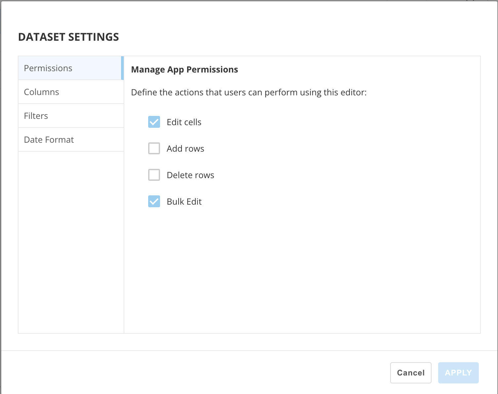

* **Edit cells —**Allows users to make changes to existing values in the DataSet.
* **Add rows —**Allows users to create new rows.
* **Delete rows —**Allows users to mark rows for deletion the next time changes are written to the DataSet.
* **Bulk edit —**Allows users to view the **Bulk Edit** button and modify the values of all the cells under a selected column.

##### Columns

The **Columns** settings allow admins to control the column configurations and which columns are editable from the app.

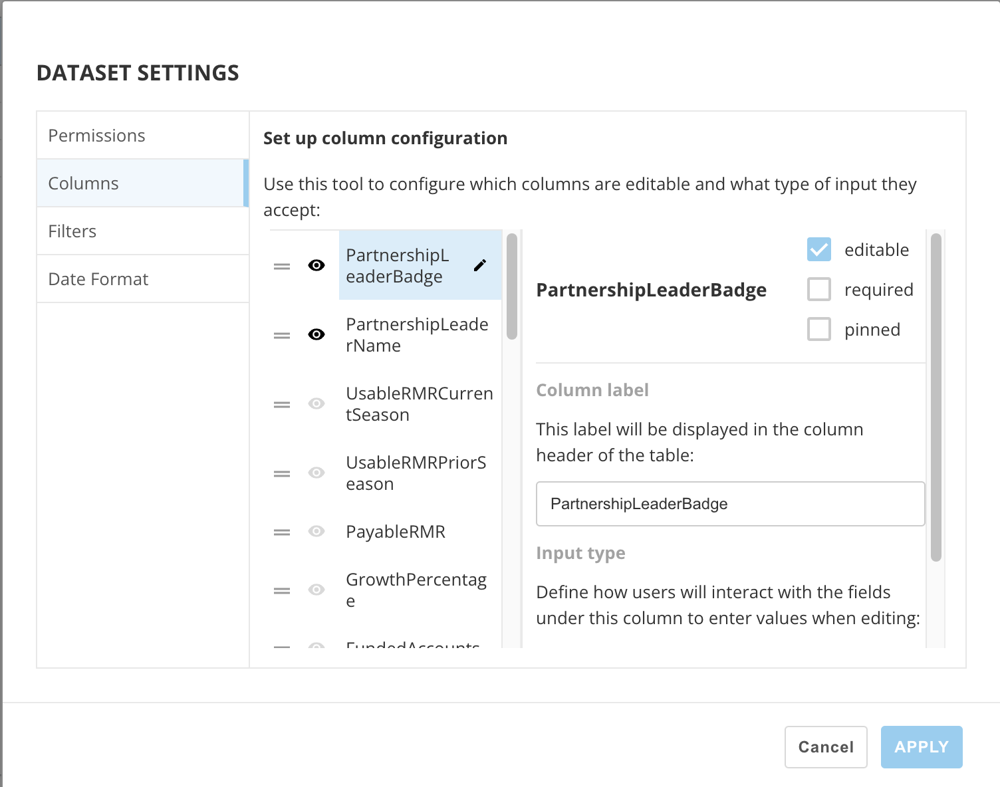  
  
The modal displays a list of each column in the DataSet. except key columns (upsert DataSets). The only edit you can make to key columns is the column name, from the main screen of the app.

If the DataSet/tab already has changes in any field, admins cannot change the column configuration—all changes must first be discarded.  
  
In the modal, each displayed column has the following controls beside the column name: 

* **Order —**Use these handles to drag and drop the columns to rearrange their order.
* **Hide/View —**Toggle between making the columns visible or hiding them. When a column is hidden, the icon is grayed out.

Next to the list of columns, at the top of the right side of the modal, the name of the active column displays along with three checkboxes, described below:

* **editable —** Check this box to make the column editable by app users. An  **Edit**icon displays beside the column name in the column list.
* **required —** Check this box to make the column required - what does it mean? If the column is not marked as editable, you must mark it editable before being able to mark it required. If this option is enabled, then each cell in the column must have content. If there are empty cells n required columns, user experience the following errors:   
 · Users cannot navigate away from the dashboard or DataSet.  
 · Users cannot change the number of rows displayed per page.   
 · Users cannot write to the DataSet.   
 · Auto-save of temporary changes skips rows with required, empty cells (invalid cells).
* **pinned —** Check this box to pin the column to the top of the column list in the modal and to fix the column's position in the DataSet.   
 In the modal, the  **Order** option is not available for a pinned column.
 

 

**Important:** Pinned columns move to the first position on the left side of the table in the app. You cannot have pinned columns on the right side of the table view.

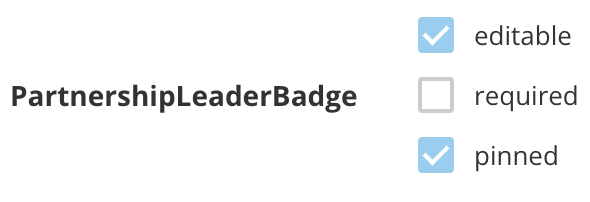

The last area in the **Columns** settings is **Column label**. In this area, you can edit the column name that displays in the table. For some columns, you can also define an **Input type**—how users interact with the fields in that columns. Possible options include **Manual input** and **Option list**.

##### Filters

The **Filters** settings allow admins to define the way Page Filters and In-App Filters are used to filter the data displayed in the DataSet/table.

* **Use Page Filters —**When this box is checked, Filters defined in the dashboard where the app card displays are transferred to and used by the app.
* **Disable In-App Filters —**When this box is checked, In-App Filters are removed, and only Page Filters defined in the dashboard where the app card displays are used by the app. Checking the box also removes the **Filter** option from the app toolbar.
* **Conflicting** **Filters —** When a column has both a Page Filter and an In-App Filter, only one can be used. This setting allows admins to control which Filter type is used when there is a conflict.

##### Screen Shot 2023-01-05 at 6.31.14 PM.png Date Format

The **Date Format** setting allows admins to control the way that date fields display on the table view.   
Possible options include:

* **Default —**Date displays in this format: Jan 6, 2023
* **Date shorthand —**Date displays as MM/DD/YYYY
* **Full date —**Date displays in this format: January 6, 2023
* **YYYY-MM-DD —**Date displays in the given format.
* **Custom —**Admin can define a custom format from options available in the modal.

 Using the App
--------------

This section describes some common tasks within the app.

### Edit Cells

To edit a cell, select it. (The font inside editable cells is blue.) Select outside of the cell to exit edit mode.  
Editable columns have a blue background header.

### Add Rows

To add a row, select  **Switch to ADD mode**. A table in add mode displays.  
To add a new row, select **Add new row**. A new row displays at the bottom of the table.

All fields in required columns and key columns are required in new rows. Temporary changes are not saved until all these fields have a value, or if the entire new row is empty. 

New rows always display at the bottom of the table on every page of the table.

### Delete Rows

To mark a column for deletion the next time the DataSet is written back, select the  kebab menu for the row. Select **Mark for deletion**.

### Reset Row

If a row has changes in any field, you can reset the entire row by selecting the  kebab menu for the row and then selecting **Reset row changes.**

### Toolbar

The following table describes the toolbar options available on the default screen of the app (Edit mode).

| **Icon** | **Description** |
| --- | --- |
| Screen Shot 2023-01-05 at 3.32.24 PM.png | **App Filters —**Select this option to display the **Filter Data**modal. After applying a Filter, only the rows displayed are affected by manual or bulk edit changes. However, if changes have already been made before filtering the data, those changes are maintained and are applied when writing back to the DataSet. |
| Screen Shot 2023-01-05 at 3.41.30 PM.png | **Discard changes** **—** Resets all changes, from all pages, in the current DataSet. |
| ******Screen Shot 2023-01-05 at 3.05.48 PM.png****** | **Switch to ADD mode —**Displays the table in add mode.
In add mode, the following option displays in the toolbar:
Screen Shot 2023-01-05 at 3.07.08 PM.png **Add new row —**Adds a new row to the bottom of the table. |
| Screen Shot 2023-01-06 at 9.24.48 AM.png | **Bulk Edit —** Allows users to edit all cells under a column at the same time.  Follow these steps to perform a bulk edit:
 1. Select Screen Shot 2023-01-06 at 9.24.48 AM.png **Bulk Edit** in the toolbar. The window displays.
2. Select the target column and new values for those columns.
3. Select **Apply**. To apply the changes, the app must download the entire DataSet in sections and apply the changes to each section. Depending on the size of the DataSet, this can take quite some time. A progress view displays to the user while the changes are being applied. Applying a Bulk Edit does not submit the changes. You must still write back to the DataSet manually.
 |
| Screen Shot 2023-01-06 at 9.24.53 AM.png | **Bulk Delete —**Allows users to mark all cells under a column for deletion. |
| Screen Shot 2023-01-05 at 3.51.26 PM.png | **Adjust font size —** Increase or decrease the font size with the controls, or select the font size from the list.
The last font size you select is stored locally. |
| Screen Shot 2023-01-05 at 3.33.32 PM.png | **Wrap Text —**Wraps the text in table cells. |
| Screen Shot 2023-01-05 at 3.33.40 PM.png | **Save Layout —** Saves the current table layout and displays it when the user returns to the app. |
| Screen Shot 2023-01-05 at 3.33.45 PM.png | **Reset Layout —**Resets the layout to the default configuration. |
| Screen Shot 2023-01-05 at 3.33.53 PM.png/td> | **Enter fullscreen —**Opens the app in fullscreen mode. Select the button again to exit fullscreen |
| Screen Shot 2023-01-05 at 3.33.57 PM.png | **Tab Settings —**Admins can use this option to access the **DataSet Settings**. |
| Screen Shot 2023-01-05 at 3.34.03 PM.png | **Help —**Opens the **Help** modal. Users can access this guide from inside the app. |

### Sort Column

Sort the columns by selecting  **Sort**for that column.

The first time you select  **Sort**, the column sorts in ascending order. The second time, the column sorts in descending order. The third time resets the column.  
Because you can sort multiple columns, a number next to the sort icon indicates the sorting priority, shown here:  

Writing Back Changes
--------------------

When you are ready to submit all changes and write them back to the DataSet, select **Write to Dataset**.   
  
Selecting this button brings up a summary of the changes to be written back to the DataSet. From this view, select **Confirm** to begin the process. The app then sends and writes back the changes. This process can take some time.  
 

 

**Important:** If you close the window, browser, or app during write back, the process is interrupted.

 

 

**Tip:** To view a summary of the changes to that tab before selecting Write to DataSet, select **Tab summary** to view the total rows in the DataSet, rows changed, and rows added.

If you do not have permission to write back to the DataSet, the app displays the following message: "You have no WRITE permissions in this DataSet," and the ability to write to the DataSet is disabled.

Change Log
----------

The app also creates a DataSet in Domo that acts as a change log for all the edits, added rows, and deleted rows submitted through the app.

To access the change log, look for a DataSet in Domo with the name <dataset\_id>\_INLINE\_CHANGE\_LOG.

 

**Note:** The DataSet name also has a hash (a string of characters and numbers) attached to it initially. After you access the DataSet, you can rename it. This doesn't affect change log functionality.

Migrating to the New Version of Inline Editing
----------------------------------------------

If you are using an older version of Inline Editing and need to update your app, follow the instructions below.

 

 

**Warning:** Before you execute the steps below, make sure that you don’t have any unsaved changes in Inline Editing that have not been written back to the Domo DataSet, otherwise you’ll lose the changes.

1. Hover over the app to display  **Card options** in the top right corner, and select it.  
 The card options display.
2. Select  **Edit Card.**  
 The card editor displays.
3. Select **Save & Finish** to create all collections necessary for app functionality. 
 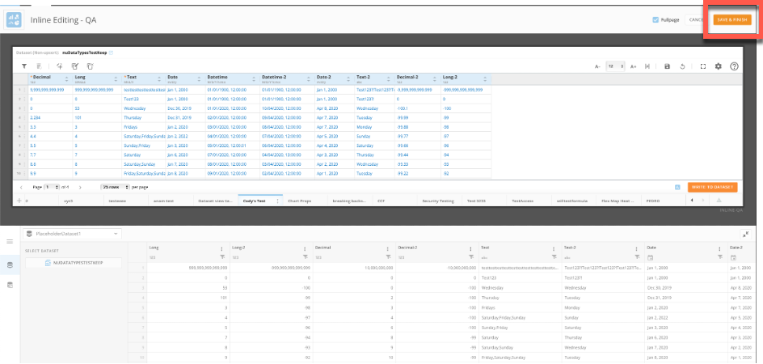
