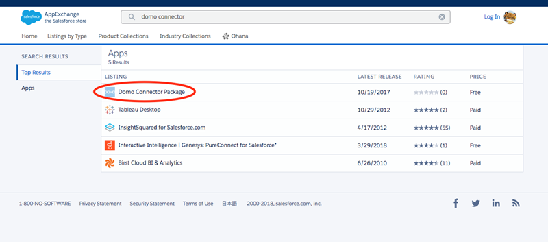
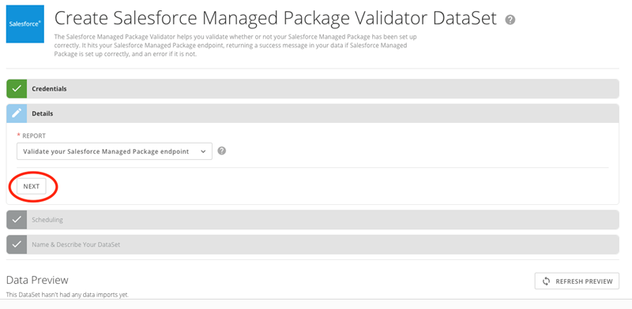
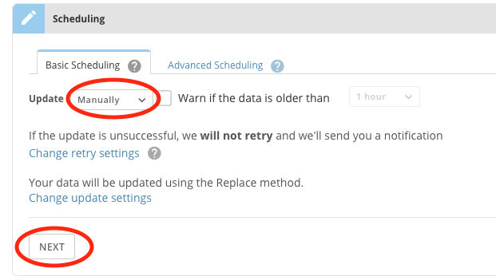

The "Domo Connector Package" found in Salesforce AppExchange allows Salesforce users to import their data into Domo. Follow the instructions in this article to download and install the Connector Package from the AppExchange.

 

**Note:** If the Managed Package is installed successfully, old and new Salesforce DataSets will work with no changes needed.

**To install Domo's Salesforce Managed Package,**

1. Log into Salesforce.
2. Navigate to the Salesforce AppExchange at [https://appexchange.salesforce.com](https://appexchange.salesforce.com "https://appexchange.salesforce.com") and search for "Domo Connector Package," then click on it.   
   
  
   
 Alternatively, you can go directly to [https://appexchange.salesforce.com/a...A00000EcrsyUAB](https://appexchange.salesforce.com/appxListingDetail?listingId=a0N3A00000EcrsyUAB "https://appexchange.salesforce.com/appxListingDetail?listingId=a0N3A00000EcrsyUAB").
3. Click **Get It Now**.  
   

4. Choose whether you want to install in a production environment or sandbox.  
   

5. Check the box reading "I have read and agree to the terms and conditions."
6. Click **Confirm and Install**.    
   

7. Click the **Install for All Users** tile.  
   

For more details, see Salesforce's documentation at [https://help.salesforce.com/articleV...ges.htm&type=5](https://help.salesforce.com/articleView?id=distribution_installing_packages.htm&type=5 "https://help.salesforce.com/articleView?id=distribution_installing_packages.htm&type=5"). 

### Verifying your Installation

Use Domo's Salesforce Managed Package Validator to verify that your Salesforce Managed Package has been installed correctly.

**To verify your installation,**

1. In the Connectors page in either the Data Center or Appstore in Domo, search for "Salesforce Managed Package" and double-click on on the icon.  
   

2. Click **Get the Data**.  
   

3. Under **Credentials**, select your Salesforce account name, then click **Next**.  
   

4. Under **Details**, click **Next**.  
   

5. In the **Update** menu, select **Manually**, then click **Next**.  
   

6. Give your DataSet a name, then click **Save**.  
   

The DataSet now runs. If everything has been set up correctly, the run will be successful, and a message will appear reading, "Validation Success: You have set up your Salesforce Managed Package correctly." 

If everything has *not* been set up correctly, the DataSet fails, and a message appears reading, "You have not installed Salesforce's Domo Connector Package," with a help link to this article. 

