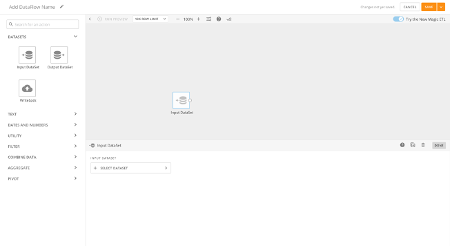
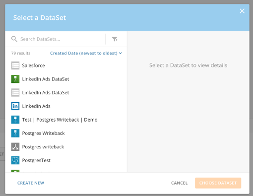
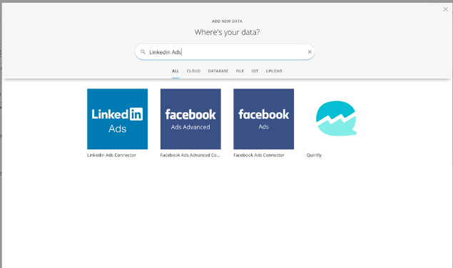
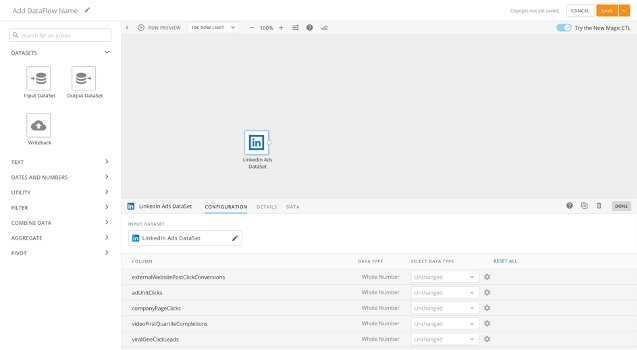
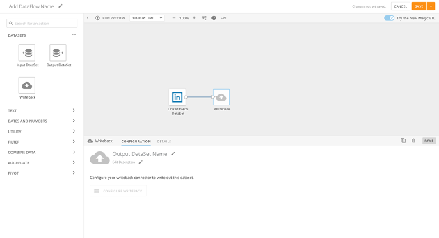
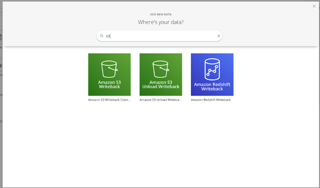
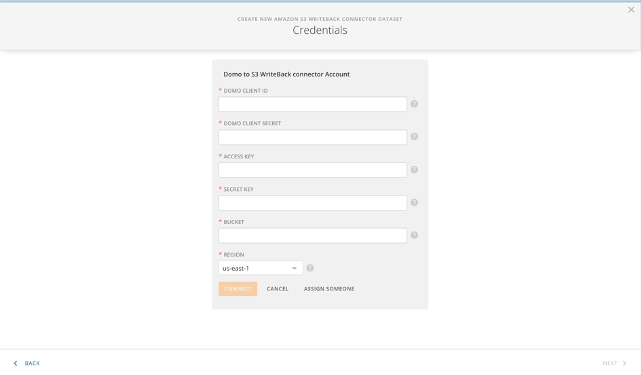
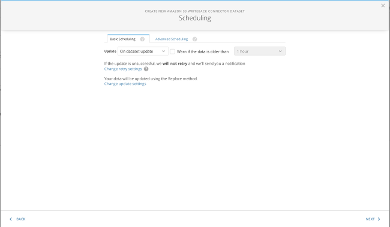
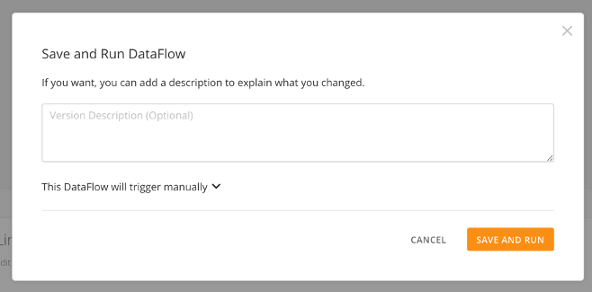

Intro
-----

Integration Studio allows you to build your data pipeline from start to finish, all in Magic ETL. With Integration Studio you can configure a Connector, build your pipeline, and then configure your Writeback Connector all from the Magic ETL canvas.

 

**Note:** Integration Studio is enabled after you purchase a Writeback Connector. For a list of available Writeback Connectors, see [Writeback Connectors](/s/topic/0TO5w000000ZapVGAS "Writeback Connectors").

Using Integration Studio
------------------------

1. Drag the **Input DataSet** tile onto the Magic ETL Canvas.

2. Choose **Select DataSet**and then either choose a pre-existing DataSet or **Create New** to configure a new Connector.

3. Search for the Connector you want in the Search Connectors Box.

4. Configure each step of the Connector Wizard and select **Save** to finish. Your DataSet will build and the columns will appear in the **Configuration** section.

5. Add more tiles to cleanse and manipulate your data if desired.

6. Drag the **Writeback** tile onto the Canvas found in the **DataSets** section of Magic ETL. 

7. Name the output DataSet and add an optional description. Then, select **Configure Writeback**.

8. Select the Writeback Connector you would like to use.

9. Set up the Connector configuration (you will need a Client ID and Secret from [https://developer.domo.com](https://developer.domo.com "https://developer.domo.com").)

10. Choose, **O****n dataset update** to update the Writeback DataSet whenever the DataFlow runs, or set a schedule to run at specified times.

11. Choose **Save and Run** to run your DataFlow and the Writeback Connector.  
  

Your Writeback Connector is now properly configured and you can continue to build your Magic ETL DataFlow.

