New features and enhancements
-----------------------------

Features and enhancements in this release include the following:

DataSet Views
-------------

Improvements and new additions have been added to the DataSet Views feature.

#### Unions in Views

DataSet Views now has the option of doing a Union with your data, not just a Join. This makes it easy to explore, wrangle, and combine your data in a simple interface. For more information, see [DataSet Views](/s/article/360046074774).

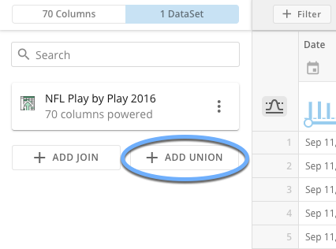

#### Views in Analyzer

DataSet Views have been integrated inside of Analyzer, allowing for light-weight ETL data changes while visualizing the data. You can now do the following, all without leaving Analyzer:

* Join another DataSet.
* Clean up the data by renaming columns, removing columns, and changing the data type.
* Create nested Beast Modes.

For more information, see [Analyzer and DataSet Views Integration](/s/article/4402058407191).

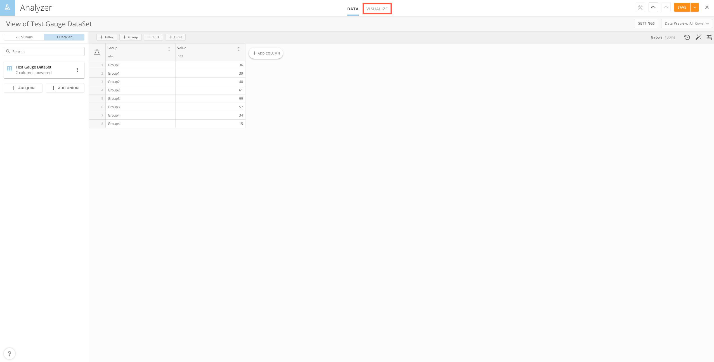

### Advanced Tools Launch Center

With the Advanced Tools Launch Center, you are now able to explore all the data tools Domo has to offer in one convenient place. Each tool has a link to more information and where to get started in the product. For more information, see [Advanced Tools Launch Center](/s/article/4403501587607).

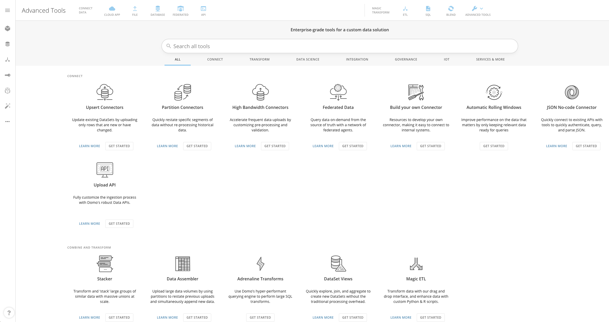

Workbench 5.1 Enhancements
--------------------------

New and exciting features have been added to Workbench 5.1.

#### Workbench Partition Support

Workbench 5.1 now offers partition support. Partitions uniquely identify sections of data, and each section can be replaced with a new version. This is a faster and cleaner way to update the data. For more information, see [Workbench 5.1 Partition Support](/s/article/360062446514).

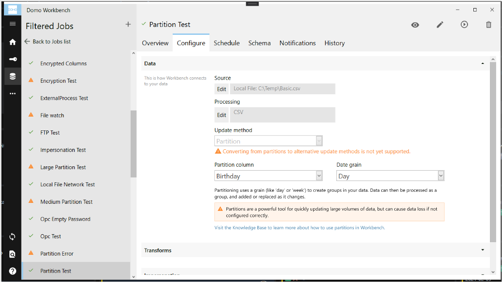

#### Enhanced Schema Protection in Workbench

In Workbench 5.1 we have added enhanced schema protections in that have more flexible options, letting you choose when to allow schema changes and on which columns, or to block all schema changes completely. These new updates give you confidence and peace of mind that schema changes will only happen when you want them to. For more information, see [Workbench 5.1](/s/article/360056669354).

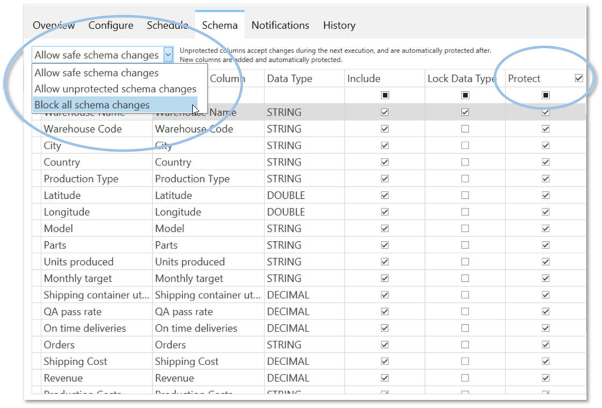

#### Bulk Actions in Workbench

Workbench 5.1 now allows you to perform bulk actions which make it possible to do actions on multiple jobs at the same time. Examples include:

* Executing multiple jobs.
* Bulk exporting jobs.
* Updating credentials on multiple jobs connecting to the same database.
* Saving edits when you have been editing multiple jobs at a time.

For more information, see [Workbench 5.1](/s/article/360056669354).

#### Take over Connector DataSets with Workbench

Workbench 5.1 allows Workbench to take over and begin updating DataSets that were originally created by a Connector. For more information, see [Workbench 5.1](/s/article/360056669354).

#### Local Workbench Scheduling

In Workbench 5.1 you can now schedule your Workbench job to trigger based on the local time of your server/Workbench machine. When the local time on your machine changes for Daylight Savings, the Workbench job schedule will automatically sync with the time on your machine. For more information, see [Workbench 5.1](/s/article/360056669354).

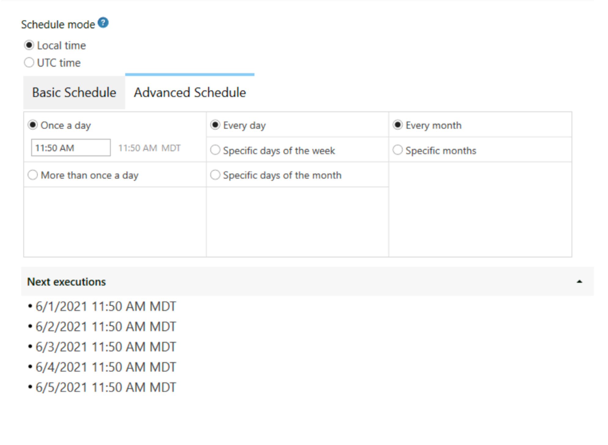

#### Database specific plugins in Workbench

In Workbench 5.1, Workbench will read data types directly from the source system for specific databases. This eliminates any inconsistency between the two, and any chance the data type will change in Workbench after the schema has been set unless the type changes in the source system. For more information, see [Workbench 5.1](/s/article/360056669354).

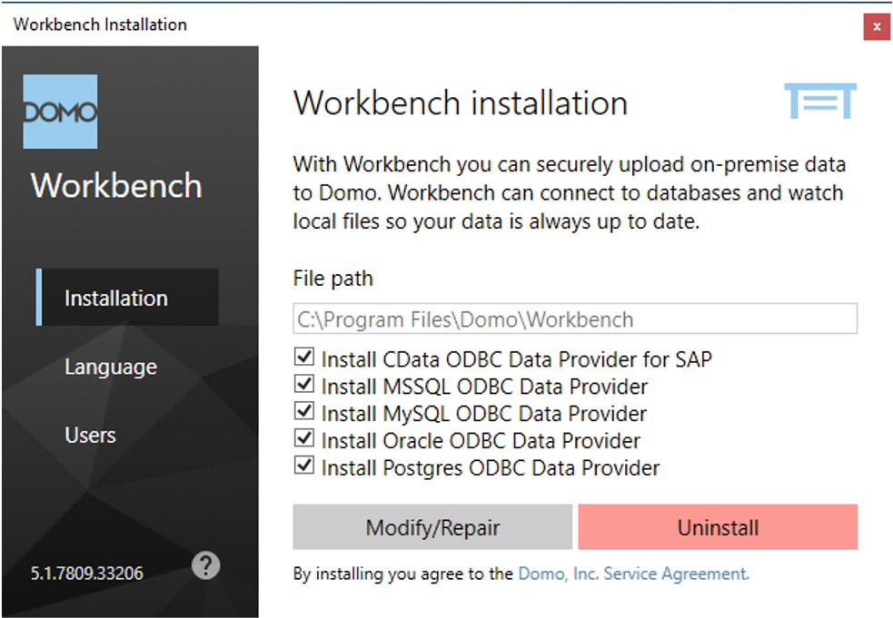

### Python and R SDK enhancements

The R and Python SDK's have been updated to use the same function naming for both languages and to have the same functions available in each. For more information, visit [https://developer.domo.com/docs/domo-sdks/sdks](https://developer.domo.com/docs/domo-sdks/sdks "https://developer.domo.com/docs/domo-sdks/sdks").

### Filter Views

Filter Views allow you to customize a single Dashboard to meet the needs of all audiences.

With Filter Views you can:

* Save personalized Views that only you see.
* Curate and share important Views to create alignment on a specific perspective.
* Provide any number of personalized data stories for any person in any role.
* Designate which saved Filter View is the “default” for a Dashboard.

For more information, see [Applying Page Level-Filters and Filter Views](/s/article/360042923914 "Applying Page-Level Filters (with Filter Views) (BETA)").

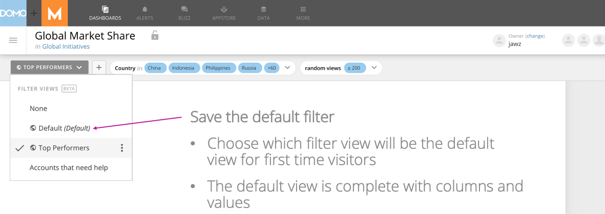

Dashboard Filter enhancements
-----------------------------

New features have been added to help you control how your users view the data.

#### Filter exclusions on Stories

With Filter exclusions, you now have the option to exclude certain Filters from affecting a particular Card. For more information, see [Applying Page-Level Filters with Filter Views](/s/article/360042923914).  
  
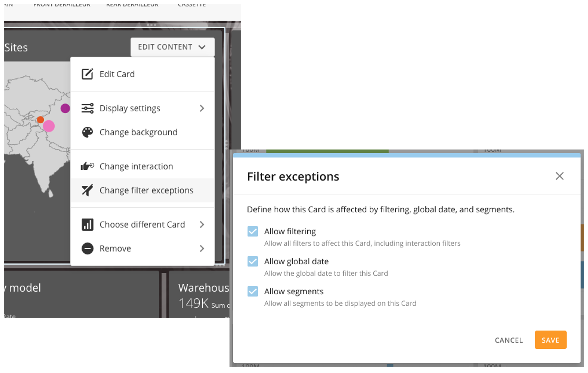

#### Aggregations in Filters

With the addition of Aggregated Filters, you are now able to filter on an aggregated column value. Aggregated Filters are available to be used everywhere Filters are applied: inside the Analyzer, as a Quick Filter, on the Card Details page, and on a Dashboard. For more information, see [Aggregated Filters](/s/article/4403489663127).

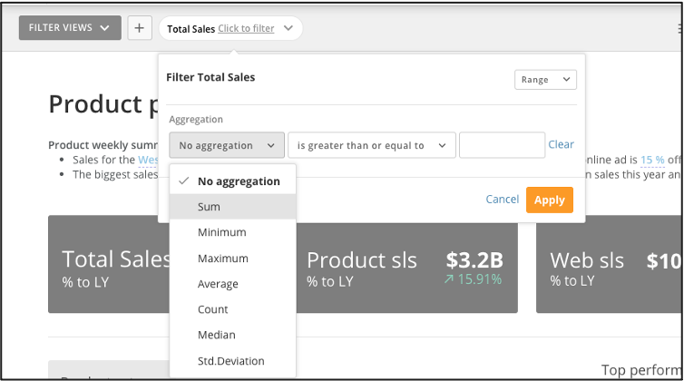

#### Dynamic Date Dashboard Filters

Dynamic Date Range Filters allow you to adjust the date range window for all the Cards on a Page. Dynamic Date Range Filters can be a huge time-saver, since users do not need to manually apply Filters to see data for a given date or time range. Also, with Dynamic Date Range Filters, the date range data for your Cards automatically "rolls over" when the current period ends. For more information, see [Applying Page-Level Filters with Filter Views](/s/article/360042923914).

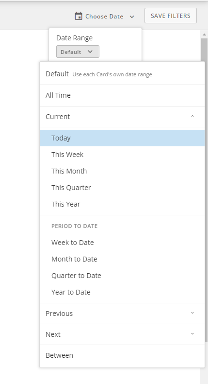

#### Page Filter settings

With Page Filter settings, you can now customize how your users interact with Cards on your Dashboard. You can toggle off **Allow adding of new filters** to have users only use Card interactions to filter. You can also turn off Date Filters if your Dashboard is built to look at a specific time frame. For more information, see [Applying Page Level-Filters and Filter Views](/s/article/360042923914 "Applying Page-Level Filters (with Filter Views) (BETA)").  
  
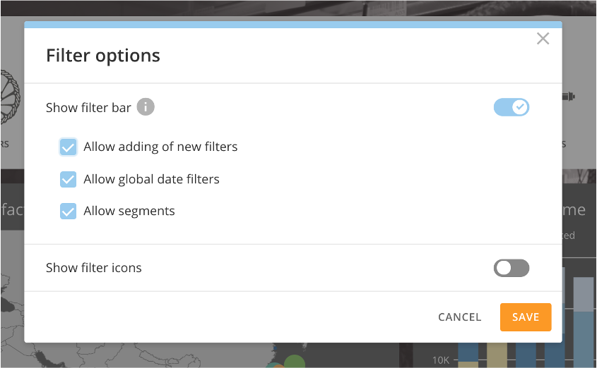

### Segments

The Segments feature allows you to create better comparisons of a Segment versus another group. It also allows you to dynamically filter one item and not have the filter impact the Segment so that you can compare the two results. You can add a Segment to any multi-series chart, period over period chart, or multi-value chart. You can also add Segments to the Card Details view of a Card and to Dashboards. For more information, see [Creating Segments in Analyzer](/s/article/4403089503383).

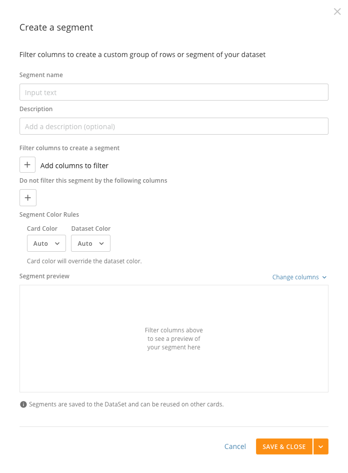

### Portuguese and Dutch language support

Domo has added Portuguese and Dutch language support for your instance. This can be done in both the Company Settings and in the individual User Settings. For more information on setting this feature at the Company level, see [Setting Your Time Zone and Regional Formatting](/s/article/360042934394).

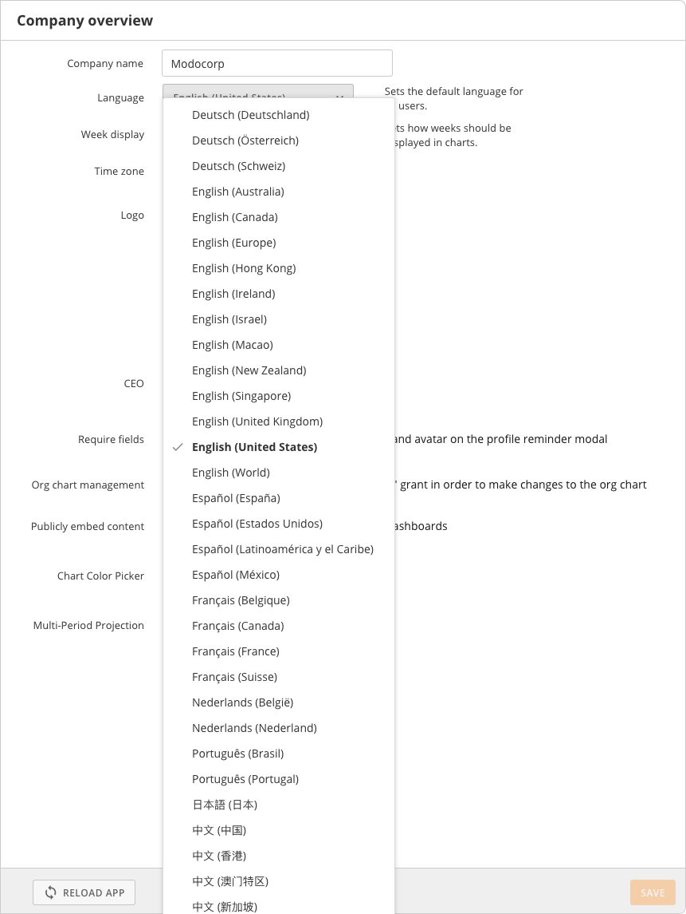

### Mobile pfilter support within the app

Pfilters are now supported inside of the Domo Mobile app. Supported pfilter examples are:

* Custom Apps that have pfilters.
* CONCAT Beast Modes with links.
* Custom Card interactions with links.
* Links that originate from outside of the Domo app will now open the Domo app with the Filters applied.

For more information, see [Sample Beast Mode Calculations: Miscellaneous Transforms](/s/article/360043430113).

New Chart Properties
--------------------

We have added new Chart Properties to make your visualizations even more dynamic.

#### Multi-Dimension Tree Maps

Treemaps now have more dimensions to analyze your business. Instead of just having an item and a value, you can have nested Tree Maps in a Tree Map. For example, now you can see not only products and their associated sales in a Tree Map but visualize product sales by category and by division in a three-level nested Tree Map. For more information, see [Tree Map](/s/article/360042925054).  
  
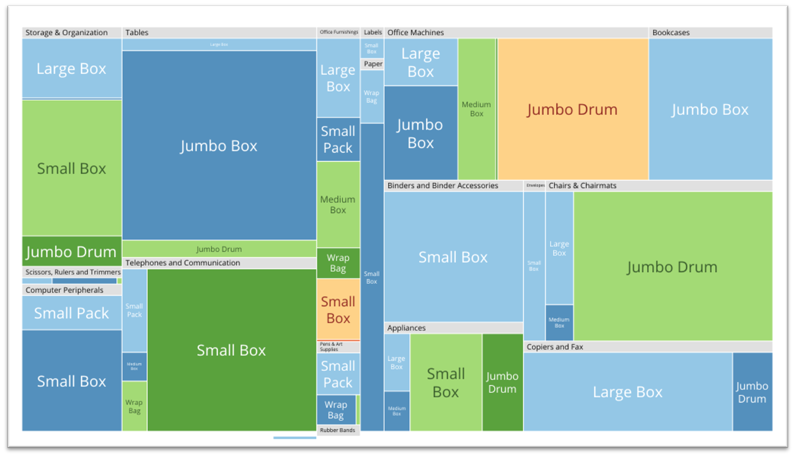

#### Color Rules on Line Charts

You can now create Line charts that apply Color Rules to each point on the line individually. You can set it to change the color when it is above, below, or between certain thresholds. This makes it a breeze to see the data and understand the performance at a glance. For more information, see [Line Chart](/s/article/360043429233).

**Note:** You must have Symbols enabled on your chart for the Color Rules to apply.

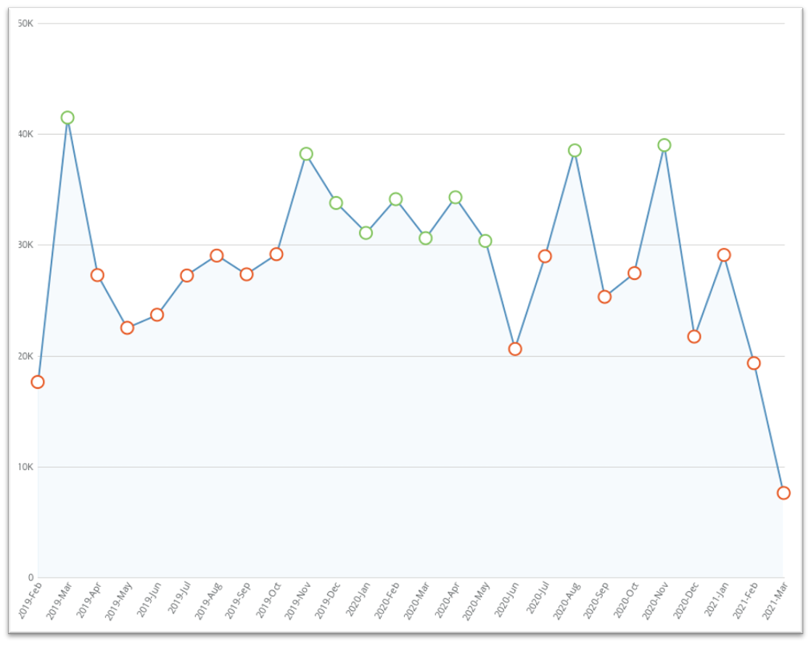

#### Right to Left Bar Charts

In Horizontal Bar charts, you can now position the bars on the right side of the chart. Selecting the right side orientation adjusts the labels, bars, and annotations to be aligned on the right side of the chart. This gives you a powerful combination when you want to layout your custom story with some charts aligned to the right side and can easily be coupled with left side oriented charts for new visual insights. For more information, see [Bar Chart](/s/article/360043428493).  
  

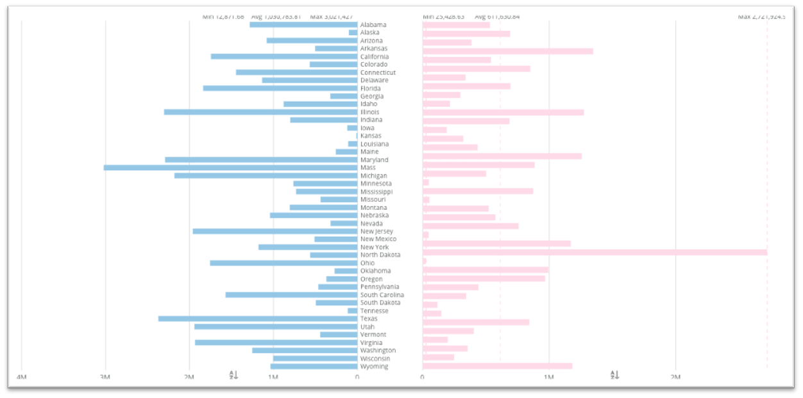

### Asset Library Redesign

The Asset Library page has been enhanced with new navigational features that allow users to find applications and view information more efficiently. For more information, see [Asset Library](/s/article/4403442101143).  
  
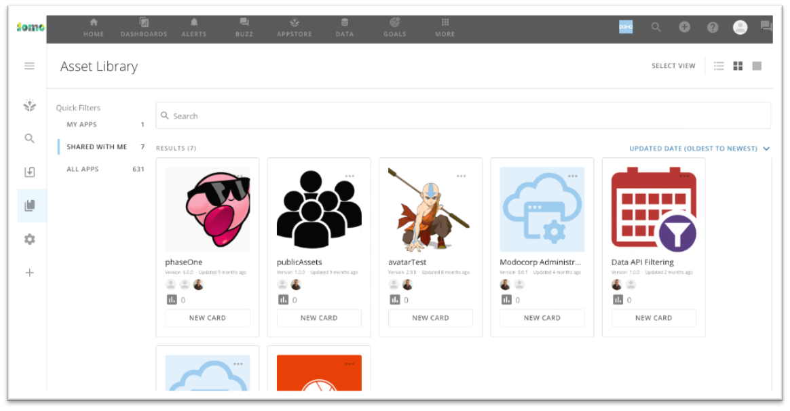

### Group Ownership of Cards and Pages

With group ownership of Cards and Pages, you can now create a group of users you would like to be able to edit a Card/Page and add the group as an owner of the Card/Page. Then, when you lock the Card/Page, only the users in the group will be able to edit it. For more information on Group ownership of Cards, see [Managing Pages](/s/article/360043428253).

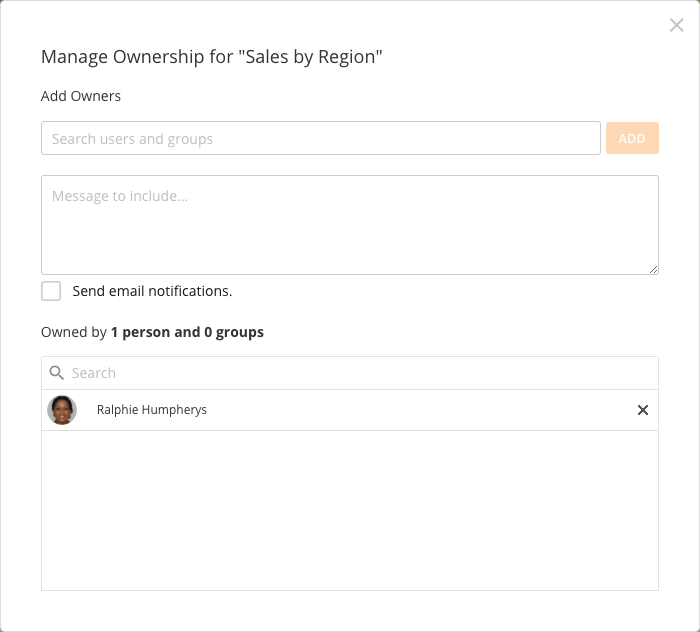

### Group Ownership DomoStats Report

With the new Group Ownership of Pages functionality, we have added the new **Pages with Multiple Owners** report in our DomoStats Connector. This allows you to see the information about the Page, broken out by each owner. For more information, see [DomoStats Connector](/s/article/360043433813).

### Enterprise People Management

With enterprise people management, you can now view all users and their profile information on a single page. You can also bulk update attributes for all users. For more information, see [Admin Settings Layout](/s/article/360042934234).  
  
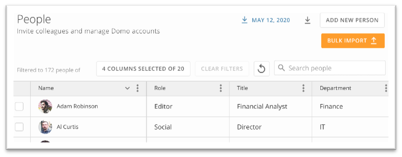

Premium features
----------------

These features are available on demand and paid. To request these features be enabled, reach out to your Domo Customer Success Manager, Technical Consultant, or Account Executive. If you do not have contact information for your CSM, TC, or AE, contact Technical Support. For information on how to contact Support, please see [Getting Help](/s/article/360042922874 "Getting Help"). Depending on the feature, you may be required to complete training before you can use the feature.

### Left Nav in Publication Groups

Publication Groups will now display the same navigation that is currently displayed in the regular instance of Domo. They will now have the collapsible menu that prioritizes Dashboard content and improved UI for quickly navigating between Dashboards. This allows for consistent UI navigation no matter where you use Domo. For more information, see [New Navigation Announcement](/s/article/360043877854).  
  
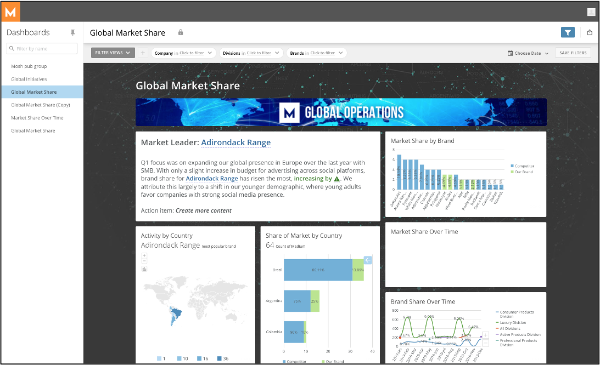

Domo Everywhere
---------------

We have added new features to the Domo Everywhere experience.

#### Page Filters in Dashboard Embed

With Page Filters in Dashboard Embed, you are now able to add the same filters you use in your Domo instance inside of your embedded Dashboard. For more information, see [Page Filters in Dashboard Embed](/s/article/4403508913943).

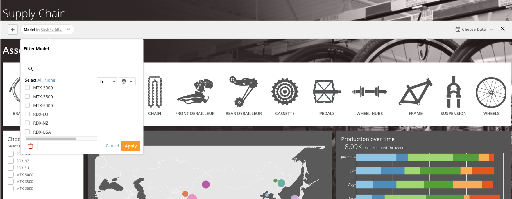

#### Domo Everywhere Launch Center

With the Domo Everywhere Launch Center, you can quickly learn how leading customers are using each version of Domo Everywhere. This allows you to choose the right Domo Everywhere product for your needs. For more information, see [Domo Everywhere Launch Center](/s/article/4403486465687).

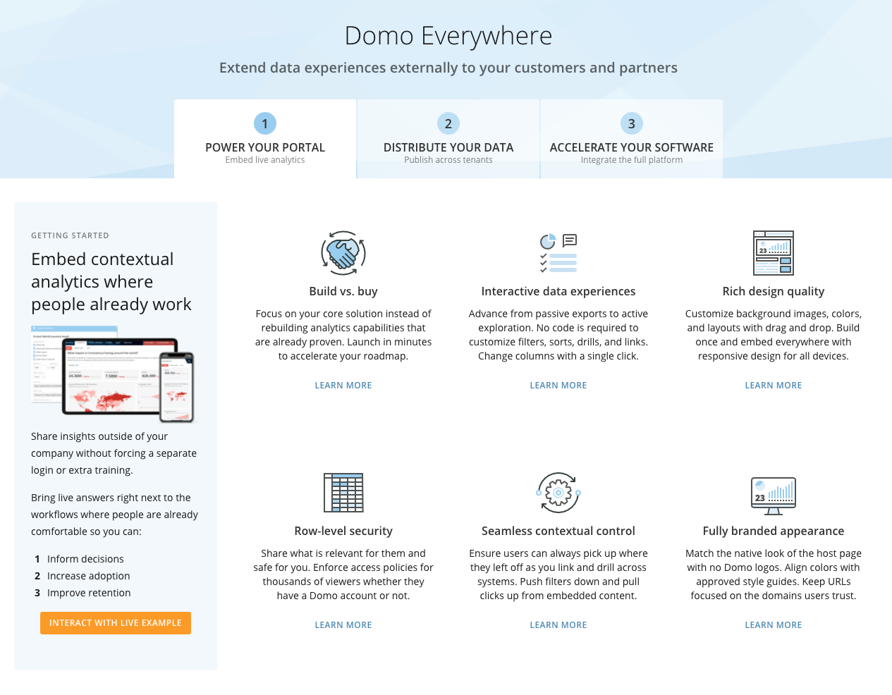

Getting help
------------

You can view the latest release notes information in the Help Center, which you can access from Domo by clicking  in the top navigation bar.

If you have questions about Domo,

* search for a topic in the Help Center
* train in Domo University at [http://domo.com/university/](http://www.domo.com/university/ "http://www.domo.com/university/")
* search for training apps in the Appstore
* get answers in the Domo Community at [https://dojo.domo.com](https://dojo.domo.com/ "https://dojo.domo.com")
* contact Technical Support by entering a help ticket in the Domo Support Portal
* reach out to your Domo Customer Success Manager or Technical Consultant

If you have feedback, please send it from within Domo (**More** ****> Feedback****). Or send an email to [product.feedback@domo.com](mailto:product.feedback@domo.com "product.feedback@domo.com").

For more information about getting help, see [Getting Help](/s/article/360042922874 "Getting Help").

