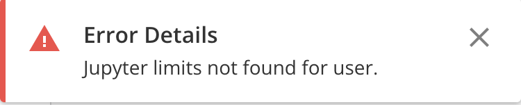
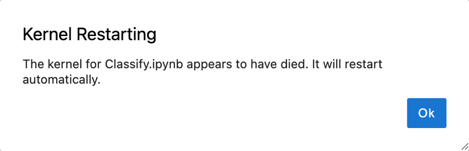
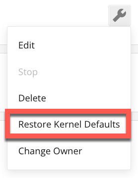
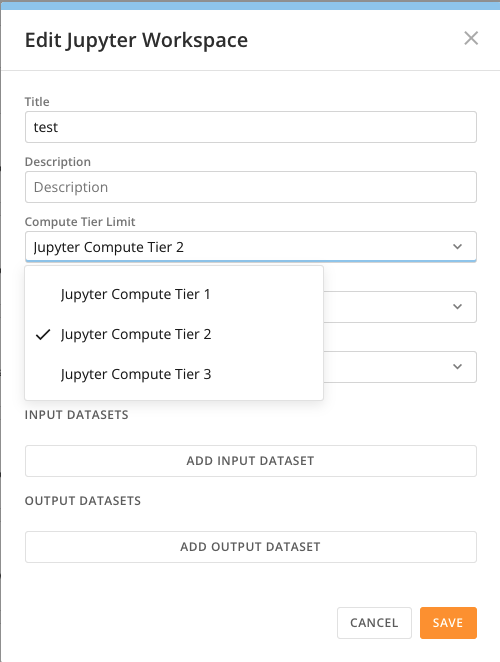
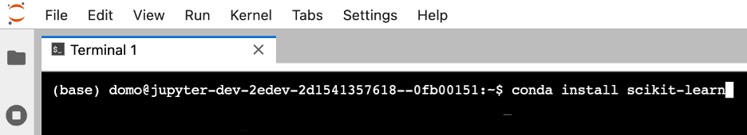
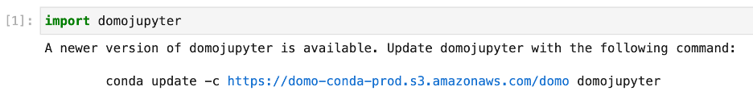
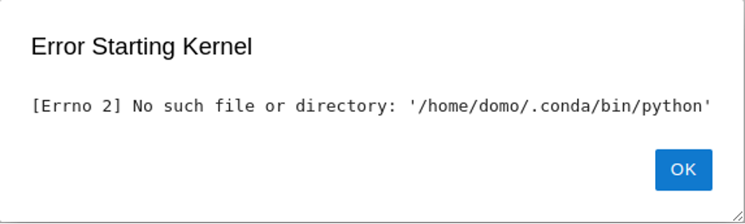
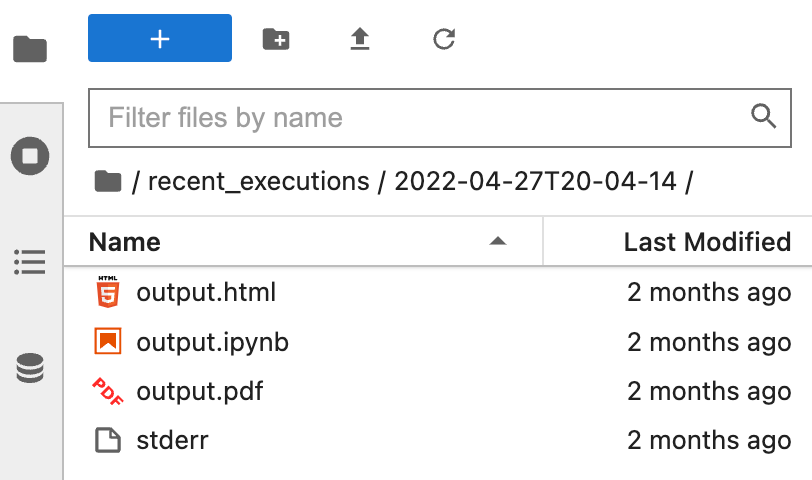

---
    title: Jupyter Troubleshooting Guide
    url: https://domo-support.domo.com/s/article/7440921035671
    linked_kbs:  ['[https://domo-support.domo.com/s/knowledge-base/](https://domo-support.domo.com/s/knowledge-base/)', '[https://domo-support.domo.com/s/](https://domo-support.domo.com/s/)', '[https://domo-support.domo.com/s/topic/0TO5w000000ZammGAC](https://domo-support.domo.com/s/topic/0TO5w000000ZammGAC)', '[https://domo-support.domo.com/s/topic/0TO5w000000ZanzGAC](https://domo-support.domo.com/s/topic/0TO5w000000ZanzGAC)', '[https://domo-support.domo.com/s/article/360047400753](https://domo-support.domo.com/s/article/360047400753)', '[https://domo-support.domo.com/s/article/7440921035671](https://domo-support.domo.com/s/article/7440921035671)', '[https://domo-support.domo.com/s/topic/0TO5w000000ZanzGAC/other-connection-methods](https://domo-support.domo.com/s/topic/0TO5w000000ZanzGAC/other-connection-methods)', '[https://domo-support.domo.com/s/article/360043429933](https://domo-support.domo.com/s/article/360043429933)', '[https://domo-support.domo.com/s/article/360043429953](https://domo-support.domo.com/s/article/360043429953)', '[https://domo-support.domo.com/s/article/360042925494](https://domo-support.domo.com/s/article/360042925494)', '[https://domo-support.domo.com/s/article/360043429913](https://domo-support.domo.com/s/article/360043429913)', '[https://domo-support.domo.com/s/article/4408174643607](https://domo-support.domo.com/s/article/4408174643607)', '[https://domo-support.domo.com/s/login/](https://domo-support.domo.com/s/login/)']
    article_id: 000003146
    views: 1,200
    created_date: 2022-10-24 21:09:00
    last updated: 2022-10-24 22:42:00
    ---


Intro
-----


The following troubleshooting steps may help solve common issues in Jupyter Workspaces. If your issue is not listed here, or the steps do not resolve your issue, contact your Account Executive (AE) or Customer Success Manager (CSM).


For general information about Jupyter, see [Jupyter Workspaces](/s/article/360047400753).


 


Jupyter Workspaces Will Not Start
---------------------------------


 


**Description**


Domo reports an error after attempting to start, or the status returns to "Stopped" instead of "Started". 


 





 


**Common Cause**


The user does not have a usage policy configured by an Admin.


 


**Troubleshooting Steps**


1. In the navigation header, select **Admin** > **Feature Settings** > **Jupyter.** Make sure that:


a. The **Jupyter Account Activated** toggle is enabled


b. The user has a usage policy with an appropriate instance size limit if **Active Account Plan** is set to **Manual**. 


 


 


Kernel Restarting
-----------------


 


**Description**


An error message displays within a Jupyter Workspace with the heading **Kernel Restarting**.





**Common Cause**


The Jupyter kernel has run out of memory.


 


**Troubleshooting Steps**


You may need to increase the size of the workspace. 


1. From the **Jupyter Workspaces** list, select **Menu** next to the workspace. Choose **Edit.**





2. Choose an option with a higher **Compute Tier Limit**. 


3. Select **Save**. 





 


 


Slow Execution
--------------


 


**Description**


A notebook cell execution takes longer than expected or seems to hang for a long time. 


 


**Common Cause**


While working with large amounts of data can take time, a slowed execution may occur if your workspace does not have enough resources for the job.


 


**Troubleshooting Steps**


If a notebook cell execution is slow, you may need to increase the size of the workspace. 


1. From the **Jupyter Workspaces** list, select  **Menu** next to the workspace. Choose **Edit.**


 


2. Choose an option with a higher **Compute Tier Limit**. 


3. Select **Save**. 


 


 


 


Error Installing Third Party Libraries
--------------------------------------


 


**Description**


Installing a third-party library for Python or R fails.


 


**Common Cause**


The library or its dependencies is not compatible with the current conda environment.


 


**Troubleshooting Steps**


1. Install using the appropriate conda pip command from a workspace terminal. Include the conda channel if necessary. 





2. If conda install fails, try pip/cran.


 


pip command:


```
pip install -U scikit-learn 
```

R/cran command: 


```
install.packages("cluster")
```

3. Select and choose **Restore Kernel Defaults**.


4. Uninstall/remove any libraries installed locally using pip or cran. 


 


 


Cannot Update domojupyter Python or R sdk
-----------------------------------------


 


**Description**


Updating domojupyter to the latest version fails, or the notebook continues to display a message that a new version of domojupyter is available.





 


**Common Cause**


The new version of domojupyter or its dependencies is not compatible with the current conda environment.


 


**Troubleshooting Steps**


1. Execute the suggested conda command from a Jupyter Workspace terminal. 


2. Select  and choose **Restore Kernel Defaults**.


 


 


Error Starting Kernel
---------------------


 


**Description**


An error message displays within a Jupyter Workspace with the heading “Error Starting Kernel".





 


**Common Cause**


An error occurred while bootstrapping the conda environment.


 


**Troubleshooting Steps**


1. Select and choose **Restore Kernel Defaults**.


 


 


Scheduled Execution Failures
----------------------------


 


**Description**


A Jupyter DataFlow created from a Jupyter Workspace notebook fails to execute successfully.


 


**Common Cause(s)**


* Python/R language syntax or logic errors
* Notebook cells executed in order result in an error
* The notebook file has been deleted
* Error accessing third-party system


 


**Troubleshooting Steps**


1. Attempt to execute the notebook's cells in order from within the Jupyter Workspace environment. 


2. Review execution details in the recent\_executions directory in your workspace. 


The following files are available: 


* output.jpynb
* output.html
* output.pdf
* stdout
* stderr





 


 


 


 

