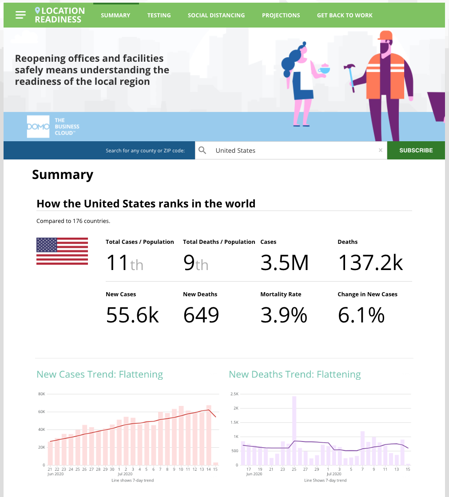
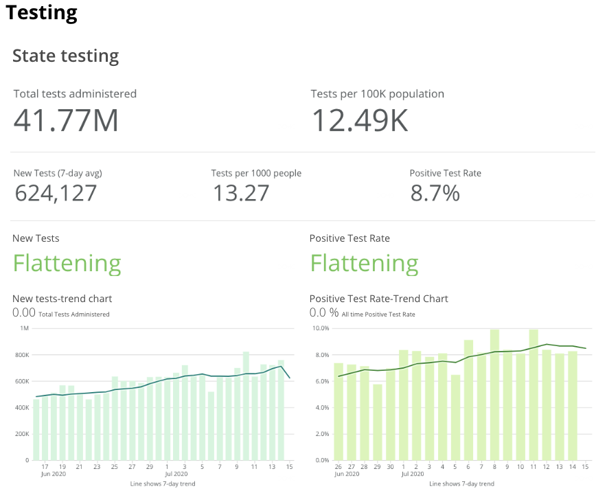
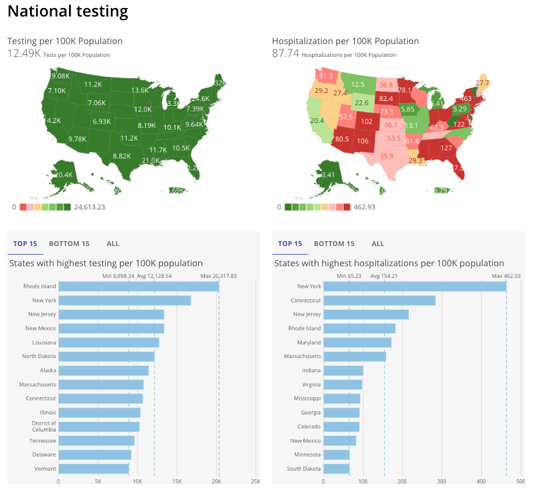
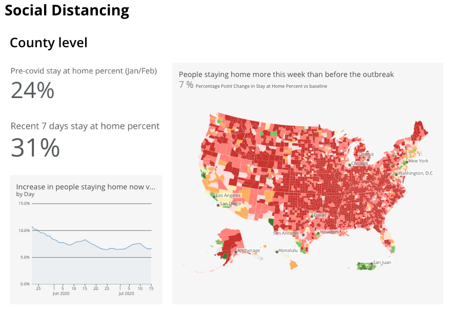
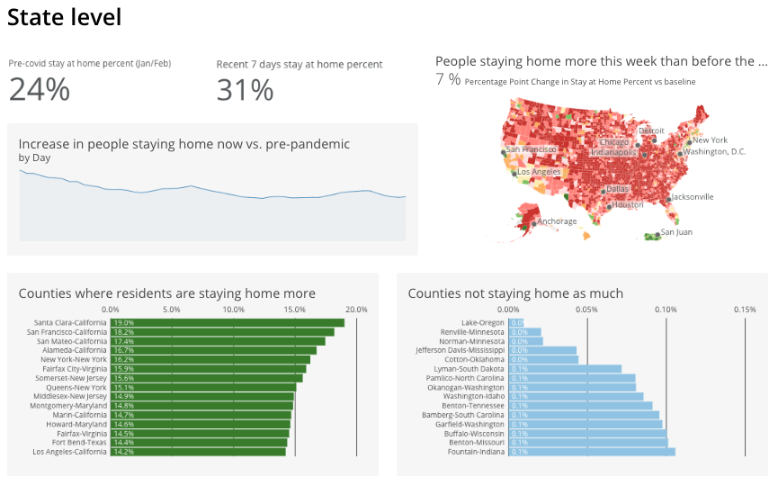
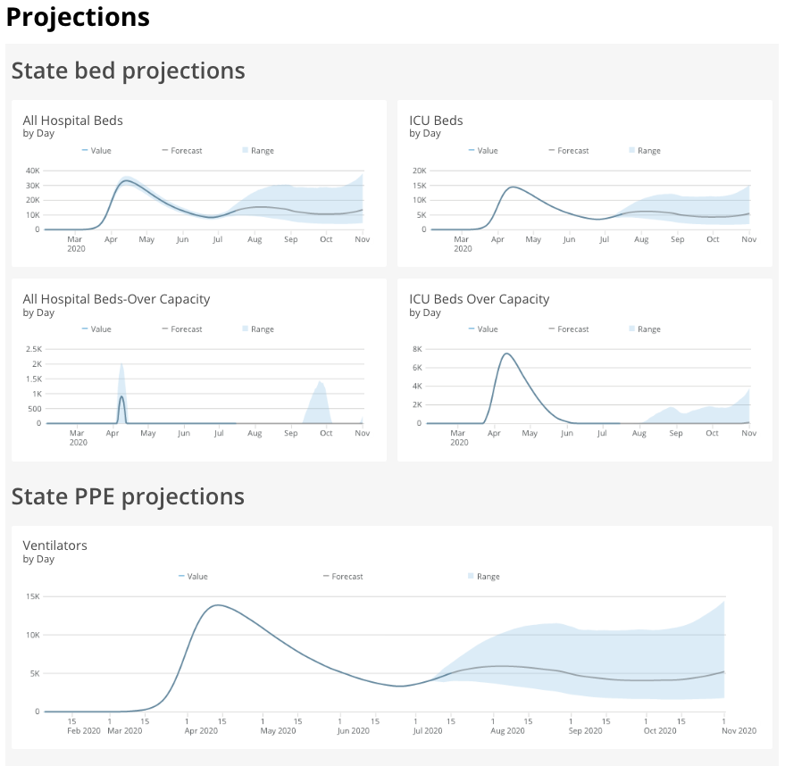
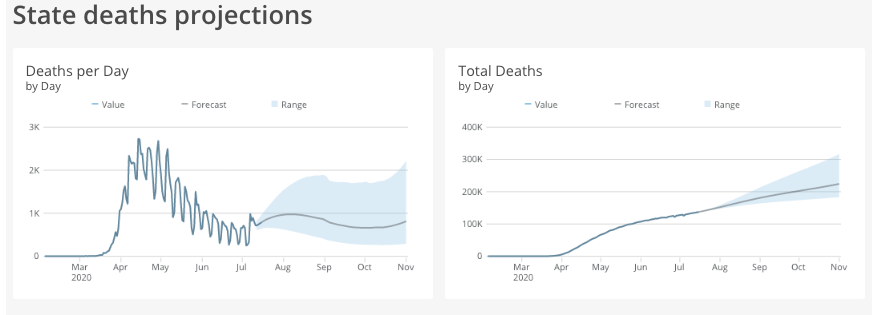
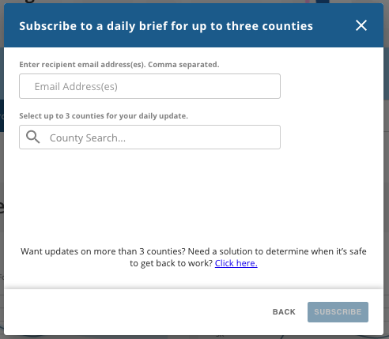

Intro
-----

Use the Location Readiness App to view COVID-19 related data for a County or State. By default, the application shows data related to the United States. By searching for a County or State, all of the sections (Summary, Testing, Social Distancing, and Projections) will return data for the specific County or State you’ve selected.

 

**Note:**When data is not available for a County, the Location Readiness App will return data for the County’s State.

* Get a precise view of how COVID-19 is impacting the Counties where your offices are located.
* Make decisions about locations to open up based on new cases, testing, and social distancing metrics.
* Stay informed on any changes with daily email updates on stats for up to three Counties.

 

**Note:** This app is part of the [Get Back to Work Solution](/s/article/360056653654 "Get Back to Work Solution") and is available *on-demand and paid*. 

 

To request this feature be enabled,

* Reach out to your Domo Customer Success Manager or Account Executive.
* If you do not have contact information for your CSM or AE, contact Domo Support. For information on how to contact Support, please see: [Getting Help](/s/article/360042922874 "Getting Help")

Summary
-------

The **Summary** section shows how your specific location ranks within the State, Country, or World. It also shows the trends of new cases and new deaths.

  

 

Testing
-------

The **Testing** section shows State and National testing data and trends.

  

  
  
 

Social distancing
-----------------

The **Social Distancing** section shows County and State level social distancing data and trends.

  

 

 

Projections
-----------

The **Projections** section shows State level projections data and trends for Beds, PPE's, and Deaths.

  
  

 

 

Daily brief
-----------

To sign up for a Daily Brief, use the **Subscribe** button on any of the Location Readiness sections. Enter email addresses and select up to three Counties. Once subscribed, the email addresses that you entered will receive a daily report with data related to COVID-19 in the Counties selected.

  

