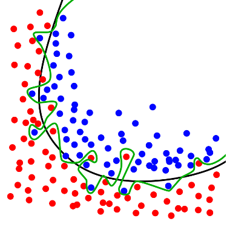

---
    title: Machine Learning Concepts to Help You be More Successful
    url: https://domo-support.domo.com/s/article/360060598413
    linked_kbs:  ['[https://domo-support.domo.com/s/knowledge-base/](https://domo-support.domo.com/s/knowledge-base/)', '[https://domo-support.domo.com/s/](https://domo-support.domo.com/s/)', '[https://domo-support.domo.com/s/topic/0TO5w000000Zan2GAC](https://domo-support.domo.com/s/topic/0TO5w000000Zan2GAC)', '[https://domo-support.domo.com/s/topic/0TO5w000000Zan8GAC](https://domo-support.domo.com/s/topic/0TO5w000000Zan8GAC)', '[https://domo-support.domo.com/s/article/360060598413](https://domo-support.domo.com/s/article/360060598413)', '[https://domo-support.domo.com/s/topic/0TO5w000000Zan8GAC/automl-machine-learning](https://domo-support.domo.com/s/topic/0TO5w000000Zan8GAC/automl-machine-learning)', '[https://domo-support.domo.com/s/article/360043429933](https://domo-support.domo.com/s/article/360043429933)', '[https://domo-support.domo.com/s/article/360043429953](https://domo-support.domo.com/s/article/360043429953)', '[https://domo-support.domo.com/s/article/360042925494](https://domo-support.domo.com/s/article/360042925494)', '[https://domo-support.domo.com/s/article/360043429913](https://domo-support.domo.com/s/article/360043429913)', '[https://domo-support.domo.com/s/article/4408174643607](https://domo-support.domo.com/s/article/4408174643607)', '[https://domo-support.domo.com/s/login/](https://domo-support.domo.com/s/login/)']
    article_id: 000004881
    views: 2.183
    created_date: 2022-10-24 22:34:00
    last updated: 2022-10-24 22:41:00
    ---

Machine Learning task types
---------------------------

In this section, we will learn an overview of machine learning techniques and how they perform well based upon our problems, including simple descriptions, and examples for each one.

### Regression

The regression task is a supervised learning task. Which can help us to predict continuous values and explains objects based on a given set of numerical and categorical data. For example, we can predict house prices based on house attributes such as several rooms, size, and location.

In mathematical terms, the regression method provides us a linear line that belongs to the equation of Y = aX+b to model a dataset. Here we are taking the X (Dependent variable) and Y (Independent variable) data points to train our linear regression model. The best observation line can be found by calculating the slope (m) and y-intercept (b) values.

Here, the regression analysis performs with various effective algorithms:

* Simple linear regression
* Multiple linear regression
* Polynomial linear regression
* Decision tree
* Radom forest
* Support Vector machine (SVM)

**Applications**

* Risk assessment
* Score prediction
* Market forecasting
* Weather forecasting
* Housing and product price prediction
* Digital personal Assistance (Siri and YouTube)

### Classification

Classification is a supervised learning task used when we need a limited set of outcomes. It generally provides predicted output values, which may be  True or False.  It performs in the way of two types such as Binomial and Multi-Class. For example, we can find whether a received email is Spam or Not.  

Here, we have data points belonging to three different fruits like blueberry, lime, and apple. We can classify them by using machine learning classification techniques. The three fruits are represented by three various related colors such as blue, orange, and yellow respectively. Then, we draw a linear line between them for clear separation and see how they are presented.  
   
**Classification supported Algorithms**

* Logistic regression
* KNN (k-nearest Neighbor)
* Naive-Base
* Discriminant Analysis
* SVM (support vector machine)
* Decision tree
* Neural network

**Applications**

* Image classification
* Email spam detection
* Fraudulent detection

Major Elements of Model Overview
--------------------------------

The model overview allows us to asses different model settings using key evaluation metrics. In what follows, we discuss and define each of these concepts.  
Evaluation Metrics

An evaluation metric is a statistic of our model that helps us determine how well it is performing. For example, accuracy is a common and intuitive evaluation metric. Many other evaluation metrics exist, each with its own strength and weakness. The choice of evaluation metric also depends on our task. If we are doing classification, we will choose a different metric than if we are doing regression. For a comprehensive list of evaluation metrics available for AutoML see ([https://docs.aws.amazon.com/sagemaker/latest/APIReference/API\_AutoMLJobObjective.html](https://docs.aws.amazon.com/sagemaker/latest/APIReference/API_AutoMLJobObjective.html "https://docs.aws.amazon.com/sagemaker/latest/APIReference/API_AutoMLJobObjective.html")).

For classification, the default evaluation metric is the Area Under the Curve (AUC) of the Receiver Operating Characteristic. The basic idea behind the AUC score is that we can measure the trade-off between the true positive rate (TPR) and False Positive Rate (FPR) at all possible classification thresholds. The ideal AUC is 1.0. Additionally, a model that predictably completely at random yields an AUC of 0.5. AUC is best used as a criteria of relative comparison. For example if model x yields a higher AUC than model y we can conclude that model x is more suited for deployment. Other metrics 

In the case of regression, the default evaluation metric is Mean Squared Error (MSE). The MSE measures average, squared difference between of values predicted from our model and the ground truth. A perfect model will yield an MSE of 0.0. Thus our goal should be to choose a model that minimizes MSE. For example if model x yields a lower MSE than model y we can conclude that model x is more suited for deployment. Because MSE squares the difference between the predicted and ground truth values, large outliers may cause large increases in the MSE. Therefore, we should take care to ensure that our input data has been carefully preprocessed.

Train/Validation Split
----------------------

When performing machine learning tasks, we typically split our dataset into two partitions: one for training and one for validating. The basic idea behind this split is to hold out some samples from the model to ensure a fair evaluation. It is common practice for a teacher to ask a students different questions during a class than on an exam to evaluate their general understanding of topics. For the same reason, we want to make sure that the data samples used to train and evaluate our models are different.

We call this practice the train/validation split. Our training data refers to the data samples used to “teach” our model, while the validation set refers to the samples we use to evaluate. Splitting our data in this ways allows us avoid issues of overfitting.

Overfitting
-----------

Overfitting refers to “the production of an analysis that corresponds too closely or exactly to a particular set of data, and may therefore fail to fit additional data or predict future observations reliably [[https://en.wikipedia.org/wiki/Overfitting]](https://en.wikipedia.org/wiki/Overfitting "https://en.wikipedia.org/wiki/Overfitting]").“ In other words, a model that is overfit is very unlikely to generalize to unseen data. 

For example, see the figure below. If we are trying to classify points as belonging to the red or the blue class, we could draw a perfect line (green) around each points. However, if we observe a new set of data the new decision boundary is unlikely to be exactly the same as the green line. Conversely, the black line is much smoother is therefore more likely to generalize.

The green line represents an overfitted model and the black line represents a regularized model. While the green line best follows the training data, it is too dependent on that data and it is likely to have a higher error rate on new unseen data, compared to the black line. [https://en.wikipedia.org/wiki/Overfitting](https://en.wikipedia.org/wiki/Overfitting "https://en.wikipedia.org/wiki/Overfitting")

We can diagnose overfitting by comparing using our training and validation datasets. When we have very low training error (i.e., AUC or MSE) but high validation error we are overfitting: our model is effectively memorizing the training data. In the ideal case, the training error and validation error are roughly equal. This implies that our model is properly calibrated and will generalize well. 

Model types
-----------

Domo AutoML currently supports two primary model types: LinearLearner and XGBoost.

**LinearLearner:** A linear model of the target variable. For example, if we want to predict sales, we decompose sales, yi, as a function of the input columns, xi, such that yi = w1x1 + w2x2 + … + wkxk. Here, wi refers to the impact of xi on yi and is learned from the data. This model can be used for either regression or classification. In the case of classification, a logistic “link” function is wrapped around the right hand side to transform the predictions into probabilities (i.e., y is between 0 and 1). 

**XGBoost:** XGBoost is a flexible, tree-based model that can be used for either regression or classification. It is an implementation of Gradient Boosted Regression/Classification Trees. The key idea is that we can derive multiple decision trees mapping xi to yi. We can then average over this “ensemble” of trees to make our final decision. The key difference between the LinearLearner and XGBoost is that the latter can learn non-linear relationships between xi and yi. For more details see ([https://xgboost.readthedocs.io/en/latest/tutorials/model.html](https://xgboost.readthedocs.io/en/latest/tutorials/model.html "https://xgboost.readthedocs.io/en/latest/tutorials/model.html")).

Hyperparameters
---------------

One important use case of the Model Overview page is to view the results of different model setting, or hyperparameters. Nearly every machine learning model has one or more hyperparameters.  A hyperparameter refers to a setting, or value, of a model that needs to be set by the user, and is not learned from data. The key value of Domo’s AutoML feature is that we automatically allow you to try hundreds of candidate hyperparameter values and choose the one with the best performance.

The best candidate is surface on the page in the “Best Candidate” pane, detailing the hyper parameter value, the resulting evaluation metric (e.g., AUC or MSE) and the model type.

Each model type has different hyperparameters.

**XGBOOST** (for more details see [https://xgboost.readthedocs.io/en/latest/parameter.html](https://xgboost.readthedocs.io/en/latest/parameter.html "https://xgboost.readthedocs.io/en/latest/parameter.html"))

* **Alpha**: L1 regularization term on weights. This parameter constrains the model to be more conservative. It will also force the effect of unimportant features to be zero.
* **Column Sample by Tree**: The fraction of columns to be subsampled for each tree. 1.0 denotes that all of the columns are used in each tree.
* **Eta**: Step size shrinkage used in update to prevents overfitting.
* **Gamma**: Minimum loss reduction required to make a further partition on a leaf node of the tree.
* **Lambda**: L2 regularization term on weights. This term constrains the model to be more conservative. Ideally, this can help the model generalize better to unseen data.
* **Subsample**: Subsample ratio of the training instances. Setting it to 0.5 means that XGBoost would randomly sample half of the training data prior to growing trees.

**LinearLearner**

* **L1 Regularization**: The strength of the L1 regularization. This parameter constrains the model to be more conservative. It will also force the effect of unimportant features to be zero.
* **Learning Rate**: Step size of the optimization algorithm. This value controls how big the each step is as we search for the best model parameters. A learning rate that is too small will cause the training to be very slow. A learning rate that is too large could cause the optimizer to miss best set of parameters.
* **Loss Function**: The function use to train the model. Either Logistic or MSE.
* **Mini Batch Size**: The the number of data samples collected for each batch. Larger batch sizes generally result in a better estimate of the gradient and can improve performance.
* **Weight Decay**: Also called L2 regularization. This term constrains the model to be more conservative. Ideally, this can help the model generalize better to unseen data.
