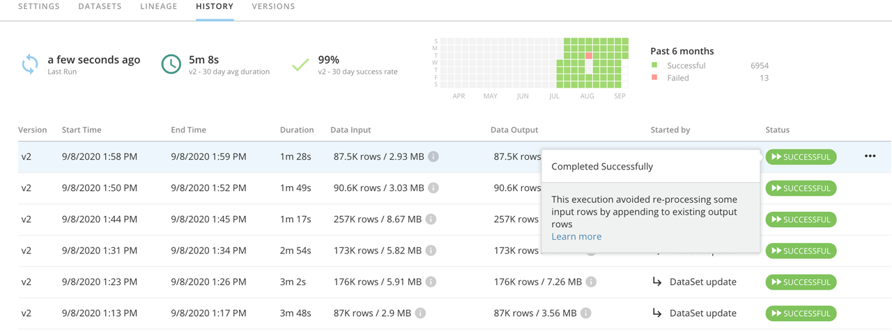

---
    title: Magic ETL DataFlow Auto Append Processing
    url: https://domo-support.domo.com/s/article/360051062653
    linked_kbs:  ['[https://domo-support.domo.com/s/knowledge-base/](https://domo-support.domo.com/s/knowledge-base/)', '[https://domo-support.domo.com/s/](https://domo-support.domo.com/s/)', '[https://domo-support.domo.com/s/topic/0TO5w000000ZamzGAC](https://domo-support.domo.com/s/topic/0TO5w000000ZamzGAC)', '[https://domo-support.domo.com/s/topic/0TO5w000000ZanvGAC](https://domo-support.domo.com/s/topic/0TO5w000000ZanvGAC)', '[https://domo-support.domo.com/s/article/360051062653](https://domo-support.domo.com/s/article/360051062653)', '[https://domo-support.domo.com/s/topic/0TO5w000000ZanvGAC/magic-etl](https://domo-support.domo.com/s/topic/0TO5w000000ZanvGAC/magic-etl)', '[https://domo-support.domo.com/s/article/360043429933](https://domo-support.domo.com/s/article/360043429933)', '[https://domo-support.domo.com/s/article/360043429953](https://domo-support.domo.com/s/article/360043429953)', '[https://domo-support.domo.com/s/article/360042925494](https://domo-support.domo.com/s/article/360042925494)', '[https://domo-support.domo.com/s/article/360043429913](https://domo-support.domo.com/s/article/360043429913)', '[https://domo-support.domo.com/s/article/4408174643607](https://domo-support.domo.com/s/article/4408174643607)', '[https://domo-support.domo.com/s/login/](https://domo-support.domo.com/s/login/)']
    article_id: 000004582
    views: 2,366
    created_date: 2022-10-24 22:15:00
    last updated: 2022-10-24 22:40:00
    ---

Intro
-----

DataFlow Auto Append Processing is a new performance improvement introduced for Magic ETL. At the start of each execution, the system reviews the state of the DataFlow’s inputs and outputs, and for any changes to the DataFlows’ actions. Where possible, only new rows added to inputs since the last DataFlow execution will be processed by the new execution and appended to the output DataSet(s). As explained below, the system automatically identifies situations where all rows must be reprocessed to ensure data integrity. In ideal cases, these optimizations will reduce execution times by orders of magnitude. This article describes how to take full advantage of this feature in your data pipeline.

 

**Important:** There are significant behavioral differences in Magic ETL. Read the [Behavior Changes and Feature Updates in Magic ETL](file:///hc/en-us/articles/360047787514) article before converting mission-critical Magic ETL DataFlows. **Failure to do so may risk an unintended change to your DataFlow’s behavior.**

How to tell if an execution was optimized
-----------------------------------------

In the **History** tab of each DataFlow, you will see a message when you hover over the **Successful** badge indicating that an execution was optimized. The run time and row counts may also indicate a DataFlow has been optimized.  For example, if your 10,000 row input DataSet had 100 rows appended to it, an optimized execution might show only 100 rows processed, while an execution where the optimization could not be applied would have shown 10,100 rows processed.

How it works
------------

DataFlow executions are only optimized in this way if the system determines that appending new rows to the existing output DataSet(s) will result in the exact same data as an unoptimized execution. The following behaviors prevent a DataFlow from being optimized. Through understanding the circumstances that cannot be optimized, we hope to help you take advantage of DataFlow optimizations and thus streamline your data pipeline.

### Current Date Functions

Any formula or tile configuration which depends on the current date and time will disable this optimization for all the transforms to which it is connected. Since the current date and time would be different with every execution, it is never possible to ensure that appending to existing output DataSets will be the same as re-executing from scratch. Functions like NOW(), TODAY(), CURDATE(), and the use of the **Current Date and Time** option on the Add Constants and Filter Rows tiles will disable DataFlow optimizations.

If a date/time field in the data itself is an acceptable substitute for the current data and time (e.g. \_BATCH\_LAST\_RUN\_), use of that field instead will enable the DataFlow optimization.

### Aggregation tiles

Tiles that do not process data row-by-row, but rather as a complete set, force the DataFlow to load all rows, and thus preventing optimized executions. For example, to determine whether a newly appended row is unique, all existing rows must be loaded during an execution in order to perform the comparisons needed to determine uniqueness.

Aggregation tiles that prevent auto-optimization include:

* Group By
* Rank & Window
* Remove Duplicates
* Pivot (Uncollapse Columns)

In most cases, DataFlow optimizations are not applicable to DataFlows that use these tiles. The exception is when the aggregation is the “lookup” side (non-outer side) of a Join. In that case, as long as the input to the aggregate tile does not change, the Join may still be optimized (see below).

### Joins

Joins will be optimized when they meet the following criteria:

1. Inputs to one side of the Join have been appended to, while the other side has stayed the same.
2. The side of the Join that is unchanged (think of it as the lookup table) is not the “outer” part of the Join.

For example, a Right Join may be optimized if only the right table changes.  An Inner Join will be optimized in most cases. A Full Outer Join will never be optimized.

### Union

Unions may be optimized when all of their inputs have new data appended. If any input is wholly replaced, or is otherwise disqualified from optimizations (e.g. the use of a Current Date function exists along the input path to the Union step), then all inputs from the Union must be re-read in their entirety.

### Scripting Tiles

Any use of the Python or R Scripting tiles disables this optimization entirely.

