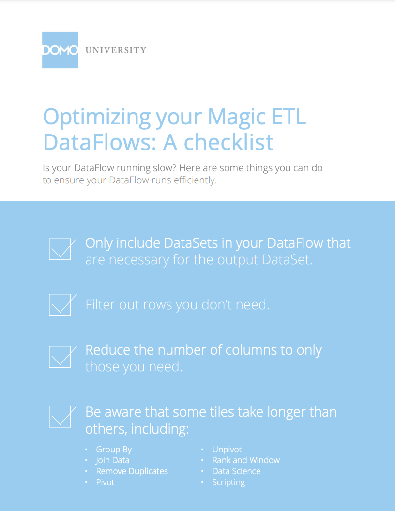

Refer to this one-pager to find out several ways to get your DataFlows to run more efficiently. To download this PDF to your computer, click [here](https://domosoftware.sharepoint.com/:b:/s/CS-Edu-PublicFiles/EfTjsNG2mSxFpjlpo5OZhOkBP8BvEKKyy4o2IcKlFCDoHg?e=jEdvIq).

