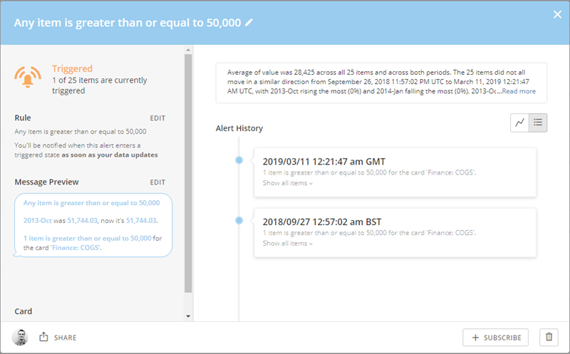
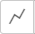
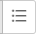
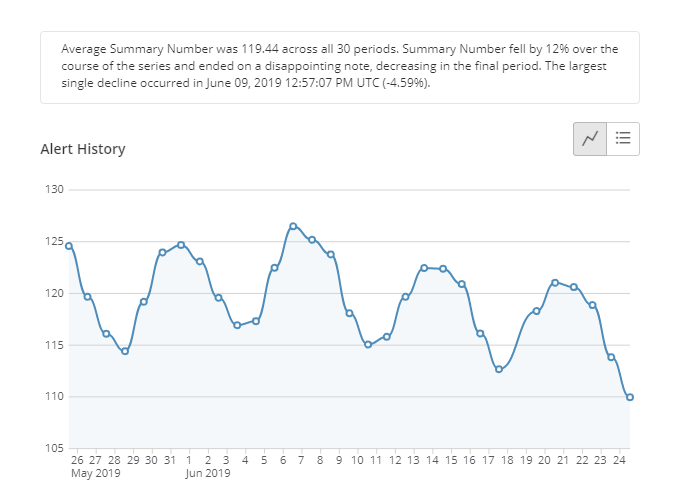
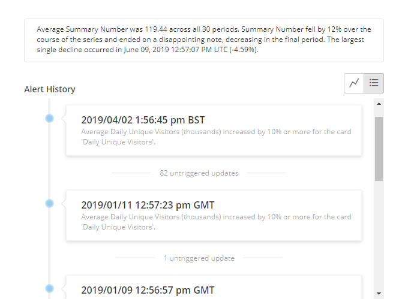

Intro
-----

You can manage all Alerts in the Alert Center. You can also choose to follow suggested Alerts created by other users. You can also manage your individual *Card*Alerts in the Card Details view, and your individual *DataSet* Alerts in the Data Center. From any of these locations, you can open a panel that provides options for setting Notifications, making edits, viewing the owner and followers, and seeing the Alert history.

Subscribing or unsubscribing to an Alert
----------------------------------------

When you subscribe to an Alert on a Card or a DataSet, you receive Notifications whenever that Alert is triggered, edited, or deleted.

When you click the **Subscribe** button for an Alert, icons appear for four methods of receiving Notifications—SMS , email , mobile push notifications , and telephone call . Of these, all but the telephone option are active by default. You can turn an option on or off by clicking on its icon. If you turn off all four Notification options, you become unsubscribed from the Alert. When you unsubscribe to an Alert, you no longer receive Notifications when any changes occur for that Alert.   

You can also choose to receive a daily or weekly email listing all Alerts that triggered in the last day or week, respectively. You do this by clicking the  icon then checking the box for **Daily** or **Weekly**. 

To see all your subscribed Alerts, open the Alert Center then click **Subscribed** in the **Quick Filters** pane on the left side of the Alert Center. 

**To subscribe or unsubscribe to an Alert in the Alert Center,**

1. Click **Alerts** in the navigation bar at the top of the screen.
2. Locate the Alert you want to subscribe or unsubscribe to.
3. (Conditional) Do one of the following:

	* To subscribe, click the **Subscribe** button, then choose the desired Notification options by toggling their icons on or off.   
	   
	 You can also choose to add the Alerts to your daily and weekly summaries by clicking  then clicking in the appropriate checkboxes.
	* To unsubscribe, click each highlighted Notification icon to turn it off.

**To subscribe or unsubscribe to a Card Alert in the Card Details view,**

1. Open the pertinent Details view by clicking on its Card, then click  in the top right corner.
2. (Conditional) Do one of the following:

	* To subscribe, under Discover click subscribe, and check one or more boxes.
	* To unsubscribe, under Followed clear all checkboxes.

**To subscribe or unsubscribe to a DataSet Alert in the Data Center,**

1. Select **Data** in the toolbar at the top of the screen.  
 The Data Center opens with the ****DataSets**** tab open by default.
2. Locate and click on the pertinent DataSet.  
 For more information about searching and filtering DataSets in the Data Center, see [Data Center Layout](/s/article/360043430633 "Data Center Layout").
3. Click on the **Alerts** tab.
4. (Conditional) Do one of the following:

	* To subscribe to an Alert, click the **Subscribe** button for that Alert.
	* To unsubscribe from an Alert, click each blue-highlighted icon to turn it off. Once all of the icons are no longer highlighted (i.e. gray), you are unsubscribed from the Alert.

For more information about the **Instantly**, **Daily**, and **Weekly** Notification options, see [Configuring Notification and Alert Settings](/s/article/360042925814 "Configuring Notification and Alert Settings"). 

Editing an Alert
----------------

Editing a Card Alert is discussed in [Creating an Alert for a DataSet](/s/article/360042925994 "Creating a Custom Alert for a KPI Card").

Deleting an Alert
-----------------

You can delete an Alert from the Alert options panel. Keep in mind that deleting an Alert affects all followers of that Alert.

**To delete an Alert,**

1. Do one of the following:

	* Click **Alerts** in the toolbar at the top of the screen, then find the Alert using the various search/filter options and click on it.
	* For a Card Alert, open the pertinent Details view by clicking on its Card, click  in the top right corner, then click the Alert you want to delete.
	* For a DataSet Alert, open the Data Center by selecting **Data** in the toolbar at the top of the screen, locate and click on the pertinent DataSet, click on the Alerts tab, then finally click on the card for the Alert you want to delete.
2. Click the  icon.
3. Click **Delete** to confirm.

Viewing the history of an Alert
-------------------------------

For any Alert, you can see how many times that Alert has been triggered. You can also see a log of specific Alert events. You can switch between these by clicking  or  in the options panel for the Alert. When you click , a trendline appears showing changes in the value of the Alert:  
   
  
   
 You can change the sort method used for the trendline by mousing over either of the axes of the chart then clicking the sort icon that appears.   
   
 When you click , a chronological list of trigger events appears:  
   

 

**To view the history of an Alert,**

1. Do one of the following:

	* Click **Alerts** in the toolbar at the top of the screen, then find the Alert using the various search/filter options and click on it.
	* For a Card Alert, open the pertinent Details view by clicking on its Card, click  in the top right corner, then click the Alert you want to see the history of.
	* For a DataSet Alert, open the Data Center by selecting ****Data**** in the toolbar at the top of the screen, locate and click on the pertinent DataSet, click on the Alerts tab, then finally click on the card for the Alert you want to see the history of.
2. (Optional) Switch between the event log and trendline by clicking  or  as desired.
