Intro
-----

Over time, goals and metrics may need to be updated with new owners, names, descriptions, and completion dates. This article describes how to edit goal and metric details, update goals and metrics to reflect progress, and share progress with management using Check-in. 

 

Updating Goal Details
---------------------

Goal details can be updated at any time. You can update the following: 

* Name
* Description
* Type
* Owner
* Start and completion dates

1. In **Goals**, go to the **Personal**, **Teams**, or **Company** tabs (wherever your goal is located).  

2. Select the goal you'd like to edit.

The **Goal Details** view displays.

3. Expand the **Goal Options** 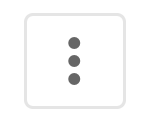 menu and select **Update Goal**. 

The **Update Goal** modal displays. 

4. Make any necessary changes and select **Update**. 

Your goal is updated with new details.

 

Updating a Goal's Status
------------------------

In the Goal Details view, a status will display showing the overall progress. This status can be automated according to metric progress or can be manually set by the owner. 

**Goal Status Key:**

|  |  |
| --- | --- |
| **Icon** | **Status** |
| Screen_Shot_2022-06-02_at_12.32.27_PM.png | On Track |
| Screen_Shot_2022-06-02_at_12.32.35_PM.png | Needs Attention |
| Screen_Shot_2022-06-02_at_12.32.19_PM.png | At Risk |
|  
Screen_Shot_2022-09-14_at_5.04.55_PM.png
  | Not Started |

 

#### Setting an Automated Goal Status

1. In Goals, go to the **Personal**, **Teams**, or **Company** tabs (wherever your goal is located).  

2. 2. Select the goal. 

3. From the goal status menu, switch the toggle to enabled. 

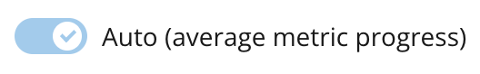

The goal's status is determined by the average progress of its associated metrics. 

 

#### Setting a Manual Goal Status

1. In Goals, go to the **Personal**, **Teams**, or **Company** tabs (wherever your goal is located).  

2. 2. Select the goal. 

3. From the goal status menu, switch the toggle to disabled. 

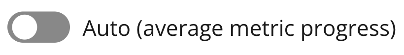

The goal's status is manually updated by the owner. 

 

Copying a Goal
--------------

Goals can be copied by the owner to create an identical goal without changing the original. You have the option to keep the original goal's metrics or create new metrics for the copied goal. 

 

1. In **Goals**, go to the **Personal**, **Teams**, or **Company** tabs (wherever your goal is located).  

2. Select the goal you wish to copy.

The **Goal Details** view displays.

3. Expand the **Goal Options**  menu and choose **Copy Goal**. 

4. (Optional) Edit the **Goal name**, **Description**, **Type**, **Owner**, **Start Date**, and **Achieve by** date to distinguish the copy from the original. 

5. Select**Next.**The **Copy goal**modal displays.

6. Choose an option and select **Done.** 

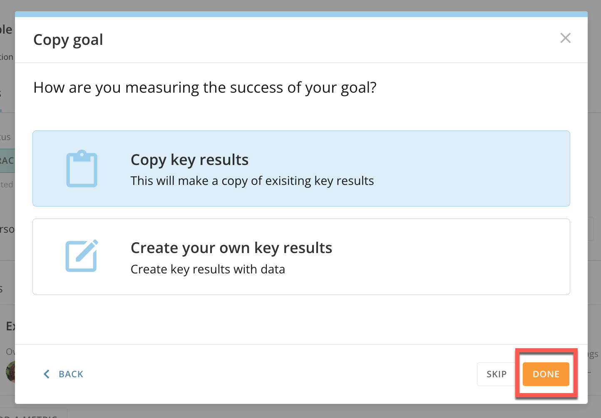

The original goal and its copy are located in their corresponding goal type tabs. 

**Note:** By selecting **Copy key results**, the same metrics in the original will be added to the copy. By selecting **Create your own key results**, you will be taken through the metric creation process. Detailed instructions for creating metrics can be found in [Getting Started with Goals](/s/article/4578278680855). 

 

Deleting a Goal
---------------

1. In **Goals**, go to the **Personal**, **Teams**, or **Company** tabs (wherever your goal is located).  

2. Select the goal you wish to delete. 

The **Goal Details** view displays. 

3. Expand the **Goal Options**  menu and select **Delete Goal**. 

A dialog displays confirming the deletion of the goal. 

**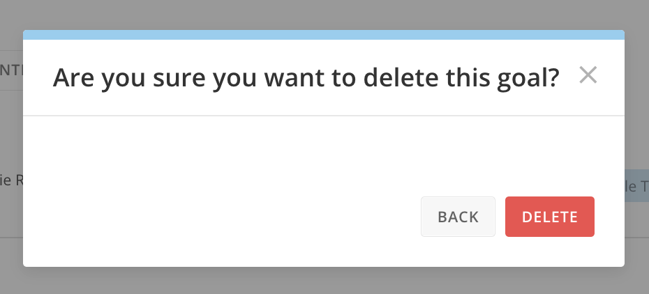**

4. If you would like to permanently delete your goal, select **Delete.**

Your goal is deleted. 

 

Updating Metric Details
-----------------------

Metric details can be updated at any time. You can update the following: 

* Name
* Description
* Type
* Owner
* Start and completion dates

1. In **Goals**, go to the **Personal**, **Teams**, or **Company** tabs (wherever your goal is located).  

2. Select the goal with the metric you'd like to edit.

The **Goal Details** view displays.

3. Locate the metric you wish to edit below your goal's details. Select the **Metric Options**  menu. 

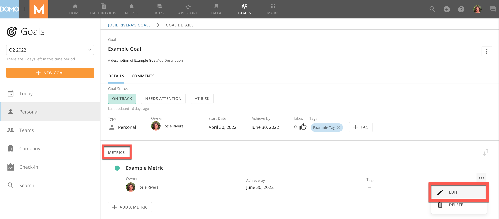

4. Select **Edit.**

The **Edit metric** modal displays allowing you to change the metric type. 

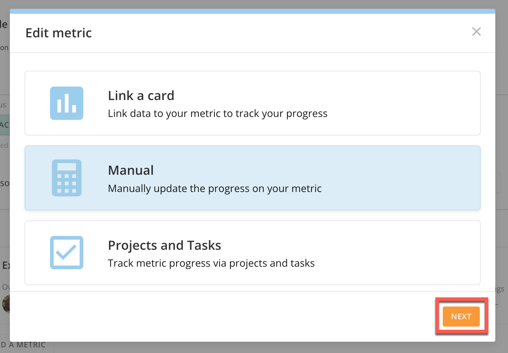

5. Choose an option and select**Next.** 

You can then enter new details depending on your selection, such as:

* Values
* Cards
* Projects
* Tasks
* Metric name
* Description

7. Select **Done**. 

The metric is updated with new details. 

**Note:** For detailed instructions on adding metrics and metric types, see [Getting Started with Goals](/s/article/4578278680855). 

 

Deleting a Metric
-----------------

Owners can delete their goal's metrics at any time. 

1. In **Goals**, go to the **Personal**, **Teams**, or **Company** tabs (wherever your goal's metric is located).  

2. Select the goal with the metric you wish to edit.  

3. Locate the metric you wish to delete below your goal's details. Select the **Metric Options**  menu and choose **Delete**. 

A modal confirming deletion displays. 

4. If you would like to permanently delete your metric, select **Delete.**

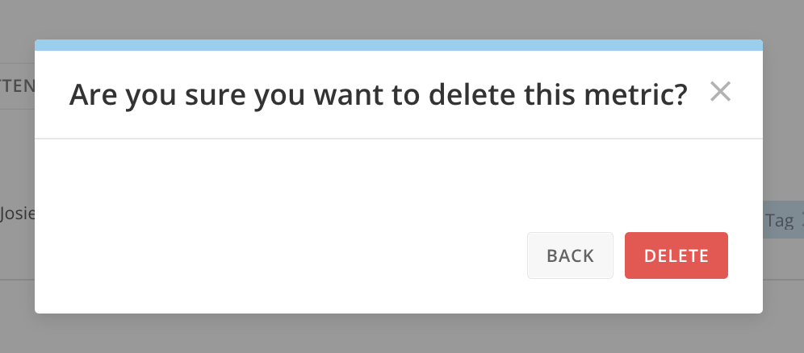 

Your metric has now been deleted. 

 

Saving a Metric as a New Goal
-----------------------------

You can create goals from metrics. 

1. In **Goals**, go to the **Personal**, **Teams**, or **Company** tabs (wherever your goal is located).  

2. Select the goal with the applicable metric. 

3. Open the metric you wish to make a goal. 

4. Open the **Metric Options**  menu in the metric details view and select **Save As Goal.** 

The **Copy goal** displays allowing you to change the goal's details. 

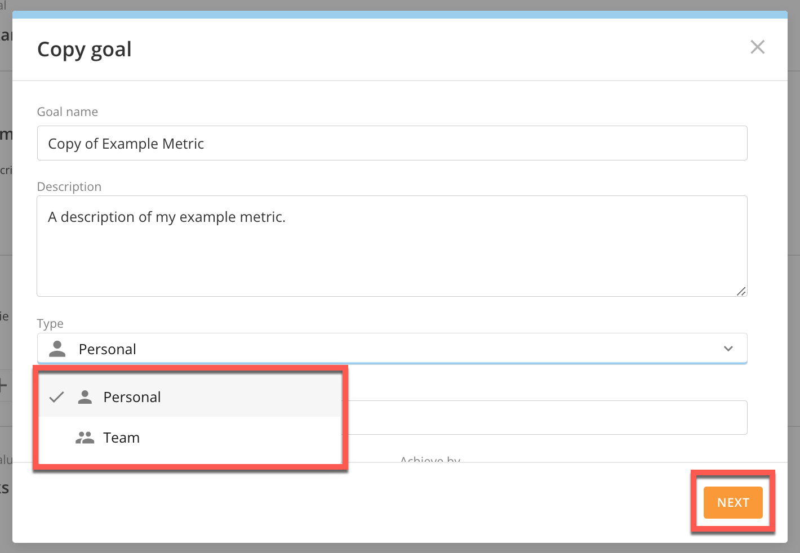

 

5. From the **Type** dropdown, select **Personal**, **Team**, or **Company** (not all of these options may appear depending on your permissions). 

6. Select **Next**. 

The **Add a metric** modal displays. You can create a new metric or select **Skip.** 

7. After adding a metric or selecting **Skip**, the metric now displays as a goal in its appropriate tab. 

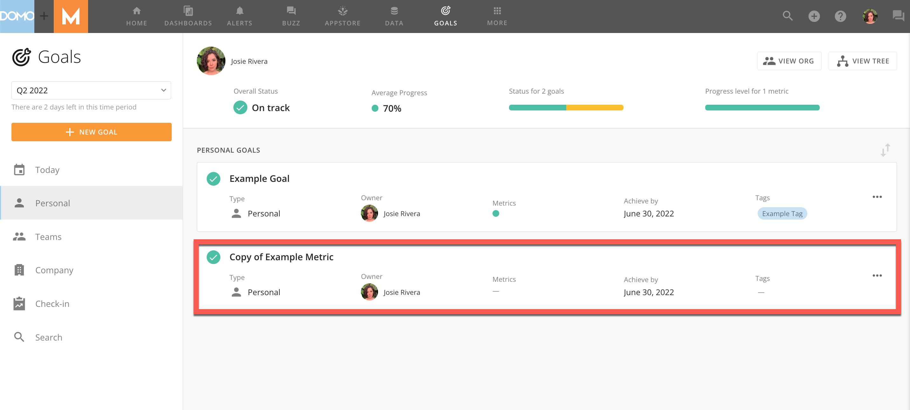

 

 

**Note:** Goals and metrics are viewed together, but can be controlled independently. This allows you to take control of a goal's status even if the metrics tell a different story.

 

Updating Metric Progress
------------------------

Metrics powered by Domo cards or Projects and Tasks are automatically updated. Metrics powered manually with percentages and custom values will need to be updated by you.  

 

#### Card-Powered Metrics

The following describes how to update metrics linked to a Domo card: 

1. In **Goals**, open the goal the card-powered metric is associated with. 

The **Goal Details** view displays 

2. Select the metric to view its details. 

At the bottom of the page is the **Linked Card.** The progress of the metric changes according to the card's data. 

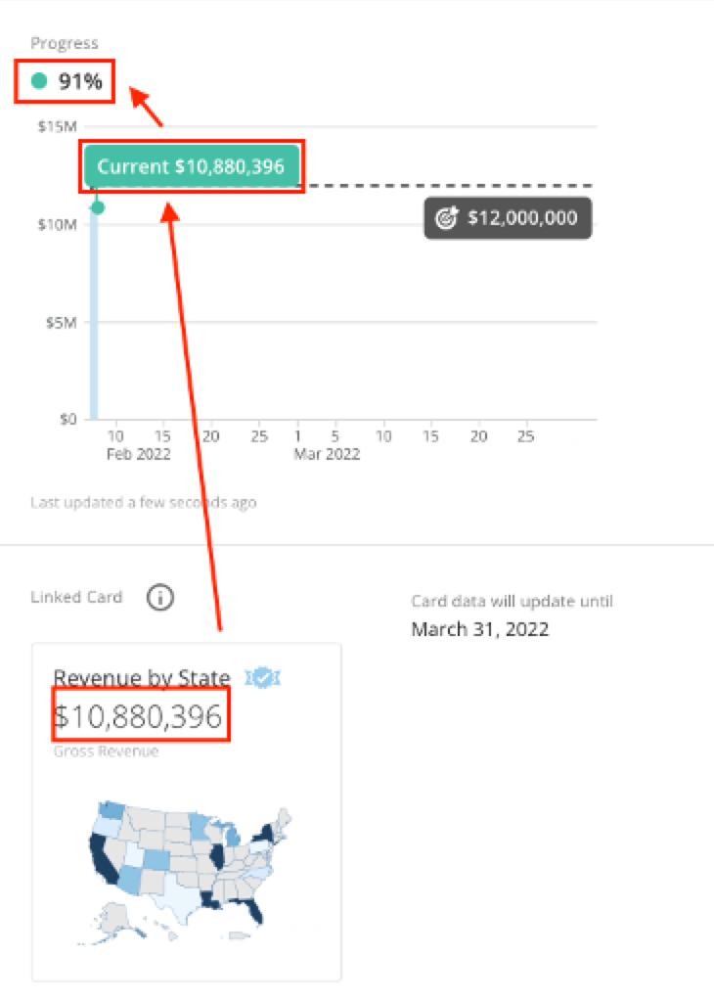

#### Percentage-Based Metrics

The following describes how to update the progress of your percentage-based metric: 

1. In **Goals**, open the goal the percentage-based metric is associated with. 

The **Goal Details** view displays 

2. Select the metric to view its details. 

3. In the metric details, adjust progress by sliding the blue slider across the scale to the desired percentage. 

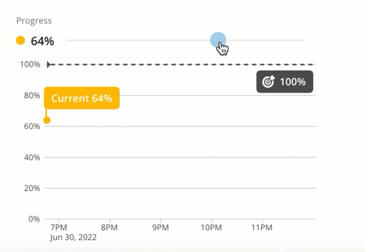

As you manually update the progress over time, the percentage scale will match your growth.

 

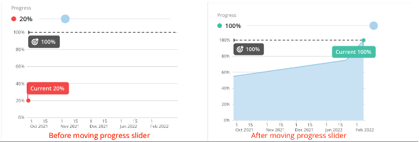

 

#### Choose Your Own Value Metrics

1. In **Goals**, open the goal the manual metric is associated with. 

The **Goal Details** view displays 

2. Select the metric to view its details. 

3. In the metric's details, select the field below **Current Value.**

4. Update the value by typing in a new number or by using the arrows. 

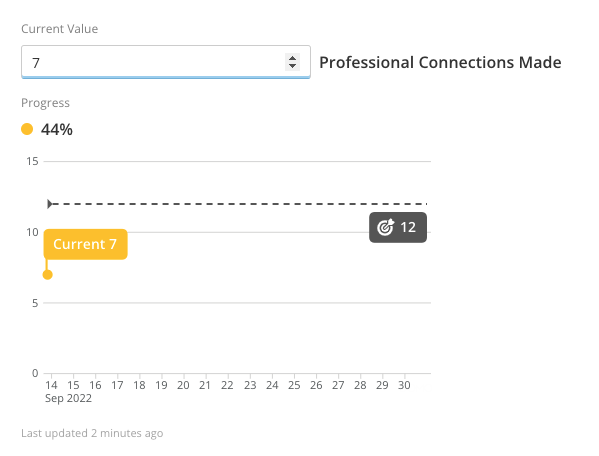

The **Add a comment** modal displays.

5. (Optional) Add a comment to provide insight into your metric progress. You can disable this message from appearing by selecting **Do not show this message again**. 

6. Select **Save.**

The metric is updated with new values. 

 

#### Projects and Tasks Metrics

Metrics powered by **Projects and Tasks** are automatically updated as you complete items. You can mark these items as complete within the Goals feature. 

 

1. In **Goals**, open the goal the Projects and Tasks metric is associated with. 

The **Goal Details** view displays 

2. Select the metric to view its details. 

At the bottom of the metric details, the metric's current progress displays. 

3. Go to the **Projects and Tasks** tab to update the metric. 

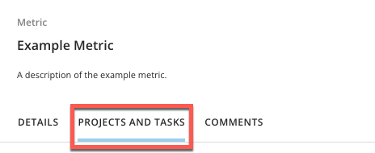

4. Click and drag items from each column.

**Tip:** You can change each list's name by selecting the arrow next to its current title. 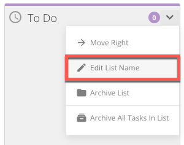

 

 

Goals Check-in
--------------

Domo goals **Check-in** is a feature that allows you to share your goal's progress with managers in your organization. In the goals **Check-in** tab, you can view goals and reports that need to be updated. 

1. In **Goals**, select the **Check-in** option from the left-side rail.

A list of goals that need to be updated displays. 

2. For each goal that you want to update, select  **Check-In**.   
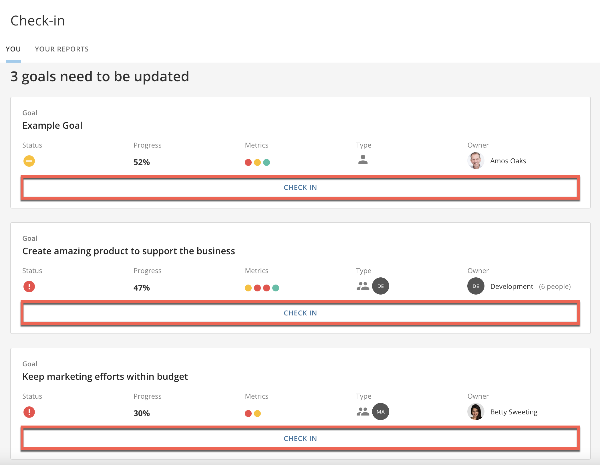  
  

3. Select the current status of your overall goal (**On Track**, **Needs Attention**, **At Risk,** or **Not Started**) and add an optional comment. Select **Next.**

**Note:** If the **Auto (average metric progress) 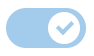** toggle is enabled, your goal's status is automatically determined by the average progress of its underlying metrics: At Risk: 0-39%; Needs Attention: 40-69%; On Track: 70-100%. By disabling, you can manually update the status of your goal. 

 

The current status of your metrics displays. No actions are needed in this step. 

4. Select **Next.** Update the progress of your metrics, if applicable. Select **Save** and **Next.**

5. Once each metric is updated, select **Submit**. 

Your goal check-in is submitted. Leadership will be notified of your goal's updates. 

 

Inviting Employees to Check-in
------------------------------

Managers can invite people to provide updates on their goal's progress. 

1. From the main **Check-in** screen, select the **Your Reports** tab.

In **Your Reports,**you will see a list of goals owned by people who report to you that have not been updated in the past 7 days.

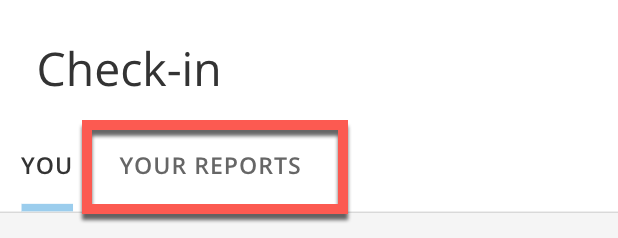

2. Select the **Request Check-in**button next to each goal you'd like updated. An automated email will be sent to each of the selected employees with check-in instructions. 

 

For more information on configuring the administration of the Goals Check-in feature, including managing the automated prompt emails, see [Configuring Domo Goals for Your Organization](/s/article/4577172785559). 

 

 

 

 

