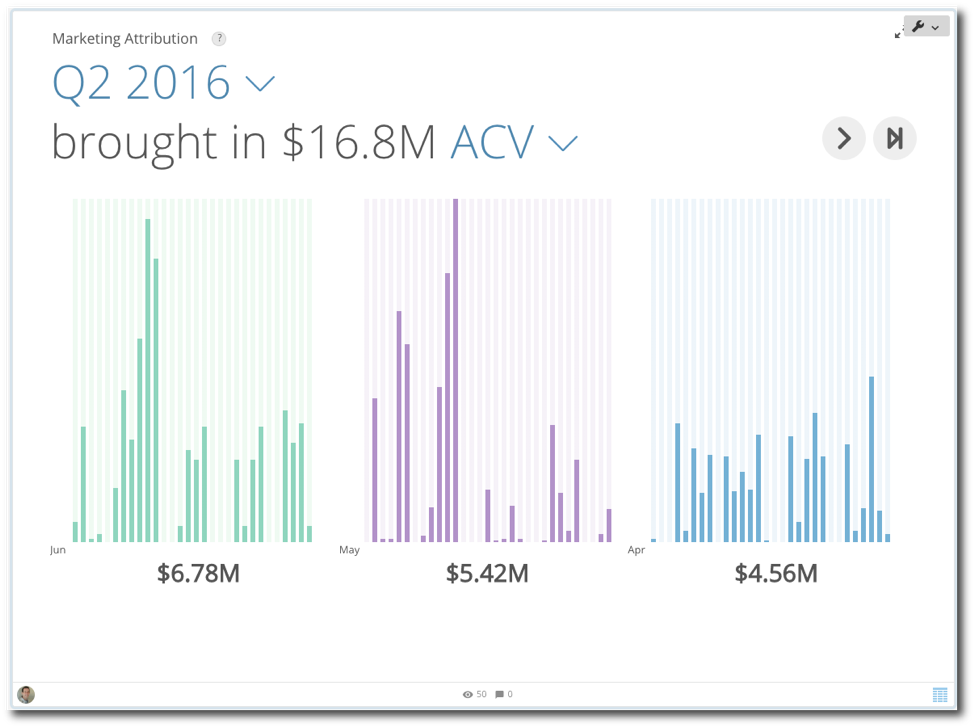
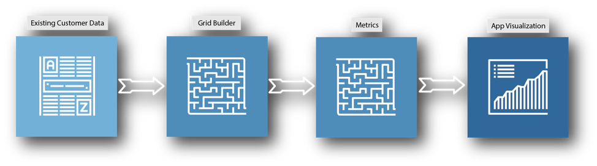
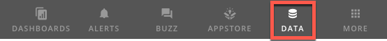
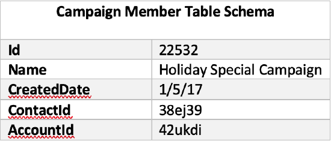
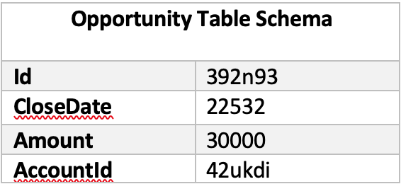
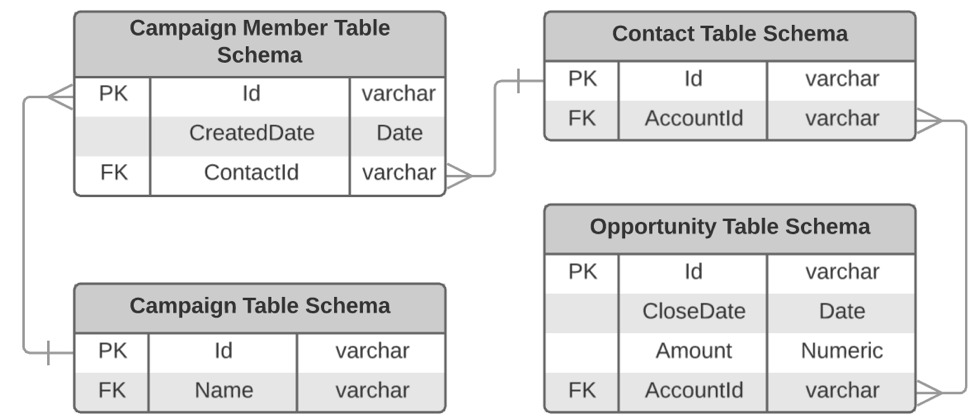
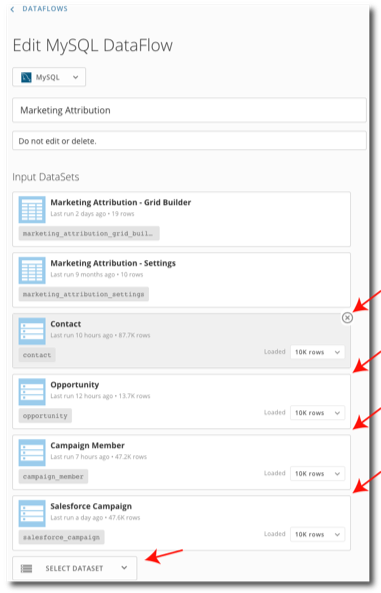
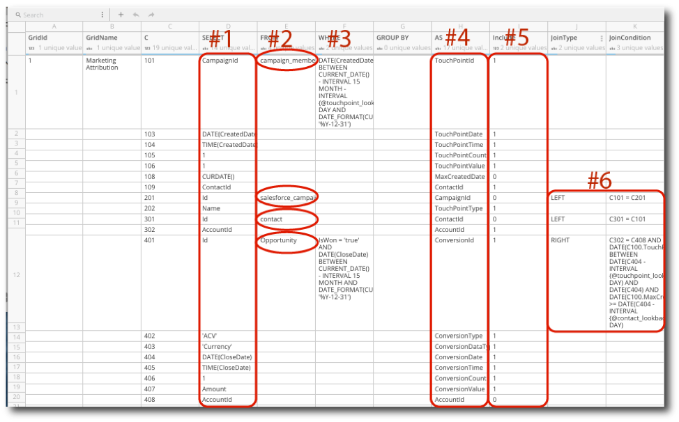
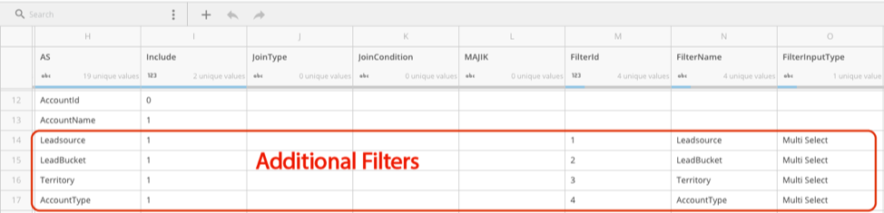

---
    title: Marketing Attribution Implementation Guide
    url: https://domo-support.domo.com/s/article/360044364413
    linked_kbs:  ['[https://domo-support.domo.com/s/knowledge-base/](https://domo-support.domo.com/s/knowledge-base/)', '[https://domo-support.domo.com/s/](https://domo-support.domo.com/s/)', '[https://domo-support.domo.com/s/topic/0TO5w000000ZampGAC](https://domo-support.domo.com/s/topic/0TO5w000000ZampGAC)', '[https://domo-support.domo.com/s/topic/0TO5w000000Zan9GAC](https://domo-support.domo.com/s/topic/0TO5w000000Zan9GAC)', '[https://domo-support.domo.com/s/article/360042922874](https://domo-support.domo.com/s/article/360042922874)', '[https://domo-support.domo.com/s/article/360044364413](https://domo-support.domo.com/s/article/360044364413)', '[https://domo-support.domo.com/s/topic/0TO5w000000Zan9GAC/available-apps](https://domo-support.domo.com/s/topic/0TO5w000000Zan9GAC/available-apps)', '[https://domo-support.domo.com/s/article/360043429933](https://domo-support.domo.com/s/article/360043429933)', '[https://domo-support.domo.com/s/article/360043429953](https://domo-support.domo.com/s/article/360043429953)', '[https://domo-support.domo.com/s/article/360042925494](https://domo-support.domo.com/s/article/360042925494)', '[https://domo-support.domo.com/s/article/360043429913](https://domo-support.domo.com/s/article/360043429913)', '[https://domo-support.domo.com/s/article/4408174643607](https://domo-support.domo.com/s/article/4408174643607)', '[https://domo-support.domo.com/s/login/](https://domo-support.domo.com/s/login/)']
    article_id: 000004149
    views: 1,093
    created_date: 2022-10-24 21:25:00
    last updated: 2022-10-24 22:40:00
    ---

Intro
-----

Thank you for choosing to install the Marketing Attribution App! This guide is intended to help you connect this app with your own data. If you have completed the purchasing process for this app, then you'll be able to go through all the steps in this guide. The first steps are making sure that the app and the app's DataFlow have been properly downloaded from the Appstore and that your data is in the correct format for use in the app.  
  

Prerequisites:
--------------

The Marketing Attribution app utilizes a tool called the Grid Builder that maps your data to the schema that the app requires. If you are not already familiar with Grid Builder, please read our Grid Builder walkthrough [here](https://developer.domo.com/docs/installation-guides/grid-builder-walkthrough). Though it is not required, it is also helpful to have a working knowledge of how MySQL query works.

Below is a diagram that displays the order in which your data will be fed through the DataFlow and then output to the app. 

  

  
Once you have become familiar with how the Grid Builder works, follow these next steps to make sure that both the Marketing Attribution app and the DataFlow have been properly deployed to your Domo instance:

* If you have purchased the Marketing Attribution app through the Domo Appstore, make sure that you have selected the **Try It** button located on the app's page in the Appstore in order to deploy the app and its DataFlow to your Domo instance. You will be asked to name the page where you'd like the app to live in your instance.
* Double check that the DataFlow has been properly deployed to your instance: to do this, navigate to the Data Center by selecting the menu button located in the top right corner of Domo, then clicking the **Data** button located in the top left corner of Domo (see image below for example.)  
  

* Select **DataFlows** from the left side of the Data Center screen, then use the Data Center's search bar to search for "Marketing Attribution". You should be able to located a DataFlow that matches your search term.

If you've followed all of these steps and you still can't locate the app on the page you've created, or its DataFlow, contact Technical Support. For information on how to contact Support, please see: [Getting Help](/s/article/360042922874).

Step 1: Prepare Your Data
-------------------------

The Marketing Attribution App compares your touch points across each attribution model: first touch, last touch, linear, position, and time decay — which means that you'll need two main tables in order to run this app. One of the tables will be the "current details about opportunities" table and the other table will be the "details about campaign member" table. In the example below, you'll see four tables that make up the two tables. Certain columns are required in order for the DataFlow to run successfully, the table schemas below will show all the required columns. The column names will be mapped once you fill out the Grid Builder so you do not need to change your column names in order to fit the schema, but you may add other categorical columns to the table that you'd like to use as filtering options (see examples below.)  
  

 

  
See the Entity Relationship Diagram below for further clarification on how the tables are connected. You can also use multiple tables to create the necessary tables that you need by joining tables in the Grid Builder. As you'll see in the example, the Campaign table joins the Name column to the Campaign table and the Contact table joins AccountId to the Campaign Member, and the AccountId is used to join everything to the Opportunity table. The Grid Builder steps will explain how to do these joins later in this document.

 

 

**Note:**  

* The Marketing Attribution App has a Hiring Manager filter built-in that cannot be removed nor repositioned in the app, it is labeled "HIRING MNGR".
* You can reach out to your Hiring Managers in the app by selecting the mail icon. These messages are automated in the "Marketing Attribution — Email Forms" DataSet. If you want to change the messages, click on the Email Forms DataSet then click on the wrench menu icon and select **Edit Webform**.
* You can use more than one DataSet as source data for the app, as long as they can be joined together using your Date and Primary Group columns. Information on how to do joins in the Grid Builder will be found in later sections in this document.
* If you are missing columns, you can create them by setting a default value in the DataFlow by using MySQL. For example, if you didn't have a LinkedInURL column then you can set all your values in that column to 'None'—this means that no Sales Reps will have a picture in the app, but it will finish running. If you are missing any columns, the DataFlow will stop running with an error.

#### Key Terms & Calculations:

* **First Touch:**Term given to the first marketing channel that engaged the customer—100% credit to first touch.
* **Last Touch:** Term given to the last marketing channel that resulted in customer conversion—100% credit to last touch.
* **Linear:**Gives credit to all marketing touch points in a customer journey—equal credit to all touches.
* **Position:** Gives credit more heavily to first touch and last touch over other touches—40% to each first and last touch, the remaining 20% is divided equally among the other touches.
* **Time Decay:**Gives credit to multiple touchpoints, but gives more credit to marketing touchpoints closer to the customer conversion. The formula is 2(difference in days from touchpoint to conversion/half life days^-1),where the default value for half-life equals 15. The half-life value can be changed in the Settings webform. This formula produces a number for each touchpoint, these numbers are then added up for all touchpoints to create a total, then the formula is run again on each touchpoint and divided by the total that was found to normalize it to a percentage part of 100%.

Step 2: Add Your Source Data to the DataFlow
--------------------------------------------

As soon as you've prepped your data, you'll need to navigate to the DataFlow and add your data as inputs to the app's DataFlow. 

Follow these steps to input your data:

* Navigate to the Data Center by selecting the menu button located in the top right corner of Domo, then clicking the Data button located in the top left corner of Domo (see image below for example.)  
  

* Select **DataFlows** on the left side of the Data Center screen, then search for "Marketing Attribution" in the Data Center's search bar. You should located a DataSet with you search term.
* Select the DataFlow to go to the details view, then click on the pencil icon on the right side of the page to edit the DataFlow.
* Remove the sample DataSets, "Contact", "Opportunity", "Campaign Member", and "Salesforce Campaign", by clicking the **x** on the corner of each DataSet. Keep the "Marketing Attribution - Grid Builder" and "Marketing Attribution - Settings" DataSets.
* Click the **Select DataSet** button, then search for the DataSets that you created for the app and add them by selecting them.
* After you've added your DataSets, scroll to the bottom of the page and click the **Save** button.
* Navigate back to the Data Center.

  
  

Step 3: Edit the Grid Builder
-----------------------------

For the third step, you'll need to edit the appropriate fields in the Grid Builder to match your input data. This guide presents the basic steps to do this, but for a more comprehensive tutorial on how the Grid Builder works and how to use it, please review the [Grid Builder Walkthrough](https://developer.domo.com/docs/installation-guides/grid-builder-walkthrough). As you make changes, it may be wise to occasionally copy your work into an Excel Spreadsheet to track all of your changes, just in case anything happens to your web browser during this process.

Follow these steps to edit the Grid Builder:

* Navigate to the Grid Builder webform that came with the Marketing Attribution App. A webform is a type of DataSet so you'll need to search for it under the DataSet tab and not the DataFlow tab, it will be named "Marketing Attribution - Grid Builder". Select the DataSet, then in the details view select the wrench menu icon located on the right side and click **Edit Webform**.

  
  

* In the SELECT column, from C101 down, replace the sample values with the names of the columns from the FROM column that you'd like to use in the app. This is where you map your own data to the app, you may have more columns that you want to add as filters so you may need to add rows (see #1 in the example image above.)
* In the FROM column, change the value on row C101 to match the name of your first DataSet, repeat this step for all of the tables you will be using as source data in the app. Each new DataSet should be assigned to the next 100's value under the "C" column. For example, start with 201 for the second DataSet, 301 for the third, etc. (see #2 in the example image above.)
* In the AS column from C101 down are the names of the columns from the SELECT column, these names should match the schema in the table above and they should already be listed correctly. You do not need to alter the AS column unless you add any additional columns to use as filters in the app. When using this column avoid using spaces, numbers, and special characters in the names in the AS column. For example, use Gross\_Sales as opposed to Gross Sales (see #4 in the example image above.)
* In the "Include" column, place a 1 in each row that you are including from your DataSet that isn't being used solely for a join, if you are not including that column place a 0 in the "Include" column.
* To do a join, fill out the "JoinType" and "JoinCondition" columns on row C201 or any of the columns that start a new table. "JoinType" needs to be in all CAPS and can be any type of join that is used by MySQL, additional joins usually use LEFT for the "JoinType". The "JoinCondition" column references the row where your column is brought in from your DataSet—the "JoinCondition" should look like this: `Ctable#.COLUMNNAME = Ctable#.COLUMNNAME.`(see #6 in the example image above.)
* As soon as you have the information entered from your data, next you'll need to configure your filters. On each row of the Grid Builder that references a column in your DataSet, that you'd like to use as a filter, you'll need to update the three filter columns: "FilterId", "FilterName", and "FilterInputType". There are no filters in the example app downloaded from the Appstore so you'll need to refer to the example image below for reference.

  
  

* On other rows that you'd like to use as filters, use incrementing number for the "FilterId" column (3,4,5,etc.), with the smallest number in the top row. Define filter names in the "FilterName" column, use "Multi Select" or "Single Select" for "FilterInputType", and leave "FilterIsPrimary" and "FilterIsPrimaryGroup" empty. Check out the [Grid Builder Walkthrough](https://developer.domo.com/docs/installation-guides/grid-builder-walkthrough) for more information on what the two filter types do (see example image above.)
* Select **Save & Continue** at the top of the page to save your edited DataSet.

As soon as you've made the necessary changes to the Grid Builder, go to the Data Center and run the Marketing Attribution DataFlow. If you the DataFlow runs successfully, then you've most likely filled out the Grid Builder correctly! If you encounter any errors during this process either review the [Grid Builder Walkthrough](https://developer.domo.com/docs/installation-guides/grid-builder-walkthrough) or contact Technical Support. For information on how to contact Support, please see: [Getting Help](/s/article/360042922874).

Step 4: Validation
------------------

Now that you have configured the Grid Builder, you should now be ready to check your Marketing Attribution App to validate your metrics.

We suggest following the process below for validation:

* Build KPI cards to test your metrics—build these cards based off of your source data, not the output data from the app. For example, if you are displaying sales trends by sales rep in the app, build a bar chart type card that displays sales per rep and have the date range in the KPI card match one of the date ranges that your app displays
* Compare your data in the KPI card to the app's data, remember to make sure that your filtering options and date ranges match between the card and app as well.
* If you do find any discrepancies, check to see if you need to change any join conditions or grouping in the Grid Builder. Double check your calculations too.
* Repeat this process for any metrics that you need to validate.

#### Congratulations!

Your Marketing Attribution App should now be good to go! Enjoy getting the best value out of your data. If you have any questions or need help troubleshooting, contact Technical Support. For information on how to contact Support, please see: [Getting Help](/s/article/360042922874).

 

