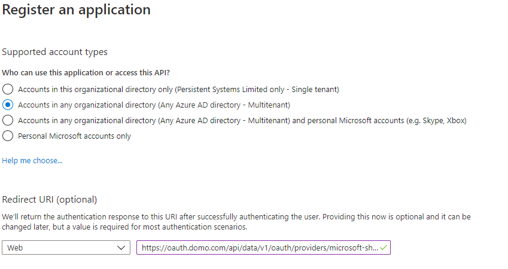
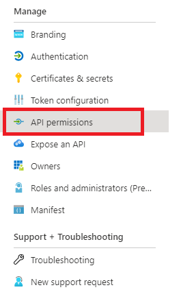
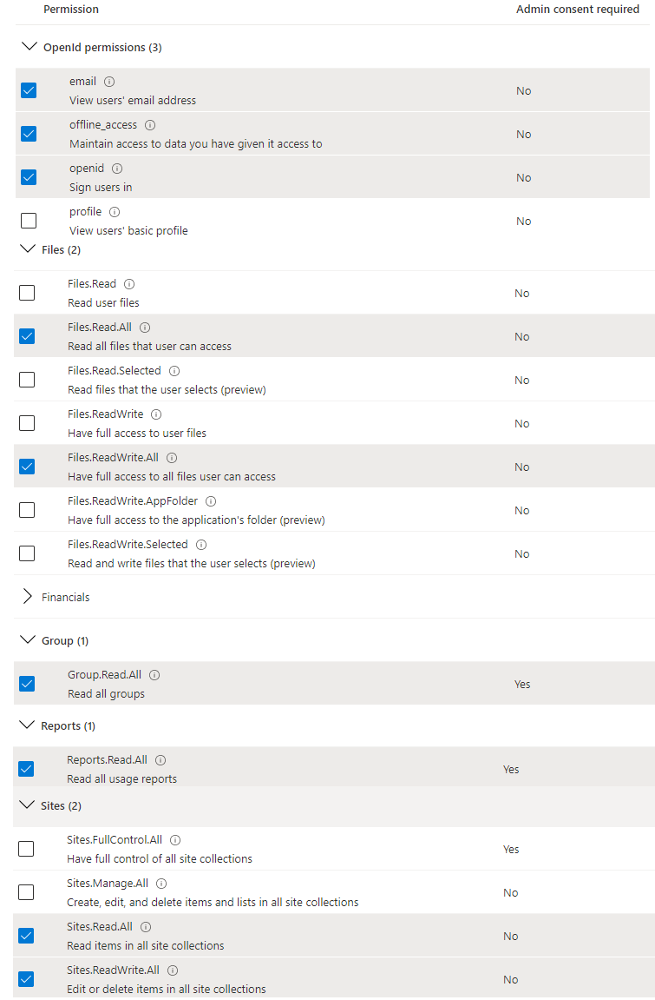
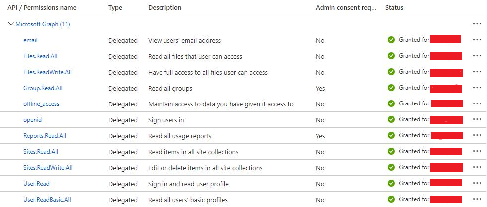

---
    title: Microsoft Sharepoint Online REST Connector
    url: https://domo-support.domo.com/s/article/360043436773
    linked_kbs:  ['[https://domo-support.domo.com/s/knowledge-base/](https://domo-support.domo.com/s/knowledge-base/)', '[https://domo-support.domo.com/s/](https://domo-support.domo.com/s/)', '[https://domo-support.domo.com/s/topic/0TO5w000000ZammGAC](https://domo-support.domo.com/s/topic/0TO5w000000ZammGAC)', '[https://domo-support.domo.com/s/topic/0TO5w000000ZanLGAS](https://domo-support.domo.com/s/topic/0TO5w000000ZanLGAS)', '[https://domo-support.domo.com/s/topic/0TO5w000000ZaowGAC](https://domo-support.domo.com/s/topic/0TO5w000000ZaowGAC)', '[https://domo-support.domo.com/s/article/360042926274](https://domo-support.domo.com/s/article/360042926274)', '[https://domo-support.domo.com/s/article/360042926054](https://domo-support.domo.com/s/article/360042926054)', '[https://domo-support.domo.com/s/article/360043436773](https://domo-support.domo.com/s/article/360043436773)', '[https://domo-support.domo.com/s/topic/0TO5w000000ZaowGAC/file-connectors](https://domo-support.domo.com/s/topic/0TO5w000000ZaowGAC/file-connectors)', '[https://domo-support.domo.com/s/article/360043429933](https://domo-support.domo.com/s/article/360043429933)', '[https://domo-support.domo.com/s/article/360043429953](https://domo-support.domo.com/s/article/360043429953)', '[https://domo-support.domo.com/s/article/360042925494](https://domo-support.domo.com/s/article/360042925494)', '[https://domo-support.domo.com/s/article/4408174643607](https://domo-support.domo.com/s/article/4408174643607)', '[https://domo-support.domo.com/s/article/360043429913](https://domo-support.domo.com/s/article/360043429913)', '[https://domo-support.domo.com/s/login/](https://domo-support.domo.com/s/login/)']
    article_id: 000003922
    views: 3,474
    created_date: 2022-10-24 21:16:00
    last updated: 2022-10-24 22:42:00
    ---


Intro
-----


Microsoft SharePoint Online enables an organization to easily create and manage custom team-focused and project-focused sites for collaboration. You can use Domo's Microsoft SharePoint Online REST Connector to get the data from an organization-wide intranet portal in different aspects based on sites within Domo. To do this, you must first create an app in Microsoft Azure. For more information about the Microsoft Sharepoint Online, visit their website at <https://products.office.com/en-us/sharepoint/sharepoint-online-collaboration-software>. 


You create a Microsoft Sharepoint Online connection in the Data Center. This topic discusses the fields and menus that are specific to the Microsoft Sharepoint Online REST connector user interface. General information for adding DataSets, setting update schedules, and editing DataSet information is discussed in [Adding a DataSet Using a Data Connector](/s/article/360042926274).


Prerequisites
-------------


To connect to Microsoft Sharepoint Online in order to retrieve information, you must have the following:


* An installed Microsoft Azure app.
* The secret ID and value for your Azure app. To generate an app and locate these credentials, see [Microsoft's documentation](https://docs.microsoft.com/en-us/azure/active-directory/develop/quickstart-register-app). You may need the following information to register for the app:


	+ **Azure Portal:** <https://portal.azure.com/>
	+ **Sharepoint App to Register:** SharePoint Online Rest API
	+ **Domo Re-direct URL:** <https://oauth.domo.com/api/data/v1/oauth/providers/microsoft-sharepoint/exchange>


### To Obtain the Sharepoint Secret ID:


1. Go to [https://portal.azure.com](https://portal.azure.com/ "https://portal.azure.com").
2. Select **Azure Active Directory > App registrations**.
3. Find and click on your web app.
4. The "application" ID is your secret ID.


 


### To obtain the Sharepoint Value:


1. Go to [https://portal.azure.com](https://portal.azure.com/ "https://portal.azure.com").
2. Select **Azure Active Directory > App registrations**.
3. Find and click on your web app.
4. Open **Certificates and secrets**.
5. Click **+New Value**.
6. Provide the value description and the expiry period for your secret. Click **Add**.
7. Your new value will appear. Copy the Value field and paste it in your Domo connector Value field.  


### Creating an Azure App for Enterprise OAuth


To create a Microsoft Azure app, do the following:


1. Log into [https://portal.azure.com](https://portal.azure.com/ "https://portal.azure.com").
2. Click on **App registrations**.  
  

3. Click **New registration**.
4. Enter the application name and select the supported account type. Enter the Redirect URI for Web as <https://oauth.domo.com/api/data/v1/oauth/providers/microsoft-sharepoint/exchange>.  
  

5. Click **Register**.
6. Now, click **API Permissions**.  
  

7. Click **+Add Permissions** button.  
  

8. Select **Microsoft Graph > Delegated Permissions**.
9. Select the permissions as required.  
  

10. After adding the permissions, all configured permissions will be listed as below.  
  



Connecting to Microsoft Sharepoint Online
-----------------------------------------


This section enumerates the options in the **Credentials** and **Details** panes in the Microsoft Sharepoint Online REST Connector page. The components of the other panes in this page, **Scheduling** and **Name & Describe Your DataSet**, are universal across most connector types and are discussed in greater length in [Adding a DataSet Using a Data Connector](/s/article/360042926274 "Adding a DataSet Using a Data Connector").


```
**Note:** Use Microsoft Account that has The Cloud Application Administrator role in [admin.microsoft.com](http://admin.microsoft.com)
```

### Credentials Pane


This pane contains fields for entering credentials to connect to a Microsoft Dynamics CRM installation via Azure. The following table describes what is needed for each field:  


| Field | Description |
| --- | --- |
| Secret ID | Enter the secret ID for your installed Azure web app. For more information about finding this, see "Prerequisites," above. |
| Value | Enter the value that was generated when you created your app. For information about generating a new key, see "Prerequisites," above. |


Once you have entered valid credentials, you can use the same account any time you go to create a new Microsoft Sharepoint Online REST DataSet. You can manage connector accounts in the **Accounts** tab in the Data Center. For more information about this tab, see [Managing User Accounts for Connectors](/s/article/360042926054 "Managing User Accounts for Connectors").


### Details Pane


This pane contains menus in which you can select your Sharepoint report and configure various options.


| Menu | Description |
| --- | --- |
| Report | Select your desired Sharepoint Online report.

|  |  |
| --- | --- |
| All Sites | Get a list of all sites, subsites and groupsites. |
| Download Item Contents | Get file content for the requested file. |
| Files | Get a list of files. |
| Get Items | Get items present in the root drive of the selected site. |
| Groups | Get a list of groups. |
| Group Sites | Get a list of sites for the selected group. |
| List | Get details for the specified list. |
| List Item Column Values | Get details for the selected list-item. |
| List Item Detailed | Get details for the selected list item. |
| List Items | Get list-items for the selected list. |
| List Notebooks | Retrieve a list of notebook objects. |
| List Onenote sections | Retrieve a list of onenote Section objects from the specified notebook. |
| Root Sites | Get a list of sites present at the root. |
| SharePoint Activity User Detail | Get details about SharePoint activity by user. |
| SharePoint Activity File Counts | Get the number of unique, licensed users who interacted with files stored on SharePoint sites. |
| SharePoint Activity User Counts | Get the trend in the number of active users. |
| SharePoint Site Usage Detail | Get details about SharePoint site usage. |
| SharePoint Site Usage File Counts | Get the total number of files across all sites and the number of active files.  |
| SharePoint Site Usage Site Counts | Get the total number of files across all sites and the number of active files.  |
| SharePoint Site Usage Storage | Get the trend of storage allocated and consumed during the reporting period.  |
| Site Lists | Get all the lists for the selected site. |
| Site Subsites | Get a list of subsites for the selected site. |
| Users | Retrieve a list of user objects. |
| Users Drive | Retrieve the properties and relationships of a Drive resource. |

 |
| Group ID | Select the group you want to use. |
| Site or Subsite? | Select whether you want to pull data from a top-level site or a subsite. |
| Site ID | Select the site you want to pull data from. |
| Subsite ID | Select the subsite you want to pull data from. |
| List ID | Select the list you want to pull data from. |
| List Item ID | Enter the ID of the list item you want to retrieve information for. |
| Drive ID | Select the drive you want to pull data from. |
| File ID | Enter the ID of the file you want to retrieve information for. You can generate a list of files by running the "Files" report. |
| Relative Path | Enter the relative path of the folder from the selected drive, e.g. /MyFolder/MySubfolder.  |
| Expand Fields | Select all of the fields you want to expand. |
| File Type | Select the file type for the data file you want to retrieve. To show file content as a binary column, select **Other**. |
| Sheet Name (Optional) | Enter the name of the sheet you want to retrieve from the specified Excel spreadsheet. Be sure to check sheet names for accidental spaces. |
| Data Tag (Optional) | Enter the tag where the data is found in your XML text. |
| Do you require attributes in data? | Select **Yes** if you require attributes values as part of your data. |
| Enter fields to exclude (Optional) | Provide a comma-separated list of fields to exclude from your XML data. |
| Enter Xpath expression | Enter your XPath query using standard XPath syntax as defined by the World Wide Web Consortium. (<https://www.w3.org/TR/2017/REC-xpath-31-20170321/>) |
| Header Start Row (Optional) | Enter the header row number. If you do not enter a number, the first row is considered the header row. |
| Data Start Row (Optional) | Enter the starting data row number. If you do not enter a number, the first row after the header row is considered the starting row. |
| Footer Rows to Skip (Optional) | If there are one or more rows at the bottom of the file you do not want to import, enter the number of rows to skip. |
| Does Your JSON Text Require a Line Reader? | Select ****Yes**** if your JSON text includes multiple lines to read. |
| Header Tag (Optional) | Enter the tag for the header in your JSON text. |
| Data Tag (Optional) | Enter the tag for the data in your JSON text. |
| Fields to Exclude (Optional) | Provide a comma-separated list of fields to exclude from the JSON import. |
| Date Format | Select the date format that should be used when converting date columns. For Excel files, cell date format will have higher precedence. |
| Delimiter | Select the desired delimiter for parsing your CSV file. |
| Custom Delimiter | Enter the desired custom delimiter character. Enter \t for tab or Unicode characters in \uxxxx form. |
| Quote Character  | Select the desired quote character for parsing your CSV file. |
| Custom Quote Character | Enter the desired custom quote character. Enter \t for tab or Unicode characters in \uxxxx form. |
| Escape Character  | Select the desired escape character for parsing your CSV file. |
| Custom Escape Character | Enter the desired custom escape character. Enter \t for tab or Unicode characters in \uxxxx form. |


### Other Panes


For information about the remaining sections of the connector interface, including how to configure scheduling, retry, and update options, see [Adding a DataSet Using a Data Connector](/s/article/360042926274).


### FAQs


#### What version of the Microsoft API does this connector use?


This connector uses version 1.0 of the Microsoft API (<https://graph.microsoft.com/v1.0>).


#### Which endpoint(s) does each report call in this connector?


 


|  |  |
| --- | --- |
| **Report Name** | **Endpoint URL(s)** |
| Download Item Contents | /sites/{siteId}/drive/items/{fileId}/content |
| Files | /sites/{siteId}/drives/{driveId}/{path}/children |
| Get Items | /sites/{siteId}/drive/root/children |
| Groups | /groups |
| Group Sites | /groups/{groupId}/sites/root |
| List | /sites/{siteId}/lists/listId?expand=columns,items(expand=fields) |
| List Item Column Values | /sites/{siteId}/lists/{listId}/items/itemId?expand=fields |
| List Item Detailed | /sites/{siteId}/lists/{listId}/items/{itemId} |
| List Items | /sites/{siteId}/lists/{listId}/items?expand=fields |
| List Notebooks | /users/{userId}/onenote/notebooks |
| List Onenote Sections | /users/{userId}/onenote/sections |
| Root Sites | /sites/root |
| Sharepoint Activity User Detail | /reports/getSharePointActivityUserDetail(period='period\_value') |
| Sharepoint Activity File Counts | /reports/getSharePointActivityFileCounts(period='period\_value') |
| Sharepoint Activity User Counts | /reports/getSharePointActivityUserCounts(period='period\_value') |
| Sharepoint Site Usage Detail | /reports/getSharePointSiteUsageDetail(period='period\_value') |
| Sharepoint Site Usage File Counts | /reports/getSharePointSiteUsageFileCounts(period='period\_value') |
| Sharepoint Site Usage Site Counts | /reports/getSharePointSiteUsageSiteCounts(period='period\_value') |
| Sharepoint Site Usage Storage  | /reports/getSharePointSiteUsageStorage(period='period\_value') |
| Sites Lists | /sites/{siteId}/lists |
| Sites Subsites | /sites/{siteId}/sites |
| Users | /users |
| Users Drive | /users/{userId}/drive |


#### What kind of credentials do I need to power up this connector?


You need the client id and client secret associated with your Microsoft account.


#### Where can I find the client id and client secret?


You need an installed Microsoft Azure app to get the client id and client secret.


To obtain the client id:


1. Visit [Microsoft Azure Portal](https://portal.azure.com/) and sign in using your Microsoft credentials.
2. Select **Azure Active Directory > App registrations**.
3. Find your app and click on it.
4. Locate the "Application ID" from the web app. The Application ID is the client id.


To obtain the client's secret:


The client secret is generated when you create your Azure app. To generate new client secret


1. Visit [Microsoft Azure Portal](https://portal.azure.com/) and sign in using your Microsoft credentials.
2. Select **Azure Active Directory > App registrations**.
3. Find your app and click on it.
4. Open **Settings > Keys**.
5. Create the client's secret.


#### How often can the data be updated?


As often as needed.


#### Are there any API limits that I need to be aware of?


No


### Troubleshooting


* Make sure your authentication remains valid.
* Review the configuration to make sure that all required items have been selected.
* Review the Connector history for error messages.
* In rare cases, you may be requesting too much information and reaching API limitations or timeouts. If this is the case, you can review the history of the Connector run to see the error message and duration. If this is the case, you can reduce the number of accounts that are being pulled, choose a smaller number of metrics for the report that you are pulling, or reduce the timeframe that you are trying to pull.
