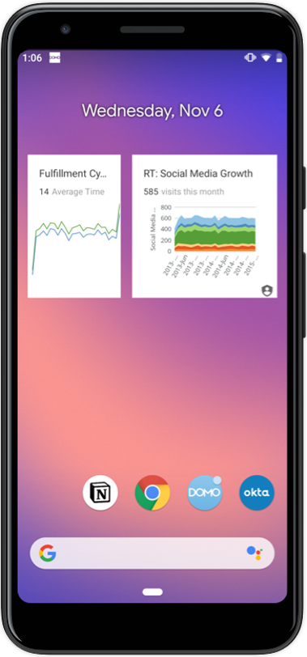
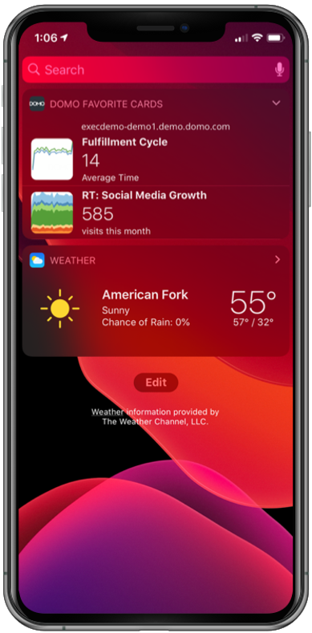

---
    title: Mobile Widgets
    url: https://domo-support.domo.com/s/article/360044406813
    linked_kbs:  ['[https://domo-support.domo.com/s/knowledge-base/](https://domo-support.domo.com/s/knowledge-base/)', '[https://domo-support.domo.com/s/](https://domo-support.domo.com/s/)', '[https://domo-support.domo.com/s/topic/0TO5w000000ZamsGAC](https://domo-support.domo.com/s/topic/0TO5w000000ZamsGAC)', '[https://domo-support.domo.com/s/topic/0TO5w000000ZancGAC](https://domo-support.domo.com/s/topic/0TO5w000000ZancGAC)', '[https://domo-support.domo.com/s/article/360044406813](https://domo-support.domo.com/s/article/360044406813)', '[https://domo-support.domo.com/s/topic/0TO5w000000ZancGAC/domo-mobile](https://domo-support.domo.com/s/topic/0TO5w000000ZancGAC/domo-mobile)', '[https://domo-support.domo.com/s/article/360043429933](https://domo-support.domo.com/s/article/360043429933)', '[https://domo-support.domo.com/s/article/360043429953](https://domo-support.domo.com/s/article/360043429953)', '[https://domo-support.domo.com/s/article/360042925494](https://domo-support.domo.com/s/article/360042925494)', '[https://domo-support.domo.com/s/article/360043429913](https://domo-support.domo.com/s/article/360043429913)', '[https://domo-support.domo.com/s/article/4408174643607](https://domo-support.domo.com/s/article/4408174643607)', '[https://domo-support.domo.com/s/login/](https://domo-support.domo.com/s/login/)']
    article_id: 000004322
    views: 2,175
    created_date: 2022-10-24 21:36:00
    last updated: 2022-10-24 22:41:00
    ---

Intro
-----

Mobile Widgets allows you to add your favorite Cards to your home screen (Android) or today view (iOS) for at-a-glance insights.

**Video - Domo Mobile - Widgets**

Using mobile widgets on Android
-------------------------------

On Android, you can add multiple widgets to your screen and resize them to look the way you want. You are able to search for specific Cards by name and add them to your screen.

 

 

**To add a widget:**

1. On a Home screen, touch and hold an empty space.
2. Tap Widgets .
3. Touch and hold the **Card** widget. You’ll see images of your Home screens.
4. Slide the **Card** widget to where you want it.
5. Click on the widget you just added to the screen.
6. Type in the name of a Card in the search bar to find and add the Card you want.

**Important:** In the Domo Mobile App, if you have gone into **Settings > Device security > Lock Domo when not in use, using device security** then you will not be able to see the mobile widgets. You will receive the following error: "Card widgets are not available when app security is enabled"

**To resize a widget:**

1. Touch and hold the widget on your Home screen.
2. You will see an outline with dots on the sides.
3. To resize the widget, drag the dots.
4. When you're done, tap outside the widget.

For more information on Widgets, visit [Android's Widget Documentation](https://support.google.com/android/answer/9450271?hl=en).

Using mobile widgets on iOS
---------------------------

On iOS, you are able to add up to five Cards from your Favorites Page to your widget. You will see the Card’s live preview, title, and Summary Number.

 

 

**To add a widget:**

1. Swipe right over the Home screen or Lock screen.
2. Scroll to the bottom and tap Edit.
3. To add the widget, tap the  next to the **Domo Favorite Cards** widget. To reorder your widgets, touch and hold  next to the apps and drag them in the order that you want.
4. To finish, tap Done.

For more information on Widgets, visit [Apple's Widget Documentation](https://support.apple.com/en-us/HT207122).

**Important:** In the Domo Mobile App, if you have gone into **Settings > Application Security > Use Touch ID** option then you will not be able to see the mobile widgets. You will receive the following error: "Your account admin has restricted access to this extension."

**To add or change the Cards shown in the widget, you must open the Domo Mobile App:**

1. Inside the Mobile App, click on the Menu  Icon.
2. Select the Settings  Icon.
3. Click on the **Widget settings** menu.
4. Drag and drop any Card from your Favorites Page into one of the five Card slots.
5. You can use this same method to reorder the Cards.
