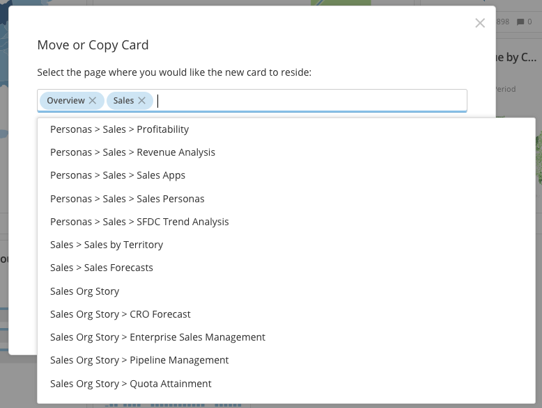

Intro
-----

You can move or copy a Card to one or more Pages in Domo from a Card Page or the Details view. When you copy a Card in this way, the copies are linked; any changes made to a copy of a Card are also made to all other copies. This is different from the **Save As** functionality in that duplicating a Card creates an entirely separate instance of that Card; making a change to a duplicated Card does *not* affect the original Card. For more information about **Save As**, see [Duplicating Cards](/s/article/360042923274 "Duplicating Cards").

 

**Notes:**

* When copied, a Card is accessible by users with access to the Page or Card.
* If a Page has been locked, you can only move or copy Cards if you are the Page owner or you have an "Admin" default security role or a custom role with "Manage All Cards and Pages" enabled. For more information about locking and unlocking content on Pages, see [Managing Custom Roles](/s/article/360043438973 "Locking or Unlocking Page Content").

You can also move or copy multiple Cards at once in the Admin Settings. You must have an "Admin" default security role or a custom role with "Manage All Cards and Pages" enabled to use this option. For more information about default security roles, see [Managing Custom Roles](/s/article/360043438973 "Security Role Reference").

**Video - Move, Copy, and Duplicate Cards**

 

Moving or copying a single Card
-------------------------------

Follow these steps to move or copy one Card to any number of selected Pages.

**To move or copy a Card to another Page,**

1. Mouse over the Card you want to move or copy. (If you are in a Details view, skip this step.)
2. Click , then select **Move or Copy** from the menu.  
A dialog appears. The names of Card Pages and/or Subpages in which this Card is located appear in the box.
3. Do one of the following:

	* If you plan to *move* the Card from its location(s), clear the default Page names from the box.
	* If you plan to *copy* the Card, leave the default Page names as they are.
4. Click the empty portion of the box to display a list of Pages.
5. Select the Pages or Subpages to which you want to move the Card.
6. (Optional) Select multiple destinations for the Card by repeating steps 4 and 5.
7. Click **Move**.

The following screenshot shows a scenario where a user wants to copy a Card to another Page (without removing it from the Pages its on). Thus, the user selects another new Page. If the user wanted to move this Card (removing it from the current Pages), the user would click the "X" next to the listed Pages from which the Card would be removed.

Copying multiple Cards
----------------------

In **More>****Admin > Cards**, you can copy multiple Cards to any number of selected Pages with a single action. You must have an "Admin" default security role or a custom role with "Manage All Cards and Pages" enabled to use this option. For more information about default security roles, see [Managing Custom Roles](/s/article/360043438973 "Security Role Reference").

**To copy multiple Cards,**

1. Select **More** in the toolbar at the top of the screen, then select**Admin**.
2. Click **Cards** in the left-hand pane.  
A list of all Cards in your Domo instance appears.
3. Check the boxes for all Cards you want to copy.  
You can use the column filters to filter the Cards in the list. You can also select or deselect all Cards passed through your selected filters.
4. Select **Edit > Add to Pages**.  
A dialog opens in which you can specify the Pages where the copied Cards will be added.
5. In the **Search Pages** field, enter the name of a Page where you want the copied Cards to live.  
The names of Pages matching the characters you've entered pop up in a list.
6. Click the name of the desired Page to add it to the field.
7. (Optional) To add more Pages to the field, repeat steps 5 and 6 as often as necessary.
8. Click **Add to Pages**.

The Cards are copied into the Pages you specified.

