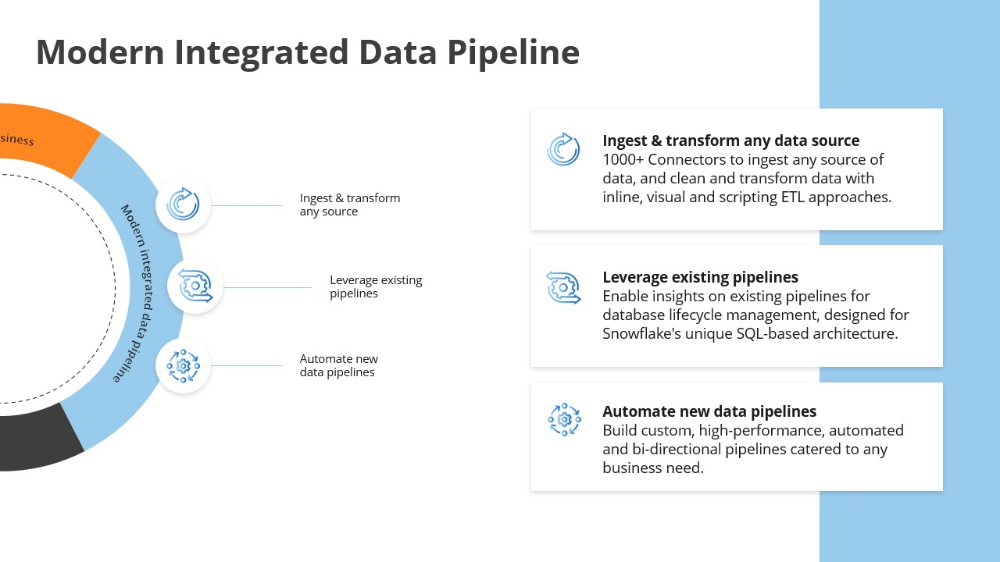
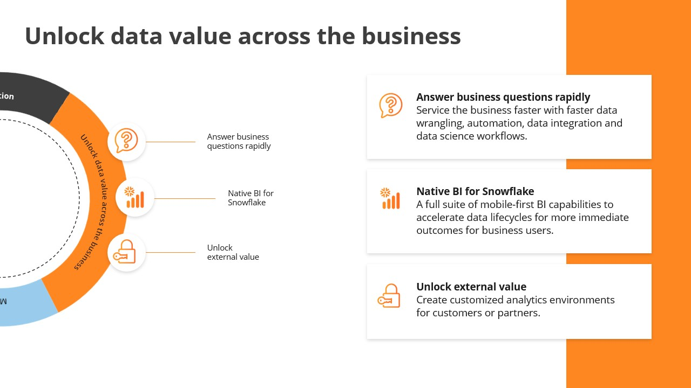
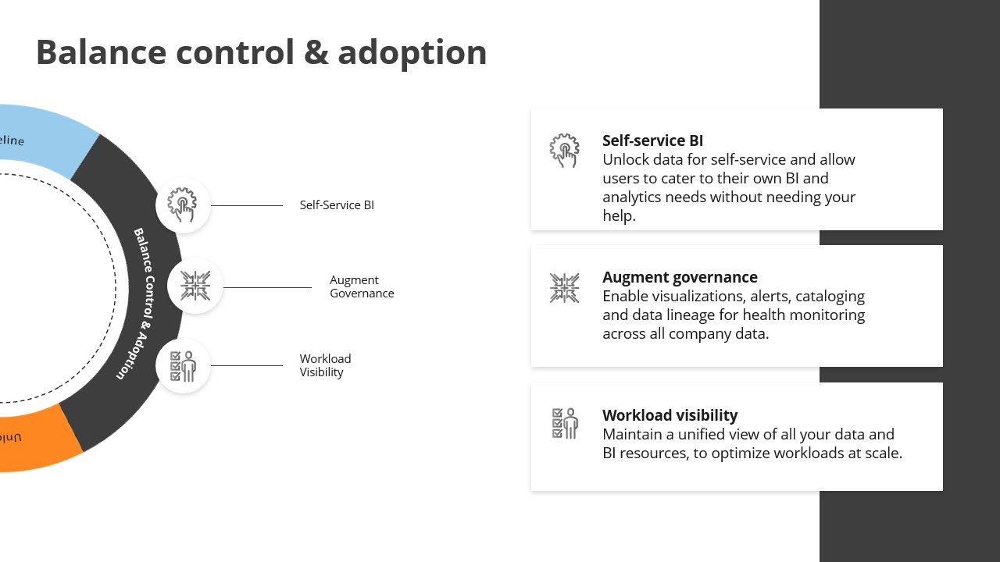

---
    title: Multi-Cloud
    url: https://domo-support.domo.com/s/article/4412849158167
    linked_kbs:  ['[https://domo-support.domo.com/s/knowledge-base/](https://domo-support.domo.com/s/knowledge-base/)', '[https://domo-support.domo.com/s/](https://domo-support.domo.com/s/)', '[https://domo-support.domo.com/s/topic/0TO5w000000ZammGAC](https://domo-support.domo.com/s/topic/0TO5w000000ZammGAC)', '[https://domo-support.domo.com/s/topic/0TO5w000000ZanzGAC](https://domo-support.domo.com/s/topic/0TO5w000000ZanzGAC)', '[https://domo-support.domo.com/s/article/4402322966807](https://domo-support.domo.com/s/article/4402322966807)', '[https://domo-support.domo.com/s/article/360063698733](https://domo-support.domo.com/s/article/360063698733)', '[https://domo-support.domo.com/s/article/4412849158167](https://domo-support.domo.com/s/article/4412849158167)', '[https://domo-support.domo.com/s/article/360042926194](https://domo-support.domo.com/s/article/360042926194)', '[https://domo-support.domo.com/s/topic/0TO5w000000ZanzGAC/other-connection-methods](https://domo-support.domo.com/s/topic/0TO5w000000ZanzGAC/other-connection-methods)', '[https://domo-support.domo.com/s/article/360043429933](https://domo-support.domo.com/s/article/360043429933)', '[https://domo-support.domo.com/s/article/360043429953](https://domo-support.domo.com/s/article/360043429953)', '[https://domo-support.domo.com/s/article/360042925494](https://domo-support.domo.com/s/article/360042925494)', '[https://domo-support.domo.com/s/article/360043429913](https://domo-support.domo.com/s/article/360043429913)', '[https://domo-support.domo.com/s/article/4408174643607](https://domo-support.domo.com/s/article/4408174643607)', '[https://domo-support.domo.com/s/login/](https://domo-support.domo.com/s/login/)']
    article_id: 000003147
    views: 2,364
    created_date: 2022-10-24 21:09:00
    last updated: 2022-10-24 22:42:00
    ---

Intro
-----

Multi-Cloud provides a native integration with cross-cloud systems to unlock data products at the speed your business needs them.

### Why Multi-Cloud?

* IT alone cannot realize the full potential of data in Snowflake. A broad and inclusive approach with all LOBs is required, and not all valuable data is in Snowflake and/or controlled by IT yet.
* Increased stress on, and demands from, data teams. Business users demand access to data products in a timely manner, increasing pressure to deliver.​
* Rigidity and friction in data processes. Rigid processes and tooling prevent the building of databases in a speedy and flexible manner. Taking too much time and too much effort.

Multi-Cloud can help with these needs and more.  
  
  
  
  
  

Setup
-----

To enable Domo's Multi-Cloud Data Fabric, contact your Customer Service Representative or Account Executive. You'll then be able to connect your existing data warehouses from these providers:

* Snowflake
* Other data providers coming soon

### Requirements

Each data platform has its own unique requirements. See the associated articles for more details.

* [Snowflake](/s/article/4402322966807)
* Other data providers coming soon

### Defaults

Multi-Cloud Data Fabric allows you to specify a default computation cloud account for Adrenaline DataFlows and a default storage account for all DataSets.

* **Default storage account**: Used as a default for all new DataSets including Connectors and DataFlow outputs.
* **Default computation account**: Used as the default account for computation of Adrenaline DataFlows. See [Creating an Adrenaline DataFlow](/s/article/360063698733) for more details.

Changing these settings does not change existing DataSets or DataFlows. These defaults are only used for new assets.

### Security & Roles

After Multi-Cloud has been enabled in your instance, you can assign new Multi-Cloud grants to manage access to these features:

#### Manage Cloud Accounts

Users with the Manage Cloud Accounts role can add and remove (coming soon) cloud accounts, and add and remove (coming soon) tables from a cloud account. This grant also allows changing the [default compute and storage clouds](/s/article/4412849158167).

 

**Note:** This role must be assigned to a user with the Manage DataSet grant to work properly.

#### Override Default Cloud

Users with the Override Default Cloud grant can choose any compute or storage cloud account that has been shared with them. This allows users with an understanding of your third-party compute cost structure and technical knowledge of how best to optimize queries the ability to set the storage or computation cloud account that is best for each asset.

 

**Note:** This role must be assigned to a user with the Edit DataSet or Manage DataSet grant to work properly.

Working with Data
-----------------

### Existing Tables

Tables that already exist in your Snowflake warehouse can be registered in Domo's Data Center through 'Add Accounts'. Only users with the Manage Cloud Accounts grant can use this feature.

In 'Add Accounts', select a database or warehouse, schema and the table(s) to add to the Data Center. These tables are not copied to Domo, but rather registered in Domo's Data Center so they're immediately available for DataFlows and cards.

Tables that have already been registered cannot be selected again. To remove an existing table from your Domo Data Center, delete the DataSet using one of Domo's [existing methods](/s/article/360042926194).

Domo assumes all date/time columns are stored in UTC. If this is not the case, the correct date/time will not display in Domo.

### Connectors

When creating a DataSet via a connector, users with the Override Default Cloud grant can choose a cloud account to store the data to. Users without this grant will always write to the default storage cloud at the time the set is created.

FAQ's
-----

##### Does Multi-Cloud work with Bring Your Own Key (BYOK)?

Not at this time, although we are exploring integration for a future release.

