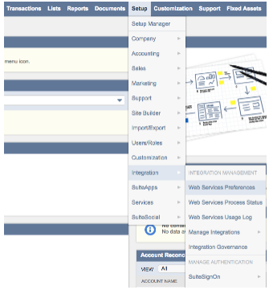
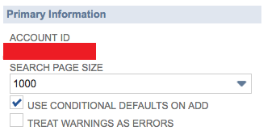
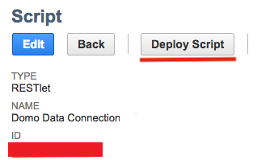
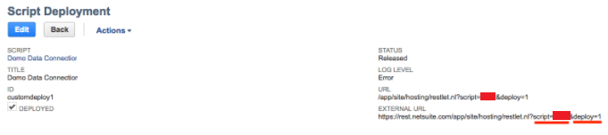

Intro
-----

NetSuite allows for data to be extracted via REST in JSON formats by accessing the endpoints as detailed below. The Domo connector expects JSON format, so all endpoints must include a parameter of format=JSON. The Domo Bundle uses the SuiteScript API (which is JavaScript-based) to extract data from Netsuite.

The connector has two components:

* The Domo Bundle running inside your NetSuite instance
* The connector code running in Domo

|  |  |
| --- | --- |
| **Primary Use Cases** | This connector is great for extracting REST data in JSON format. |
| **Primary Company Roles** | Most appropriate for ERP/finance roles. |
| **Average Implementation Time** | 4-8 hours |
| **Ease of Use (on a 1-to-10 scale with 1 being easiest)** | 8 |

Prerequisites
-------------

To connect to your NetSuite account and create a DataSet using this connector, you must have the following:

* Your NetSuite username and password
* Your NetSuite Role ID (only required if no default role is specified or if you do not want to use the default role)
* A NetSuite account ID
* A NetSuite script bundle and deploy bundle ID
* A NetSuite report ID

Each of these items is discussed in more detail in the next sections.

Configuration Instructions
--------------------------

1. Download the following SuiteScript files.

	* [EC\_Libs-4.0.0.js](https://domosoftware.sharepoint.com/:u:/s/CS-Edu-PublicFiles/Eb-xAIk0kkpEvYrMGKiXPCYBwQWb3x_mkApQ0yQcFO72IQ?e=EDzNMa "EC_Libs-4.0.0.js")
	* [EC\_RestletDataExtractor.js](https://domosoftware.sharepoint.com/:u:/s/CS-Edu-PublicFiles/EZ7fqF-wQs9Dnw6uljdzXfYBsO50SGphhtdWk8l3H0BKGw?e=X7sImo "EC_RestletDataExtractor.js")
2. In NetSuite, go to **Documents > Files > File Cabinet**.
3. Create a new folder inside the SuiteScripts folder named "Domo."
4. Upload the two files (EC\_Libs-4.0.0.js and EC\_RestletDataExtractor.js).
5. Go to **Customization > Scripting > Scripts.**
6. Under **File**, search for and then select the script file (EC\_RestletDataExtractor.js).  
A form now opens in which you can create the restlet.
7. Fill out the form with the recommendations below (case-sensitive):  
Name = Domo Data Connection  
ID = \_domo\_data\_extractor  
Script File = EC\_RestletDataExtractor.js  
GET Function = EC.get  
Library Script File = EC\_Libs-4.0.0.js
8. Click **Save and Deploy**.  
You will now be taken to the Script Deployment center.
9. For the **Deployment ID**, enter \_domo\_deployment.
10. For the **Status**, select **Released** and leave the **Log Level** at **Debug**.
11. For the **Audience**, please check **Select All** for **Roles**, **Employees**, and **Partners**.
12. Ensure the **Deployed** checkbox is checked.
13. Save and deploy the script.  
After the script is deployed it will present you with the Script Deployment status screen.
14. Copy the **External URL** link for use in the next step.  
Once you complete the installation in the NetSuite instance, you will need to make the connection in your Domo instance.

Connecting to Your NetSuite Data in Domo
----------------------------------------

This section enumerates the options in the **Credentials** and **Details** panes in the NetSuiteApp Connector page. The components of the other panes in this page, **Scheduling** and **Name & Describe Your DataSet**, are universal across most connector types and are discussed in greater length in [Adding a DataSet Using a Data Connector](/s/article/360042926274 "Adding a DataSet Using a Data Connector").

### Credentials Pane

This pane contains fields for to connecting to your NetSuite account. Each connection option is discussed in detail in continuation. 

Once you have connected to NetSuite, you can use the same account any time you go to create a new NetSuiteApp DataSet. You can manage connector accounts in the **Accounts**tab in the Data Center. For more information about this tab, see [Managing User Accounts for Connectors](/s/article/360042926054 "Managing User Accounts for Connectors").

| **Field** | **Description** |
| Environment | Select the environment (Production or Sandbox). |
| Username | Enter your NetSuite username. |
| Password | Enter your NetSuite password. |
| Role ID | Enter your NetSuite Role ID. It's only required if no default role is specified or if you do not want to use the default role. |
| Account ID | Enter your NetSuite account ID. |
| NetSuite Script Bundle ID | Enter the script variable from the NetSuite bundle URL. |
| NetSuite Deploy Bundle ID | Enter the deploy variable from the NetSuite bundle URL. |

#### Choosing Your Environment

In the **Environment** menu, select **Sandbox** if your NetSuite account is a sandbox account. You can find this by hovering over your name/account in the top right corner of NetSuite and clicking **View all roles**. Your environment should be listed under **Account Type**.

#### Finding Your Account ID

To find your account ID, select **Setup > Integration > Web Services Preferences** in NetSuite.

Your account ID will be located under "Primary Information."

#### Finding Your Script ID and Deploy ID

**To find your script ID and deploy ID,**

1. In NetSuite, select **Customization > Scripting > Scripts**.  

2. Locate "Domo Data Connection" either by scrolling through the results or typing "netsuite.js" in the **Script File** box at the top.

3. Click **Deploy Script** and follow instructions to get to the Script Deployment page. The External URL on this page will provide the script and deploy ID where the Script ID is the XXXX in 'script=XXXX' and the Deploy ID is the X in 'deploy=X'.

Once you have established the connection to NetSuite, you can now create DataSets from Saved Searches.

### Details Pane

This pane contains a single **Report** menu in which you enter the ID for the NetSuite saved search you want to pull into Domo. 

| **Menu** | **Description** |
| Saved Search ID | Enter the NetSuite Saved Search you want to run.
Example: For customsearch776, you would only enter 776. |
| Date From | Select the report date using relative or specific dates. Relative meaning number of days from today or a specific date using the date selector. |
| Date From Offset | This adjusts the current date to the given number of days into the past. Example: 0 for today, 1 for yesterday. |
| Select Specific Date From | Select the report date using the date picker. This option is only available when Report Date is set to 'Specific.' |
| Date To | Select report date using relative or specific dates. Relative meaning number of days from today or a specific date using the date selector. |
| Date To Offset | This adjusts the current date the given number of days into the past. Example: 0 for today, 1 for yesterday. |
| Select Specific Date To | Select the report date using the date picker. This option is only available when Report Date is set to 'Specific.' |
| Duplicate Row Handling | Select **Remove Duplicate Rows** to remove duplicate rows in your dataset.Select **Keep Duplicate Rows** to keep duplicate rows in your dataset. |
| Big Number Handling | Select **Treat Big Numbers As Strings** to treat numbers with over 35 digits as strings. 
Select **Truncate Big Numbers** to truncate them. |

Useful Links
------------

The following NetSuite document describes the SuiteScript API, which is what we use for the NetSuite connector. Specifically the chapter on RESTLets (chapter 22) pertains to our connector architecture.

 [https://system.netsuite.com/core/media/media.nl?id =5732122&c=NLCORP&h=5fca4bf5dd825a28ab41&\_xt=.pdf& ...](https://system.netsuite.com/core/media/media.nl?id=5732122&c=NLCORP&h=5fca4bf5dd825a28ab41&_xt=.pdf&addrcountry=US#page=222) 

Limitations
-----------

Saved searches will never connect to NetSuite financial statements because of balancing entries that NetSuite doesn't expose in the saved search results.

 [NetSuite.docx](https://domosoftware.sharepoint.com/:w:/s/CS-Edu-PublicFiles/EZXVYuI4Dc1Fr1oh5JYq3A4B-J20SVco0LQDBOjHEZkP1w?e=N2gTmN)

Troubleshooting
---------------

* If you get an "Unexpected Error" message after configuring the connection, check your column names for invalid characters such as apostrophes, quotation marks, backslashes, etc.
* Verify that the External Script URL, Script ID, and Deploy ID in NetSuite match what is in the connector.
* Verify that the saved search ID in NetSuite matches what is in Domo and that it is the internal ID.
* Verify that the saved search runs without issue in NetSuite.
