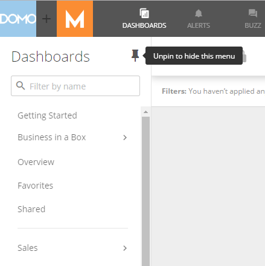
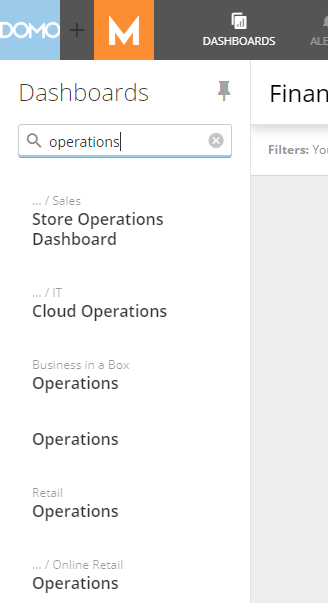
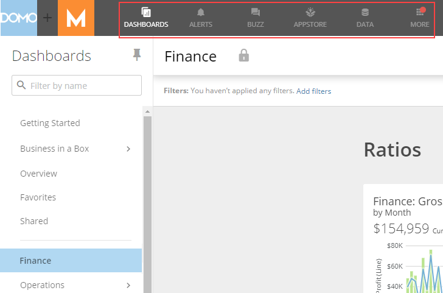
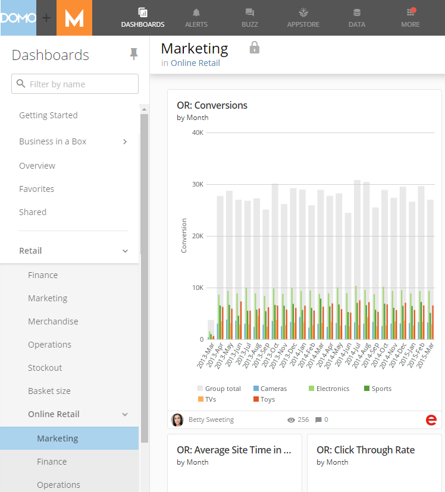
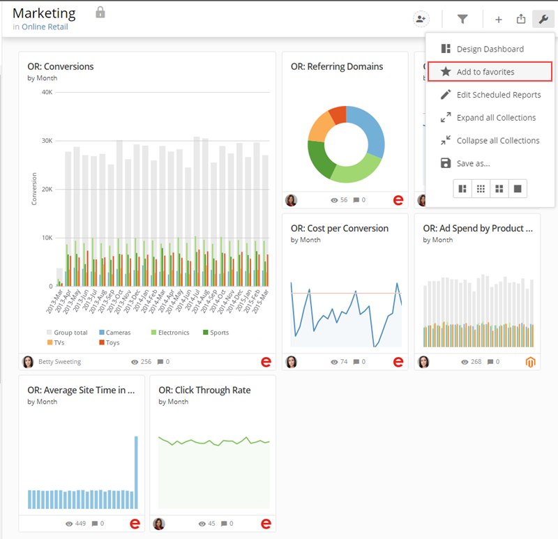
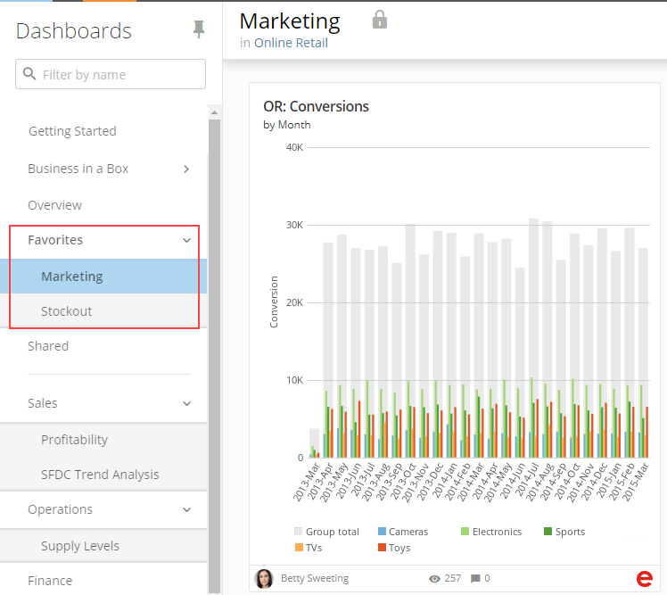

---
    title: New Navigation Announcement
    url: https://domo-support.domo.com/s/article/360043877854
    linked_kbs:  ['[https://domo-support.domo.com/s/knowledge-base/](https://domo-support.domo.com/s/knowledge-base/)', '[https://domo-support.domo.com/s/](https://domo-support.domo.com/s/)', '[https://domo-support.domo.com/s/topic/0TO5w000000ZamsGAC](https://domo-support.domo.com/s/topic/0TO5w000000ZamsGAC)', '[https://domo-support.domo.com/s/topic/0TO5w000000ZanlGAC](https://domo-support.domo.com/s/topic/0TO5w000000ZanlGAC)', '[https://domo-support.domo.com/s/article/360043877854](https://domo-support.domo.com/s/article/360043877854)', '[https://domo-support.domo.com/s/topic/0TO5w000000ZanlGAC/getting-started](https://domo-support.domo.com/s/topic/0TO5w000000ZanlGAC/getting-started)', '[https://domo-support.domo.com/s/article/360043429933](https://domo-support.domo.com/s/article/360043429933)', '[https://domo-support.domo.com/s/article/360043429953](https://domo-support.domo.com/s/article/360043429953)', '[https://domo-support.domo.com/s/article/360042925494](https://domo-support.domo.com/s/article/360042925494)', '[https://domo-support.domo.com/s/article/360043429913](https://domo-support.domo.com/s/article/360043429913)', '[https://domo-support.domo.com/s/article/4408174643607](https://domo-support.domo.com/s/article/4408174643607)', '[https://domo-support.domo.com/s/login/](https://domo-support.domo.com/s/login/)']
    article_id: 000004333
    views: 2,265
    created_date: 2022-10-24 21:40:00
    last updated: 2022-10-24 22:42:00
    ---

Intro
-----

Domo's new navigation makes it easy to organize and manage your Pages so that they are easier to find, regardless of whether you have just a few Pages or a few hundred. It also makes is possible to navigate to all of Domo’s most used features in fewer clicks, decreasing the time it takes you to perform actions in Domo and get answers. For more information, watch this [demo video](https://youtu.be/0Ekqq3CvvV4).

The new navigation will be released to all Domo customers in March 2020. Until then, all customers have the option to turn on the new navigation by going into the Admin Settings and selecting ****Company Settings > Feature control****, then switching on the option reading "Enable updated navigation for all users." (You must have Admin security privileges to do this.) This way, your organization has the freedom to make the transition whenever it is ready. Note that third-level and favorited Pages are only supported in the updated navigation, so if you switch back to the old navigation from the new navigation, these Pages won't be visible in the UI.  

Here’s a highlight list of some of the most notable improvements:

Improved UI
-----------

The Pages menu has been moved to the left side of the screen in a scrollable "Dashboards" list. You can collapse this list by clicking the  icon, giving more space when you want to focus on important dashboard content. You can still show the list when it is in its collapsed state by mousing over the icon, or "repin" the list by clicking . 

The list is searchable too, allowing you to quickly filter down the list of Pages as you type.

You will also find shortcuts to your most important Domo functions now exposed at the top of the screen, giving you quicker access.

****

Third-level Pages
-----------------

An additional level of Page hierarchy lets you create Subpages of your Subpages. You have more options than ever for how you organize your Pages to show related information.

Favorite Pages
--------------

You can now mark Pages as "favorites," making it easier for you to get to your most important content in Domo. You can add any Page as a "favorite" Page by choosing the **Add to favorites** option in the wrench menu for the Page. 

Once a Page is added as a Favorite, you can jump to it quickly by clicking **Favorites** at the top of the Pages list and selecting the Page you want to open.

 

