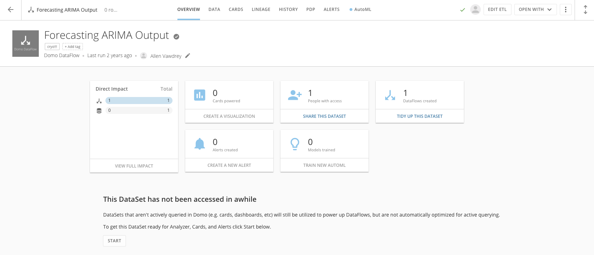
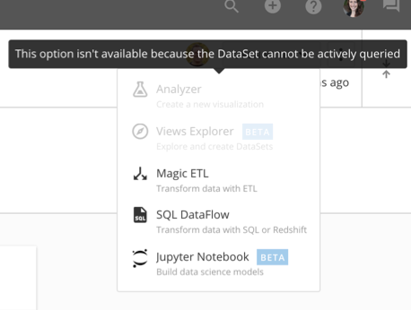
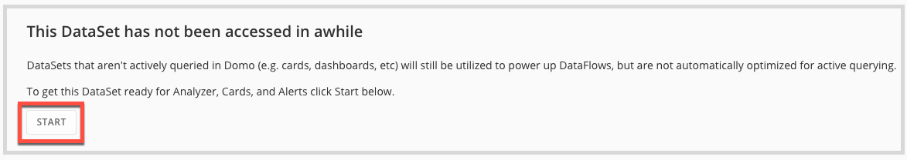
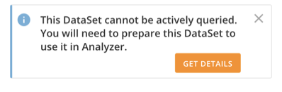
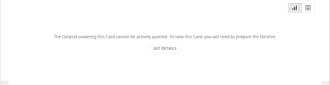
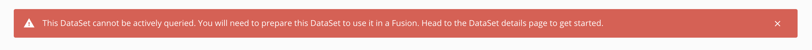

---
    title: Non-queryable DataSets
    url: https://domo-support.domo.com/s/article/360056727214
    linked_kbs:  ['[https://domo-support.domo.com/s/knowledge-base/](https://domo-support.domo.com/s/knowledge-base/)', '[https://domo-support.domo.com/s/](https://domo-support.domo.com/s/)', '[https://domo-support.domo.com/s/topic/0TO5w000000ZammGAC](https://domo-support.domo.com/s/topic/0TO5w000000ZammGAC)', '[https://domo-support.domo.com/s/topic/0TO5w000000ZanzGAC](https://domo-support.domo.com/s/topic/0TO5w000000ZanzGAC)', '[https://domo-support.domo.com/s/article/360056727214](https://domo-support.domo.com/s/article/360056727214)', '[https://domo-support.domo.com/s/topic/0TO5w000000ZanzGAC/other-connection-methods](https://domo-support.domo.com/s/topic/0TO5w000000ZanzGAC/other-connection-methods)', '[https://domo-support.domo.com/s/article/360043429933](https://domo-support.domo.com/s/article/360043429933)', '[https://domo-support.domo.com/s/article/360043429953](https://domo-support.domo.com/s/article/360043429953)', '[https://domo-support.domo.com/s/article/360042925494](https://domo-support.domo.com/s/article/360042925494)', '[https://domo-support.domo.com/s/article/360043429913](https://domo-support.domo.com/s/article/360043429913)', '[https://domo-support.domo.com/s/article/4408174643607](https://domo-support.domo.com/s/article/4408174643607)', '[https://domo-support.domo.com/s/login/](https://domo-support.domo.com/s/login/)']
    article_id: 000003153
    views: 2,215
    created_date: 2022-10-24 21:10:00
    last updated: 2022-10-24 22:40:00
    ---

Intro
-----

Not all DataSets are created equal. For example, some DataSets may be used strictly as DataFlow inputs or have not been accessed for a while and therefore are not being actively queried (i.e. used and viewed regularly in Cards or Dashboards). These DataSets will continue to run as scheduled, perform normally as expected, and are optimized for their current use, but must be brought into an actively queried state to use in visualizations.

DataSets that cannot be actively queried
----------------------------------------

When a DataSet is not optimized for querying, the following message will appear in the DataSet Details.  
  

  
  

You will also be notified of a DataSet's status when you click **Open With** menu in the DataSet Details view. You must bring the DataSet back to an actively queried state to begin building new content with it.  
  

  
  

### Bringing DataSets to an actively queried state

To optimize a DataSet for querying to be used in Cards, Dashboards, and more, click the **Start** button in the Details View Overview tab. You may begin using that DataSet as soon as it is done preparing.  
  

  
  

#### From the Data Center

1. Navigate to the [Data Center](https://domohelp.domo.com/Welcome/Domo_User_Interface/Data_Center_Layout "Data Center Layout") and search for the DataSet you want to actively query.
2. Click on the DataSet to view the Overview tab in the DataSet Details.
3. Click **Start**.

#### In Analyzer

1. In Analyzer, you will be presented with the following message if a DataSet is not actively queried.  
  

2. Click**Get Details** to be taken directly to the DataSet Details view.
3. Click **Start**.

#### From Card Details

1. In the Card Details view, you will be presented with the following message if a DataSet is not actively queried.  
  

2. Click **Get Details** to be taken directly to the DataSet Details view.
3. Click **Start**.

#### In DataFusions

1. In DataFusions, you will be presented with the following message if a DataSet you are attempting to use as an input is not actively queried.  
  

2. Navigate to the Data Center. Find and select the DataSet to access the DataSet Details view.
3. Click **Start**.
