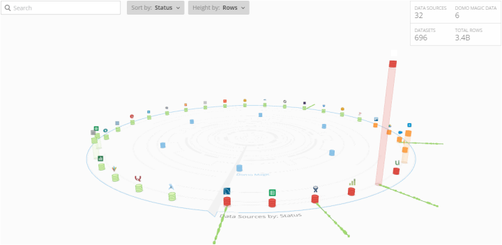
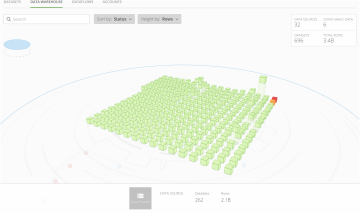
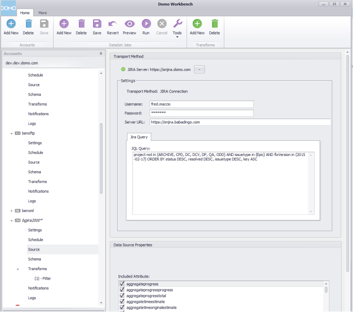

---
    title: November 2015 Release Notes
    url: https://domo-support.domo.com/s/article/360048116074
    linked_kbs:  ['[https://domo-support.domo.com/s/knowledge-base/](https://domo-support.domo.com/s/knowledge-base/)', '[https://domo-support.domo.com/s/](https://domo-support.domo.com/s/)', '[https://domo-support.domo.com/s/topic/0TO5w000000ZamwGAC](https://domo-support.domo.com/s/topic/0TO5w000000ZamwGAC)', '[https://domo-support.domo.com/s/topic/0TO5w000000Zan7GAC](https://domo-support.domo.com/s/topic/0TO5w000000Zan7GAC)', '[https://domo-support.domo.com/s/article/360043430413](https://domo-support.domo.com/s/article/360043430413)', '[https://domo-support.domo.com/s/topic/0TO5w000000ZapSGAS](https://domo-support.domo.com/s/topic/0TO5w000000ZapSGAS)', '[https://domo-support.domo.com/s/article/360042925714](https://domo-support.domo.com/s/article/360042925714)', '[https://domo-support.domo.com/s/article/360042925814](https://domo-support.domo.com/s/article/360042925814)', '[https://domo-support.domo.com/s/article/360043430173](https://domo-support.domo.com/s/article/360043430173)', '[https://domo-support.domo.com/s/article/360043428253](https://domo-support.domo.com/s/article/360043428253)', '[https://domo-support.domo.com/s/article/360043430233](https://domo-support.domo.com/s/article/360043430233)', '[https://domo-support.domo.com/s/article/360043429033](https://domo-support.domo.com/s/article/360043429033)', '[https://domo-support.domo.com/s/article/360043429233](https://domo-support.domo.com/s/article/360043429233)', '[https://domo-support.domo.com/s/article/360043427973](https://domo-support.domo.com/s/article/360043427973)', '[https://domo-support.domo.com/s/article/360042924494](https://domo-support.domo.com/s/article/360042924494)', '[https://domo-support.domo.com/s/article/360042922994](https://domo-support.domo.com/s/article/360042922994)', '[https://domo-support.domo.com/s/article/360042922874](https://domo-support.domo.com/s/article/360042922874)', '[https://domo-support.domo.com/s/article/360048116074](https://domo-support.domo.com/s/article/360048116074)', '[https://domo-support.domo.com/s/topic/0TO5w000000Zan7GAC/archived-feature-release-notes](https://domo-support.domo.com/s/topic/0TO5w000000Zan7GAC/archived-feature-release-notes)', '[https://domo-support.domo.com/s/article/360043429933](https://domo-support.domo.com/s/article/360043429933)', '[https://domo-support.domo.com/s/article/360043429953](https://domo-support.domo.com/s/article/360043429953)', '[https://domo-support.domo.com/s/article/360042925494](https://domo-support.domo.com/s/article/360042925494)', '[https://domo-support.domo.com/s/article/360043429913](https://domo-support.domo.com/s/article/360043429913)', '[https://domo-support.domo.com/s/article/4408174643607](https://domo-support.domo.com/s/article/4408174643607)', '[https://domo-support.domo.com/s/login/](https://domo-support.domo.com/s/login/)']
    article_id: 000004456
    views: 1,123
    created_date: 2022-10-24 22:11:00
    last updated: 2022-10-24 22:41:00
    ---

 

**Note:** Depending on the product version you are using, the documentation may include information about features that may not be available or may have changed.

New features and enhancements
-----------------------------

Features and enhancements in this release include the following:

### The Data Warehouse

The Data Warehouse provides a visually engaging way for you to interact with your data warehouse that has been built within Domo. The Data Warehouse gives you quick insight into the breadth of your data and also allows you to drive into the depth of individual data providers. You can then take your newly gained insights and take effective action on a specific data source or create new data source where a gap was discovered.

The Data Warehouse provides a three-dimensional visual representation of all data sources and Magic connectors in your Domo, along with data currently flowing into and between them. These are represented as stacks on a rotating palette. You can configure the order and height of the stacks to indicate different metrics.

###### Data Warehouse main view

Mousing over a stack causes the palette to stop rotating, and an information panel appears for the data source or Magic connector. This panel shows information such as the number of DataSets for the data source or connector, the number of cards built, the number of successful and failed runs, etc.

You can click and drag the panel to move it manually. The panel can be moved in three dimensions.

Stacks are colored differently depending on their type and current activity. Green indicates a functional data source, blue indicates a Magic connector, orange indicates a warning state for a data source, and red indicates that one or more DataSets for a data source is broken and needs immediate attention.

The arrangement of stacks around the palette and the height of the individual stacks indicate specified metrics. By default, stack arrangement indicates status and stack height indicates the number of rows of data. If you want, you can change the criteria determined by arrangement and height. For example, you could set the arrangement of stacks around the palette to indicate the number of cards built using the data source or Magic connector and the height of the stacks to indicate the number of DataSets.

Clicking a connector stack changes the view to show three-dimensional representations of all DataSets for the connector. This view also shows the data sources, the number of DataSets, and the number of rows for the data source or connector.

###### Connector stack view for The Data Warehouse

For information about The Data Warehouse, see [Using The Data Warehouse to Manage Data](/s/article/360043430413 "Using The Data Warehouse to Manage Data").

### Workbench 4

Workbench version 4 is here. The latest version of Domo Workbench provides a clean and intuitive user experience that will help you get the most out of Workbench. New features like API token login and parallel job processing improve security and performance while new connections like the external process plugin will extend the reach to Workbench to almost any data you have in your Data Center.

The user interface has been updated with all of the following improvements:

* Uses .Net and Windows best practices
* Provides wizards for executing primary activities
* Uses a tree navigation system to provide a cleaner flow for the creation of accounts, DataSet Jobs, and transforms
* Provides enhanced logging

In Workbench 4 you also have access to numerous security and performance upgrades, including the following:

* The use of API tokens for all Workbench users
* Implementation of multi-part uploading for all large DataSet Jobs
* Automated proxy setting determination
* Simplification of multiple instance connections
* Parallel job processing

Workbench 4 also includes a new developer plugin model that will enable you to do all of the following:

* Install new plugins directly in Workbench
* Create data provider, transport, and transform plugins that can be consumed in a common format (DLL)

In addition to all this, this release includes other new functionality such as the ability to connect to OLAP cubes; the ability to define connections using external process file providers; the ability to create groups of DataSet Jobs on the same update schedule; and more.

For information about Workbench 4, see [Workbench 4](/s/topic/0TO5w000000ZapSGAS "Workbench 4").

### Buzz v3

Buzz has been updated to provide more enjoyable and meaningful social experiences with your colleagues in Domo.

You can view a discussion in the Buzz panel or expand it to fill the screen. The Buzz panel now displays only the first and last comments in each conversation in chronological order; however, you can expand any particular conversation to show only that conversation in its entirety. You can also filter the feed activity to show only discussions that are connected to a trending topic, card, or project.

In addition, you can now do all of the following in Buzz:

* @ mention the users or groups you want to see your message
* @ mention cards or projects you want to reference in the message
* reference specific users, cards, groups, or projects using @ or popular topics using #
* add new hash tags #
* select images for URLs
* attach documents and images by selecting from the browser, dragging and dropping, or entering the image URL
* attach YouTube videos that can be played inline
* navigate through previews of referenced cards using a card carousel
* filter by browse mode or trending topic, card, or project
* specify a post as public or private
* "mute" discussions so you don't receive notifications when new comments are added to that discussion

###### Buzz - Main panel

###### Buzz - New discussion view

For more information about Buzz, see [Buzz](/s/article/360042925714 "Buzz").

### Notifications Management

Notifications provide a way for you to know when important things happen in Domo that demand your attention. The new **Manage Notifications & Alerts** page in Domo gives you the flexibility to determine how, when, and which notifications come to you. This page lets you set options for Notifications, Instant Alerts, Daily Alerts, and Weekly Alerts.

In the **Notifications** tab, you can toggle global settings for receiving notifications via email, mobile app, or SMS. You can also specify if and how you receive notifications for all of the following:

* Someone @ mentioning you or a group you're in
* Someone commenting on a conversation you're mentioned in
* Someone liking something you posted
* Someone sharing a card or page with you
* Someone assigning a task to you or updating your task
* Someone uploading a new version of a document card you've favorite

You can also toggle subscription emails in the Notifications tab.

###### Manage Notifications & Alerts - Notifications tab

In the **Instant Alerts** tab, you can set options for instant notifications for triggered alerts. In the **Daily Alerts** tab, you can set the time at which daily summary emails (lists of alerts) are sent to you. You can also specify whether updates to "Favorited" cards are included in the email. In the **Weekly Alerts**  tab you can set the day of the week and time when weekly summary emails are sent.

###### Manage Notifications & Alerts - Daily Alerts tab

For any alert, you can now select whether you want to receive instant, daily, and/or weekly notifications. Alerts with **Daily** selected appear in your daily summary email, and alerts with **Weekly** selected appear in your weekly summary email.

For more information, see [Customizing Notification and Alert Settings](/s/article/360042925814 "Customizing Notification and Alert Settings").

### Alert Summary card

Domo's existing alert interface has been updated in the form of an alert summary card. This card contains all of the information and options necessary for understanding, editing, and deleting alerts. The card is available from the Alerts Center, the card Details view, and the Profile page.

The alert summary card allows you to do all of the following from one place:

* Set instant, daily, and weekly notifications on the alert
* Edit the alert
* Delete the alert
* View the Details view for the card in which the alert has been set
* See the creator and followers of the alert
* View the 180-day history for the alert
* View a list of events when the alert has been triggered

For more information, see [Notifications and Alerts](/s/article/360042925814 "Notifications and Alerts").

### Domo University training videos access

You can now access and authenticate to Domo University using a link in the Domo product. This link provides access to a new Domo University page where hundreds of training videos can be viewed. No separate login is required, and new videos are added at frequent intervals. Customers should visit the Help Center to register for webinars and/or public courses.

### Improved document card

The document card has been updated with a number of exciting new capabilities. Now you can make Domo the place where all of your documents are stored so you can collaborate around them, compare them with data, and easily view the version history. You'll know exactly when a file has been updated, and you'll never have to leave Domo to view your documents.

New document card features include the following:

* The ability to show your actual document in Domo, rather than just a placeholder.
* A number of new supported file types, including images. (Image cards will still be available in Domo with all of the same functionality before; however, they will gradually be phased out as more and more users switch to using document cards to display images.) All of these file types will be available for use in document cards:

	+ PDF
	+ DOCX
	+ DOC
	+ XLSX
	+ XLS
	+ PPTX
	+ PPT
	+ TXT
	+ PNG
	+ JPG
	+ BMP
* A maximum upload file size of 100 MB.
* A panel in the document card **Details** view in which old versions of the document are stored as thumbnails. You can see any old version of the document by clicking its thumbnail, as well as delete any version.
* A document preview mode with standard and full-screen viewing modes, page navigation controls, and a download icon.
* An option that allows you to receive notifications when a document card you have added as a Favorite gets a new version.

###### Document Details view

###### Document preview mode

For more information about document cards, see [Adding a Document Card to Domo](/s/article/360043430173 "Adding a Document Card to Domo").

### Ability to change page owner

You can now change the owner of a card page as long as you are already the owner or have an "Admin" security role.

For more information about changing the owner of a page, see [Managing Pages](/s/article/360043428253 "Managing Pages").

### Ability to rename pages

You can now rename card pages inline instead of having to make the change in the **Manage Pages** dialog.

For more information about renaming a page, see [Managing Pages](/s/article/360043428253 "Managing Pages").

### Notebook card non-owner editing

Notebook cards can now be edited by any Admin, Privileged, or Editor user with access to the card.

For more information about notebook cards, see [Notebook Cards](/s/article/360043430233 "Cards").

### Country maps for Portugal and United Arab Emirates

You can now add map cards for Portugal and United Arab Emirates.

###### Portugal

###### United Arab Emirates

For more information, see [Country Map](/s/article/360043429033 "Country Map").

### Regression lines

You can now add regression lines to single-series Vertical Bar and Line charts and most Line chart subtypes. You can specify the color of regression lines as well as the style (dashed or plain). You can also indicate whether the last date point in your chart is included in the calculation for the regression line.

###### Bar chart with regression line

######  Line chart with regression line

For more information, see [Line Chart](/s/article/360043429233 "Bar Graph").

### First day of week selection in Calendar charts

In Calendar charts, you can now specify the day that begins each week instead of using the default day of Sunday.

For more information about building calendars, see [Calendar](/s/article/360043427973 "Calendar").

### Expanded hover functionality for Donut graphs

**Details** views for Donut graphs now include additional hover functionality similar to that found in Pie charts. When you hover over a section of a Donut graph, hover text next to the graph indicating the name of the section and the total of all sections of the graph.

For more information about Donut graphs, see [Donut Chart](/s/article/360042924494 "Donut Graph").

### DataFlow Improvements

A number of improvements have been made to our DataFlows functionality. These include the following:

* Improved error messages for Magic DataFlows.
* The ability to click and drag multiple items in a Magic DataFlow.
* The ability to delete multiple items in a Magic DataFlow.
* The ability to restrict edit access for a Redshift or MySQL DataFlow to the owner and users with an "Admin" security profile.
* DataFlow versioning. A new **Versions** tab in the DataFlow Details view lists all versions of a DataFlow. Each time you save changes to a DataFlow, a new version entry appears here. When saving, you also have the option of describing the changes you made, similar to saving edits to a KPI card. Each version entry includes the save time, editor, inputs and outputs, runs vs. success rate, and change description (if one has been provided). In addition, for any version you have the option of making it the current version. This functionality is available for all DataFlow types.
* The ability to choose the columns in an input DataSet for a Redshift of MySQL DataFlow. This speeds up the processing time and allows for columns to have more room for values.

###### DataFlow edit restriction control

###### Save DataFlow dialog

###### DataFlow Versions tab

###### Input DataSet column selection

For more information about DataFlows, see [SQL DataFlows](/s/article/360042922994 "Magic ETL DataFlows").

### Table encoding protection

We are turning on a higher level of security on all table cards. This will reduce the vulnerability of malicious attacks using cross site scripting and other methods. Domo will only allow tags in tables that are part of our "whitelist group." In addition, only approved style attributes will be allowed.

### Release guides

Admin users in Domo will now have access to release guides that describe all of the features for an upcoming product release. These will be accessible in an admin user's Domo one week before the release.   

Getting Help
------------

You can view the latest release notes information in the Help Center, which you can access from Domo by clicking **> Help Center**.

If you have questions about Domo,

* search for a topic in the Help Center
* train in Domo University at [http://www.domo.com/university](http://www.domo.com/university "http://www.domo.com/university")
* get answers in the Domo Community at dojo.domo.com
* contact Technical Support
* reach out to your Domo Customer Success Manager or Technical Consultant

If you have feedback, please send it from within Domo Or send an email to [product.feedback@domo.com](mailto:product.feedback@domo.com "product.feedback@domo.com").

For more information about getting help, see [Getting Help](/s/article/360042922874 "Getting Help"). 

