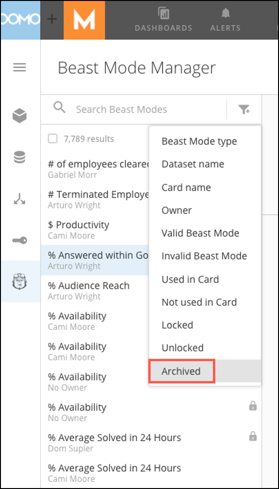
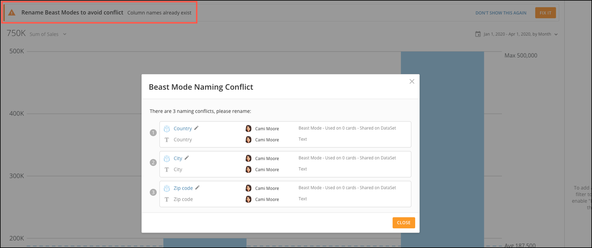
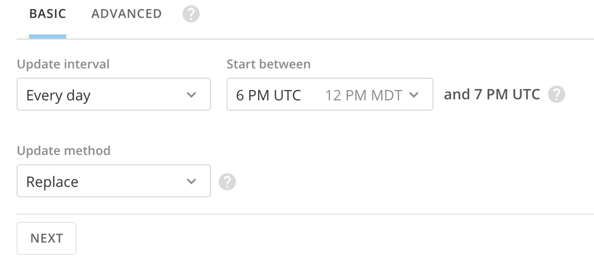
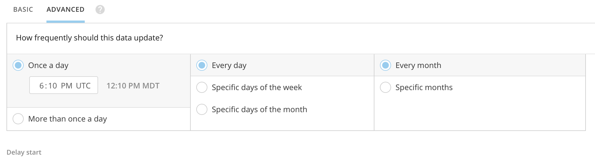
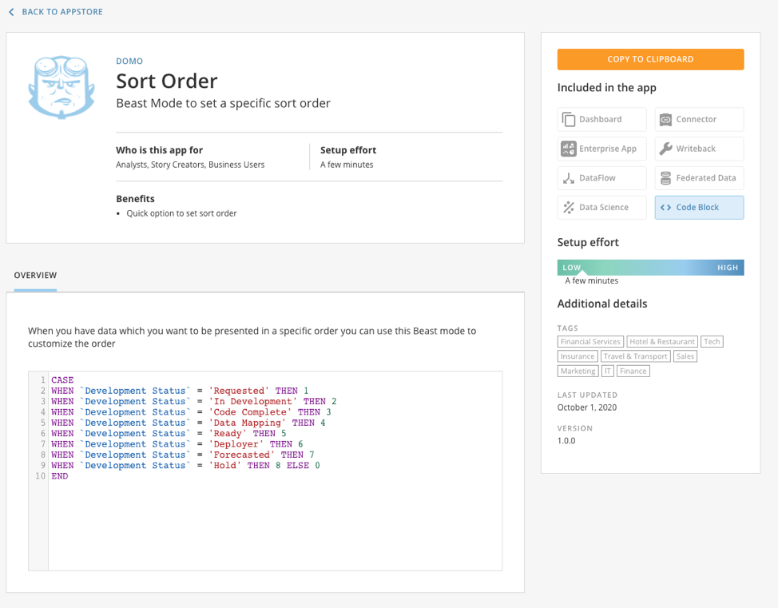
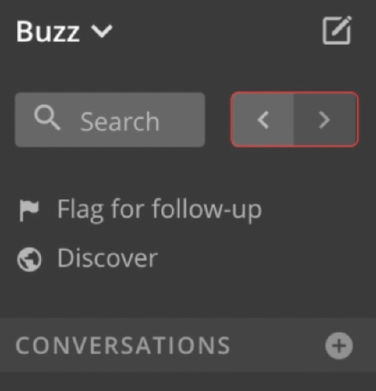
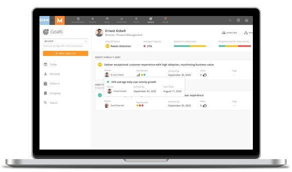
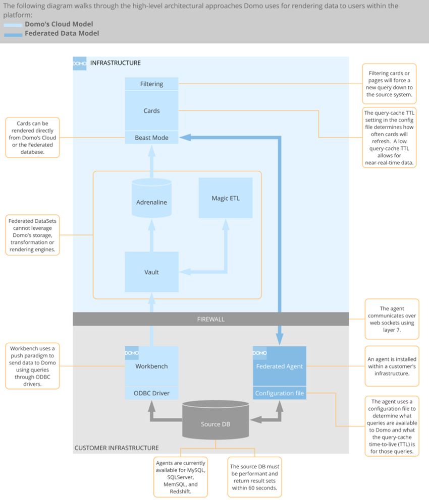
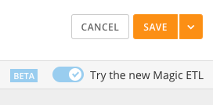

---
    title: October 2020 Release Notes
    url: https://domo-support.domo.com/s/article/360061873754
    linked_kbs:  ['[https://domo-support.domo.com/s/knowledge-base/](https://domo-support.domo.com/s/knowledge-base/)', '[https://domo-support.domo.com/s/](https://domo-support.domo.com/s/)', '[https://domo-support.domo.com/s/topic/0TO5w000000ZamwGAC](https://domo-support.domo.com/s/topic/0TO5w000000ZamwGAC)', '[https://domo-support.domo.com/s/topic/0TO5w000000Zan7GAC](https://domo-support.domo.com/s/topic/0TO5w000000Zan7GAC)', '[https://domo-support.domo.com/s/article/360042925474](https://domo-support.domo.com/s/article/360042925474)', '[https://domo-support.domo.com/s/article/360043429913](https://domo-support.domo.com/s/article/360043429913)', '[https://domo-support.domo.com/s/article/360042926274](https://domo-support.domo.com/s/article/360042926274)', '[https://domo-support.domo.com/s/article/360055259374](https://domo-support.domo.com/s/article/360055259374)', '[https://domo-support.domo.com/s/article/360057087073](https://domo-support.domo.com/s/article/360057087073)', '[https://domo-support.domo.com/s/article/360043429973](https://domo-support.domo.com/s/article/360043429973)', '[https://domo-support.domo.com/s/article/360047711914](https://domo-support.domo.com/s/article/360047711914)', '[https://domo-support.domo.com/s/article/360042932974](https://domo-support.domo.com/s/article/360042932974)', '[https://domo-support.domo.com/s/article/360051062653](https://domo-support.domo.com/s/article/360051062653)', '[https://domo-support.domo.com/s/article/360047787514](https://domo-support.domo.com/s/article/360047787514)', '[https://domo-support.domo.com/s/article/360042922874](https://domo-support.domo.com/s/article/360042922874)', '[https://domo-support.domo.com/s/article/360061873754](https://domo-support.domo.com/s/article/360061873754)', '[https://domo-support.domo.com/s/topic/0TO5w000000Zan7GAC/archived-feature-release-notes](https://domo-support.domo.com/s/topic/0TO5w000000Zan7GAC/archived-feature-release-notes)', '[https://domo-support.domo.com/s/article/360043429933](https://domo-support.domo.com/s/article/360043429933)', '[https://domo-support.domo.com/s/article/360043429953](https://domo-support.domo.com/s/article/360043429953)', '[https://domo-support.domo.com/s/article/360042925494](https://domo-support.domo.com/s/article/360042925494)', '[https://domo-support.domo.com/s/article/4408174643607](https://domo-support.domo.com/s/article/4408174643607)', '[https://domo-support.domo.com/s/login/](https://domo-support.domo.com/s/login/)']
    article_id: 000004419
    views: 5,272
    created_date: 2022-10-24 21:48:00
    last updated: 2022-10-24 22:42:00
    ---

New features and enhancements
-----------------------------

Features and enhancements in this release include the following:

Beast Mode Manager
------------------

Improvements to Beast Mode Manager make managing your Beast Modes even easier.

### Archive Beast Modes

You now have the ability to archive Beast Modes. This removes Beast Modes from Cards or DataSets. You are only able to archive a Beast Mode if it is not in use on a Card. The archive feature is also available for bulk use. You can select up to 100 Beast Modes at a time when using bulk archive. There is no limit to the total amount of Beast Modes that you can archive.

You can then unarchive Beast Modes and it will restore it to the Card or DataSet it originated from. If a Card or DataSet is deleted, then the Beast Mode is also deleted. For more information, see [Beast Mode Manager](/s/article/360042925474 "Beast Mode Manager").

### Duplicate Beast Mode name modal

Inside of Analyzer, there is a new modal that appears when there is a duplicate Beast Mode name. This allows you to rename the Beast Mode or delete duplicate Beast Modes. For more information, see [Adding a Beast Mode Calculation to Your Chart](/s/article/360043429913 "Adding a Beast Mode Calculation to Your Chart").

Enhanced Connector scheduling
-----------------------------

The new Connector scheduler showcases a simplified and streamlined UI that is easier to understand and displays your time zone when scheduling. Connectors are still scheduled in UTC, but our new Scheduler shows you what time that converts to in your chosen time zone. For more information, see [Adding a DataSet Using a Data Connector](/s/article/360042926274 "Adding a DataSet Using a Data Connector").

Code Block Apps
---------------

Code Blocks allow users to copy and paste several different code types that can be used to create solutions to complex questions. This makes advanced functionality much more accessible. For more information, see [Code Block Apps](/s/article/360055259374 "Code Block Apps").

**Available Code Block types:**

* Beast Modes
* SQL
* R
* Python
* Jupyter Notebooks

Public Domo App assets
----------------------

You now have the ability to share assets like pictures or javascript code between your custom Domo app and your public website. You also have the option to build your public website directly on Domo instead of having to find another hosting provider. For more information, see [Public Domo App Assets](/s/article/360057087073 "Public Domo App Assets").

Buzz Conversation toggle
------------------------

With the new Buzz Conversation toggle arrows, you can easily switch between your Buzz messages. Use the arrows to move back and forth through conversations as you viewed them. For more information, see [Buzz Layout](/s/article/360043429973 "Buzz Layout").

Goals
-----

With Domo Goals you can power your company objectives by measurable data, watch progress with automatic updates and alerts, and create top to bottom alignment. With Goals you also have visibility into everyone’s goals and track how goals interrelate and progress. For more information, see [Creating and Editing Goals](/s/article/360047711914 "Creating and Editing Goals").

**With Goals you can,**

* Set company, department, and personal goals that everyone can view.
* Measure the results with metrics powered by data in Domo.
* Align your objectives with your company, department, and team so everyone can see how your work fits into the big picture.
* View your progress as it updates in real-time with your data.
* Check-in with regular updates so everyone knows how you’re progressing.
* Create powerful dashboards to analyze your company’s progress.
* Easily show which individual objectives align with company goals.

Federated Data
--------------

Domo's Federated Data model allows you to directly render Cards and other user-level interactions in the Domo platform using a database hosted outside of Domo's cloud. Instead of executing the visualization query against Domo, the query is executed at the target database and the results are sent to Domo to render the visualization. This model is especially relevant for users who would like to keep their data at rest in their infrastructure for security or logistical reasons. For more information, see [Using the Federated Data Solution](/s/article/360042932974 "Using the Federated Data Solution").  
  

Magic ETL v2 (Beta)
-------------------

Magic ETL v2 (Beta) has many backend and tile improvements as well as new tiles. When you open the edit view of a Magic ETL DataFlow, there is now a toggle switch to enable Magic ETL v2. It is important to note that some of the tiles have changed their functionality. For more information, see [Magic ETL v2 DataFlow Optimizations](/s/article/360051062653 "Magic ETL v2 DataFlow Optimizations (Beta)").

 

**Important:** You **MUST** read through the following article before switching an existing Magic ETL DataFlow to v2 or you risk breaking your DataFlow as several tiles have changed their functionality: [Upgrading to Magic ETL v2](/s/article/360047787514 "Upgrading to Magic ETL v2 (Beta)")

**The following is a list of Magic ETL v2 features:** 

* Faster runtimes
* New tile categorizations
* Searchable tooltip text
* Color-coded and curved lines
* Expression support (Add Formula, Filter Rows, and Group By tiles)
* Views as Inputs
* Enhancements to data type classifying
* Enhancements to error handling
* Join tile updates
* Append tile optimizations
* Value Mapper tile updates
* Pivot and Unpivot tiles (renamed from Collapse and Uncollapse Columns)
* New Dynamic Unpivot tile
* Improvements to the Python Script and R Script tiles (dropped required schema tab)
* Selectable text in data previews

Getting help
------------

You can view the latest release notes information in the Help Center, which you can access from Domo by clicking  in the top navigation bar.

If you have questions about Domo,

* search for a topic in the Help Center
* train in Domo University at [http://domo.com/university/](http://www.domo.com/university/ "http://www.domo.com/university/")
* search for training apps in the Appstore
* get answers in the Domo Community at [https://dojo.domo.com](https://dojo.domo.com/ "https://dojo.domo.com")
* contact Technical Support by entering a help ticket in the Domo Support Portal
* reach out to your Domo Customer Success Manager or Technical Consultant

If you have feedback, please send it from within Domo (**More** ****> Feedback****). Or send an email to [product.feedback@domo.com](mailto:product.feedback@domo.com "product.feedback@domo.com").

For more information about getting help, see [Getting Help](/s/article/360042922874 "Getting Help").

