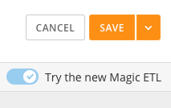
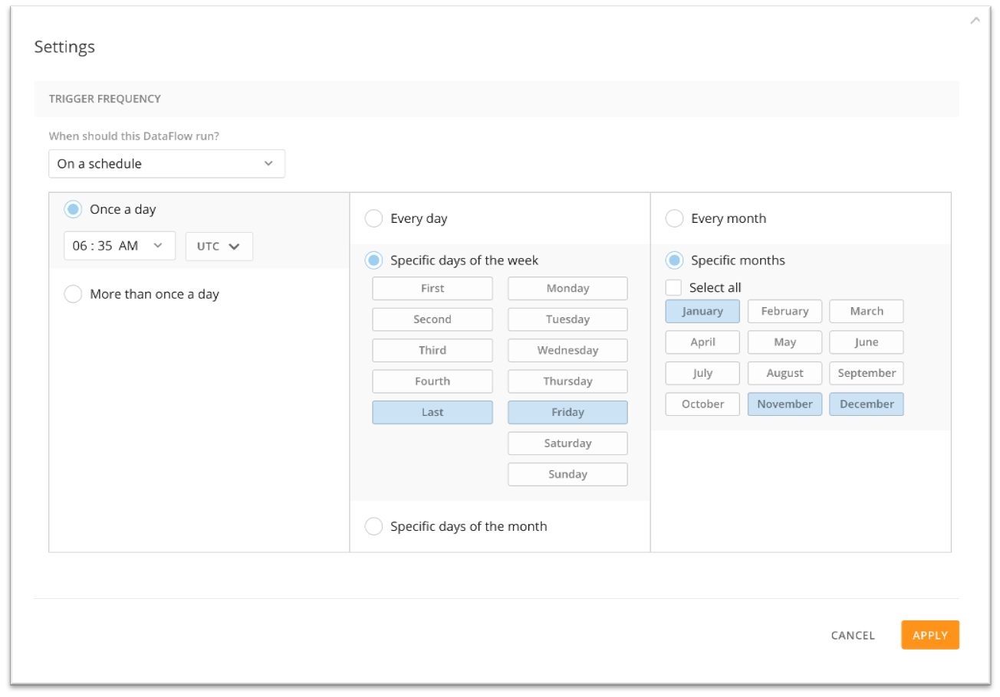
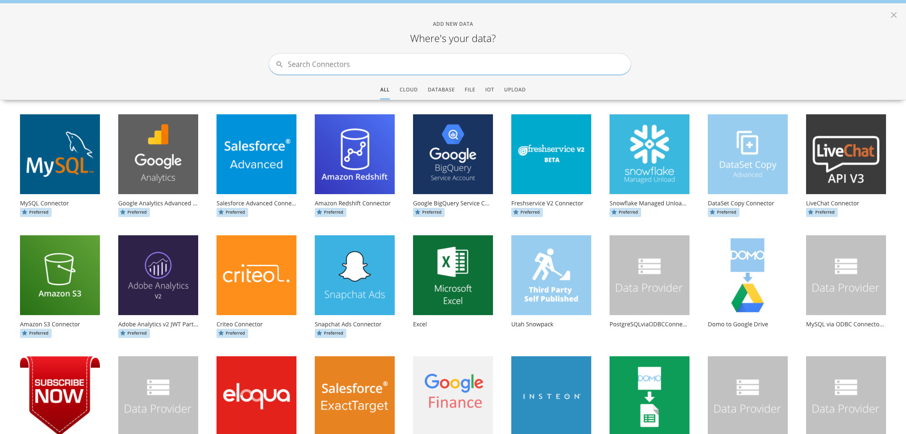
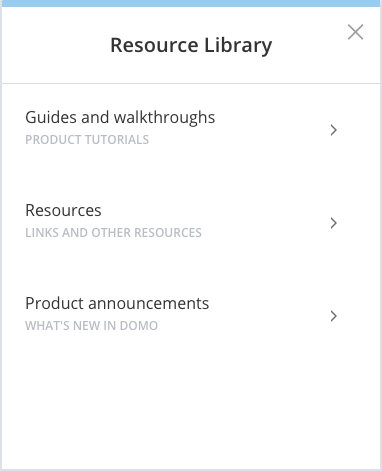
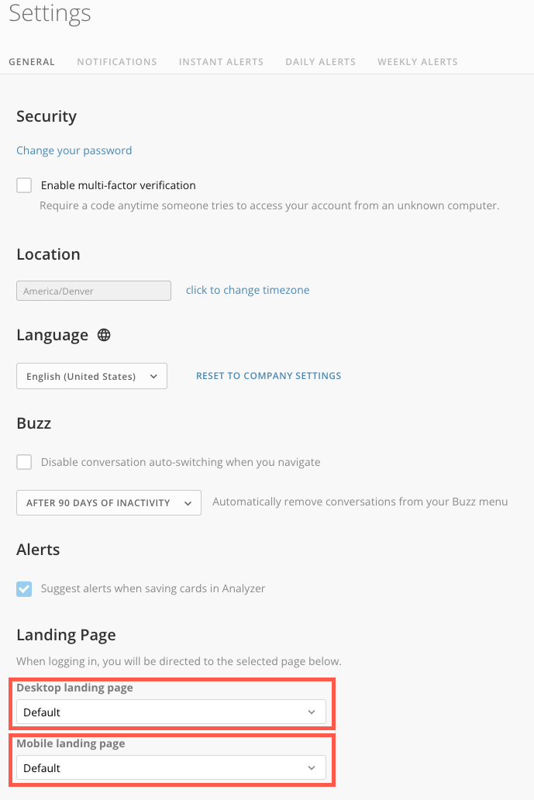
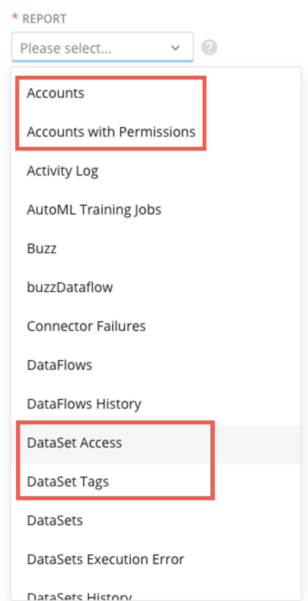
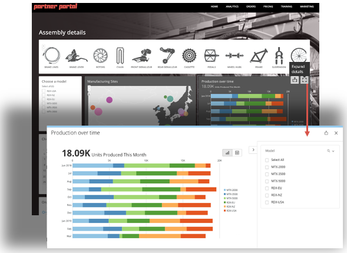
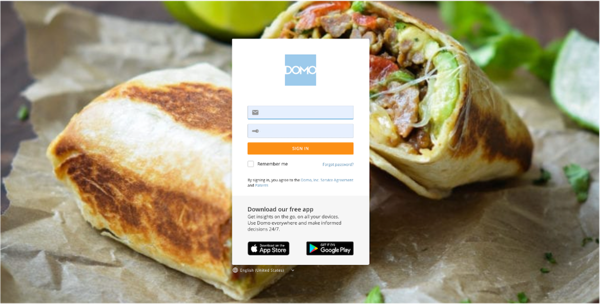

---
    title: October 2021 Release Notes
    url: https://domo-support.domo.com/s/article/4425111066903
    linked_kbs:  ['[https://domo-support.domo.com/s/knowledge-base/](https://domo-support.domo.com/s/knowledge-base/)', '[https://domo-support.domo.com/s/](https://domo-support.domo.com/s/)', '[https://domo-support.domo.com/s/topic/0TO5w000000ZamwGAC](https://domo-support.domo.com/s/topic/0TO5w000000ZamwGAC)', '[https://domo-support.domo.com/s/topic/0TO5w000000Zan7GAC](https://domo-support.domo.com/s/topic/0TO5w000000Zan7GAC)', '[https://domo-support.domo.com/s/article/4408794063639](https://domo-support.domo.com/s/article/4408794063639)', '[https://domo-support.domo.com/s/article/360047787514](https://domo-support.domo.com/s/article/360047787514)', '[https://domo-support.domo.com/s/article/360043427873](https://domo-support.domo.com/s/article/360043427873)', '[https://domo-support.domo.com/s/article/360042926274](https://domo-support.domo.com/s/article/360042926274)', '[https://domo-support.domo.com/s/article/4409542407063](https://domo-support.domo.com/s/article/4409542407063)', '[https://domo-support.domo.com/s/article/4409575159191](https://domo-support.domo.com/s/article/4409575159191)', '[https://domo-support.domo.com/s/article/360043433813](https://domo-support.domo.com/s/article/360043433813)', '[https://domo-support.domo.com/s/article/360042922874](https://domo-support.domo.com/s/article/360042922874)', '[https://domo-support.domo.com/s/article/360043437993](https://domo-support.domo.com/s/article/360043437993)', '[https://domo-support.domo.com/s/article/4407164711447](https://domo-support.domo.com/s/article/4407164711447)', '[https://domo-support.domo.com/s/article/4425111066903](https://domo-support.domo.com/s/article/4425111066903)', '[https://domo-support.domo.com/s/topic/0TO5w000000Zan7GAC/archived-feature-release-notes](https://domo-support.domo.com/s/topic/0TO5w000000Zan7GAC/archived-feature-release-notes)', '[https://domo-support.domo.com/s/article/360043429933](https://domo-support.domo.com/s/article/360043429933)', '[https://domo-support.domo.com/s/article/360043429953](https://domo-support.domo.com/s/article/360043429953)', '[https://domo-support.domo.com/s/article/360042925494](https://domo-support.domo.com/s/article/360042925494)', '[https://domo-support.domo.com/s/article/360043429913](https://domo-support.domo.com/s/article/360043429913)', '[https://domo-support.domo.com/s/article/4408174643607](https://domo-support.domo.com/s/article/4408174643607)', '[https://domo-support.domo.com/s/login/](https://domo-support.domo.com/s/login/)']
    article_id: 000004416
    views: 5,266
    created_date: 2022-10-24 21:48:00
    last updated: 2022-10-24 22:41:00
    ---

New features and enhancements
-----------------------------

Features and enhancements in this release include the following:

### New Magic ETL

The new Magic ETL has many backend and tile improvements as well as new tiles. When you open the edit view of a Magic ETL DataFlow, there is now a toggle switch to enable the new Magic ETL. It is important to note that some of the tiles have changed their functionality. For more information, see [What's New in the New Magic ETL](/s/article/4408794063639).

**Important:** You MUST read through the following article before switching an existing Magic ETL DataFlow to the new Magic ETL or you risk breaking your DataFlow as several tiles have changed their functionality: [Upgrading to the New Magic ETL](/s/article/360047787514).

**The following is a list of the new Magic ETL features:**

* Faster runtimes.
* New tile categorizations.
* Searchable tooltip text.
* Color-coded and curved lines.
* Expression support (Add Formula, Filter Rows, and Group By tiles.)
* Views as Inputs.
* Enhancements to data type classifying.
* Enhancements to error handling.
* Join tile updates.
* Append tile optimizations.
* Value Mapper tile updates.
* Pivot and Unpivot tiles (renamed from Collapse and Uncollapse Columns.)
* New Dynamic Unpivot tile.
* Improvements to the Python Script and R Script tiles (dropped required schema tab.)
* Selectable text in data previews.

### Enhanced DataFlow scheduling capabilities

With the enhanced DataFlow scheduling options, you can now schedule a DataFlow to run on a specific schedule, such as:

* Specific calendar days (1st, 15th, and 28th of the month.)
* Specific day of the week (Last Friday.)
* Only during active hours (Every 2 hours between 8 AM to 5 PM.)
* Annually or Quarterly.

You are also able to set the time that it runs in your time zone, instead of the default of UTC. For more information, see [Scheduling DataFlows](/s/article/360043427873).  
  

### New Connector wizard in the Data Center

With the new Connector wizard in the Data Center, you are able to easily select the type of Connector you need with filtered tabs to specific Connector types. Preferred Connectors are listed first for easy access to the most popular or recommended Connectors. The wizard includes inline configuration for easy Connector setup. For more information, see [Adding a DataSet Using a Connector](/s/article/360042926274).  
  

### New Resource Library

The Guide Center has been updated to the Resource Library. The new Resource Library allows you to view **Guides and walkthroughs**, find additional **Resources**, and review **Product announcements**. For more information, see [Resource Library](/s/article/4409542407063).  
  

### User-Specific Landing Pages

With User-Specific Landing Pages, both Admins and end-users can set a specific Page or Card to open when they log into Domo. This allows you to customize the view for users in a specific department or to bring up the Page/Card you use the most without extra navigation clicks. For more information, see [Setting User-Specific Landing Pages](/s/article/4409575159191).

 

### New DomoStats Reports

The DomoStats Connector now has four new reports to choose from:

* **Accounts -**Shows the Accounts in an instance.
* **Accounts with Permissions -**Shows the Accounts in an instance as well as who has access to these Accounts and at what permission level.
* **DataSet Access -** Shows which users or groups have access to which DataSets and what permission level they have.
* **DataSet Tags -** Shows which tags are assigned to which DataSets.

For more information, see [DomoStats Connector](/s/article/360043433813).  
  

Premium features
----------------

These features are available on demand and paid. To request these features be enabled, reach out to your Domo Customer Success Manager, Technical Consultant, or Account Executive. If you do not have contact information for your CSM, TC, or AE, contact Technical Support. For information on how to contact Support, please see [Getting Help](/s/article/360042922874 "Getting Help"). Depending on the feature, you may be required to complete training before you can use the feature.

### Card Details maximization modal in Dashboard Embed

With the Card Details maximization modal in Dashboard Embed, you can now click on the Expand details icon to see the Card Details view of the Card. In this view, you can now export the visuals to PDF or PowerPoint and it will reflect all Filters and interactions applied to the Card. For more information, see [Sharing Cards and Dashboards Outside of Domo Using Domo Embed](/s/article/360043437993).  
  

### Custom Login Screen

Custom Login Screen gives Admins the ability to change the login screen to their desired background image or color. This allows you to display your brand and have a more consistent user experience. This is part of our Brand Kit features. For more information, see [Custom Login Screen](/s/article/4407164711447).  
  

 

Getting help
------------

You can view the latest release notes information in the Help Center, which you can access from Domo by clicking  in the top navigation bar.

If you have questions about Domo,

* search for a topic in the Help Center
* train in Domo University at [http://domo.com/university/](http://www.domo.com/university/ "http://www.domo.com/university/")
* search for training apps in the Appstore
* get answers in the Domo Community at [https://dojo.domo.com](https://dojo.domo.com/ "https://dojo.domo.com")
* contact Technical Support by entering a help ticket in the Domo Support Portal
* reach out to your Domo Customer Success Manager or Technical Consultant

If you have feedback, please send it from within Domo (**More** ****> Feedback****). Or send an email to [product.feedback@domo.com](mailto:product.feedback@domo.com "product.feedback@domo.com").

For more information about getting help, see [Getting Help](/s/article/360042922874 "Getting Help").

